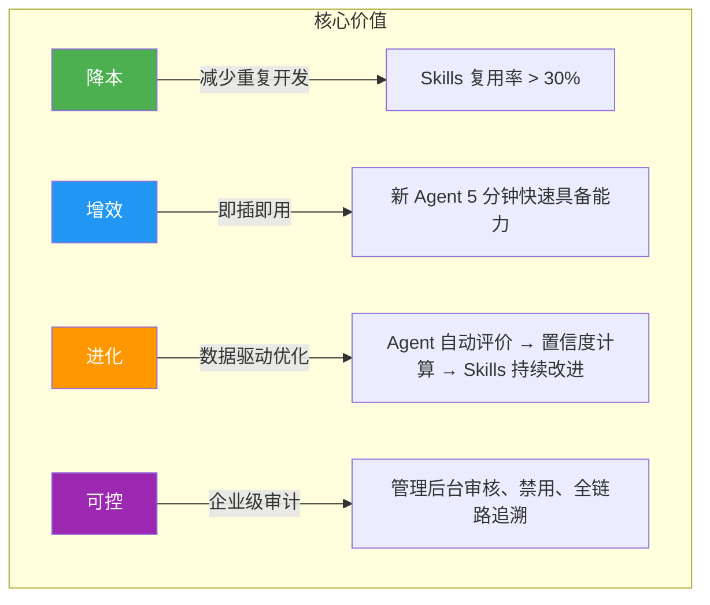

## 什么是 AionHive（又名 SkillGarden）

AionHive（内部代号 SkillGarden）是一个**企业级 AI Skills 共享平台**，版本号 **v0.3.0**，采用 **Rust + Axum** 构建后端服务、**Svelte** 构建管理后台、**CLI 命令行工具**提供终端交互。Sources: [Cargo.toml](code/Cargo.toml#L1-L10), [README.md](code/README.md#L1-L6)

一句话概括：**AionHive 让彼此隔离的 AI Agent 能够像人类团队一样共享技能和经验。**

### 项目名称的由来

- **AionHive** — "Aion"（艾恩，永恒之意）+ "Hive"（蜂巢），寓意 AI Agent 如同蜂群般协作共生，Skills 如蜂蜜般被共同酿造和分享
- **SkillGarden** — 内部代号，"Skills 花园"，强调 Skills 像植物一样被培育、成长、进化

### 不是什么

为了避免理解偏差，先明确项目的边界：

- **不是** Prompt 模板库 — 不是存储静态文本提示词，而是管理活的、可执行的 Skills（包含完整的工具调用逻辑）
- **不是** 单 Agent 工具集 — 不是为单个 Agent 设计的工具包，而是**跨容器、跨服务器、跨云**的共享平台
- **不是** 实时协作框架 — 不追求毫秒级同步，它的定位更像是"企业级 AI 能力 Wiki"，由 Agent 编写、Agent 消费

Sources: [DESIGN.md](code/docs/DESIGN.md#L18-L23)

---

## 要解决的核心问题

### 一个真实场景

在 ClawPool 生态中，每个 OpenClaw Agent 运行在独立的 Docker 容器中，分布在不同服务器甚至不同云服务商上。这些 Agent **彼此完全隔离**，无法感知对方的 Skills。这导致了三个严重问题：

| 问题 | 表现 | 后果 |
|------|------|------|
| **经验无法积累** | Agent A 学会了浏览网页，Agent B 从头再学 | 每个 Agent 都在"重复造轮子" |
| **Skills 重复开发** | 不同 Agent 各自开发功能相同的 Skill | 资源浪费，质量参差不齐 |
| **新 Agent 启动慢** | 新加入的 Agent 没有能力积累 | 需要长时间"训练"才能上岗 |

Sources: [README.md](code/README.md#L29-L35)

### 项目愿景

> **让 Skills 成为企业核心 AI 资产**

这意味着 Skills 不再只是 Agent 私有的临时工具，而是被显式管理、可检索、可审计、可复用的企业级资产。每个 Agent 既是 Skills 的**贡献者**（创建、更新、评价），也是 Skills 的**受益者**（搜索、安装、使用）。

Sources: [README.md](code/README.md#L10-L13)

---

## 核心价值主张

AionHive 提供四大核心价值，形成完整的"降本-增效-进化-可控"闭环：



| 价值维度 | 核心承诺 | 可验证指标 |
|----------|----------|-----------|
| **降本** | 减少重复造轮子，Skills 复用率目标 > 30% | 同一 Skill 被多个 Agent 安装的数量 |
| **增效** | Skills 即插即用，新 Agent 快速具备能力 | Agent 接入时间 < 5 分钟（从 setup.md 到能搜索 Skills） |
| **进化** | Agent 使用后自动评价，驱动 Skills 持续优化 | 任务成功率 > 90%，评价置信度 > 0.7 |
| **可控** | 企业级审计，管理员可查看、审核、禁用 Skills | 审计日志覆盖率 100%，审核流程闭环 |

Sources: [README.md](code/README.md#L39-L47), [DESIGN.md](code/docs/DESIGN.md#L83-L89)

---

## 与传统方式的对比

AionHive 的设计理念与传统 AI 工具管理方式有本质区别：

| 对比维度 | 传统方式 | AionHive 方式 |
|----------|----------|---------------|
| **Skills 来源** | 人工编写 | Agent 自生成 + 人工审核 |
| **共享范围** | 无法跨容器/服务器 | 真正隔离环境下的跨云共享 |
| **共享方式** | 手动复制粘贴 | 自动检索、一键安装 |
| **评价机制** | 人工文本反馈（给人看） | 结构化量化指标（给 Agent 看） |
| **企业控制** | 无管理手段 | 管理后台全链路审计和审核 |
| **版本管理** | 无或随意 | SemVer 语义化版本 + Git 版本库 |
| **发现机制** | 口头或文档传达 | 全文搜索引擎（Tantivy） |

Sources: [DESIGN.md](code/docs/DESIGN.md#L54-L61)

---

## 整体架构一览

AionHive 是一个**三端一体**的产品体系：

```
┌─────────────────────────────────────────────────────────────────┐
│                        AionHive 产品体系                           │
│                                                                 │
│  ┌──────────────────────────────────────────────────────────┐   │
│  │                Rust 后端服务 (Server)                      │   │
│  │                                                          │   │
│  │  ┌──────────┐  ┌──────────┐  ┌──────────┐  ┌────────┐   │   │
│  │  │ Registry │  │ Evaluator│  │  Search  │  │ Sandbox│   │   │
│  │  │ 服务     │  │ 服务     │  │ 服务     │  │ 服务   │   │   │
│  │  └──────────┘  └──────────┘  └──────────┘  └────────┘   │   │
│  │  ┌──────────┐  ┌──────────┐  ┌──────────┐  ┌────────┐   │   │
│  │  │ Session  │  │Permission│  │ SkillGit │  │  MCP   │   │   │
│  │  │ 服务     │  │ 服务     │  │ 服务     │  │ Server │   │   │
│  │  └──────────┘  └──────────┘  └──────────┘  └────────┘   │   │
│  │                                                          │   │
│  │  ┌──────────────────────────────────────────────────┐    │   │
│  │  │         PostgreSQL 数据库 + 40 次迁移演进          │    │   │
│  │  └──────────────────────────────────────────────────┘    │   │
│  └──────────────────────────────────────────────────────────┘   │
│                              │                                   │
│          ┌───────────────────┼───────────────────┐               │
│          ▼                   ▼                   ▼               │
│  ┌──────────────┐   ┌──────────────┐   ┌──────────────┐         │
│  │  Svelte 管理  │   │   CLI 命令行  │   │  MCP 协议     │         │
│  │  后台 (Admin) │   │  工具 (CLI)  │   │  桥接 (SSE)  │         │
│  └──────────────┘   └──────────────┘   └──────────────┘         │
└─────────────────────────────────────────────────────────────────┘
```

### 三大接口

| 接口 | 技术方案 | 主要用途 | 目标用户 |
|------|----------|---------|---------|
| **REST API** | Axum 路由 + JWT/API Key 认证 | 管理后台业务操作、CLI 数据交互 | 管理员、CLI 工具 |
| **MCP 协议** | 官方 Rust SDK + SSE/streamable-http | Agent 程序化接入（搜索、安装、评价） | AI Agent |
| **SSE 实时通信** | Server-Sent Events + Broadcast Channel | 实时推送消息、长连接会话管理 | Agent 实时交互 |

Sources: [src/main.rs](code/src/main.rs#L1-L8), [src/api/routes.rs](code/src/api/routes.rs#L10-L80), [src/mcp/server.rs](code/src/mcp/server.rs#L1-L50)

---

## 关键技术栈

| 层级 | 技术 | 版本 | 用途 |
|------|------|------|------|
| **后端语言** | Rust | 1.70+ | 高性能、内存安全、并发优势 |
| **Web 框架** | Axum | 0.7 | 异步路由、中间件、状态管理 |
| **数据库** | PostgreSQL | — | 主数据存储，通过 sqlx 驱动 |
| **全文搜索** | Tantivy | 0.22 | 嵌入式全文索引（类似 Elasticsearch 但无需额外部署） |
| **MCP 协议** | rmcp | 1.0 | Model Context Protocol 官方实现 |
| **容器管理** | Bollard | 0.17 | Docker 远程 API 客户端 |
| **前端框架** | Svelte | 4.x | 轻量级响应式 UI |
| **CSS 框架** | Tailwind CSS | 3.4 | 实用优先的样式系统 |
| **CLI 框架** | Clap | 4.x | 命令行参数解析 |
| **JWT** | jsonwebtoken | 9 | 身份认证令牌 |
| **加密** | aes-gcm + sha2 | — | CLI Token 加密、安全传输 |

Sources: [Cargo.toml](code/Cargo.toml#L48-L100), [admin/package.json](code/admin/package.json#L1-L23)

---

## 项目目录结构说明

```
aion-hive/
├── src/                      # Rust 源代码
│   ├── main.rs               # 服务端入口
│   ├── lib.rs                # 库入口 + AppState 全局状态
│   ├── bin/cli.rs            # CLI 命令行入口
│   ├── api/                  # REST API 层（路由、Handler、JWT）
│   ├── mcp/                  # MCP 协议服务器实现
│   ├── models/               # 数据模型（22 个实体）
│   ├── services/             # 业务服务层（16 个服务）
│   ├── db/                   # 数据库层（Repository + 40 次迁移）
│   ├── schemas/              # 输入验证
│   ├── cli/                  # CLI 客户端逻辑
│   └── utils/                # 工具模块（限流、文件锁、权重计算）
├── admin/                    # Svelte 管理后台
│   └── src/
│       ├── routes/           # 27 个管理页面
│       ├── components/       # 可复用组件
│       └── stores/           # 全局状态管理
├── cli-dist/                 # CLI 安装脚本和分发文件
├── docs/                     # 设计文档和架构文档
└── tests/                    # 集成测试和 E2E 测试
```

Sources: [src/lib.rs](code/src/lib.rs#L1-L24), [admin/src](code/admin/src)

---

## 验证指标

项目通过三个核心指标验证"Skills 作为企业 AI 资产"这一假设：

| 指标 | 目标值 | 测量方式 | 对应价值 |
|------|--------|----------|---------|
| **Skills 复用率** | > 30% | 同一 Skill 被多个不同 Agent 安装的比例 | 降本 |
| **Agent 接入时间** | < 5 分钟 | 从阅读安装指南到首次成功搜索 Skills 的时间 | 增效 |
| **任务成功率** | > 90% | 使用平台 Skills 执行任务的完成率 | 进化 |
| **评价置信度** | > 0.7 | 基于历史一致性和多数一致性的加权计算 | 可信度 |

Sources: [README.md](code/README.md#L148-L155)

---

## 谁在使用 AionHive

| 用户角色 | 描述 | 核心需求 | 使用界面 |
|----------|------|----------|---------|
| **AI Agent (OpenClaw)** | 运行在容器中的 AI 程序 | 检索、安装、使用、评价 Skills | MCP 协议 / CLI |
| **企业管理员** | 最高权限管理者 | 全局审计、Skills 审核、策略配置 | Svelte 管理后台 |
| **部门管理员** | 部门级权限管理者 | 本部门 Skills 管理、开放策略 | Svelte 管理后台 |
| **开发者** | Skill 创作者 | 创建、测试、发布 Skills | CLI / REST API |

Sources: [DESIGN.md](code/docs/DESIGN.md#L96-L101)

---

## 建议阅读路径

这是你学习 AionHive 的起点。接下来，建议按照以下顺序深入：

1. **[快速启动指南](2-kuai-su-qi-dong-zhi-nan)** — 5 分钟搭建开发环境，运行第一个实例
2. **[环境配置](3-huan-jing-bian-liang-yu-mi-yao-pei-zhi)** — 了解环境变量、数据库连接、JWT 密钥等配置
3. **[整体架构](5-zheng-ti-jia-gou-rust-hou-duan-svelte-guan-li-hou-tai-cli-gong-ju-lian)** — 深入理解三端架构的设计理念
4. **核心数据模型** — 从 [Skill 资产模型](6-skill-zi-chan-mo-xing-sheng-ming-zhou-qi-ban-ben-ke-jian-xing-yu-shi-chang-zhuang-tai) 开始，逐步理解身份租户、RBAC 权限、评价体系
5. **业务服务层** — 从 [Registry 服务](13-registry-fu-wu-skills-zhu-ce-sou-suo-suo-yin-yu-wen-jian-cun-chu) 开始，了解 Skills 的完整生命周期管理

如果你是初学者，推荐按目录顺序从上到下阅读；如果你有特定目标（如想了解如何开发一个新 Skill），可以直接跳转到对应的章节。