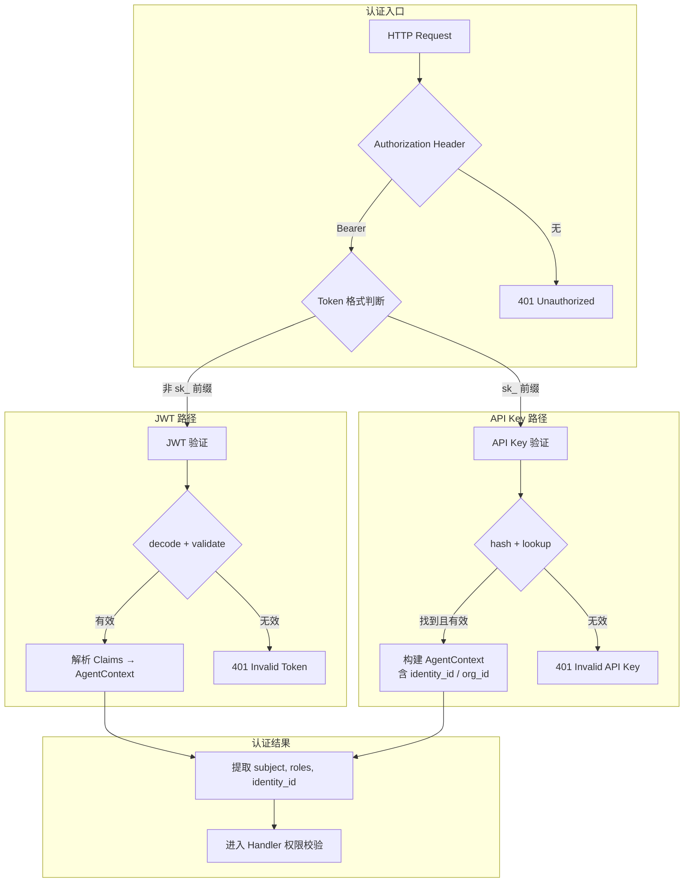
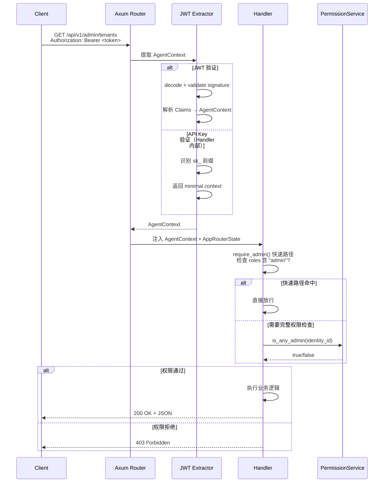

本页面深入剖析 AionHive 的 HTTP API 路由体系与双轨认证机制。路由层采用 Axum 框架构建，以 `/api/v1/` 为统一前缀组织所有业务端点；认证层则通过 JWT（JSON Web Token）与 API Key 两条路径实现身份验证，分别服务于用户交互式登录和 Agent/CLI 程序化访问两种场景。理解这一层的设计，是掌握后续 Handler 权限校验、SSE 实时通信等机制的基础。

## 路由拓扑：从根到叶的 Axum Router 构建

系统的路由定义集中在 `src/api/routes.rs` 一个文件中，由 `create_api_router(state: ApiState)` 函数统一组装。该函数接收一个 `Arc<AppRouterState>` 类型的共享状态，返回一个 `Router<ApiState>` 实例，随后在 `main.rs` 中通过 `.merge(api_router)` 合并到顶层 Router 中。顶层 Router 还挂载了 `/health`、`/mcp`、`/sse`、`/sse/:session_id` 四个非 v1 路径，其中 `/health` 不走认证，`/mcp` 和 `/sse` 由 MCP 服务器内部处理认证。Sources: [routes.rs](src/api/routes.rs#L1-L10), [main.rs](src/main.rs#L327-L334)

整个路由表按功能域划分为以下六大类别：

| 路由类别 | 前缀 | 典型端点 | 认证要求 |
|---------|------|---------|---------|
| 认证与用户 | `/api/v1/auth/` + `/api/v1/users/` | `/login`, `/register`, `/users/me` | 公开（登录/注册）或 JWT |
| Skill 资产 | `/api/v1/skills/` | CRUD, 上传, 审核, 版本管理, 下载 | JWT / API Key |
| 组织管理 | `/api/v1/orgs/:slug/` | 组成员, Skills, 审查 | JWT（需组织角色） |
| 管理后台 | `/api/v1/admin/` | 租户, 身份, 角色, API Key, 审计 | JWT + admin 角色 |
| 会话与工具 | `/api/v1/sessions/` + `/api/v1/tools/` | 会话查询, 工具执行 | JWT / API Key |
| 自服务 | `/api/v1/api-keys/` + `/api/v1/agents/` | 用户自主管理 API Key 和 Agent | JWT（仅本人） |

路由定义遵循 RESTful 风格，使用 Axum 的 `routing::{get, post, put, patch, delete}` 方法映射 HTTP 方法到对应的 Handler 函数。参数提取通过路径段（如 `:id`, `:slug`）和 Query 查询字符串完成。所有 Handler 函数分散在 `src/api/handlers/` 目录下的 30+ 个模块中，通过 `handlers/mod.rs` 统一 re-export。Sources: [routes.rs](src/api/routes.rs#L10-L540), [handlers/mod.rs](src/api/handlers/mod.rs#L1-L73)

## 双轨认证体系：JWT 与 API Key 的职责分工

AionHive 设计了两种独立的认证机制，服务于不同的使用场景：

**JWT 认证**面向用户交互场景：管理员通过 Admin 后台（Svelte）登录后获得 JWT token，后续请求在 `Authorization: Bearer <token>` 头中携带。JWT 的 Claims 中封装了 subject（用户 UUID）、roles（角色列表）和 auth_source（认证来源），用于快速身份识别和权限判断。JWT 的私钥由环境变量 `AION_HIVE_JWT_SECRET` 配置，若未设置则自动生成随机密钥——这意味着服务重启后所有旧 token 失效，生产环境务必配置固定密钥。JWT 有效期由 `AION_HIVE_JWT_EXPIRY_HOURS` 控制，默认 24 小时。Sources: [jwt.rs](src/api/jwt.rs#L14-L36)

**API Key 认证**面向程序化访问场景：Agent 或 CLI 工具通过 `sk_` 前缀的 API Key 进行认证。API Key 在创建时由 `ApiKeyService` 生成，格式为 `sk_<uuid>`（去除连字符后的 32 位十六进制字符串），并经过 SHA-256 + Salt 哈希后存储。认证时，系统通过 `is_api_key_format()` 函数快速判断 token 是否为 API Key 格式（`sk_` 前缀），然后调用 `ApiKeyService::validate()` 执行完整的有效性检查：验证哈希匹配、状态为 Active、未过期且关联的 Identity 状态为 Active。每次成功认证后，系统会通过 `mark_used()` 更新 `last_used_at` 时间戳，用于审计追踪。Sources: [jwt.rs](src/api/jwt.rs#L281-L284), [api_key.rs](src/services/admin/api_key.rs#L68-L102)



## JWT Claims 结构与 AgentContext 上下文

JWT 的 Claims 结构设计体现了系统演进中的两个关键设计决策：**认证来源区分**与**Phase 2 权限瘦身**。

Claims 包含 `auth_source` 字段（`AuthSource` 枚举），用于区分 Token 的签发途径：`UserLogin`（用户登录）、`AdminLogin`（管理员登录）、`RegisteredAgent`（通过 API Key 注册的 Agent）和 `LegacyAgent`（旧版 Agent，向后兼容）。在 Phase 2 演进中，`AdminLogin` 与 `UserLogin` 已合并，权限判断统一走 `PermissionService`，JWT 不再承载完整的权限信息，仅保留 `roles` 字段作为快速路径（如 `admin` 角色用于跳过 `require_admin()` 中的 DB 查询）。Sources: [jwt.rs](src/api/jwt.rs#L38-L74)

`AgentContext` 是认证完成后注入到 Handler 中的请求上下文结构体，包含比 JWT Claims 更丰富的运行时信息：

| 字段 | 来源 | 用途 |
|------|------|------|
| `subject` | JWT claims.subject | 调用方标识（identity UUID 或旧版 agent_id） |
| `identity_id` | JWT claims.identity_id | 归属 identity 的 UUID，权限校验的核心标识 |
| `roles` | JWT claims.roles | 角色列表（快速路径：admin 跳过 PermissionService） |
| `agent_id` | 仅 RegisteredAgent 来源 | 调用方 Agent 的 UUID |
| `session_id` | MCP 连接时自动创建 | 当前 MCP 会话 UUID |
| `org_id` | API Key 关联的组织 | 组织级权限判断的上下文 |
| `api_key_id` | API Key 认证时填充 | 审计追踪用 |
| `raw_api_key` | API Key 明文 | CLI setup 场景生成 config.toml 用 |

`AgentContext` 实现了 `FromRequestParts<S>` trait，这意味着它可以作为 Axum Handler 的参数直接提取，框架会自动从请求头中解析 Authorization 字段并完成 JWT 验证。对于 API Key 认证，需要先识别 token 格式，然后调用 `agent_context_from_identity()` 函数手动构建上下文。Sources: [jwt.rs](src/api/jwt.rs#L76-L168)

## API Key 全生命周期：从创建到吊销

API Key 的管理遵循"管理端批量管理 + 用户端自服务"的双轨模式：

**管理端端点**（前缀 `/api/v1/admin/api-keys`）由 `require_admin` 守卫保护，提供完整的 CRUD 操作：`list_api_keys_handler` 支持按 identity_id 或 organization_id 过滤；`create_api_key_handler` 允许管理员为任意用户创建 Key；`update_api_key_status_handler` 支持启用/禁用状态切换；`delete_api_key_handler` 执行彻底删除。Sources: [api_keys.rs](src/api/handlers/api_keys.rs#L10-L108)

**用户自服务端点**（前缀 `/api/v1/api-keys`）由 JWT 认证保护，仅允许用户操作自己的 Key：`list_my_api_keys_handler` 从 JWT subject 中提取 identity_id，列出该用户的所有 Key；`create_my_api_key_handler` 在创建时校验 `organization_id` 的归属关系（通过 `PermissionService::is_org_member()`）；`revoke_my_api_key_handler` 和 `update_my_api_key_status_handler` 均校验 `key.identity_id == identity_id`，防止越权操作。Sources: [api_keys.rs](src/api/handlers/api_keys.rs#L112-L241)

API Key 的状态机包含四个状态：`Active`（正常）、`Disabled`（管理员禁用）、`Expired`（过期）、`Revoked`（吊销）。`effective_status()` 方法会结合 DB 存储状态和 `expires_at` 字段计算有效展示状态，优先级为：Revoked > Disabled > Expired > Active。Key 的创建响应中会返回完整的明文 Key（仅此一次），之后所有查询仅返回 `key_prefix`（前 12 位）用于识别。Sources: [api_key.rs](src/models/api_key.rs#L24-L57)

## Agent 注册与 Token 交换

对于 MCP 场景下的 Agent 访问，系统设计了专门的注册-交换流程：

1. **Agent 注册**（`POST /api/v1/auth/agent/register`）：传入 `agent_id` 和可选的 `agent_name`，服务端生成一个 UUID v4 作为 `agent_secret`，存储在 `agents` 表中。返回的 secret 仅在注册时展示一次，对应安全最佳实践。Sources: [agents.rs](src/api/handlers/agents.rs#L10-L40)

2. **Token 交换**（`POST /api/v1/auth/agent/token`）：传入 `agent_id` 和 `agent_secret`，服务端验证凭据后调用 `generate_token()` 生成 JWT。该 JWT 的 subject 为 agent_id，roles 和 scope 为空数组，认证来源为 `LegacyAgent`（向后兼容模式）。后续 Agent 的所有请求通过此 JWT 进行认证。Sources: [agents.rs](src/api/handlers/agents.rs#L42-L65)

3. **Agent 自服务管理**（`GET /api/v1/agents`, `DELETE /api/v1/agents/:agent_id`）：用户可查看自己名下的所有 Agent 列表，并吊销不再使用的 Agent。吊销操作会校验 `agent.identity_id == identity_id`。Sources: [agents.rs](src/api/handlers/agents.rs#L67-L132)

## 用户登录流程与速率限制

用户登录（`POST /api/v1/auth/login`）是系统中最复杂的认证端点，它集成了多层安全检查：

```
用户登录流程
═══════════════════════════════════════════
1. 速率限制检查 ── 基于用户名的时间窗口限流（5次/5分钟）
2. 密码验证 ── IdentityService::verify_password_and_get_user()
3. 账号状态检查 ── 仅允许 Active 状态的 Identity 登录
4. 组织查询 ── 获取用户所属的所有组织列表
5. 权限上下文构建 ── PermissionService::build_context() 获取角色信息
6. JWT 生成 ── 根据 is_admin 判断决定是否注入 "admin" 角色
7. 返回 token + 用户信息 + 组织列表 + 角色信息
```

登录响应中除了 JWT token 外，还包含用户的 identity 信息、组织列表（含角色）、system_roles 和 tenant_roles 等，这样前端（Svelte Admin）在登录后无需额外请求即可完成权限初始化。速率限制器基于 `RateLimiter` 结构体，使用滑动时间窗口算法，每个用户独立计数。Sources: [users.rs](src/api/handlers/users.rs#L9-L83), [main.rs](src/main.rs#L228-L232)

## CLI Token 加密：AES-256-GCM 保护 API Key

在 CLI 安装场景中，`cli.setup` 命令需要将 API Key 写入 `config.toml` 文件。为防止明文泄露，系统设计了 AES-256-GCM 加密机制：

- 加密后的 token 格式为 `skc_<base64(nonce || ciphertext || tag)>`，其中 nonce 为 12 字节，由安全随机数生成器产生
- 加密密钥由环境变量 `AION_HIVE_CLI_ENCRYPTION_KEY` 提供（32 字节 hex，即 64 位十六进制字符）
- 解密函数 `decrypt_api_key()` 对非 `skc_` 前缀的 token 返回 `None`（表示非加密 token），保持向后兼容
- 每次加密产生的 nonce 不同，因此即使相同的 API Key 每次加密结果也不同，防止重放攻击

加密发生在 download token 创建时：当 CLI 通过 `DownloadToken` 获取安装包时，系统在 `config_data` 字段中预填加密后的 API Key，下载时直接嵌入 tar.gz 包中。这样 CLI 安装后即可直接使用，无需用户手动配置。Sources: [cli_token.rs](src/utils/cli_token.rs#L1-L90)

## 下载保护：Token 签名的安全下载通道

Skill 的 tar.gz 包下载和 CLI 二进制文件下载使用短时效的 Download Token 进行保护，而非直接暴露文件路径。下载端点（`/api/v1/skills/:name/download/:version` 和 `/api/v1/cli/download/:version/:target`）在 Handler 中验证 token 的有效性——检查签名、过期时间和资源类型匹配。`DownloadToken` 模型记录了下述信息：下载者 identity_id、使用的 api_key_id、资源类型（`skill` 或 `cli`）、过期时间以及使用状态。对于 CLI 下载，还额外携带预填的 `config_data`（含加密后的 API Key）。Sources: [download_token.rs](src/models/download_token.rs#L1-L38), [routes.rs](src/api/routes.rs#L61-L69)

## 认证层与路由的交互模式

从架构角度看，认证与路由的交互遵循"**提取 - 验证 - 注入**"的三段式模式：

1. **提取**：Axum 的 `FromRequestParts` 机制从 HTTP 请求头中提取 `Authorization: Bearer <token>` 字段
2. **验证**：`JwtAuth`（或手动调用的 API Key 验证逻辑）完成 token 的签名验证、过期检查、状态校验
3. **注入**：验证通过后，构建 `AgentContext` 实例并注入到 Handler 的参数列表中

对于需要管理员权限的端点，Handler 内部调用 `require_admin()` 辅助函数，该函数首先检查 JWT roles 中是否包含 `admin` 角色（快速路径，避免 DB 查询），若不包含则通过 `PermissionService::is_any_admin()` 执行完整的系统角色检查。这种设计在性能与安全性之间取得了平衡：高频请求通过 JWT claims 快速放行，复杂权限场景通过 PermissionService 精确判断。Sources: [helpers.rs](src/api/handlers/helpers.rs#L127-L144)



## 关键设计决策与演进路线

回顾认证层的设计演进，有三个关键决策值得关注：

**Phase 1 → Phase 2 的 JWT 瘦身**：早期版本中 JWT 的 roles 字段承载了完整的权限信息，导致 token 体积大且权限变更需要重新签发。Phase 2 将权限判断的重心迁移到 `PermissionService`，JWT 仅保留 `admin` 角色作为快速路径。这使得权限系统的弹性大幅提升——角色和权限的变更即时生效，无需用户重新登录。Sources: [jwt.rs](src/api/jwt.rs#L193-L205)

**API Key 的双轨管理模式**：管理员端和用户自服务端的 API Key 管理路径分离，既满足了管理员批量运维的需求，也赋予了用户对自身密钥的自主控制权。自服务端点通过 ownership 校验（`key.identity_id == identity_id`）防止越权，无需额外权限检查。

**CLI Token 加密的零信任设计**：即使 `config.toml` 文件泄露，攻击者也无法直接获取 API Key 明文。AES-256-GCM 认证加密模式还提供了完整性保护，防止篡改。加密密钥独立于 JWT 密钥，遵循密钥分离原则。

---

**下一步建议**：理解路由与认证机制后，建议继续阅读 [Handler 模式：请求处理、权限校验与错误处理](11-handler-mo-shi-qing-qiu-chu-li-quan-xian-xiao-yan-yu-cuo-wu-chu-li) 深入了解每个 Handler 如何利用 `AgentContext` 执行精细化的权限校验，以及 [RBAC 权限模型：System/Tenant/Org/Group 四级角色体系](8-rbac-quan-xian-mo-xing-system-tenant-org-group-si-ji-jiao-se-ti-xi) 掌握背后的权限数据模型架构。