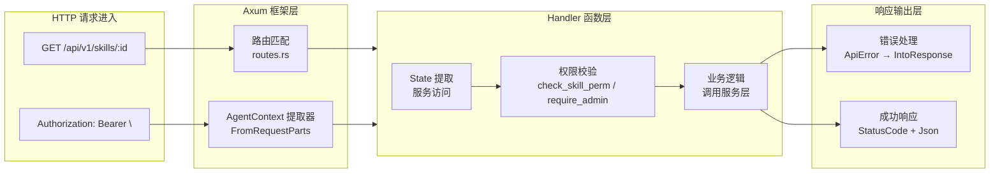
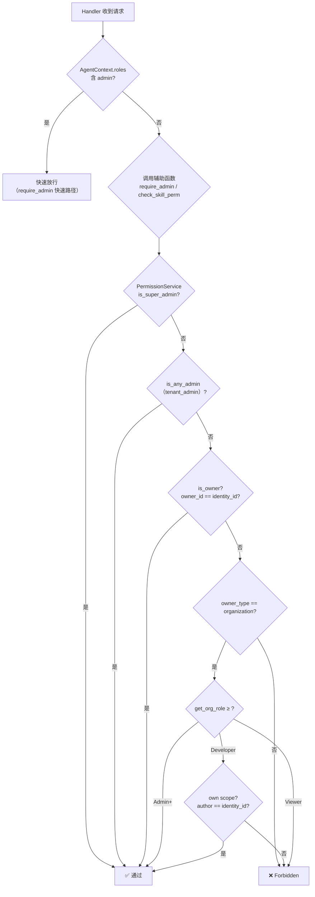
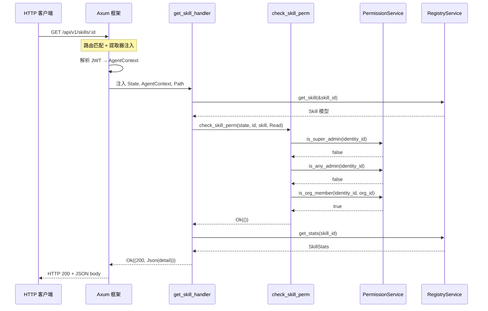

## 架构概览

REST API 层采用 **Axum 框架**实现经典的"路由-处理器-服务"三层架构，以 `ApiError` 为统一的错误类型枢纽，将认证（JWT/API Key）、授权（RBAC 权限校验）、请求处理、错误响应串联为一条清晰的请求生命周期管道。整个模式围绕四个核心抽象展开：**路由注册**（定义端点与处理函数的映射）、**认证提取**（`AgentContext` 从 HTTP 请求中自动解析身份）、**权限门控**（通过辅助函数在业务逻辑执行前进行准入检查）、**错误转换**（`ApiError` 枚举实现 `IntoResponse` 自动转化为标准 HTTP 错误 JSON）。



Sources: [src/api/routes.rs](src/api/routes.rs#L1-L541), [src/api/error.rs](src/api/error.rs#L1-L76), [src/api/handlers/mod.rs](src/api/handlers/mod.rs#L1-L73)

## 路由注册模式

所有 API 端点集中在 `routes.rs` 的 `create_api_router()` 函数中注册。该函数接收 `ApiState`（即 `Arc<AppRouterState>`）作为参数，返回一个配置完成的 `Router<ApiState>`。路由采用 **Axum 的链式注册风格**，每个 `.route()` 调用同时指定 HTTP 方法（`get`/`post`/`put`/`delete`/`patch`）和对应的 handler 函数。路径参数使用 `:param` 语法（如 `/:id`），通配符使用 `/*path`，由 Axum 自动解析并注入 handler 函数签名中对应的 `Path<T>` 提取器。

```rust
// 路由注册的统一模式
Router::new()
    .route("/api/v1/skills", get(list_skills_handler))
    .route("/api/v1/skills/:id", get(get_skill_handler))
    .route("/api/v1/skills/:id", put(update_skill_handler))
    .route("/api/v1/skills/:id", delete(delete_skill_handler))
    .with_state(state)
```

路由注册遵循以下命名约定：`/api/v1/` 前缀下的每个资源路径使用**复数名词**（`/skills`、`/users`、`/tenants`），嵌套资源使用冒号参数（`/orgs/:slug/groups/:group_id/members`）。全系统约 120 个路由端点分布在 30 多个 handler 模块中，通过 `pub use handlers::*` 统一导出，确保每个 handler 函数的可见性。`AppRouterState` 作为全局共享状态，通过 `State(state): State<ApiState>` 提取器注入每个 handler，内容包含所有服务实例（`RegistryService`、`PermissionService`、`SearchService` 等）、仓库实例（`SkillRepository`、`AgentRepository` 等）以及基础设施（`SseState`、`RateLimiter` 等）。

Sources: [src/api/routes.rs](src/api/routes.rs#L1-L541), [src/api/http_state.rs](src/api/http_state.rs#L1-L104)

## 认证提取：AgentContext 与 JWT 解析

认证机制的核心是 `AgentContext` 结构体，它通过实现 Axum 的 `FromRequestParts` trait 实现**零额外编码的自动提取**。当 handler 函数签名中包含 `agent_context: AgentContext` 参数时，Axum 在路由匹配后自动调用 `from_request_parts()` 方法，从 HTTP 请求头中读取 `Authorization: Bearer <token>`，解码并验证 JWT，构造完整的调用方上下文。

```rust
// Handler 函数签名中 AgentContext 作为提取器
pub async fn get_skill_handler(
    State(state): State<ApiState>,
    AgentContext { identity_id, .. }: AgentContext,  // 自动提取
    Path(skill_id): Path<String>,
) -> Result<impl IntoResponse, ApiError> { ... }
```

`AgentContext` 包含以下关键字段，覆盖了请求处理的全部身份信息需求：

| 字段 | 类型 | 来源 | 用途 |
|------|------|------|------|
| `subject` | `String` | JWT `sub` | 身份标识符（identity_id 或 agent_id） |
| `identity_id` | `Option<Uuid>` | JWT `identity_id` | 归属的 Identity UUID（核心权限主体） |
| `roles` | `Vec<String>` | JWT `roles` | 快速角色判断（如 `admin`） |
| `agent_id` | `Option<Uuid>` | RegisteredAgent 来源 | 调用方 Agent UUID |
| `session_id` | `Option<Uuid>` | MCP 连接时注入 | 当前 MCP 会话 |
| `org_id` | `Option<Uuid>` | API Key 认证时填充 | 调用方关联的组织 |
| `api_key_id` | `Option<Uuid>` | API Key 认证时填充 | 审计追踪用 |
| `auth_source` | `AuthSource` | JWT `auth_source` | 认证来源（UserLogin/RegisteredAgent） |

`from_request_parts()` 的完整流程是：从请求头提取 `Authorization` 值 → 验证 `Bearer ` 前缀 → 调用 `verify_token()` 解码 JWT → 从 `Claims` 构造 `AgentContext`。值得注意的是，若 token 是 `sk_` 开头的 API Key 格式，则通过另一条路径（中间件层拦截后调用 `agent_context_from_identity()`）构造 `AgentContext`，而非走 JWT 验证流程。`AgentContext` 还提供了 `require_identity()` 方法，将 `Option<Uuid>` 转换为 `Result<Uuid, ApiError>`，在需要强制身份认证的 handler 中统一使用。

Sources: [src/api/jwt.rs](src/api/jwt.rs#L1-L408), [src/api/handlers/helpers.rs](src/api/handlers/helpers.rs#L1-L271)

## 权限校验体系

权限校验分为**三个层次**，按调用频率和复杂度递增排列，形成一个渐进式授权体系：

### 第一层：快速角色检查（JWT roles）

适用于最简单的场景——在 handler 函数内部，直接检查 `AgentContext` 中的 `roles` 字段。`JWT roles` 中包含 `admin` 等快捷角色标记，用于最轻量的判断。例如 `user_login_handler` 中根据 `is_admin` 决定是否在 JWT 中注入 `"admin"` 角色。`AgentContext` 还提供了 `require_admin()` 方法，将 `roles` 检查封装为 `Result<(), ApiError>`。

### 第二层：辅助函数门控（helpers.rs）

`helpers.rs` 定义了一系列**权限检查辅助函数**，它们封装了 `PermissionService` 的调用，统一返回 `Result<Uuid, ApiError>`。这些函数是 handler 层最常用的权限门控手段：

- **`require_admin()`**：检查是否为系统管理员（super_admin 或任意租户的 tenant_admin）。先检查 `AgentContext.roles` 中的 `admin` 快速路径，再调用 `permission.is_any_admin()` 进行数据库查询。
- **`require_marketplace_admin()`**：检查是否拥有 `super_admin` / `marketplace_admin` / `marketplace_reviewer` 角色之一。
- **`require_marketplace_admin_only()`**：仅检查 `super_admin` / `marketplace_admin`，排除 `marketplace_reviewer`。
- **`require_org_member()`**：验证用户是否是指定组织的成员，并可设定最低角色要求（如 `OrgRole::Admin`）。
- **`check_skill_perm()` / `check_skill_perm_db()` / `check_skill_perm_raw()`**：对 Skill 资源的细粒度权限校验，传入 `SkillAction` 枚举（`Read` / `Update` / `Delete` / `SubmitReview` / `Approve` / `Reject` / `Publish` / `PublishToMarketplace`）。

这些函数的返回值统一为 `Result<Uuid, ApiError` 的原因是：权限校验成功后通常需要获取 `identity_id` 用于后续业务逻辑（如写入审计日志、记录操作者），免去重复提取。

### 第三层：PermissionService 细粒度鉴权（services/permission.rs）

`PermissionService` 是权限校验的最底层，提供**完整的 RBAC 上下文构建**和**资源级权限判断**。其核心方法是 `build_context()`，接受 `identity_id`，从四张角色表（`system_role_assignments`、`tenant_role_assignments`、`org_membership`、`group_repo`）中聚合构建完整的 `PermissionContext`，包含 `system_roles`（HashSet）、`tenant_roles`（Vec<（Uuid, String）>）、`org_roles`（Vec<（Uuid, String）>）、`group_roles`（Vec<（Uuid, String）>）。

`build_context()` 的结果带有 **5 秒 TTL 的内存缓存**（`context_cache: Arc<Mutex<HashMap<Uuid, ContextCacheEntry>>>`），在短时间窗口内同一用户的多次请求共享同一个权限上下文，显著降低数据库查询压力。缓存失效后自动重建，保证权限变更的最终一致性。

`check_skill_permission()` 方法实现了针对 Skill 操作的完整鉴权逻辑，按优先级依次检查：
1. **超级管理员**（`super_admin`）—— 全部放行
2. **租户管理员**（`tenant_admin`）—— 对其租户下的所有 Skill 拥有全部权限
3. **Skill 所有者**（`owner_type == "user" && owner_id == identity_id`）—— 拥有全部权限
4. **组织成员**（`owner_type == "organization"`）—— 根据 `OrgRole` 层级（`Viewer` < `Developer` < `Admin` < `Owner`）和 `SkillAction` 类型进行精细化判断。例如 `Update` 操作要求 `Admin` 以上角色可编辑任意 Skill，`Developer` 仅可编辑自己创建的 Skill（own scope），`Viewer` 无编辑权限。
5. **市场可见性**（`visibility == "marketplace" && status == "published"`）—— 公开 Skill 所有用户可读



Sources: [src/api/handlers/helpers.rs](src/api/handlers/helpers.rs#L1-L271), [src/services/permission.rs](src/services/permission.rs#L1-L800), [src/api/handlers/permission_check.rs](src/api/handlers/permission_check.rs#L1-L65)

## 错误处理体系

`ApiError` 枚举是贯穿整个 Handler 层的统一错误类型，它同时承担了**类型标记**、**错误消息**和**HTTP 响应生成**三重职责。

```rust
pub enum ApiError {
    NotFound(String),        // 404
    BadRequest(String),      // 400
    Unauthorized(String),    // 401
    Forbidden(String),       // 403
    InternalError(String),   // 500
    Conflict(String),        // 409
    TooManyRequests(String), // 429
}
```

每个 variant 映射到对应的 HTTP Status Code，通过 `IntoResponse` trait 实现自动转换为 JSON 响应体：

```json
{
    "error": "Skill not found: id=abc-123",
    "status": 404
}
```

`ApiError` 的设计体现了几点关键考量：

- **从 `anyhow::Error` 转换**：允许 handler 中通过 `?` 运算符直接传播 `anyhow` 错误，自动转换为 `InternalError`。这适用于服务层调用返回的未分类错误。
- **从 `serde_json::Error` 转换**：JSON 解析错误自动映射为 `BadRequest`，避免在不合法请求体时暴露 500 错误。
- **从 `AppError` 转换**：模型层的领域错误统一转换为 `InternalError`，保持错误抽象边界。
- **`ApiResult<T>` 类型别名**：`type ApiResult<T> = Result<T, ApiError>` 作为所有 handler 函数的统一返回类型。

在 handler 函数中，所有错误操作都通过 `?` 运算符或 `map_err` 转换为 `ApiError`：

```rust
// 统一错误转换模式
let skill = state
    .registry
    .get_skill(&skill_id)
    .await
    .map_err(|e| ApiError::NotFound(format!("Skill {} not found: {}", skill_id, e)))?;

check_skill_perm(&state, identity_id, &skill, SkillAction::Read).await?;

state
    .permission
    .build_context(identity_id)
    .await
    .map_err(|e| ApiError::InternalError(e.to_string()))?;
```

这种模式确保了 **handler 函数体不包含任何错误响应的序列化逻辑**——所有错误路径都通过类型系统在 `?` 处自动转发，最终由 Axum 框架调用 `ApiError::into_response()` 完成响应生成。这使 handler 函数的代码高度聚焦于业务逻辑，错误处理完全由类型系统驱动。

Sources: [src/api/error.rs](src/api/error.rs#L1-L76), [src/api/handlers/skills.rs](src/api/handlers/skills.rs#L1-L507)

## Handler 函数的典型结构

综合以上三个维度，一个完整的 handler 函数遵循以下结构模式，按照"提取 → 验证 → 处理 → 响应"的顺序组织：

```rust
pub async fn update_skill_handler(
    // 1. 提取层：通过 Axum 提取器自动获取
    State(state): State<ApiState>,
    agent_context: AgentContext,
    Path(skill_id): Path<String>,
    Json(body): Json<UpdateSkillBody>,
) -> Result<impl IntoResponse, ApiError> {
    // 2. 权限门控层：先检查权限，再执行业务
    let skill = state
        .registry
        .get_skill(&skill_id)
        .await
        .map_err(|e| ApiError::NotFound(...))?;

    let identity_id = agent_context.require_identity()?;
    check_skill_perm(&state, Some(identity_id), &skill, SkillAction::Update).await?;

    // 3. 业务逻辑层：调用 Service 层执行操作
    let update = SkillUpdate { ... };
    state.registry.update_skill(&skill_id, update).await
        .map_err(|e| ApiError::BadRequest(...))?;

    // 4. 响应层：返回成功结果
    Ok((StatusCode::OK, Json(response)))
}
```

不同类别的 handler 在权限校验策略上有所区别：

| Handler 类别 | 权限校验策略 | 典型辅助函数 | 适用场景 |
|---|---|---|---|
| **公开端点** | 无校验或仅身份提取 | 无，仅 `AgentContext` | 健康检查、登录注册、市场列表 |
| **用户自有** | 身份认证 + 资源所有权 | `agent_context.require_identity()` | 个人 Skills 管理、API Key 管理 |
| **组织操作** | 组织成员身份 + 角色最低要求 | `require_org_member(state, ctx, org_id, min_role)` | 组织成员管理、组织 Skills 编辑 |
| **管理操作** | 管理员角色校验 | `require_admin()` / `require_marketplace_admin()` | 租户管理、系统角色分配、审计日志 |
| **Skill 资源** | 资源级 RBAC 校验 | `check_skill_perm(state, id, skill, action)` | Skill CRUD、审核、发布 |

Sources: [src/api/handlers/skills.rs](src/api/handlers/skills.rs#L150-L350), [src/api/handlers/users.rs](src/api/handlers/users.rs#L1-L200), [src/api/handlers/tenants.rs](src/api/handlers/tenants.rs#L1-L158), [src/api/handlers/admin.rs](src/api/handlers/admin.rs#L1-L109)

## 跨层交互与数据流

以一次典型的"获取 Skill 详情"请求为例，完整的数据流展现了各层之间的协作关系：



此流程展示了 Handler 模式的核心设计原则：**Handler 函数不直接操作数据库**，所有数据访问都通过 Service 层进行；**权限校验独立于业务逻辑**，在调用 Service 之前完成；**错误路径全部由类型系统驱动**，`?` 运算符自动传播错误到 Axum 框架层。

Sources: [src/api/handlers/skills.rs](src/api/handlers/skills.rs#L78-L150), [src/services/permission.rs](src/api/../services/permission.rs#L1-L800)

## 配置日志追踪与可观测性

Handler 模式中内嵌了多层次的可观测性支持。每个 handler 的请求日志由 `main.rs` 中的 `request_logging_middleware` 中间件自动记录，包含 `method`、`uri`、`status_code`、`latency_ms` 四个维度。权限校验失败时，`check_skill_perm_raw` 和 `PermissionService::check_skill_permission` 中通过 `tracing::warn!` 输出详细的拒绝原因，包括 `identity_id`、`org_id`、`role` 等上下文信息。在 `ApiError` 的 `IntoResponse` 实现中，错误被记录为 `tracing::error!` 级别日志，确保所有异常路径都有迹可循。

这种设计使生产环境中的问题排查路径清晰可循：从请求日志确认耗时和状态码 → 从权限拒绝日志定位授权策略问题 → 从错误级别日志定位服务层异常，形成完整的可观测性闭环。

Sources: [src/main.rs](src/main.rs#L1-L50), [src/services/permission.rs](src/services/permission.rs#L200-L400)

## 总结与最佳实践

Handler 模式在 AionHive 中体现了以下几个核心设计原则：

**职责分离**：路由注册（`routes.rs`）只负责 URL 映射，不包含任何业务逻辑；Handler 函数负责编排但不直接操作数据库；Service 层封装业务逻辑；Repository 层封装数据访问。每层只做一件事，边界清晰。

**错误统一**：所有 handler 函数返回 `Result<impl IntoResponse, ApiError>`，确保错误路径的响应格式完全一致。`ApiError` 的 7 个 variant 覆盖了 HTTP API 的全部常见错误场景，`From` 实现保证了与下层错误类型的兼容。

**权限前置**：所有需要权限保护的 handler 在函数体最前面调用权限检查函数，形成"先检查后执行"的契约。`check_skill_perm` 等辅助函数将 `PermissionService` 的复杂调用封装为一行代码，降低了 handler 函数的认知负担。

**提取器驱动**：`AgentContext` 的 `FromRequestParts` 实现使认证信息对 handler 函数完全透明——开发者只需在参数列表中声明即可获得完整的身份上下文，无需手动解析 JWT 或查询数据库。

**下一阶段阅读建议**：理解 Handler 模式后，建议深入阅读 [Permission 服务：多层级权限上下文构建与缓存](15-permission-fu-wu-duo-ceng-ji-quan-xian-shang-xia-wen-gou-jian-yu-huan-cun) 了解权限校验的底层实现，以及 [API 路由设计与认证机制（JWT + API Key）](10-api-lu-you-she-ji-yu-ren-zheng-ji-zhi-jwt-api-key) 了解认证机制的完整设计。