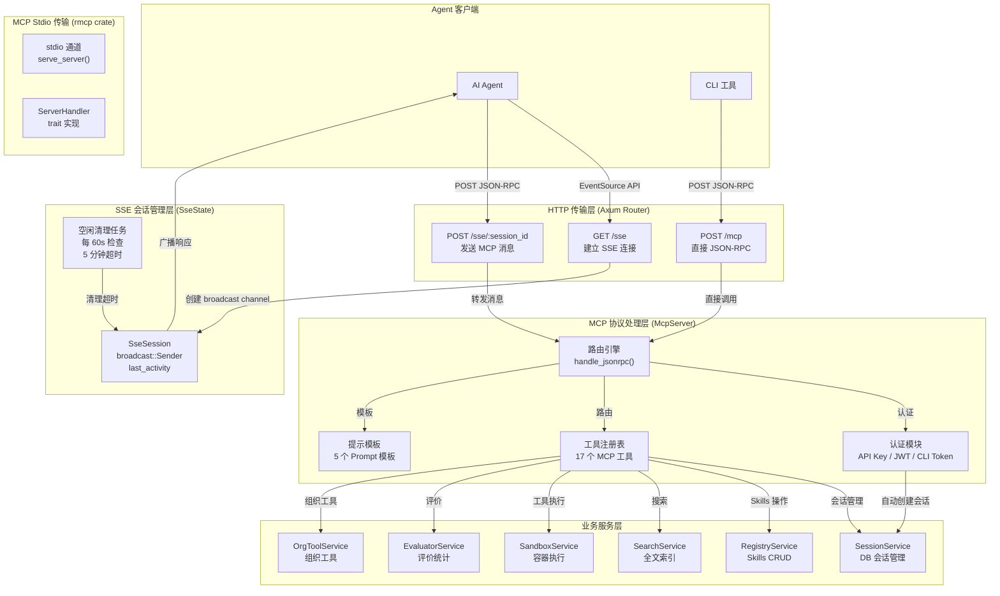
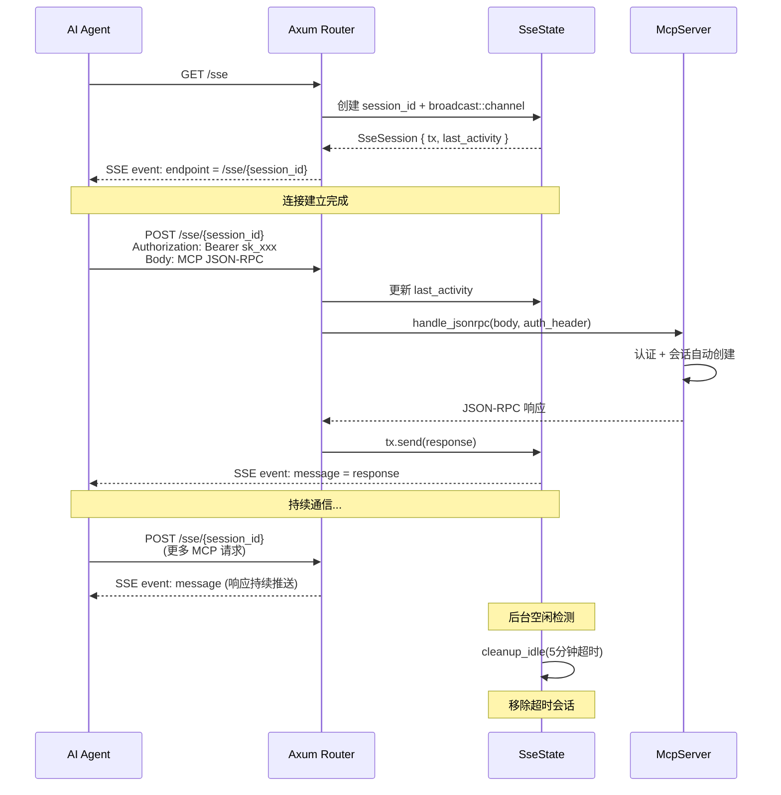
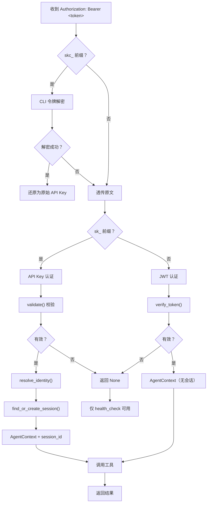
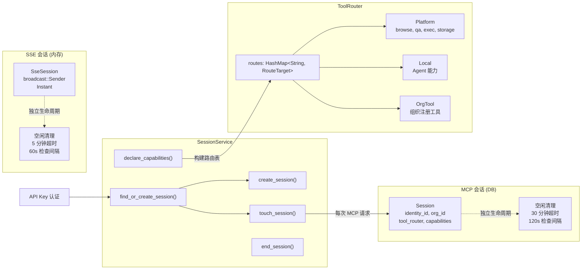

SSE（Server-Sent Events）与 MCP（Model Context Protocol）的桥接是 AionHive 平台的核心通信架构，使 AI Agent 能够通过标准化的 HTTP 协议与平台进行实时双向通信。这一架构解决了两个关键问题：Agent 如何通过 HTTP 通道使用 MCP 协议与 Skills 仓库交互，以及如何管理会话生命周期。

## 架构总览：从 HTTP 到 MCP 的双层桥接

AionHive 的通信架构采用**三层传输模型**：最外层是标准的 HTTP 接口，中间层是 SSE 实时推送通道，最内层是 MCP 协议处理引擎。这种分层设计使得 Agent 既可以通过 SSE 实现长连接实时通信，也可以通过直接的 POST 端点进行一次性请求。

Sources: [main.rs](src/main.rs#L1-L402), [http_state.rs](src/api/http_state.rs#L1-L104), [mcp/server.rs](src/mcp/server.rs#L1-L2167)

这个架构的核心设计理念是**传输层与协议层分离**：SSE 只负责 HTTP 长连接的建立和消息的上下行转发，MCP 协议层（`McpServer`）则专注于 JSON-RPC 消息的处理和业务逻辑的编排。两者通过 `handle_jsonrpc()` 方法桥接，使得同一个 MCP 协议引擎可以同时服务于 SSE 长连接和直接的 HTTP 短连接。

## SSE 传输层：建立长连接实时通道

SSE 传输层基于 Axum 框架的 `Sse` 响应类型和 `tokio::sync::broadcast` 广播通道实现。当 Agent 发起 `GET /sse` 请求时，服务端会创建一个独一无二的会话 ID，分配一个广播通道，并通过 SSE 的 `endpoint` 事件将专属的消息发送端点告知客户端。

### SSE 连接的完整生命周期

建立 SSE 连接的过程分为四个阶段，每个阶段都在 `main.rs` 的 `sse_handler` 和 `sse_message_handler` 中实现：

**阶段一：连接建立（`GET /sse`）**。服务端生成 UUID 作为会话 ID，初始化容量为 100 的 `broadcast::channel`，将 `(session_id, SseSession)` 对写入 `SseState.sessions`（`Arc<RwLock<HashMap>>`）。然后构造一个 `event: endpoint` 事件，数据为 `/sse/{session_id}`，通过 SSE 流发送给客户端。这个端点 URL 是客户端后续发送消息的目标。

**阶段二：消息发送（`POST /sse/:session_id`）**。客户端收到 endpoint 后，将 MCP JSON-RPC 请求 POST 到该端点。服务端先更新 `last_activity` 时间戳用于空闲检测，然后从 `SseState` 取出对应的 `broadcast::Sender`，释放读锁后调用 `McpServer::handle_jsonrpc()` 处理请求，最后将结果通过 broadcast channel 发送回 SSE 流。

**阶段三：持续通信**。SSE 流保持打开状态，客户端可以重复发送 POST 请求，服务端通过同一个 broadcast channel 将响应推送给客户端。`axum::response::sse::KeepAlive` 确保连接不会因网络中间件超时而断开。

**阶段四：空闲清理**。后台任务每 60 秒检查所有 SSE 会话的 `last_activity`，超过 5 分钟（`SSE_IDLE_TIMEOUT_SECS`）无消息的会话将被自动移除并释放资源。这个超时时间在 `http_state.rs` 中配置为常量 `300` 秒。

Sources: [main.rs](src/main.rs#L1-L402), [http_state.rs](src/api/http_state.rs#L1-L104)

这里有一个关键的设计决策：**为什么 SSE 使用独立的 broadcast channel，而不是共享 MCP 的 stdio 通道？** 因为 `McpServer` 本身基于 `rmcp` crate 的 stdio 传输模式实现（`serve_server()`），而 SSE 传输需要 HTTP 请求/响应模式。通过独立的 broadcast channel，SSE 层可以异步处理多个请求，而不会阻塞 stdio 通道。`run_sse()` 方法虽然存在，但内部仍使用 stdio，实际上 SSE 的主要逻辑是通过 `handle_jsonrpc()` 直接调用的。

## MCP 协议层：JSON-RPC 消息处理引擎

`McpServer` 位于 `src/mcp/server.rs`，是整个系统的协议处理核心。它同时实现了两个接口：`rmcp::ServerHandler` trait（用于 stdio 传输）和 `handle_jsonrpc()` 方法（用于 HTTP/SSE 传输）。这种双重实现确保无论使用哪种传输方式，业务逻辑保持一致。

### 认证机制：三层令牌体系

`handle_jsonrpc()` 方法接收可选的 `Authorization` 请求头，支持三种认证模式，按优先级依次尝试：

**第一层 — CLI 加密令牌（`skc_` 前缀）**：当配置了 32 字节的 CLI 加密密钥时，服务端尝试用 `cli_token::decrypt_api_key()` 解密。解密成功的令牌还原为原始 API Key 后进入下一层校验。解密失败则透传，由后续步骤处理。这个机制用于 CLI 工具的安全分发场景。

**第二层 — API Key 认证（`sk_` 前缀）**：这是主流的认证方式。`resolve_identity_from_api_key()` 方法执行以下步骤：
1. 调用 `ApiKeyService::validate()` 校验 API Key 的有效性、过期时间、是否被禁用或撤销
2. 通过 `IdentityService::get()` 查找身份信息（display_name）
3. 更新 `last_used_at` 时间戳
4. 构建 `AgentContext`，包含 `identity_id`、`org_id`、`api_key_id` 等关键信息
5. **自动创建会话**：调用 `SessionService::find_or_create_session()` 查找或创建新的 MCP 会话，并将 `session_id` 绑定到 `AgentContext` 中

**第三层 — JWT 令牌（`eyJ` 前缀）**：作为向后兼容的降级方案，使用 `verify_token()` 验证 JWT 令牌。这种方式不创建会话，仅提供基本的身份标识。

Sources: [mcp/server.rs](src/mcp/server.rs#L1-L400)

### 可见性隔离：MCP 专属的 Skill 过滤规则

这是一个重要的安全设计。MCP 协议层的 Skill 可见性规则与 REST API 不同，采用**严格隔离**策略。`filter_skills_visible_mcp()` 方法实现了三条规则：

- **未认证的请求**：只能看到 `status=published` 且 `visibility=marketplace` 的 Skill（公开市场）
- **个人 API Key（无 org_id）**：只能看到自己拥有的 Skill（`owner_type=user` 且 `owner_id` 或 `author_identity_id` 匹配当前身份），加上市场已发布的 Skill
- **组织 API Key（有 org_id）**：只能看到该组织拥有的 Skill（`owner_type=organization` 且 `owner_id` 匹配），加上市场已发布的 Skill。**即使该组织成员的个人 Skill 也不可见**

这种设计从根本上防止了数据泄露：个人 API Key 无法看到组织的 Skill，组织 API Key 也无法看到个人的 Skill。这与 REST API 的混合可见性策略形成鲜明对比。

### 工具注册表：17 个 MCP 工具

`tools()` 方法注册了 17 个 MCP 工具，分为六大类：

| 类别 | 工具名称 | 功能描述 | 认证要求 |
|------|---------|---------|---------|
| **系统** | `health_check` | 服务健康检查 | 无需认证 |
| **Skills 搜索** | `skills.search` | 全文搜索（支持标签过滤） | 需要 |
| | `skills.list` | 分页列表（支持排序） | 需要 |
| | `skills.info` | 获取详细信息 | 需要 |
| | `skills.popular` | 按安装数排序的热门列表 | 需要 |
| | `skills.versions` | 按名称列出所有版本 | 需要 |
| **Skills 操作** | `skills.create` | 创建新 Skill | 需要 |
| | `skills.update` | 更新已有 Skill | 需要 |
| | `skills.install` | 安装并获取下载链接 | 需要 |
| **评价** | `evaluate_skill` | 提交评价（成功率、耗时、标签） | 需要 |
| | `skills.stats` | 获取统计指标 | 需要 |
| **会话** | `session.info` | 获取当前会话信息 | 需要 |
| | `session.declare` | 声明 Agent 能力 | 需要 |
| **工具路由** | `tools.list` | 列出组织已审批的工具 | 需要 |
| | `tools.execute` | 执行组织工具 | 需要 |
| | `tools.platform.execute` | 执行平台内置工具 | 需要 |
| **部署** | `cli.setup` | 获取 CLI 安装包 | 需要 |

每个工具都定义了完整的 JSON Schema 输入参数描述，包括参数类型、枚举值、描述信息和必填字段。例如 `skills.create` 要求 `name`、`description`、`content` 为必填，`tags`、`tools`、`version` 为可选。

Sources: [mcp/server.rs](src/mcp/server.rs#L1599-L1798)

### Prompt 模板系统：引导 Agent 工作流

`McpServer` 实现了 `ServerHandler::list_prompts()` 和 `get_prompt()` 方法，提供了 5 个预定义的 Prompt 模板，用于引导 Agent 完成特定工作流：

- **`discover-skill`**：引导 Agent 搜索、评估并推荐最适合当前任务的 Skill，包含完整的搜索 → 信息获取 → 统计评估 → 推荐流程
- **`create-skill`**：提供 SKILL.md 的 YAML 格式模板，引导 Agent 创建标准化的 Skill，包括归属类型推断规则
- **`install-skill`**：指导 Agent 完成下载、解压、移动到 Skills 目录的完整安装流程
- **`evaluate-skill-reliability`**：提供可靠性评估的量化标准，包括 success_rate、confidence、total_evaluations 等指标的阈值判断
- **`generate-skill-template`**：生成可填充的 SKILL.md 模板，包含完整的 YAML 头部和 Markdown 正文结构

这些 Prompt 模板使用 `PromptMessageRole::User` 和 `PromptMessageRole::Assistant` 两种角色，构建了结构化的对话上下文，使 Agent 能够遵循标准化的操作流程。

Sources: [mcp/server.rs](src/mcp/server.rs#L1798-L2167)

## 会话管理：双轨生命周期

AionHive 维护着**两套独立的会话系统**，分别服务于不同的目的：

### SSE 会话（内存级）

由 `SseState` 管理，存储在 `Arc<RwLock<HashMap<String, SseSession>>>` 中。每个会话包含 `broadcast::Sender<String>` 用于消息推送，以及 `last_activity: Instant` 用于空闲检测。超时时间为 5 分钟，后台清理任务每 60 秒执行一次。SSE 会话是轻量级的，主要服务于 SSE 长连接的维持和消息路由。

### MCP 会话（数据库持久化）

由 `SessionService` 管理，通过 `SessionRepository` 持久化到 PostgreSQL。每个 MCP 会话包含 `identity_id`、`org_id`、`status`（Active/Ended）、`tool_router`（JSON 格式的路由表）、`capabilities`（Agent 声明的能力列表）等字段。空闲超时为 30 分钟，后台清理任务每 120 秒执行一次。

当 Agent 通过 API Key 认证时，`handle_jsonrpc()` 自动调用 `find_or_create_session()` 查找该身份的活动会话，若存在则复用（避免创建重复会话），否则创建新会话。每次 MCP 请求都会调用 `touch_session()` 更新 `last_active_at`，防止被空闲清理。

Sources: [services/session.rs](src/services/session.rs#L1-L345), [models/session.rs](src/models/session.rs#L1-L96)

### ToolRouter：能力声明与路由决策

`SessionService::declare_capabilities()` 方法根据 Agent 声明的能力构建路由表。路由逻辑在 `ToolRouterService` 中实现，遵循固定的优先级：

1. 平台工具（`browse`、`qa`、`exec`、`storage`）始终路由到 `RouteTarget::Platform`
2. Agent 声明的能力（除平台工具外）路由到 `RouteTarget::Local`
3. 组织注册的 CLI 工具路由到 `RouteTarget::OrgTool(tool_id)`

路由表以 JSON 格式持久化在 `Session.tool_router` 字段中，Agent 可以通过 `session.declare` MCP 工具动态更新。这个设计使得 Agent 可以灵活地声明支持哪些工具，而服务端则根据声明和平台配置自动决定路由目标。

Sources: [services/tool_router.rs](src/services/tool_router.rs#L1-L91), [models/session.rs](src/models/session.rs#L1-L96)

## 双通道传输：SSE 与直接 POST 的对比

除了 SSE 长连接，系统还提供了 `POST /mcp` 端点（`mcp_handler`），支持一次性的 JSON-RPC 请求。这种方式适合 CLI 工具或不需要长连接的场景。两种传输方式的对比：

| 特性 | `POST /mcp`（短连接） | `GET /sse` + `POST /sse/:id`（长连接） |
|------|-------------------|-----------------------|
| **连接模型** | 每次请求新建连接 | 持久连接，复用通道 |
| **消息模式** | 请求-响应（同步） | 请求-响应（异步推送） |
| **适用场景** | CLI 工具、一次性查询 | Agent 持续交互、实时通信 |
| **会话管理** | 无 SSE 会话（仅 DB 会话） | SSE 会话 + DB 会话双重管理 |
| **认证方式** | 每请求 `Authorization` 头 | 每请求 `Authorization` 头 |
| **资源消耗** | 低（无长连接） | 中（需维持连接） |
| **超时机制** | 无（请求完成后断开） | 5 分钟空闲超时 + 清理任务 |

两种传输方式共享同一个 `McpServer::handle_jsonrpc()` 方法，因此业务逻辑完全一致。区别仅在于传输层的资源管理方式。

Sources: [main.rs](src/main.rs#L1-L402)

## 测试与验证

项目中提供了三层测试覆盖：

**`tests/e2e/mcp_sse_e2e_test.ts`**：基于 Deno 的 MCP SDK 测试，使用 `SSEClientTransport` 模拟 Agent 的 SSE 连接。测试用例覆盖了健康检查、工具列表、Skills 创建与查询、搜索、多请求会话等场景。由于 `eventsource` npm 包在 Deno 中的兼容性问题，这些测试需要在 Node.js 或浏览器环境中运行。

**`tests/e2e/sse_simple_test.ts`**：低级别的 SSE 协议测试，使用原生 `fetch` API 手动解析 SSE 事件流。不依赖 MCP SDK，直接测试 `GET /sse` 连接建立、`endpoint` 事件接收、`POST /sse/:session_id` 消息发送和响应接收的完整流程。

**`tests/e2e/mcp_e2e_test.ts`**：针对 `POST /mcp` 端点的测试，验证 JSON-RPC 请求的直连处理能力。

Sources: [tests/e2e/mcp_sse_e2e_test.ts](tests/e2e/mcp_sse_e2e_test.ts#L1-L175), [tests/e2e/sse_simple_test.ts](tests/e2e/sse_simple_test.ts#L1-L108)

## 总结与架构决策要点

SSE 与 MCP 的桥接架构体现了几个关键的设计决策：

- **传输协议与业务逻辑分离**：`McpServer` 同时支持 stdio（原生 MCP）和 HTTP（桥接模式），所有业务逻辑集中在 `handle_jsonrpc()` 和 `call_tool_internal()` 中，不依赖于具体的传输方式
- **认证与会话自动绑定**：API Key 认证后自动创建或复用 MCP 会话，使 Agent 无需手动管理会话生命周期
- **双轨会话管理**：内存级 SSE 会话负责连接维持，数据库级 MCP 会话负责状态持久化，两者互不干扰
- **严格可见性隔离**：MCP 协议层采用比 REST API 更严格的隔离策略，防止跨组织/跨用户的 Skill 数据泄露
- **可扩展的工具注册表**：17 个 MCP 工具覆盖了 Skills 全生命周期管理，未来可以通过 `tools()` 方法扩展

下一步可以深入阅读 [Session 服务：MCP 会话生命周期与工具路由](16-session-fu-wu-mcp-hui-hua-sheng-ming-zhou-qi-yu-gong-ju-lu-you) 了解会话的详细实现，或查看 [Sandbox 服务：Docker 容器隔离执行与工具池管理](14-sandbox-fu-wu-docker-rong-qi-ge-chi-zhi-xing-yu-gong-ju-chi-guan-li) 了解工具执行的后端机制。