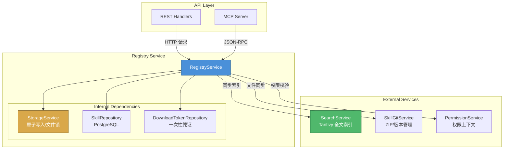
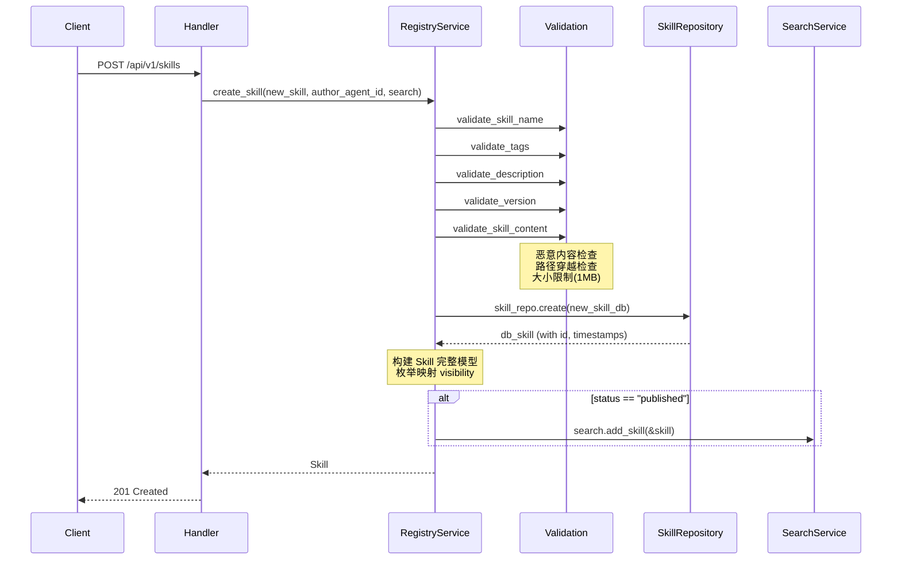
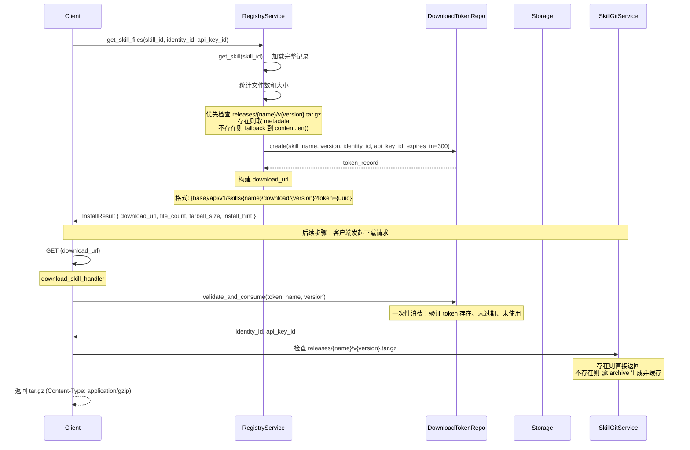
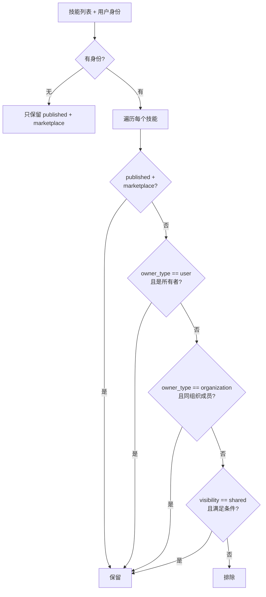

Registry 服务是 Skill-Garden 平台中负责 Skills 全生命周期管理的核心服务层。它向上承接 REST API 和 MCP 协议层的请求，向下协调 PostgreSQL 数据库持久化、Tantivy 全文搜索引擎、文件系统存储与原子写入、以及 Git 仓库版本管理等多个子系统，是平台数据流的枢纽。

## 职责边界与架构定位

Registry 服务处于业务服务层，与周围服务的关系可以概括为：**Registry 是 Skill 资产的权威数据源（source of truth），Search 是它的查询视图，Storage 是它的文件操作基础设施，SkillGit 是它的版本管理扩展**。它的核心职责涵盖四点：

- **Skills CRUD**：创建、读取、更新、删除 Skill 资产，涉及输入验证、数据库持久化、搜索索引同步
- **文件存储**：管理 SKILL.md 文件、skills-index.json 索引文件，以及版本化 tarball 的生成路径
- **安装与下载**：生成带时限的下载凭证（token），统计文件数量和大小，构建安全的下载 URL
- **可见性过滤**：根据 `Visibility` 枚举（Private / OrgVisible / Marketplace / Shared）和用户身份，对列表结果进行过滤



Sources: [registry.rs](src/services/registry.rs#L1-L50), [services/mod.rs](src/services/mod.rs#L1-L33)

## 核心数据结构：Skill 模型

Registry 服务操作的核心是 `Skill` 结构体，它定义在 `src/models/skill.rs` 中。Skill 模型包含三个层级的表示：

| 结构体 | 用途 | 特点 |
|--------|------|------|
| `Skill` | 完整模型 | 包含 `content`（SKILL.md 内容）、`visibility`（枚举）、`marketplace_status` 等全量字段 |
| `SkillMetadata` | 列表展示 | 不含 `content`，含 `author_name` 联表字段，用于分页列表和搜索结果摘要 |
| `SkillDetail` | 详情展示 | 包含 `SkillMetadata` + `content` + 可选的 `stats`（评价统计） |

Skill 的生命周期由 `status` 字段控制，其状态流转为：`draft` → `pending_review` → `approved` → `published`，或 `rejected` 回退。`marketplace_status` 是独立的平行状态，用于市场发布流程：`pending_review` → `listed` / `rejected` / `delisted` / `unlisted`。两者共同决定了 Skill 的可发现性。

Sources: [skill.rs](src/models/skill.rs#L1-L200), [skill_policy.rs](src/models/skill_policy.rs#L1-L55)

## 创建流程：验证 → 持久化 → 索引同步

`create_skill` 方法体现了 Registry 服务最核心的写入流程，包含五个严格顺序的阶段：



输入验证是防止恶意数据注入的第一道防线。`validate_skill_name` 只允许字母数字、连字符、下划线和空格；`validate_skill_content` 扫描 `<script>`、`javascript:`、`/etc/passwd` 等 12 种恶意模式，并检查路径穿越（`..` / `../`）。内容大小限制为 500KB，整篇 Skill 限制为 1MB。`normalize_description` 会清理多余空白和换行，确保描述字段的整洁性。

持久化后的搜索索引同步是**有条件的**：只有 `status == "published"` 的 Skill 才会被加入 Tantivy 索引。这意味着草稿、待审核、已拒绝的 Skill 不会出现在搜索结果中，体现了"先审核后可见"的安全策略。

Sources: [registry.rs](src/services/registry.rs#L55-L160), [validation.rs](src/schemas/validation.rs#L1-L80)

## 更新流程：路由策略与文件锁

更新流程的架构设计体现了对**旧数据兼容性**的考量。`update_skill` 内部实现了"双路径"策略：

1. **文件索引路径**（`update_skill_file_index`）：优先查找 `skills-index.json` 中的记录。如果存在，则读写 SKILL.md 文件，解析 frontmatter（YAML 格式的元数据头），应用更新字段，原子写入文件，再更新索引 JSON 和搜索索引
2. **数据库回退路径**（`update_skill_db_fallback`）：如果文件索引中找不到该 Skill，则直接通过 `SkillRepository` 更新数据库字段，然后重新从数据库读取完整记录并同步搜索索引

```mermaid
flowchart TD
    Update[update_skill] --> Lock[获取文件锁: .lock-{name}]
    Lock --> Validate[验证输入字段]
    Validate --> LoadIndex[加载 skills-index.json]
    LoadIndex --> Found{在索引中?}
    Found -->|是| FilePath[文件索引路径]
    Found -->|否| DBPath[数据库回退路径]

    FilePath --> ReadMD[读取 SKILL.md]
    ReadMD --> ParseFrontmatter[解析 YAML frontmatter]
    ParseFrontmatter --> Apply[应用更新字段]
    Apply --> AtomicWrite[原子写入 SKILL.md]
    AtomicWrite --> UpdateIndex[更新 skills-index.json]
    UpdateIndex --> SyncSearch[同步搜索索引]

    DBPath --> CheckDB[确认 DB 记录存在]
    CheckDB --> UpdateDB[通过 Repo 更新字段]
    UpdateDB --> Reload[重新读取完整记录]
    Reload --> SyncSearch2[同步搜索索引]

    SyncSearch --> Done{status == published?}
    SyncSearch2 --> Done
    Done -->|是| AddOrUpdate[add/update skill]
    Done -->|否| Delete[delete_skill from index]
```

文件锁机制（`get_skill_lock`）基于 `fs2` crate 的 `try_lock_exclusive`，在 `registry_dir` 下创建 `.lock-{skill_name}` 文件作为互斥锁。这避免了并发更新同一 Skill 文件时的竞态条件。锁在 `FileLock` 的 `Drop` 实现中自动释放，确保即使发生 panic 也不会死锁。

Sources: [registry.rs](src/services/registry.rs#L160-L320), [storage.rs](src/services/storage.rs#L120-L200)

## 安装与下载：Token 保护的安全分发

`get_skill_files` 方法实现了 Skill 的安全下载流程，它不直接返回文件内容，而是生成一个**带时限的下载凭证**（download token），让客户端通过 URL 自行下载 tarball。



这个流程包含三个关键安全设计：**Token 一次性消费**——每个 download token 在 `DownloadTokenRepository` 中被标记为已使用，不可重复使用；**TTL 限制**——token 有效期 300 秒（5 分钟），过期后自动失效；**不透明标识**——URL 中只暴露随机 UUID，不泄露 identity_id 或 api_key_id 等身份信息。

`InstallResult` 返回的 `download_url` 格式为 `{AION_HIVE_PUBLIC_URL}/api/v1/skills/{name}/download/{version}?token={uuid}`，客户端可直接使用 curl 或 HTTP 客户端下载。下载处理器（`download_skill_handler`）优先使用预生成的 release tarball，若不存在则通过 `SkillGitService.generate_release_tarball` 实时从 Git 仓库生成并缓存到 releases 目录。

Sources: [registry.rs](src/services/registry.rs#L400-L530), [download.rs](src/api/handlers/download.rs#L1-L100)

## 可见性过滤：细粒度的列表权限控制

`filter_skills_visible_to` 是一个静态方法，供 REST API 和 MCP 协议层共用。它实现了四层可见性规则，与 `PermissionService.check_skill_permission` 的 Read 操作保持一致：



**关键规则**：无身份用户只能看到 `published + marketplace` 的 Skill；个人所有者的 Skill 对所有者本人可见（无论任何状态）；组织 Skill 对同组织成员可见（无论任何状态）；`shared` 可见性目前保留为扩展点，未来可支持跨组织共享。

这个过滤逻辑在列表 API 的 handler 层（`list_skills_handler`）中结合 RBAC 权限上下文进一步扩展：超级管理员可以看到所有 Skill；市场管理员可以看到所有已提交市场的 Skill（任何 `marketplace_status`）。

Sources: [registry.rs](src/services/registry.rs#L600-L700), [skills.rs](src/api/handlers/skills.rs#L1-L100)

## 文件存储与原子写入

`StorageService` 是 Registry 的文件操作基础设施，提供四个关键能力：

- **原子写入**（`atomic_write`）：写入临时文件（`.tmp` 后缀）→ `BufWriter` 缓冲 → `sync_all` 落盘 → `fs::rename` 原子重命名。这保证了在写入过程中如果进程崩溃，不会留下半截文件
- **JSON 读写**：`read_json` / `write_json` / `atomic_write_json` 是泛型方法，基于 `serde::Serialize` / `DeserializeOwned`，适用于任何实现了相应 trait 的类型
- **文件锁**：`FileLock` 基于 `fs2::FileExt::try_lock_exclusive`，用于对特定 Skill 的写操作互斥
- **目录管理**：`ensure_dir` 自动创建父目录，`delete_file` 只在文件存在时删除

`skills-index.json` 是 Registry 的本地索引文件，记录所有 Skill 的元数据。当数据库不可用时，文件索引路径提供降级能力。`SKILL.md` 文件是每个 Skill 的资产文件，采用 YAML frontmatter + Markdown 正文的格式，既人类可读也机器可解析。

Sources: [storage.rs](src/services/storage.rs#L1-L200)

## 搜索索引同步

Registry 与 Search 服务的交互遵循"同步写"模式——每次 CRUD 操作后立即同步搜索索引，而非异步队列。这种设计的选择基于以下考量：

- **一致性优先**：创建/更新后搜索结果立即可见，避免最终一致性带来的用户困惑
- **操作频率可控**：Skill 的创建和更新频率远低于查询，同步写不会成为性能瓶颈
- **Tantivy 低延迟**：Tantivy 的 commit 操作在数据量较小时是毫秒级的

同步逻辑是有条件的：只有 `published` 状态的 Skill 才会被加入索引，非 published 状态（如 `draft`、`pending_review`、`rejected`、`archived`）的 Skill 会从索引中删除。这确保了搜索结果只包含已发布、可被发现的 Skill。

SearchService 的索引 schema 包含 10 个字段：`id`（STRING + STORED）、`name`（TEXT + STORED）、`description`（TEXT + STORED）、`tags`（TEXT + STORED）、`content`（TEXT）、`install_count`（STORED）、`visibility`（STRING + STORED）、`owner_type`（STRING + STORED）、`owner_id`（STRING + STORED）、`status`（STRING + STORED）。其中 `STRING` 类型字段用于精确匹配过滤（如可见性、所有者），`TEXT` 类型字段用于全文搜索。

Sources: [search.rs](src/services/search.rs#L1-L200), [registry.rs](src/services/registry.rs#L140-L160)

## 内部协作关系总结

Registry 服务是一个典型的"门面模式"（Facade）实现——它对外暴露简洁的接口，内部则协调多个子系统和依赖：

| 协作对象 | 协作方式 | 关键方法 |
|----------|----------|----------|
| `SkillRepository` | 异步数据库操作 | `create`, `find_by_id`, `update`, `delete`, `list_sorted`, `count`, `increment_install_count` |
| `StorageService` | 同步文件操作 | `atomic_write`, `atomic_write_json`, `read_json`, `read_file`, `delete_file` |
| `SearchService` | 同步索引同步 | `add_skill`, `update_skill`, `delete_skill`, `rebuild_from_skills` |
| `DownloadTokenRepository` | 异步数据库操作 | `create`, `validate_and_consume` |
| `SkillGitService` | 文件同步 | `copy_dir_recursive`（通过 `sync_skill_files_from`） |
| `PermissionService` | 权限校验 | 通过 handler 层调用 `check_skill_permission` |

Sources: [registry.rs](src/services/registry.rs#L1-L960), [http_state.rs](src/api/http_state.rs#L1-L104)

## 延伸阅读

Registry 服务是平台中最核心的业务服务，与之紧密相关的页面包括：

- [Skill 资产模型：生命周期、版本、可见性与市场状态](6-skill-zi-chan-mo-xing-sheng-ming-zhou-qi-ban-ben-ke-jian-xing-yu-shi-chang-zhuang-tai) — 了解 Skill 数据模型的完整定义
- [Search 服务：Tantivy 全文索引与可见性过滤](19-sou-suo-fu-wu-tantivy-quan-wen-suo-yin-yu-ke-jian-xing-guo-lu) — 深入了解搜索索引的构建与查询
- [SkillGit 服务：ZIP 上传解压、Git 版本管理与发布](17-skillgit-fu-wu-zip-shang-chuan-jie-ya-git-ban-ben-guan-li-yu-fa-bu) — 了解文件同步与版本管理的配合
- [Permission 服务：多层级权限上下文构建与缓存](15-quan-xian-fu-wu-duo-ceng-ji-quan-xian-shang-xia-wen-gou-jian-yu-huan-cun) — 了解可见性过滤的权限上下文
- [Repository 模式：PostgreSQL 数据访问与事务管理](27-repository-mo-shi-postgresql-shu-ju-fang-wen-yu-shi-wu-guan-li) — 了解数据持久化层的实现细节
- [原子文件存储与文件锁机制](30-yuan-zi-wen-jian-cun-chu-yu-wen-jian-suo-ji-zhi) — 了解文件存储和锁的底层实现