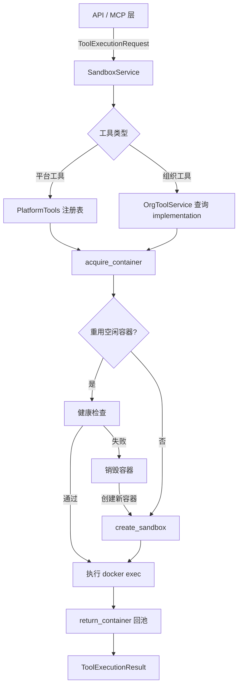

Sandbox 服务是 Aion Hive 执行基础设施的核心组件，为组织级工具（Org Tools）和平台内置工具（Platform Tools）提供基于 Docker 容器的隔离执行环境。它通过 bollard SDK 与 Docker 守护进程通信，实现容器的创建、执行、池化回收和自动清理。该服务的核心设计哲学是**优雅降级**——当 Docker 不可用时服务器照常启动，只是 sandbox 相关操作返回明确的错误信息，不阻塞其他服务。

Sources: [sandbox.rs](src/services/sandbox.rs#L1-L6)

## 架构概览与数据流

Sandbox 服务处于工具执行链路的中枢位置，向上承接 Session 服务的路由决策和 API 层的外部请求，向下管理 Docker 容器的完整生命周期。工具执行请求的完整路径如下：



**关键交互链路**：API handler 接收外部请求后，从 `OrgToolService` 获取工具的 `implementation` 字段（包含 `docker_image`、`cmd`、`timeout_seconds`），构建 `ToolExecutionRequest` 后交由 `SandboxService.execute_org_tool()` 处理。平台工具则直接通过 `execute_platform_tool()` 执行，无需数据库查询。

Sources: [sandbox.rs](src/services/sandbox.rs#L60-L77), [org_tool.rs](src/services/org_tool.rs#L19-L100), [sandboxes.rs](src/api/handlers/sandboxes.rs#L50-L119)

## 配置体系

Sandbox 服务的配置通过 `SandboxConfig` 结构体集中管理，所有参数均有合理的默认值，可通过环境变量 `DOCKER_HOST` 覆盖 Docker 连接地址：

| 配置字段 | 类型 | 默认值 | 说明 |
|---------|------|--------|------|
| `docker_host` | `String` | `http://localhost:2375` | Docker 守护进程 TCP 地址 |
| `default_timeout` | `u64` | `30` | 工具执行默认超时（秒） |
| `max_container_lifetime` | `u64` | `3600` | 容器最大存活时间（秒，1小时） |
| `max_idle_seconds` | `u64` | `600` | 容器最大空闲时间（秒，10分钟） |
| `max_containers` | `usize` | `50` | 全局最大并发容器数 |
| `max_per_tool` | `usize` | `5` | 单个工具的最大池化容器数 |
| `max_queue_wait_seconds` | `u64` | `60` | 请求在 FIFO 队列中的最大等待时间（秒） |

Sources: [sandbox.rs](src/services/sandbox.rs#L29-L58)

## 并发模型：FIFO 公平队列 + 池化复用

Sandbox 服务的并发模型是整篇文档中最值得深入理解的部分。它面向的场景是：多个并发请求可能同时调用同一个工具，而该工具的容器资源有限。设计目标是在**公平性**（请求按到达顺序处理）、**资源利用率**（容器复用避免冷启动）和**吞吐量**（全局和单工具双重限流）之间取得平衡。

### 核心数据结构：ToolPool

每个工具（由 `tool_key` 标识）拥有一个独立的 `ToolPool` 实例，通过 `DashMap` 全局注册：

```rust
struct ToolPool {
    sem: Arc<Semaphore>,           // 并发许可，FIFO 语义
    avail: Mutex<Vec<String>>,     // 空闲容器 ID 列表
    total: AtomicUsize,            // 当前该工具拥有的容器总数
    notify: Notify,                // 唤醒等待者
}
```

- **`sem`**：tokio 的 `Semaphore` 天然具有 FIFO 公平性——当多个 `acquire_owned()` 等待时，它们按调用顺序被唤醒。这避免了"先到先服务"场景中的饥饿问题。初始许可数为 `max_per_tool`（默认 5）。
- **`avail`**：存储当前空闲（Ready 状态）可复用的容器 ID。`Mutex` 保护，操作极短。
- **`total`**：原子计数器，跟踪该工具当前拥有的容器总数，用于判断是否达到 `max_per_tool` 上限。
- **`notify`**：当池满且所有容器都在忙碌时，请求通过 `notify.notified().await` 阻塞等待；当容器被归还时，`notify.notify_one()` 唤醒一个等待者。

Sources: [sandbox.rs](src/services/sandbox.rs#L143-L157)

### acquire_container：四阶段获取流程

`acquire_container` 是并发模型的核心方法，执行以下四阶段逻辑：

**阶段 1：获取 Semaphore 许可（公平排队）**

```rust
let permit = tokio_timeout(
    Duration::from_secs(queue_timeout),
    pool.sem.clone().acquire_owned(),
).await.map_err(|_| /* 队列超时错误 */)?;
```

通过 `tokio::time::timeout` 包裹 `acquire_owned()`，确保请求在 `max_queue_wait_seconds`（默认 60 秒）内未获得许可则返回错误。这里的超时机制防止了队列无限堆积。

**阶段 2：尝试复用空闲容器（快速路径）**

```rust
let reuse = {
    let mut avail = pool.avail.lock().unwrap();
    avail.pop()
};
if let Some(cid) = reuse {
    if self.is_container_running(&cid).await
        && self.health_check_container(&cid).await.unwrap_or(false)
    {
        self.mark_busy(&cid);
        return Ok(ContainerLease { ... });
    }
    // 不健康：销毁并重试
    self.remove_container_by_id(&cid, &pool).await;
    pool.total.fetch_sub(1, Ordering::SeqCst);
    continue;
}
```

从 `avail` 列表中弹出一个空闲容器 ID，执行双重健康检查：先通过 Docker API 验证容器状态为 `running`，再通过 `echo ok` 的 exec 命令验证容器确实响应。如果健康检查失败，该容器被销毁并从池中移除，`total` 减 1，然后继续循环。健康检查机制保证了不会将失效容器分配给请求。

**阶段 3：创建新容器（受限创建）**

```rust
let can_create = pool.total.load(Ordering::SeqCst) < self.max_per_tool;
if can_create {
    if self.containers.len() >= self.max_containers {
        self.evict_global_lru().await;
    }
    match self.create_sandbox(tool_key, image, org_id.clone()).await {
        Ok(cid) => { ... return Ok(ContainerLease { ... }); }
        Err(e) => { ... return Err(e); }
    }
}
```

创建新容器受双重限制：单工具上限（`max_per_tool`）和全局上限（`max_containers`）。在达到全局上限时，通过 `evict_global_lru()` 驱逐全局最近最少使用的空闲容器，为新容器腾出空间。

**阶段 4：全部忙碌时等待（阻塞等待）**

```rust
pool.notify.notified().await;
```

当池满且所有容器都在执行时，请求通过 `Notify` 阻塞等待。当某个容器执行完毕通过 `return_container` 归还时，`notify.notify_one()` 会唤醒一个等待者，然后循环回到阶段 2 尝试复用。

Sources: [sandbox.rs](src/services/sandbox.rs#L366-L450)

### ContainerLease：RAII 资源管理

`ContainerLease` 是一个 RAII 模式的结构体，持有容器 ID、所属 Pool 的引用和 Semaphore 许可：

```rust
struct ContainerLease {
    container_id: String,
    pool: Arc<ToolPool>,
    _permit: OwnedSemaphorePermit,
}
```

当 `Lease` 被 drop 时，`Semaphore` 许可自动释放，允许下一个排队请求进入。容器本身通过 `return_container` 方法显式归还到池中。

Sources: [sandbox.rs](src/services/sandbox.rs#L161-L166)

## 容器生命周期管理

### 创建：create_sandbox

每个容器创建时执行以下步骤：

1. **镜像拉取**：调用 `ensure_image` 检查本地镜像是否存在，不存在则从远程仓库拉取
2. **容器创建**：设置 `sleep 3600` 作为容器入口命令，使容器保持运行状态而不是执行完就退出
3. **环境注入**：设置 `AION_TOOL_MODE=container` 和 `AION_SESSION_ID={org_id}` 环境变量
4. **网络隔离**：所有容器加入 `aion-hive-isolation` 桥接网络，网络模式设为 `internal: true`，禁止容器对外部网络访问
5. **注册跟踪**：将 `SandboxInfo` 注册到 `containers` DashMap 中，包含 tool key、session ID、镜像、状态和时间戳

```rust
let config = Config {
    image: Some(image.to_string()),
    attach_stdout: Some(true),
    attach_stderr: Some(true),
    tty: Some(false),
    env: Some(vec![env_mode, env_session]),
    cmd: Some(vec!["sleep".to_string(), "3600".to_string()]),
    host_config: Some(bollard::service::HostConfig {
        network_mode: Some(network_mode),
        ..Default::default()
    }),
    ..Default::default()
};
```

容器命名格式为 `aion-hive-{uuid}`，便于在 Docker 环境中识别。

Sources: [sandbox.rs](src/services/sandbox.rs#L710-L776)

### 执行：execute_in_container

工具执行使用 `docker exec` 而非 `docker run`，这意味着容器本身只是一个长期运行的"沙箱"，工具命令作为新进程在其中执行。这带来两个关键优势：

- **容器复用**：容器创建成本（镜像拉取、启动）只需支付一次，后续请求通过 `docker exec` 快速执行
- **独立于入口点**：容器的原始 ENTRYPOINT/CMD 完全无关紧要，任何镜像都可以作为沙箱

执行时支持两种模式：

**自定义命令模式（组织工具）**：当 `implementation.cmd` 指定时，构造 shell 一行命令，将 JSON 参数通过 stdin heredoc 传入：

```bash
python /app/tools/issue_lister.py <<'EOF_xxx'
{"param1": "value1"}
EOF_xxx
```

**平台模式（默认）**：使用内置的 `tool-execute` 入口点，并注入 `_tool_id` 参数供平台脚本路由到正确的处理器：

```bash
tool-execute <<'EOF_xxx'
{"_tool_id": "browse", "url": "https://..."}
EOF_xxx
```

输出处理：stdout 的内容被收集后尝试解析为 JSON；stderr 的内容被记录为警告日志。如果输出不是合法 JSON，返回 `ValidationError`。

Sources: [sandbox.rs](src/services/sandbox.rs#L815-L943)

### 回收：return_container

执行完成后，容器不销毁而是归还到池中：

```rust
async fn return_container(&self, lease: ContainerLease) {
    let cid = lease.container_id.clone();
    if let Some(mut inst) = self.containers.get_mut(&cid) {
        inst.info.status = SandboxStatus::Ready;
        inst.info.last_used = chrono::Utc::now();
    }
    lease.pool.avail.lock().unwrap().push(cid);
    lease.pool.notify.notify_one();
}
```

归还操作将容器状态标记为 `Ready`，更新 `last_used` 时间戳，将容器 ID 推回 `avail` 列表，最后唤醒一个等待中的请求。

Sources: [sandbox.rs](src/services/sandbox.rs#L452-L462)

### 清理：后台定时任务

服务初始化时通过 `start_cleanup_task` 启动一个后台异步任务，每 60 秒扫描一次所有 Pool 中的空闲容器，根据两个维度驱逐：

- **最大存活时间**（`max_container_lifetime`，默认 1 小时）：容器创建时间超过该阈值即被销毁
- **最大空闲时间**（`max_idle_seconds`，默认 10 分钟）：容器最后一次使用时间超过该阈值即被销毁

驱逐时仅操作空闲容器（`avail` 列表中的容器），**绝不会杀死正在执行中的容器**。销毁使用 `force: true` 的 `remove_container` 以确保容器被彻底清理。

```rust
// 仅扫描空闲容器
for cid in avail.iter() {
    let age = now - inst.value().info.created_at.timestamp();
    let idle = now - inst.value().info.last_used.timestamp();
    if age > max_lifetime as i64 || idle > max_idle as i64 {
        to_remove.push((cid.clone(), pool.clone()));
    }
}
```

Sources: [sandbox.rs](src/services/sandbox.rs#L292-L343)

### 全局 LRU 驱逐

当全局容器数达到 `max_containers`（默认 50）时，`evict_global_lru` 方法遍历所有 Pool 的空闲容器，找到 `last_used` 最早的那个（全局 LRU），将其销毁。这是一个"软限制"机制——它不会拒绝请求，而是通过驱逐腾出空间。

```rust
async fn evict_global_lru(&self) {
    let mut lru: Option<(String, Arc<ToolPool>, i64)> = None;
    for pool_entry in self.pools.iter() {
        let pool = pool_entry.value().clone();
        let avail = pool.avail.lock().unwrap();
        for cid in avail.iter() {
            if let Some(inst) = self.containers.get(cid) {
                let ts = inst.value().info.last_used.timestamp();
                if lru.as_ref().map(|(_, _, t)| ts < *t).unwrap_or(true) {
                    lru = Some((cid.clone(), pool.clone(), ts));
                }
            }
        }
    }
    // 销毁 LRU 容器
}
```

Sources: [sandbox.rs](src/services/sandbox.rs#L633-L659)

## 执行模式：组织工具 vs 平台工具

Sandbox 服务区分两类工具的隔离执行方式：

| 维度 | 组织工具 (Org Tool) | 平台工具 (Platform Tool) |
|------|--------------------|------------------------|
| **镜像来源** | `ghcr.io/{org_id}/{tool_id}:latest` 或自定义 | 硬编码注册表：`aion-hive/tool-{name}:latest` |
| **命令模式** | 自定义 cmd（从 `implementation.cmd` 读取） | 固定 `tool-execute` |
| **参数注入** | 纯 JSON 参数，不注入 `_tool_id` | 注入 `_tool_id` 供平台路由 |
| **注册方式** | 通过 `OrgToolService.register_tool()` 数据库注册 | 代码内硬编码 |
| **状态检查** | 必须为 `approved` 状态才能执行 | 始终可用 |
| **工具密钥** | `org:{org_id}/tool:{tool_id}` | `platform:{tool_id}` |

**平台工具注册表**：当前内置四个平台工具，覆盖了基本的浏览、问答、执行和存储能力：

| 工具 ID | 镜像 | 命令 | 默认超时 |
|---------|------|------|---------|
| `browse` | `aion-hive/tool-browse:latest` | `browse` | 30s |
| `qa` | `aion-hive/tool-qa:latest` | `qa` | 60s |
| `exec` | `aion-hive/tool-exec:latest` | `exec` | 120s |
| `storage` | `aion-hive/tool-storage:latest` | `storage` | 30s |

Sources: [sandbox.rs](src/services/sandbox.rs#L125-L141), [sandbox.rs](src/services/sandbox.rs#L200-L218), [sandbox.rs](src/services/sandbox.rs#L482-L578)

## 优雅降级与容错设计

Sandbox 服务的一个核心设计原则是**不因 Docker 的缺失而影响系统整体可用性**：

1. **启动时检测**：`with_config()` 中通过 `Docker::connect_with_local_defaults()` 尝试连接 Docker，失败则设 `docker` 字段为 `None`，仅记录警告日志
2. **初始化时验证**：`initialize()` 中执行 `docker.ping()` 验证守护进程实际可达，如果网络不通或 Docker 未启动，依然返回 `Ok(())` 不阻塞服务器启动
3. **操作时返回错误**：所有实际需要 Docker 的操作（`docker()` 方法）在 Docker 不可用时返回 `AppError::InternalError`，信息明确："Docker is not available. Please start Docker daemon to enable sandbox features."
4. **健康检查 API**：`health_check()` 返回 `bool` 而非 `Result`，让调用方可以优雅地展示 Docker 连接状态

```rust
fn docker(&self) -> Result<&Docker, AppError> {
    self.docker.as_ref().ok_or_else(|| {
        AppError::InternalError(
            "Docker is not available. Please start Docker daemon to enable sandbox features.".to_string(),
        )
    })
}
```

Sources: [sandbox.rs](src/services/sandbox.rs#L248-L257), [sandbox.rs](src/services/sandbox.rs#L222-L228), [sandbox.rs](src/services/sandbox.rs#L260-L290)

## API 接口

Sandbox 服务通过以下 REST API 暴露能力，分为管理端和用户端两个维度：

**管理端接口**（需要 Admin 权限）：

| 方法 | 路径 | Handler | 功能 |
|------|------|---------|------|
| GET | `/api/v1/admin/sandboxes` | `list_sandboxes_handler` | 列出所有容器（含已停止的） |
| GET | `/api/v1/admin/sandboxes/health` | `get_sandbox_health_handler` | Docker 连接状态 + 活跃容器数 |
| DELETE | `/api/v1/admin/sandboxes/:key` | `remove_sandbox_handler` | 按容器 ID 强制删除 |

**用户端接口**：

| 方法 | 路径 | Handler | 功能 |
|------|------|---------|------|
| GET | `/api/v1/sandboxes` | `list_sandbox_status_handler` | 列出活跃容器状态（含空闲秒数） |
| POST | `/api/v1/sandboxes/release` | `release_sandbox_handler` | 释放指定 org/tool 的所有容器 |
| POST | `/api/v1/tools/execute` | `execute_tool_handler` | 执行组织工具（需 approved） |
| POST | `/api/v1/tools/execute-platform` | `execute_platform_tool_handler` | 执行平台工具 |

**工具执行请求体** (`ExecuteToolBody`)：

```json
{
  "tool_id": "issue_lister",
  "org_id": "550e8400-...",
  "parameters": { "repo": "org/repo" },
  "timeout_seconds": 60,
  "docker_image": "ghcr.io/myorg/issue_lister:latest"
}
```

`execute_tool_handler` 在执行前会从 `OrgToolService` 获取工具的 `implementation` 字段，提取 `docker_image`、`timeout_seconds`、`cmd` 等配置，与请求体中的字段合并（请求体优先级更高）。同时，执行前会验证工具状态是否为 `approved`，未批准的工具返回 403 Forbidden。

Sources: [sandboxes.rs](src/api/handlers/sandboxes.rs#L1-L207), [api/models.rs](src/api/models.rs#L480-L531), [routes.rs](src/api/routes.rs#L348-L366)

## 与 Session 服务的协作关系

Sandbox 服务与 Session 服务通过 `ToolRouterService` 形成协作链路。Session 服务维护每个会话的 `ToolRouter`，其中包含从工具名称到执行目标的映射：

```rust
pub enum RouteTarget {
    Local,           // Agent 自身实现
    Platform,        // 平台内置工具 → SandboxService.execute_platform_tool()
    OrgTool(String), // 组织注册工具 → SandboxService.execute_org_tool()
}
```

当 MCP 会话收到工具调用请求时，Session 服务通过 `ToolRouter.route()` 确定目标类型，平台工具和组织工具的目标最终都指向 Sandbox 服务。这种路由抽象使得 Agent 不需要感知底层的执行环境差异。

Sources: [session.rs](src/models/session.rs#L63-L95), [tool_router.rs](src/services/tool_router.rs#L1-L91)

## 设计要点与权衡

1. **容器隔离 vs 启动速度**：使用 `docker exec` 复用容器的设计在隔离性和启动速度之间取得了平衡。容器提供了文件系统、网络、进程级别的隔离，而 `exec` 模式避免了每次请求的冷启动开销。

2. **公平排队 vs 吞吐量**：基于 tokio `Semaphore` 的 FIFO 队列确保了请求的公平性，但代价是晚到的请求必须等待。`max_queue_wait_seconds` 超时机制防止了队列无限堆积。

3. **全局限制 vs 单工具限制**：双重限制机制（全局 50 容器、单工具 5 容器）防止了单个工具耗尽所有资源，也防止了整体资源无限制增长。

4. **优雅降级 vs 硬依赖**：Docker 不可用时服务器继续运行的设计取舍在于：核心功能（Skills 管理、权限、MCP 等）不受影响，但工具执行功能不可用。这种设计适合开发环境或 Docker 未部署的场景。

5. **网络隔离**：`aion-hive-isolation` 网络使用 `internal: true` 的桥接模式，容器之间可以通信但无法访问外部网络，提供了基础的安全隔离。

## 下一步阅读

- [Session 服务：MCP 会话生命周期与工具路由](16-session-fu-wu-mcp-hui-hua-sheng-ming-zhou-qi-yu-gong-ju-lu-you) — 了解 Session 如何通过 ToolRouter 将工具调用路由到 Sandbox 服务
- [OrgTool 服务：组织级工具注册与审批](21-orgtool-fu-wu-zu-zhi-ji-gong-ju-zhu-ce-yu-shen-pi) — 了解组织工具如何注册、审批，其 `implementation` 字段如何驱动 Sandbox 创建容器
- [整体架构：Rust 后端 + Svelte 管理后台 + CLI 工具链](5-zheng-ti-jia-gou-rust-hou-duan-svelte-guan-li-hou-tai-cli-gong-ju-lian) — 将 Sandbox 服务置于整体架构中理解