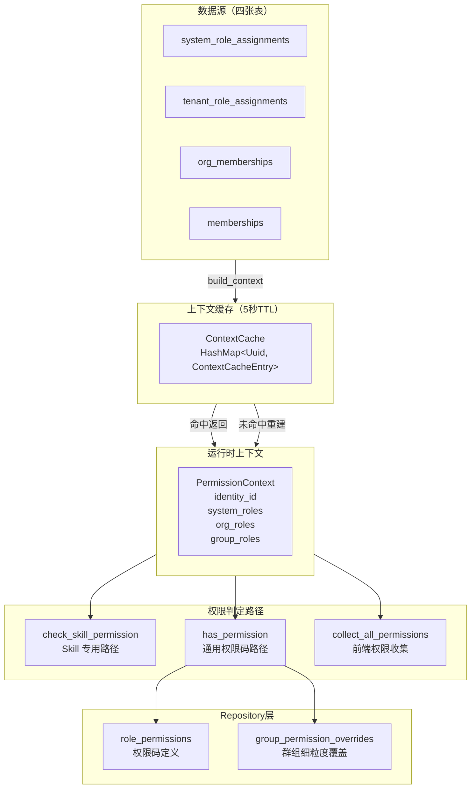
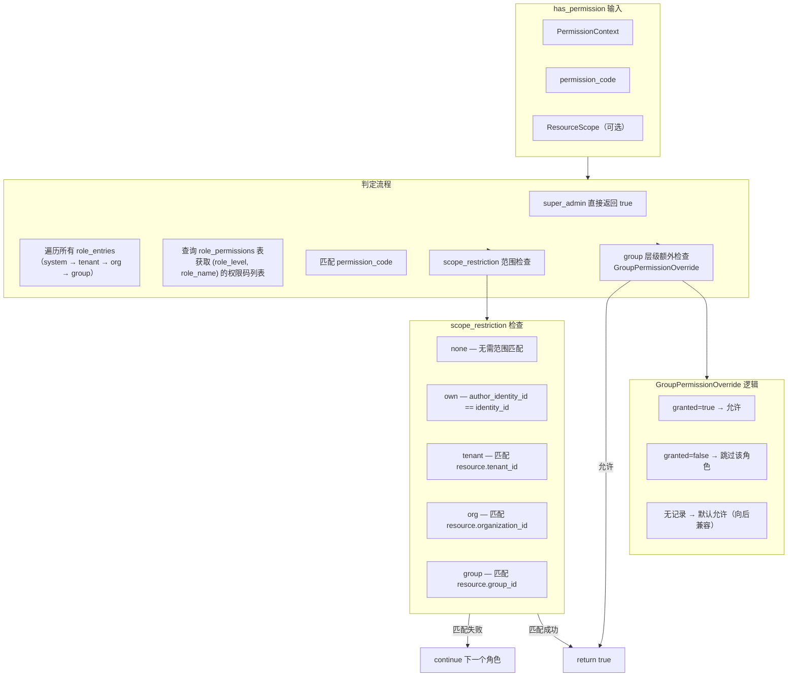

Permission 服务是 SkillGarden 多租户 RBAC 权限体系的核心执行引擎。它负责将分散在四张角色分配表（系统级、租户级、组织级、群组级）中的角色信息，聚合为一个统一的 `PermissionContext` 运行时结构，并基于此提供两套权限判定路径：**面向 Skill 资源的高效专用路径**（`check_skill_permission`）和 **面向通用权限码的泛化路径**（`has_permission`）。两者共享同一套缓存机制，5 秒 TTL 的 `ContextCacheEntry` 将高频请求的数据库负载降至最低。

## 架构概览：四级权限上下文的数据流

权限判定的核心挑战在于：一个用户的权限来源是分散的——系统角色分配 `system_role_assignments`、租户角色分配 `tenant_role_assignments`、组织成员身份 `org_memberships`、群组成员身份 `memberships`——而每次权限判定都需要将这些碎片化的信息聚合为一个完整的上下文。PermissionService 通过 `build_context` 方法实现这一聚合，并通过 `PermissionContext` 结构体将结果缓存。



Source: [permission.rs](src/services/permission.rs#L1-L200)

**关键设计决策**：PermissionService 不依赖 `roles` 表（`src/models/role.rs`）中的角色层级定义，而是直接使用 `role_permissions` 表（`role_level` + `role_name` 组合）中的权限码映射。这意味着角色权限的绑定关系完全由 `role_permissions` 表驱动，`roles` 表更多承担角色元数据管理的角色——这种分离设计使得权限码的分配可以独立于角色创建流程，也允许跨层级复用相同的角色名称（如 `admin` 角色可以同时出现在 system、tenant、organization 三个层级，但各自拥有不同的权限码集合）。

## PermissionContext：四级聚合的运行时结构

`PermissionContext` 是权限判定的核心数据结构，它将分散在四张表中的角色信息聚合为四个向量：

```rust
pub struct PermissionContext {
    pub identity_id: Uuid,
    pub system_roles: HashSet<String>,          // 系统级角色（如 super_admin）
    pub tenant_roles: Vec<(Uuid, String)>,      // 租户级角色（tenant_id, role_name）
    pub org_roles: Vec<(Uuid, String)>,         // 组织级角色（org_id, role_name）
    pub group_roles: Vec<(Uuid, String)>,       // 群组级角色（group_id, role_name）
}
```

Source: [permission.rs](src/services/permission.rs#L26-L35)

**角色数据来源详解**：

| 层级 | 数据表 | Repository 方法 | 存储特点 |
|------|--------|----------------|----------|
| **System** | `system_role_assignments` | `find_by_identity` | 全局唯一，不绑定 scope_id |
| **Tenant** | `tenant_role_assignments` | `find_by_identity` | 绑定 `tenant_id`，同一用户可在不同租户有不同角色 |
| **Organization** | `org_memberships` | `list_user_organizations` | 绑定 `org_id`，`role` 字段存储角色名 |
| **Group** | `memberships` | `list_user_group_memberships` | 绑定 `group_id`，`role` 字段存储角色名 |

Source: [system_role_assignment.rs](src/db/repositories/system_role_assignment.rs#L82-L92), [tenant_role_assignment.rs](src/db/repositories/tenant_role_assignment.rs#L85-L97), [org_membership.rs](src/db/repositories/org_membership.rs#L124-L142), [group.rs](src/db/repositories/group.rs#L274-L291)

**`build_context` 的缓存策略**：方法内部使用 `std::collections::HashMap<Uuid, ContextCacheEntry>` 作为缓存池，每个条目包含 `ctx` 和 `cached_at` 时间戳。5 秒的 TTL 覆盖了大多数 API 请求中同一用户连续调用多次权限判定的场景（如一次请求中先后校验 Read 和 Update 权限），同时确保角色变更在可接受的时间窗口内生效。缓存访问通过 `Mutex` 保护，颗粒度是每次完整的 `build_context` 调用——这意味着高并发下同一用户的多个请求会串行化在缓存检查上，但由于 5 秒 TTL 和 5 秒内仅一次数据库查询，实际开销可控。

Source: [permission.rs](src/services/permission.rs#L475-L516)

## 双路径权限判定设计

PermissionService 提供两条判定路径，分别对应不同的使用场景：

### 路径一：`check_skill_permission` — Skill 专用快速路径

这是专门为 Skill 资源设计的权限判定方法，**不依赖 `PermissionContext`**，而是直接通过 `is_super_admin`、`is_any_admin`、`is_org_member`、`get_org_role` 等独立方法逐层判断。这种设计避免了构建完整上下文的开销，适用于 Skill 资源的高频操作场景。

```mermaid
flowchart LR
    subgraph Entry["check_skill_permission"]
        direction TB
        A[接收 identity_id + Skill 字段]
    end

    subgraph Layers["判定层级（短路返回）"]
        L1["1. is_super_admin → 全部通过"]
        L2["2. is_any_admin → 全部通过"]
        L3["3. 按 SkillAction 分派"]
    end

    subgraph Actions["SkillAction 分支"]
        R["Read"]
        U["Update"]
        D["Delete"]
        S["SubmitReview"]
        AR["Approve/Reject"]
        P["Publish"]
        PM["PublishToMarketplace"]
    end

    subgraph Logic["判定逻辑复用"]
        OR["is_owner 检查\n(is_owner 判断)"]
        OMR["is_org_member\n(组织成员)"]
        GOR["get_org_role\n(组织角色比较)"]
        SR["has_any_system_role\n(市场角色)"]
    end

    Entry --> Layers
    Layers -->|不是 super/admin| Actions
    Actions --> Logic
```



Source: [permission.rs](src/services/permission.rs#L112-L473)

**判定层级与短路逻辑**：

1. **超级管理员优先**：`is_super_admin` 返回 `true` 时，所有操作直接放行——这是最高优先级的短路，确保系统管理员不受任何下层约束。
2. **租户管理员放行**：`is_any_admin` 检测用户是否为 `super_admin` 或任一租户的 `tenant_admin`，是则直接放行。注意这里 `is_any_admin` 的语义比 `is_super_admin` 更宽，但也意味着 `tenant_admin` 可以跨租户操作——这是一个设计上的权衡，实际使用中 `tenant_admin` 通常只会被分配到一个租户。
3. **操作类型分派**：根据 `SkillAction` 枚举值进入不同的判定逻辑分支。每个分支都遵循 **所有者优先、组织角色次之、特殊角色兜底** 的模式。

**各 SkillAction 的权限矩阵**：

| SkillAction | 所有者 (user) | Org Admin | Org Reviewer | Org Developer | 市场角色 |
|-------------|---------------|-----------|-------------|--------------|---------|
| **Read** | ✅ | ✅（同组织） | ✅（同组织） | ✅（同组织） | ✅（已发布市场 Skill） |
| **Update** | ✅ | ✅ | ❌ | ✅（own scope） | ❌ |
| **Delete** | ✅ | ✅ | ❌ | ✅（own scope） | ❌ |
| **SubmitReview** | ✅ | ✅ | ✅ | ✅ | ❌ |
| **Approve/Reject** | ✅（个人） | ❌ | ✅（不能审核自己的） | ❌ | ❌ |
| **Publish** | ✅ | ✅ | ❌ | ❌ | ❌ |
| **PublishToMarketplace** | ✅ | ✅ | ❌ | ❌ | ❌ |

Source: [permission.rs](src/services/permission.rs#L234-L473)

**`is_owner` 判定逻辑**：`skill_owner_type == "user"` 且 `skill_owner_id == identity_id` 或 `skill_author_identity_id == identity_id`。这意味着一个 Skill 的"所有者"既可以是 `owner_id` 字段指向的用户，也可以是 `author_identity_id` 字段指向的创建者——两个字段只要有一个匹配即视为所有者。这种设计允许 Skill 的所有权转移（通过变更 `owner_id`）而不影响创建者的编辑权限。

Source: [permission.rs](src/services/permission.rs#L108-L110)

**`OrgRole` 比较语义**：`OrgRole` 枚举手动实现了 `Ord` trait，将角色按 **Owner(4) > Admin(3) > Reviewer(2) > Developer(1) > Member(0)** 的层级排序。代码中使用 `role >= OrgRole::Admin` 这样的比较来判定权限阈值，例如 `Update` 操作要求 `Admin+` 才能编辑组织内任何 Skill，而 `Developer` 只能编辑自己创建的。`Approve/Reject` 操作要求 `Reviewer+` 且不能审核自己的 Skill——这是为了防止自我审核的利益冲突。

Source: [org_membership.rs](src/models/org_membership.rs#L34-L57)

### 路径二：`has_permission` — 通用权限码路径

这是基于 `PermissionContext` + `role_permissions` 表的泛化权限判定，适用于 Skill 以外的资源类型（如组织管理、租户配置、API Key 管理等）。



Source: [permission.rs](src/services/permission.rs#L547-L680)

**`role_entries` 的构建顺序**：`has_permission` 将 `PermissionContext` 中的角色按 **system → tenant → org → group** 的顺序展开为 `Vec<(String, String, Option<Uuid>)>` 三元组（层级、角色名、scope_id）。遍历时按此顺序，**一旦找到匹配的权限码即返回 `true`**。这意味着高层级角色（如 system）的权限定义可以覆盖低层级角色（如 group）的限制——不过在实际使用中，各层级角色通常拥有不同的权限码集合，因此这种顺序的影响主要体现在 `super_admin` 的短路检查上。

Source: [permission.rs](src/services/permission.rs#L547-L570)

**`scope_restriction` 范围检查**：`role_permissions` 表的 `scope_restriction` 字段（取值为 `none`、`own`、`tenant`、`org`、`group`）定义了权限码的生效范围。检查逻辑如下：

- **`none`**：无条件通过，不做范围限制。
- **`own`**：仅当资源的 `author_identity_id` 等于当前用户的 `identity_id` 时通过。这实现了"仅自己创建的资源"的细粒度控制。
- **`tenant`/`org`/`group`**：将角色所在的 `scope_id`（来自 `role_entries` 三元组）与 `ResourceScope` 中对应的 `tenant_id`/`organization_id`/`group_id` 进行比较。如果 `ResourceScope` 中缺少对应字段，则尝试使用 `owner_id` 作为 fallback——这允许在不显式设置 `tenant_id` 等字段的情况下，通过 `owner_id` 做范围匹配。

Source: [permission.rs](src/services/permission.rs#L598-L641)

**`GroupPermissionOverride` 的细粒度覆盖**：在 group 层级，`has_permission` 会额外查询 `group_permission_overrides` 表，检查是否存在针对当前 `(group_id, role_name, permission_code)` 的覆盖记录。这是四级权限中最细粒度的控制点，允许在群组级别对特定角色的特定权限做精确的"授予/拒绝"控制。`granted=true` 时直接允许，`granted=false` 时跳过该角色继续检查其他角色——这意味着一个群组管理员可以通过 `group_permission_overrides` 表"剥离"某个角色的特定权限，而无需创建新的角色定义。

Source: [permission.rs](src/services/permission.rs#L643-L668), [group_permission_override.rs](src/db/repositories/group_permission_override.rs#L68-L87)

## ResourceScope：资源上下文描述

`ResourceScope` 是为 `has_permission` 的通用路径提供资源上下文的结构体，它描述了被访问资源的归属信息：

```rust
pub struct ResourceScope {
    pub owner_type: Option<String>,
    pub owner_id: Option<Uuid>,
    pub author_identity_id: Option<Uuid>,
    pub tenant_id: Option<Uuid>,
    pub organization_id: Option<Uuid>,
    pub group_id: Option<Uuid>,
}
```

Source: [permission.rs](src/services/permission.rs#L37-L46)

`ResourceScope` 的设计体现了 **"谁拥有该资源"** 的完整描述：`owner_type` + `owner_id` 描述资源的所有者身份（用户/组织/租户），`author_identity_id` 描述创建者，`tenant_id`/`organization_id`/`group_id` 描述资源所属的层级结构。在 `check_permission_handler` 中，前端或 API 调用方可以通过 `PermissionCheckBody` 传入这些字段，实现灵活的资源级权限校验。

Source: [permission_check.rs](src/api/handlers/permission_check.rs#L16-L36)

## 辅助查询方法体系

PermissionService 提供了一系列独立于 `build_context` 的轻量级查询方法，用于常见的单维度检查场景：

| 方法 | 用途 | 查询的表 | 调用频率 |
|------|------|---------|---------|
| `is_super_admin` | 检查是否为超级管理员 | `system_role_assignments` | 高（每次 `check_skill_permission` 都调用） |
| `has_any_system_role` | 检查是否拥有任一系统角色 | `system_role_assignments` | 中（市场管理员检查） |
| `is_any_admin` | 检查是否为任意管理员 | `system_role_assignments` + `tenant_role_assignments` | 高 |
| `is_system_admin` | 检查 `identities.is_system_admin` 字段 | `identities` | 低（兼容旧版） |
| `is_org_member` | 检查是否为组织成员 | `org_memberships` | 高（Skill Read/Update 判定） |
| `get_org_role` | 获取组织内角色 | `org_memberships` | 高（Skill Update/Delete/Approve 判定） |
| `get_user_org_ids` | 获取用户所属组织 ID 列表 | `org_memberships` | 中（可见性过滤） |
| `get_tenant_admin_tenant_ids` | 获取管理的租户 ID 列表 | `tenant_role_assignments` | 低（管理后台） |

Source: [permission.rs](src/services/permission.rs#L80-L167)

**`is_system_admin` 与 `is_super_admin` 的区别**：`is_system_admin` 检查的是 `identities` 表的 `is_system_admin` 布尔字段——这是一个遗留的设计，用于标识特定 Identity 是否为系统管理员。而 `is_super_admin` 检查的是 `system_role_assignments` 表中的 `super_admin` 角色分配。两者在语义上重叠，但 `is_super_admin` 是更现代的设计，支持多角色分配和审计追溯（记录了 `assigned_by` 和 `assigned_at`）。代码中 `check_skill_permission` 优先使用 `is_super_admin`，仅在少数管理后台场景中使用 `is_system_admin`。

Source: [identity.rs](src/models/identity.rs#L18-L28), [permission.rs](src/services/permission.rs#L80-L87)

## batch 查询优化：`collect_all_permissions`

`collect_all_permissions` 方法用于前端权限刷新场景，它收集当前用户所有可用的 `permission_code` 列表。其核心优化点在于使用 `list_by_roles_batch` 方法替代逐角色查询——通过 `UNNEST` 将多个 `(role_level, role_name)` 对一次性传入 SQL 查询，将 N 次数据库往返降为 1 次。

```rust
// 一次 SQL 批量查询替代 N 次逐个查询
let perms = self
    .role_permission_repo
    .list_by_roles_batch(&role_entries)
    .await
    .map_err(|e| AppError::InternalError(e.to_string()))?;
```

Source: [permission.rs](src/services/permission.rs#L737-L743), [role_permission.rs](src/db/repositories/role_permission.rs#L43-L67)

**`super_admin` 的特殊处理**：当 `PermissionContext` 包含 `super_admin` 角色时，`collect_all_permissions` 直接返回 `["*", "system:admin:access"]` 两个特殊权限码，表示拥有所有权限。前端收到 `*` 通配符时会跳过具体的权限检查，直接渲染所有 UI 元素。这种设计避免了在 `role_permissions` 表中为 `super_admin` 角色定义所有权限码的繁琐工作。

Source: [permission.rs](src/services/permission.rs#L718-L722)

## 与 Handler 层的集成模式

PermissionService 在 Handler 层通过两种模式集成：

**1. 直接调用 `check_skill_permission`**：通过 `check_skill_perm` / `check_skill_perm_raw` / `check_skill_perm_db` 三个辅助函数（定义在 `helpers.rs`），将 Skill 模型或原始字段转换为 `check_skill_permission` 调用。这三个函数本质上是对 `check_skill_permission` 的适配器封装，区别在于输入参数的类型：

- `check_skill_perm`：接收 `&crate::models::Skill`（API 层模型）
- `check_skill_perm_db`：接收 `&crate::db::repositories::skill::Skill`（DB 层模型）
- `check_skill_perm_raw`：接收原始字段值

Source: [helpers.rs](src/api/handlers/helpers.rs#L15-L77)

**2. 构建 `PermissionContext` 后调用 `has_permission`**：在 `check_permission_handler` 中，先通过 `build_context` 构建上下文，再通过 `has_permission` 进行通用权限校验。这种方式适用于非 Skill 资源的权限检查，如组织管理、系统配置等操作。

Source: [permission_check.rs](src/api/handlers/permission_check.rs#L16-L39)

**3. 管理后台的 `require_*` 辅助函数**：`helpers.rs` 中定义了 `require_admin`、`require_marketplace_admin`、`require_marketplace_admin_only`、`require_org_member` 等函数，它们封装了常见的权限检查模式，在管理后台 Handler 中广泛使用。这些函数优先检查 JWT 中的 `roles` 字段（`agent_context.roles`），如果 JWT 中已声明 `admin` 角色则跳过数据库查询——这是一种 JWT 缓存优化，减少数据库负载。

Source: [helpers.rs](src/api/handlers/helpers.rs#L106-L176)

## 与 `role_permissions` 表的数据模型关系

`role_permissions` 表是连接角色与权限码的核心映射表，其 Schema 定义如下：

```rust
pub struct RolePermission {
    pub id: Uuid,
    pub role_level: String,        // "system" | "tenant" | "organization" | "group" | "personal"
    pub role_name: String,         // 如 "super_admin", "tenant_admin", "admin", "developer"
    pub permission_code: String,   // 如 "skill:create", "skill:update", "org:manage"
    pub scope_restriction: String, // "none" | "own" | "tenant" | "org" | "group"
    pub created_at: DateTime<Utc>,
}
```

Source: [role_permission.rs](src/models/role_permission.rs#L1-L22)

**`role_level` 的 `personal` 层级**：在 `collect_all_permissions` 中，除了从 `PermissionContext` 中提取的 role_entries 外，还会额外添加 `("personal", "user")` 这样一个角色条目。这意味着所有已认证用户（无论是否拥有任何系统/租户/组织/群组角色）都自动拥有 `personal` 层级的 `user` 角色所定义的权限码——这是实现"登录用户基础权限"的标准化方式。

Source: [permission.rs](src/services/permission.rs#L733-L735)

**`role_permissions` 的关系模型**：`role_permissions` 表使用 `(role_level, role_name, permission_code)` 作为唯一约束（通过 `ON CONFLICT DO UPDATE` 实现 upsert 语义），这意味着同一个角色可以拥有多个权限码，同一个权限码可以分配给多个角色。这种多对多的关系通过 `role_permissions` 表本身实现，无需额外的中间表——简化了查询逻辑，但代价是权限码的"角色"元数据（如角色层级、角色名称）在每行中重复存储。

Source: [role_permission.rs](src/db/repositories/role_permission.rs#L82-L100)

## 缓存策略的权衡与边界

5 秒 TTL 的缓存设计需要理解其适用边界：

- **适用场景**：同一用户在短时间内多次调用 `build_context`（如一次 API 请求中多次权限校验，或前端页面加载时的批量权限检查）。
- **不适用场景**：角色变更后的即时生效。当管理员通过管理后台修改用户角色后，最多需要等待 5 秒才能让新角色在权限检查中生效。
- **缓存粒度**：以 `identity_id` 为 key 缓存整个 `PermissionContext`，而非按角色条目单独缓存。这意味着如果用户的任何角色发生变化，整个上下文缓存都会失效。
- **并发安全**：`Mutex<HashMap<...>>` 保护整个缓存，但由于 `build_context` 内部在持有锁时仅做查找和插入操作（数据库查询在锁外执行），锁的持有时间通常为微秒级。

Source: [permission.rs](src/services/permission.rs#L478-L516)

---

**下一步建议**：理解 Permission 服务后，建议阅读 [Session 服务：MCP 会话生命周期与工具路由](16-session-fu-wu-mcp-hui-hua-sheng-ming-zhou-qi-yu-gong-ju-lu-you)，了解会话层如何利用 PermissionContext 进行工具调用的权限校验；或查看 [RBAC 权限模型：System/Tenant/Org/Group 四级角色体系](8-rbac-quan-xian-mo-xing-system-tenant-org-group-si-ji-jiao-se-ti-xi) 了解角色定义的完整数据模型。