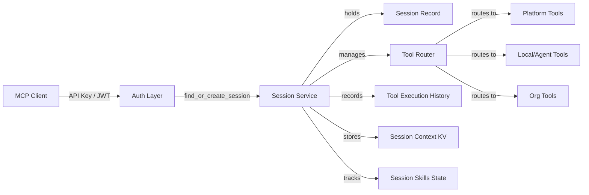
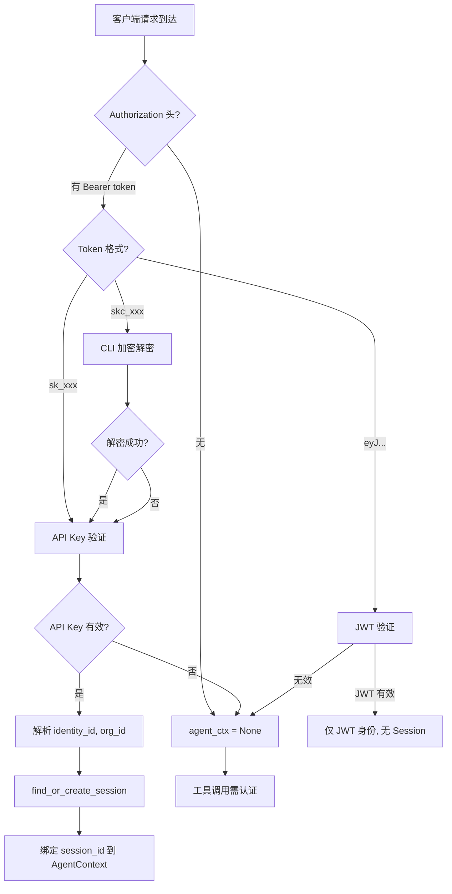

Session 服务是整个系统的会话中枢，负责管理 MCP (Model Context Protocol) 客户端与后端之间的连接生命周期、工具调用路由决策、以及会话级上下文状态。它既是 MCP 协议的身份锚点，也是工具路由的策略引擎——每个 MCP 请求都隐式或显式地绑定到一个 Session，Session 决定了该请求能调用哪些工具、这些工具应该路由到何处执行。

## 架构定位：从身份到路由的桥梁

Session 服务在系统架构中处于身份认证层与工具执行层之间的关键位置。当 MCP 客户端（CLI 或 AI Agent）通过 API Key 或 JWT 完成认证后，系统自动为其创建或复用 Session，随后该 Session 成为后续所有工具调用的上下文容器。



Session 的核心职责可归纳为三个维度：**生命周期管理**（创建→活跃→结束）、**路由决策**（基于能力声明的工具分配）、**状态追踪**（上下文、技能加载、执行历史）。这三个维度分别对应三个数据库表：`sessions`、`session_skills`、`session_context`、`session_tool_executions`。Sources: [src/services/session.rs](src/services/session.rs#L1-L345)、[src/models/session.rs](src/models/session.rs#L1-L96)

## 会话生命周期：从创建到自动回收

Session 的生命周期遵循一个清晰的四阶段模型：**创建（或复用）→ 活跃维持 → 能力声明 → 结束（或超时回收）**。

### 创建与复用策略

`find_or_create_session` 方法是 Session 创建的核心入口。它首先检查该 identity 是否已有活跃的 Session，若有则直接复用，避免为同一个客户端创建多个冗余连接。若没有活跃 Session，则调用 `create_session` 插入新记录，初始状态为 `Active`，`tool_router` 为空 JSON 对象 `{}`。

```rust
pub async fn find_or_create_session(
    &self, identity_id: Uuid, org_id: Uuid,
) -> Result<SessionRepo, AppError> {
    let existing = self.get_active_session(identity_id).await?;
    if let Some(session) = existing {
        return Ok(session);  // 复用已有会话
    }
    let session = self.create_session(identity_id, org_id).await?;
    Ok(session)
}
```

这个模式在 MCP Server 的 `handle_jsonrpc` 中自动触发：当客户端通过 API Key 认证时，系统自动解析出 `identity_id` 和 `org_id`，然后调用 `find_or_create_session` 创建或复用 Session，并将 `session_id` 绑定到 `AgentContext` 中，供后续工具调用使用。Sources: [src/services/session.rs](src/services/session.rs#L34-L73)、[src/mcp/server.rs](src/mcp/server.rs#L248-L288)

### 活跃心跳与空闲回收

每个 MCP 请求到达时，系统会调用 `touch_session` 更新 `last_active_at` 时间戳，相当于一次心跳保活。同时，`end_idle_sessions` 方法作为后台清理任务，扫描所有 `status = 'active'` 且 `last_active_at` 早于指定空闲阈值的 Session，将其标记为 `ended`。这个机制确保了一旦客户端断开连接或停止发送请求，其 Session 不会无限期占用资源。

```sql
-- end_idle_sessions 的核心 SQL
UPDATE sessions
SET status = 'ended', ended_at = NOW()
WHERE status = 'active'
  AND last_active_at < NOW() - ($1 || ' seconds')::INTERVAL
```

### 主动结束

客户端或管理员可以通过 REST API 的 `POST /api/v1/sessions/:id/end` 主动结束 Session。REST handler 会校验调用者身份——只有 Session 的拥有者或管理员有权结束。Sources: [src/services/session.rs](src/services/session.rs#L75-L128)、[src/db/repositories/session.rs](src/db/repositories/session.rs#L145-L195)

## 工具路由模型：三级路由策略

工具路由是 Session 服务的核心能力之一，它决定了某个工具调用应该被分发到哪个执行目标。整个路由系统围绕 `ToolRouter` 和 `RouteTarget` 两个核心类型构建。

### 路由目标枚举

`RouteTarget` 定义了三种路由目标：

| 目标 | 含义 | 示例工具 |
|------|------|----------|
| `Platform` | 平台内置工具，由 Sandbox 服务执行 | `browse`, `qa`, `exec`, `storage` |
| `Local` | Agent 本地实现，由调用方自行处理 | 客户端声明的自定义能力 |
| `OrgTool(String)` | 组织注册的 CLI 工具，由 Sandbox 执行 | 组织自定义工具，携带 tool_id |

`ToolRouter` 本质上是一个 `HashMap<String, RouteTarget>`，将工具名称映射到路由目标。

### 能力声明与路由构建

Session 创建时 `tool_router` 为空，客户端需要通过 `session.declare` MCP 方法或 `POST /api/v1/sessions/:id/declare` REST 接口声明其能力。`declare_capabilities` 方法的构建逻辑如下：

1. **平台工具固定注入**：`browse`、`qa`、`exec`、`storage` 四个工具无条件路由到 `Platform`，确保每个 Session 都能使用平台能力。
2. **声明能力路由到 Local**：客户端声明的 capabilities 中，除平台工具外的所有工具名称路由到 `Local`，表示这些工具由客户端自身实现。
3. **序列化持久化**：构建完成的 `ToolRouter` 序列化为 JSON 存入 `sessions.tool_router` 字段。

```rust
let mut router = ToolRouter::new();
// 平台工具始终路由到 Platform
for tool in &["browse", "qa", "exec", "storage"] {
    router.add_route(tool.to_string(), RouteTarget::Platform);
}
// 声明能力路由到 Local
for cap in &capabilities {
    if !platform_tools.contains(&cap.as_str()) {
        router.add_route(cap.clone(), RouteTarget::Local);
    }
}
```

### ToolRouterService：独立的路由决策引擎

除了 Session 内嵌的 `ToolRouter`，系统中还有一个独立的 `ToolRouterService` 提供更完整的路由决策能力。它额外支持 `OrgTool` 路由：当工具名称在组织已注册且已批准的工具体系中时，路由到 `OrgTool` 目标。`ToolRouterService::build_routing_table` 方法整合了平台工具、Agent 能力、组织工具三个来源，构建完整的路由表。Sources: [src/models/session.rs](src/models/session.rs#L63-L95)、[src/services/session.rs](src/services/session.rs#L153-L194)、[src/services/tool_router.rs](src/services/tool_router.rs#L1-L91)

## 会话上下文：Key-Value 状态存储

每个 Session 可以关联多个上下文键值对，存储在 `session_context` 表中。这个机制为 Session 提供了轻量级的状态存储能力，允许客户端在会话期间持久化临时数据。

`set_context` 使用 `ON CONFLICT ... DO UPDATE` 语义——当同一个 `(session_id, context_key)` 已存在时，自动覆盖更新值并刷新 `updated_at` 时间戳。`get_context`、`list_contexts`、`delete_context` 提供了完整的 CRUD 操作。Sources: [src/services/session.rs](src/services/session.rs#L198-L238)、[src/db/repositories/session_context.rs](src/db/repositories/session_context.rs#L105-L176)

## 会话技能状态：加载/卸载与状态追踪

Session 支持动态加载和卸载 Skill，并追踪每个 Skill 的运行状态。这是通过 `session_skills` 表实现的，每个记录包含 `skill_id`、`skill_state`（JSON）、`status`、`loaded_at`、`last_used_at` 等字段。

`load_skill` 同样使用 `ON CONFLICT` 语义：当同一个 `(session_id, skill_id)` 已存在时，更新状态并刷新 `last_used_at`。`unload_skill` 执行物理删除。`update_skill_state` 允许在 Skill 执行过程中更新其状态数据，这对于需要维护会话内状态的 Skill 尤为重要。

这个设计使得 Session 成为一个可扩展的 Skill 运行时容器——客户端可以在会话期间逐步加载所需的 Skill，系统可以追踪每个 Skill 的加载时间和最后使用时间，为后续的统计分析提供基础。Sources: [src/services/session.rs](src/services/session.rs#L242-L303)、[src/db/repositories/session_context.rs](src/db/repositories/session_context.rs#L178-L273)

## 工具执行历史：审计与回溯

每次工具调用都可以通过 `record_tool_execution` 记录到 `session_tool_executions` 表中。每条记录包含 `tool_id`、`tool_type`（platform/local/org_tool）、`parameters`、`result`、`success`、`execution_time_ms`、`error_message` 等字段。

这个机制为系统提供了两个关键能力：
1. **审计追踪**：可以回溯某个 Session 中执行的所有工具调用，包括参数和结果，便于问题排查。
2. **性能分析**：记录每次执行的耗时，可以分析工具调用的性能瓶颈。

`get_tool_execution_history` 按 `executed_at DESC` 排序，返回最近的执行记录，由 `limit` 参数控制返回数量。Sources: [src/services/session.rs](src/services/session.rs#L307-L343)、[src/db/repositories/session_context.rs](src/db/repositories/session_context.rs#L275-L322)

## MCP 协议集成：Session 作为第一公民

在 MCP 协议层面，Session 暴露了两个关键方法：`session.info` 和 `session.declare`。

### session.info

查询当前 Session 的详细信息，包括 `session_id`、`org_id`、`identity_id`、`status`、`created_at`。客户端可以通过传递 `session_id` 参数查询特定 Session，也可以省略参数让系统自动使用认证上下文中绑定的 Session。

### session.declare

客户端通过此方法向 Session 声明其能力集。系统调用 `declare_capabilities` 构建 `ToolRouter`，并返回路由结果——特别地，`browse` 和 `qa` 两个核心工具的路由目标会以可读字符串形式返回（"local" 或 "platform"），方便客户端理解当前会话的能力分配。

### 自动 Session 绑定流程

当 MCP 客户端通过 HTTP/SSE 通道发送 JSON-RPC 请求时，`handle_jsonrpc` 方法会执行以下流程：



API Key 模式（`sk_xxx`）是 Session 的核心驱动场景——每次 API Key 认证都会自动创建或复用 Session。而 JWT 模式（向后兼容）不创建 Session，仅提供身份标识。Sources: [src/mcp/server.rs](src/mcp/server.rs#L221-L417)、[src/mcp/server.rs](src/mcp/server.rs#L958-L1071)

## REST API 端点：管理接口

Session 通过 REST API 暴露了四个管理端点，主要用于管理后台的会话监控和干预：

| 方法 | 路径 | 功能 | 权限控制 |
|------|------|------|----------|
| `GET` | `/api/v1/sessions` | 列出所有 Session | 管理员看全部，非管理员只看自己的 |
| `GET` | `/api/v1/sessions/:id` | 查看单个 Session 详情 | Session 拥有者或管理员 |
| `POST` | `/api/v1/sessions/:id/end` | 主动结束 Session | Session 拥有者或管理员 |
| `POST` | `/api/v1/sessions/:id/declare` | 声明能力 | 需认证 |

`list_sessions_handler` 支持 `limit`、`offset`、`status` 查询参数，返回的 `SessionWithMeta` 结构包含 `identity_name`、`org_name`、`tenant_name` 等富化信息，便于管理后台展示。`enrich_session_with_meta` 函数通过并发查询 Identity 和 Organization 服务完成富化。Sources: [src/api/handlers/sessions.rs](src/api/handlers/sessions.rs#L1-L187)、[src/api/routes.rs](src/api/routes.rs#L329-L335)

## 数据模型与表结构

Session 数据模型在三个层面定义：Rust 结构体（`models/session.rs`）、Repository 层（`db/repositories/session.rs`）、以及数据库表（通过迁移创建）。

**sessions 表核心字段**：

| 字段 | 类型 | 说明 |
|------|------|------|
| `id` | UUID | 主键 |
| `identity_id` | UUID | 关联的身份 |
| `org_id` | UUID | 关联的组织 |
| `status` | String | `active` 或 `ended` |
| `tool_router` | JSONB | 路由表序列化 |
| `capabilities` | JSONB | 声明的能力列表 |
| `created_at` | Timestamp | 创建时间 |
| `last_active_at` | Timestamp | 最后活跃时间 |
| `ended_at` | Timestamp? | 结束时间（可为空） |

**session_context 表**：存储 `(session_id, context_key)` 键值对，`context_value` 为 JSONB 类型。

**session_skills 表**：存储 `(session_id, skill_id)` 关联，含 `skill_state` JSONB、`status`、`loaded_at`、`last_used_at`。

**session_tool_executions 表**：记录每次工具执行，含 `tool_id`、`tool_type`、`parameters`、`result`、`success`、`execution_time_ms`、`error_message`。Sources: [src/db/repositories/session.rs](src/db/repositories/session.rs#L11-L28)、[src/db/repositories/session_context.rs](src/db/repositories/session_context.rs#L11-L71)

## 设计要点与约束

Session 服务的设计体现了几项关键决策：

**Session 与 Identity 一对多**：一个 Identity 在同一时间只能有一个活跃 Session（`find_or_create_session` 确保复用），但可以有多个已结束的 Session。这避免了同一个客户端同时维护多个连接导致的资源浪费和状态混乱。

**工具路由的声明式设计**：客户端通过 `session.declare` 声明能力，而非直接指定路由规则。系统自动将平台工具固定路由到平台，其余能力路由到本地，这种模式降低了客户端的复杂度，同时保证了平台工具始终可用。

**无状态 vs 有状态的平衡**：Session 本身提供轻量级的状态存储（context 和 skill state），但工具执行的主要逻辑（Sandbox 执行、Registry 查询）是无状态的。这种设计使得 Session 作为 "会话胶水" 连接各个无状态服务，既保持了服务整体的可扩展性，又提供了会话级的状态连续性。

**SSE 会话的独立管理**：系统中还存在一个独立的 `SseState` 用于管理 SSE 长连接会话（5 分钟空闲超时），它与 Session 服务是互补关系——SSE 管理传输层连接，Session 管理业务层会话。Sources: [src/api/http_state.rs](src/api/http_state.rs#L29-L68)

## 阅读导航

Session 服务与多个周边服务紧密协作。建议按以下路径深入阅读：

- **MCP 协议与 Session 的交互细节** → [SSE 实时通信与 MCP 协议桥接](12-sse-shi-shi-tong-xin-yu-mcp-xie-yi-qiao-jie)：理解 SSE 通道如何承载 MCP 消息，以及 Session 如何在 HTTP/SSE 模式下被创建和绑定。
- **Sandbox 服务如何执行被路由的工具** → [Sandbox 服务：Docker 容器隔离执行与工具池管理](14-sandbox-fu-wu-docker-rong-qi-ge-chi-zhi-xing-yu-gong-ju-chi-guan-li)：Platform 和 OrgTool 路由目标最终会调用 Sandbox 服务执行。
- **Permission 服务如何影响 Session 的操作权限** → [Permission 服务：多层级权限上下文构建与缓存](15-permission-fu-wu-duo-ceng-ji-quan-xian-shang-xia-wen-gou-jian-yu-huan-cun)：Session 创建时绑定的 identity 和 org 决定了权限上下文。
- **Identity 与 Organization 模型** → [身份与租户模型：Identity、Tenant、Organization 多级体系](7-shen-fen-yu-zu-hu-mo-xing-identity-tenant-organization-duo-ji-ti-xi)：Session 关联的 `identity_id` 和 `org_id` 来源于此。
- **OrgTool 服务的注册与审批流程** → [OrgTool 服务：组织级工具注册与审批](21-orgtool-fu-wu-zu-zhi-ji-gong-ju-zhu-ce-yu-shen-pi)：OrgTool 路由目标依赖的工具注册数据来源于此。