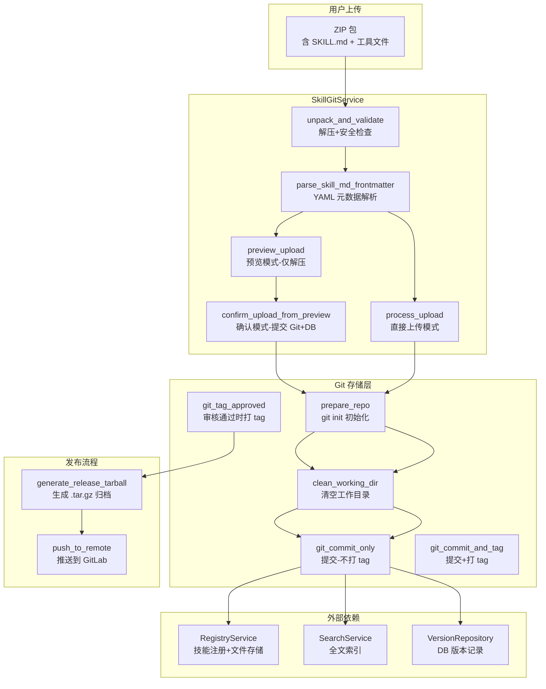
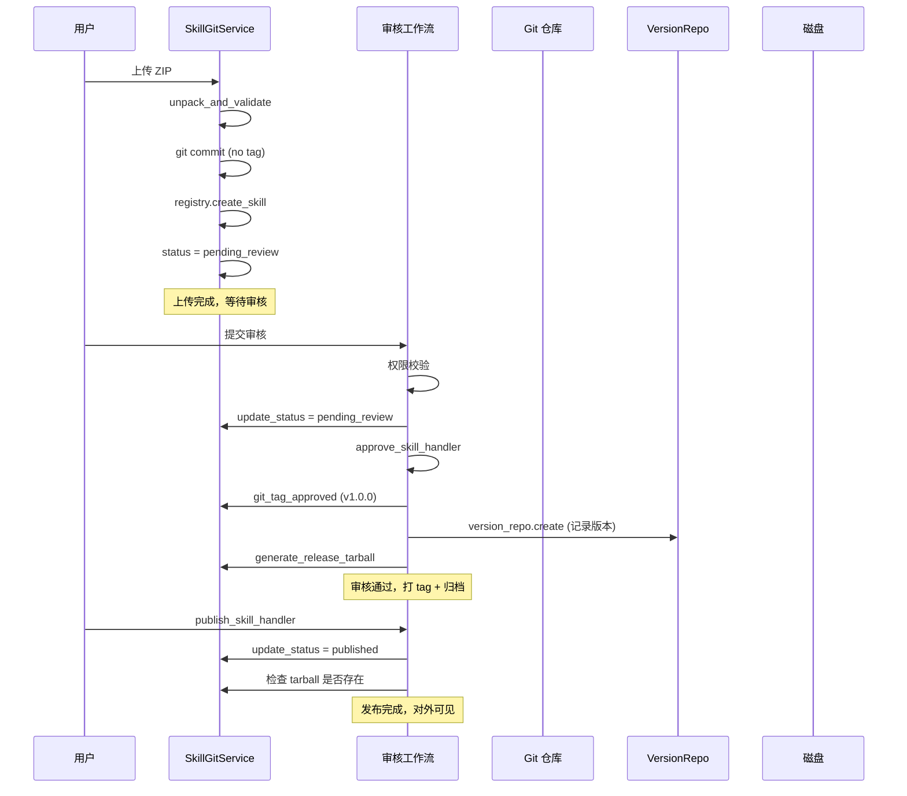

SkillGit 服务是 Skill Garden 体系的**版本管理中枢**，它实现了从 ZIP 包上传 → 解压验证 → 本地 Git 仓库托管 → 版本标签 → 发布归档的完整链路。该服务不依赖远程 Git 仓库（如 GitLab），而是以内嵌的本地 Git 仓库作为每个 Skill 的版本存储后端，远程同步作为可选扩展。其核心设计哲学是：**ZIP 是传输格式，Git 是存储格式，版本号是寻址标识**。

## 架构定位与数据流

SkillGit 服务处于上传流程的中心位置，串联了 Registry 服务（文件系统+DB 写入）、Search 服务（全文索引）和 Version Repository（版本记录），构成一条完整的"上传→存储→索引→追溯"管道。



这个架构的核心特征是**两阶段提交模式**：上传阶段仅 commit 不打 tag，审核通过后才打 tag + 生成 tarball + 写入版本记录。这种设计确保了 Git 版本号与审核状态严格一致——只有经过审核的版本才会获得正式 tag，未审核的版本虽然存在于 Git 历史中，但无法通过 tag 寻址。

Sources: [skill_git.rs](src/services/skill_git.rs#L1-L99), [workflow.rs](src/api/handlers/workflow.rs#L400-L499)

## ZIP 解压引擎：安全验证与元数据提取

`unpack_and_validate` 方法是整个上传管线的入口，它执行了严格的解压安全策略和元数据提取。

### 安全防护层

解压引擎实现了三层安全防护：

| 防护层级 | 实现机制 | 防护目标 |
|---------|---------|---------|
| 大小限制 | `MAX_UPLOAD_SIZE = 50MB`，同时校验压缩包和解压后总大小 | 防止磁盘耗尽攻击 |
| 路径穿越防护 | `sanitize_path()` 函数拒绝包含 `..` 或绝对路径的条目 | 防止 ZIP Slip 漏洞 |
| 格式校验 | 通过 `zip` crate 的 `ZipArchive::new()` 验证 ZIP 格式合法性 | 防止畸形包攻击 |

`sanitize_path` 函数的核心逻辑是对每个 ZIP 条目路径进行规范化检查，过滤掉所有包含 `ParentDir` 组件（`..`）或以 `/` 开头的绝对路径条目，确保解压后的文件不会逃逸到目标目录之外。

### SKILL.md 强制约束

解压完成后，引擎强制要求 ZIP 包根目录包含 `SKILL.md` 文件，这是每个 Skill 的"身份证"。该文件使用 YAML frontmatter 格式（`---` 包裹的元数据块），`parse_skill_md_frontmatter` 函数负责解析其中定义的 `name`、`description`、`tags`、`version`、`dependencies` 和 `compatibility` 字段。

```yaml
---
name: my-skill
description: A test skill
version: 1.0.0
tags: [web, http]
dependencies: [tool-a, tool-b]
compatibility: ">=1.0.0"
---
# Skill Content
```

值得注意的是，`version` 字段是可选的——当用户未在 SKILL.md 中指定版本号时，后端会自动根据该 Skill 的历史版本递增 patch 号（`1.0.3` → `1.0.4`），首次上传则默认为 `1.0.0`。这个逻辑由 `resolve_version` 函数实现，它使用 `semver` crate 进行语义化版本解析。

### 递归目录展开

`copy_dir_recursive` 函数处理了一个常见的 ZIP 包结构差异：有些 ZIP 包直接包含文件在根目录，有些则包含一个顶层目录（如 `my-skill/SKILL.md`）。当解压后的目录仅包含一个子目录时，该函数会自动展开这一层，确保最终文件结构一致。

Sources: [skill_git.rs](src/services/skill_git.rs#L300-L450), [skill_git.rs](src/services/skill_git.rs#L1200-L1250)

## 预览-确认两阶段上传

SkillGit 提供了一种**预览-确认**的两阶段上传模式，这类似于"购物车"模式——先预览再决定是否提交。

### 预览阶段 (`preview_upload`)

用户上传 ZIP 后，服务执行完整的解压和验证流程，但**不提交到 Git 仓库，也不写入数据库**。解压后的文件被移动到 `{temp_dir}/preview-{preview_id}` 目录下，服务返回以下信息供前端展示：

- **元数据**：从 SKILL.md 解析出的名称、描述、版本、标签等
- **文件清单**：所有文件的路径和大小，支持逐文件预览
- **统计信息**：总文件数和总大小

预览 ID 是简化的 UUID（取第一个 `-` 前的部分），用户在预览期间可以：
- 通过 `GET /api/v1/skills/upload/preview/{preview_id}/files/*path` 获取任意文件的内容（支持文本和二进制文件）
- 检查元数据是否正确
- 确认文件结构是否完整

### 确认阶段 (`confirm_upload_from_preview`)

当用户确认上传时，调用 `confirm_upload_from_preview` 方法，执行完整的提交流程：

1. **重新读取 SKILL.md**：从预览目录读取最新的 SKILL.md 内容
2. **准备 Git 仓库**：首次上传时 `git init`，后续复用已有仓库
3. **清空工作目录**：删除除 `.git` 外的所有文件
4. **拷贝文件**：将预览目录的文件复制到仓库工作目录
5. **Git commit**：仅提交，不打 tag（`git_commit_only`）
6. **Registry 注册**：通过 `RegistryService.create_skill` 写入文件系统和数据库
7. **状态设为 pending_review**：等待审核流程
8. **清理预览目录**：删除临时预览文件

这种两阶段设计的优势在于：**用户可以在不产生任何持久化数据的情况下预览上传结果，发现错误及时修正，避免了无效的 Git 提交和数据库记录**。

### 直接上传模式 (`process_upload`)

除了两阶段模式，服务也提供 `process_upload` 方法作为直接上传的入口。两者的核心区别在于：

| 特性 | 预览-确认模式 | 直接上传模式 |
|-----|------------|------------|
| 预览能力 | ✅ 支持，可逐文件查看 | ❌ 无预览 |
| 一次性提交 | ❌ 分两步 | ✅ 一步完成 |
| 适用场景 | 前端管理后台 | CLI 工具、API 调用 |
| 权限校验时机 | 确认时 | 上传时 |

Sources: [skill_git.rs](src/services/skill_git.rs#L200-L400), [skill_git.rs](src/services/skill_git.rs#L450-L550), [skill_upload.rs](src/api/handlers/skill_upload.rs#L1-L200)

## Git 版本管理核心操作

SkillGit 的 Git 版本管理围绕本地仓库展开，每个 Skill 对应一个独立 Git 仓库，存储在 `{data_dir}/git-repos/skill-{name}/` 目录下。

### 仓库初始化与复用

`prepare_repo` 方法负责 Git 仓库的生命周期管理：

- 如果 `.git` 目录已存在，直接返回 `false`（复用仓库）
- 如果目录存在但无 `.git`（可能是残留的空目录），先清理再 `git init`
- 如果目录不存在，创建目录后执行 `git init`

这种设计使得同一个 Skill 的多个版本可以在同一个仓库中累积，Git 历史天然记录了所有版本变更。

### 提交策略：两阶段标签

Git 操作的核心策略是**提交与标签分离**：

| 方法 | 操作 | 触发时机 |
|-----|------|---------|
| `git_commit_only` | `git add .` + `git commit` | 上传时、回滚时 |
| `git_commit_and_tag` | `git add .` + `git commit` + `git tag -a` | 审核通过时 |
| `git_tag_approved` | 仅 `git tag -a`（在已有 commit 上补打 tag） | 审核通过时 |

`git_commit_only` 在每次上传时生成一个 commit，commit message 包含版本号和上传者信息。`git_tag_approved` 则在审核通过时在最新 commit 上打 annotated tag（`v1.0.0` 格式）。如果 tag 已存在（如重新审核），会自动使用 `-f` 强制覆盖。

这种分离策略的深层原因在于：**版本号只能授予经过审核的代码**。未审核的 commit 虽然存在于 Git 历史中，但不会拥有正式的 tag，因此无法通过版本号引用。

### 版本号解析与自动递增

`resolve_version` 函数实现了版本号的自动管理逻辑：

```rust
fn resolve_version(skill_name, latest_version, user_version) -> Result<String, AppError> {
    // 用户显式指定 → 直接使用
    if let Some(v) = user_version { return Ok(v.clone()); }
    // 有历史版本 → patch + 1
    if let Some(latest) = latest_version { 
        // 1.0.3 → 1.0.4
    }
    // 首次上传 → 1.0.0
}
```

版本号解析使用 `semver` crate 进行语义化版本解析，确保版本格式的合法性。版本检查通过 `version_repo.get_latest_version` 查询数据库中的 `skill_versions` 表，确保不会出现版本号冲突。

### 版本回滚

`rollback_version_commit_only` 和 `rollback_version` 方法实现了版本回退功能。回滚的流程是：

1. 验证目标版本 tag 存在（`git rev-parse v{target}`）
2. 获取当前最新版本号，计算新版本号（patch + 1）
3. 清空工作目录，从目标 tag 检出文件（`git checkout {tag} -- .`）
4. 读取恢复后的 SKILL.md 获取元数据
5. 统计文件数和总大小
6. Git commit（不打 tag，审核通过后再打）
7. 写入 `skill_versions` 表（git_tag 为 None）

回滚操作**不会覆盖或删除**已有版本，而是创建一个新的 commit 来恢复目标版本的文件内容，新版本号在当前最新版本基础上递增 patch 号。这确保了版本历史的完整性和可追溯性——每次回滚都在 Git 历史中留下明确的记录，回滚后的版本也需要经过审核流程才能正式发布。

Sources: [skill_git.rs](src/services/skill_git.rs#L600-L800), [skill_git.rs](src/services/skill_git.rs#L1250-L1500)

## 审核与发布流程

SkillGit 与审核工作流紧密集成，构成了完整的"上传→审核→发布"生命周期。



### 审核通过时触发

`approve_skill_handler` 在审核通过时执行三个关键操作：

1. **打 Git tag**：调用 `git_tag_approved` 在最新 commit 上创建 annotated tag
2. **写入版本记录**：通过 `VersionRepository.create` 将版本信息写入 `skill_versions` 表，记录文件数、总大小、上传者等信息
3. **生成 tarball**：调用 `generate_release_tarball` 使用 `git archive` 命令生成 `.tar.gz` 格式的发布归档，存储在 `{data_dir}/releases/{skill_name}/v{version}.tar.gz`

### 发布时兜底

`publish_skill_handler` 在发布时执行兜底检查：如果 release tarball 不存在（理论上审核通过时已生成），则重新生成。同时，新版本发布后，旧版本的 `is_current` 标记会被设为 `false`，确保只有最新版本对外可见。

### 版本记录持久化

`VersionRepository` 将版本信息持久化到 `skill_versions` 表，包含以下关键字段：

| 字段 | 类型 | 说明 |
|------|------|------|
| `skill_name` | String | 技能名称，用于多版本查询 |
| `version` | String | 语义化版本号 |
| `git_commit_hash` | Option | Git commit SHA |
| `git_tag` | Option | Git tag 名称（审核通过后才有） |
| `changelog` | Option | 变更说明 |
| `file_count` | i32 | 文件数量 |
| `total_size_bytes` | i64 | 总大小 |
| `uploaded_by` | Option<Uuid> | 上传者身份 ID |
| `git_remote_url` | Option | 远程 Git 仓库 URL |

Sources: [workflow.rs](src/api/handlers/workflow.rs#L400-L499), [version.rs](src/db/repositories/version.rs#L1-L188), [skill_git.rs](src/services/skill_git.rs#L800-L900)

## 远程 GitLab 同步（可选扩展）

SkillGit 的 GitLab 集成是**可选扩展**，通过环境变量控制，默认不启用。整个设计遵循"先本地，后远程"的原则——本地 Git 仓库始终是主存储，GitLab 作为备份和协作平台。

### 配置体系

`GitRemoteConfig` 结构体从环境变量读取配置：

| 环境变量 | 默认值 | 说明 |
|---------|-------|------|
| `GITLAB_URL` | `https://gitlab.com` | GitLab 实例 URL |
| `GITLAB_GROUP` | `skill-garden` | 目标 Group/Namespace |
| `GITLAB_TOKEN` | 空 | Personal/Project Access Token |
| `GITLAB_PUSH_ENABLED` | `false` | 是否启用推送 |

远程 URL 构造格式为 `https://oauth2:{token}@{gitlab_url}/{group}/{repo}.git`，使用 OAuth2 方式进行认证。

### 远程操作

支持三种远程操作：

1. **`push_to_remote`**：设置或更新 remote origin，然后推送主分支和所有 tags
2. **`clone_from_gitlab`**：从 GitLab 克隆仓库到本地（如果本地仓库已存在则拒绝）
3. **`fetch_from_gitlab`**：从 GitLab 拉取最新更新（包括 tags）

这些操作目前通过管理后台手动触发，对应 API 路由为 `/api/v1/skills/{name}/sync`、`/api/v1/skills/{name}/clone` 和 `/api/v1/skills/{name}/remote`。

Sources: [skill_git.rs](src/services/skill_git.rs#L30-L110), [skill_git.rs](src/services/skill_git.rs#L900-L1050)

## API 路由总览

SkillGit 服务暴露的 API 路由分布在 `skill_upload.rs`、`workflow.rs` 和 `git.rs` 三个 handler 文件中：

| 方法 | 路由 | Handler | 功能 |
|------|------|---------|------|
| POST | `/api/v1/skills/upload` | `upload_skill_handler` | 直接上传 ZIP |
| POST | `/api/v1/skills/upload/preview` | `upload_skill_preview_handler` | 预览上传 |
| GET | `/api/v1/skills/upload/preview/{id}/files/*path` | `get_preview_file_handler` | 预览文件内容 |
| POST | `/api/v1/skills/upload/preview/{id}/confirm` | `confirm_skill_upload_handler` | 确认上传 |
| GET | `/api/v1/skills/{name}/versions` | `list_skill_versions_handler` | 版本列表 |
| GET | `/api/v1/skills/{name}/versions/diff` | `get_skill_version_diff_handler` | 版本差异 |
| GET | `/api/v1/skills/{name}/tags` | `list_skill_git_tags_handler` | Git tag 列表 |
| POST | `/api/v1/skills/{name}/rollback` | `rollback_skill_handler` | 版本回退 |
| POST | `/api/v1/skills/{name}/sync` | `sync_skill_from_gitlab_handler` | GitLab 同步 |
| POST | `/api/v1/skills/{name}/clone` | `clone_skill_from_gitlab_handler` | GitLab 克隆 |
| GET | `/api/v1/skills/{name}/remote` | `get_skill_remote_info_handler` | 远程信息 |

Sources: [routes.rs](src/api/routes.rs#L1-L200), [skill_upload.rs](src/api/handlers/skill_upload.rs#L1-L397), [workflow.rs](src/api/handlers/workflow.rs#L1-L650)

## 设计权衡与演进方向

### 当前设计的特点

1. **本地优先**：不依赖外部 Git 服务，所有版本管理在本地完成，降低了部署复杂度和对外部服务的依赖
2. **审核即标签**：Git tag 的创建时机与审核通过严格绑定，确保了版本号的权威性
3. **两阶段上传**：预览-确认模式提供了良好的用户体验，避免了无效提交
4. **回滚不覆盖**：回滚通过创建新版本而非覆盖旧版本实现，保证了版本历史的完整性

### 可预见的演进方向

1. **GitLab 深度集成**：当前远程同步是可选的手动操作，未来可以支持自动推送、Webhook 触发同步、CI/CD 流水线集成
2. **分支管理**：当前仅使用 main 分支，未来可能支持 feature 分支、PR 审核流程
3. **增量上传**：当前每次上传都是全量替换，未来可以支持增量 diff 上传，减少传输量
4. **版本对比 UI**：当前通过 API 返回 diff 数据，未来可以在管理后台提供可视化版本对比界面

## 进一步阅读

- 了解上传后的文件如何被索引和搜索：`[Search 服务：Tantivy 全文索引与可见性过滤](19-search-fu-wu-tantivy-quan-wen-suo-yin-yu-ke-jian-xing-guo-lu)`
- 了解 Skill 的完整生命周期状态转换：`[Skill 资产模型：生命周期、版本、可见性与市场状态](6-skill-zi-chan-mo-xing-sheng-ming-zhou-qi-ban-ben-ke-jian-xing-yu-shi-chang-zhuang-tai)`
- 了解审核流程的权限控制：`[RBAC 权限模型：System/Tenant/Org/Group 四级角色体系](8-rbac-quan-xian-mo-xing-system-tenant-org-group-si-ji-jiao-se-ti-xi)`
- 了解 Registry 服务如何管理上传后的文件存储：`[Registry 服务：Skills 注册、搜索索引与文件存储](13-registry-fu-wu-skills-zhu-ce-sou-suo-suo-yin-yu-wen-jian-cun-chu)`