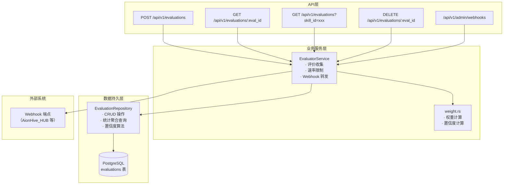
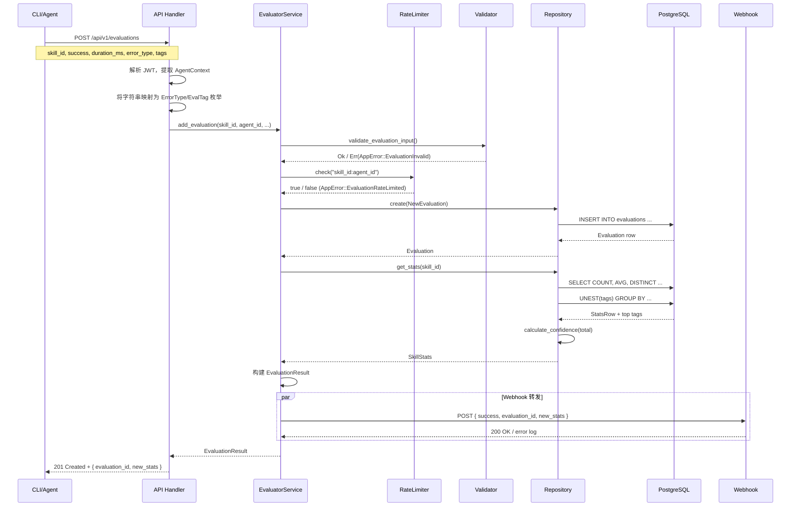

Evaluator 服务是 AionHive 系统中的一个核心服务层，负责结构化评价数据的收集、存储、置信度计算与统计聚合，并提供基于 Webhook 的事件通知能力。它位于 `src/services/evaluator.rs`，是 API 层与数据库层之间的业务中间件，为 CLI 和管理后台提供一致的评价数据视图。

## 架构概览

Evaluator 服务在系统中的位置如下图所示，它连接了 API 路由、数据库、权重计算引擎和外部 Webhook：



**核心职责**：接收 Agent 对 Skill 执行结果的评价数据，执行输入验证和速率限制，将评价持久化到数据库，实时计算统计聚合结果，并在配置了 Webhook 时将评价结果转发到外部系统。

Sources: [evaluator.rs](src/services/evaluator.rs#L1-L23), [routes.rs](src/api/routes.rs#L104-L541), [evaluations.rs](src/api/handlers/evaluations.rs#L1-L188)

## 数据模型

### 评价记录（Evaluation）

每条评价记录代表一次 Agent 对 Skill 的执行结果评估，包含以下核心字段：

| 字段 | 类型 | 说明 |
|------|------|------|
| `id` | UUID | 主键，由数据库自动生成 |
| `skill_id` | VARCHAR(255) | 被评价的 Skill ID |
| `agent_id` | VARCHAR(255) | 执行评价的 Agent ID |
| `success` | BOOLEAN | 执行是否成功 |
| `duration_ms` | BIGINT | 执行耗时（毫秒） |
| `error_type` | VARCHAR(50) | 可选，错误类型分类 |
| `tags` | TEXT[] | 评价标签数组 |
| `timestamp` | TIMESTAMPTZ | 评价时间戳 |

数据库表创建于最初的迁移文件 `001_initial_schema.sql`，并建立了 `skill_id`、`agent_id` 和 `timestamp` 三个索引以优化查询性能。

Sources: [evaluation.rs](src/models/evaluation.rs#L1-L60), [001_initial_schema.sql](src/db/migrations/001_initial_schema.sql#L45-L70)

### 错误类型与标签枚举

错误类型（`ErrorType`）定义了四种分类：`Timeout`（超时）、`Crash`（崩溃）、`LogicError`（逻辑错误）和 `Other`（其他）。序列化时采用 `snake_case` 格式。

评价标签（`EvalTag`）定义了四种语义标签：`Reliable`（可靠）、`Fast`（快速）、`Stable`（稳定）和 `Experimental`（实验性）。这些标签在 API 层从字符串映射到枚举，在数据库层以 `TEXT[]` 数组存储。

Sources: [evaluation.rs](src/models/evaluation.rs#L1-L30)

### SkillStats 统计结构

`SkillStats` 是评价系统的核心输出结构，包含以下聚合计算值：

- **success_rate**：加权成功率（0-1），基于权重计算引擎得出
- **avg_duration_ms**：加权平均执行时间
- **total_evaluations**：总评价数
- **unique_agents**：评价过的唯一 Agent 数
- **confidence**：置信度（0-1），反映统计结果的可靠程度
- **tags**：聚合后的高频标签列表
- **local_version / latest_version / upgrade_available**：版本信息字段，用于在 CLI 中展示版本升级提示

`SkillStats` 还提供了 `confidence_level()` 方法，将置信度数值映射为 `ConfidenceLevel` 枚举（Low / Medium / High），用于向用户呈现直观的可靠性指示。

Sources: [evaluation.rs](src/models/evaluation.rs#L60-L130)

## 核心业务流程

### 评价提交流程

评价提交是 Evaluator 服务最核心的流程，其完整执行路径如下：



**关键设计决策**：评价提交后立即计算并返回更新后的统计信息，而非异步处理。这样 Agent 可以在每次评价后及时获取最新的成功率、置信度等指标，用于决策是否继续使用该 Skill。

Sources: [evaluator.rs](src/services/evaluator.rs#L52-L105), [evaluations.rs](src/api/handlers/evaluations.rs#L1-L60)

### 输入验证

评价提交前需要经过两层验证：

1. **Schema 验证**（`validate_evaluation_input`）：检查 `skill_id` 非空，`duration_ms` 不超过 1 小时（3,600,000 ms）。该函数位于 `src/schemas/validation.rs`。
2. **速率限制**（`RateLimiter`）：以 `"skill_id:agent_id"` 为键，默认每 24 小时最多允许 10 次评价。超出限制返回 `AppError::EvaluationRateLimited`。

Sources: [validation.rs](src/schemas/validation.rs#L160-L180), [rate_limiter.rs](src/utils/rate_limiter.rs#L1-L50)

### 统计聚合算法

统计聚合在 `EvaluationRepository` 层通过 SQL 聚合查询实现，核心逻辑在 `get_stats` 方法中：

```sql
SELECT
    COUNT(*) as total,
    COUNT(*) FILTER (WHERE success = true) as success_count,
    AVG(duration_ms) as avg_duration,
    COUNT(DISTINCT agent_id) as unique_agents
FROM evaluations
WHERE skill_id = $1
```

**成功率计算**：`success_rate = success_count / total`（简单算术平均，非加权）。

**置信度计算**（`calculate_confidence`）采用分段线性模型：
- 评价数 < 3：`confidence = total / 3.0`（低置信度，线性增长）
- 评价数在 3 到 10 之间：`confidence = (total - 3) / 7.0 + 0.5`（中等置信度）
- 评价数 > 10：`confidence = 1.0`（高置信度）

这种设计反映了统计学的核心原理：样本量越大，统计结果越可靠。评价数少于 3 时置信度不足 1.0，超过 10 条评价后方可达到完全置信。

**高频标签提取**：通过 `UNEST(evaluations.tags)` 将标签数组展开，按出现频率排序取前 5 个。

Sources: [evaluation.rs](src/db/repositories/evaluation.rs#L40-L120)

## 权重计算引擎（weight.rs）

虽然 `EvaluatorService` 当前使用简单算术平均计算成功率，系统还提供了一个独立的权重计算引擎位于 `src/utils/weight.rs`，用于更精细的评价分析。

### 权重因子

权重计算基于 `EvalContext` 上下文中的多个因子，每个因子都有预设的权重常量：

| 因子 | 方向 | 影响值 | 条件 |
|------|------|--------|------|
| BASE | 基准 | 1.0 | 始终 |
| SUCCESS_HISTORY_BONUS | 加分 | +0.2 | 该 Agent 有成功的评价历史 |
| RECENT_BONUS | 加分 | +0.1 | 评价在 24 小时内 |
| MAJORITY_BONUS | 加分 | +0.3 | 评价结果与多数一致 |
| SINGLETON_PENALTY | 扣分 | -0.5 | 该 Skill 只有一条评价 |
| TOO_FAST_PENALTY | 扣分 | -0.3 | 执行时间 < 1 秒 |
| TOO_SLOW_PENALTY | 扣分 | -0.2 | 执行时间 > 10 倍平均 |

权重最小值为 0.1，防止零权重导致计算异常。

### 加权统计计算

`calculate_weighted_stats` 函数实现了完整的加权统计流程：

1. 按 `agent_id` 分组，追踪每个 Agent 是否有成功历史
2. 计算整体平均执行时间
3. 对每条评价构建 `EvalContext` 并计算权重
4. 计算加权成功率：`weighted_success_rate = sum(权重大小) / sum(全部权重)`
5. 计算置信度（与 Repository 层不同的独立实现）

权重计算引擎当前作为独立模块存在，与 `EvaluatorService` 的简单算术平均形成互补。未来可根据需求将加权计算集成到主流程中。

Sources: [weight.rs](src/utils/weight.rs#L1-L200)

## Webhook 转发机制

Evaluator 服务支持将评价结果实时转发到外部 Webhook 端点，这是实现与 AionHive_HUB 等外部系统集成的关键能力。

### 配置方式

Webhook URL 通过环境变量 `AION_HIVE_EVAL_WEBHOOK_URLS` 配置，支持多个 URL（逗号分隔）。也可以在运行时通过 API 动态管理。

### 运行时管理 API

Webhook 管理通过以下 REST API 端点实现：

| 方法 | 路径 | 功能 |
|------|------|------|
| GET | `/api/v1/admin/webhooks` | 列出所有配置的 Webhook URL |
| POST | `/api/v1/admin/webhooks` | 添加新的 Webhook URL |
| DELETE | `/api/v1/admin/webhooks/:index` | 按索引移除 Webhook URL |

所有 Webhook 管理操作都会记录审计日志，记录在 `audit_logs` 表中。

### 转发行为

在 `add_evaluation` 方法中，评价提交成功后会调用 `forward_to_webhooks` 方法，对每个配置的 Webhook URL 并发发送 POST 请求：

```rust
async fn forward_to_webhooks(&self, evaluation: &EvaluationResult) {
    // 遍历所有 webhook_urls
    // 发送 POST 请求，Payload 为 EvaluationResult 的 JSON 序列化
    // 记录成功/失败日志
}
```

**转发特性**：
- 异步非阻塞：转发失败不会影响评价提交的主流程
- 错误隔离：单个 Webhook 失败不影响其他 Webhook
- 幂等设计：Webhook 接收方应自行处理重复消息
- 日志记录：成功/失败均有 `info`/`error` 级别日志

**线程安全说明**：当前 `EvaluatorService` 的 Webhook 管理方法（`add_webhook_url_dyn`、`remove_webhook_url`）通过 `clone` 方式修改，并非线程安全。生产环境应使用 `Arc<RwLock>` 或数据库持久化存储来管理 Webhook 配置。

Sources: [evaluator.rs](src/services/evaluator.rs#L25-L50), [webhooks.rs](src/api/handlers/webhooks.rs#L1-L100)

## API 接口清单

Evaluator 服务通过以下 REST API 端点暴露能力：

| 方法 | 路径 | 认证 | 功能 |
|------|------|------|------|
| POST | `/api/v1/evaluations` | JWT (Agent) | 提交评价 |
| GET | `/api/v1/evaluations?skill_id=xxx` | JWT (Agent) | 查询评价列表 |
| GET | `/api/v1/evaluations/:eval_id` | JWT (Agent) | 查询单条评价 |
| DELETE | `/api/v1/evaluations/:eval_id` | JWT (Agent) | 删除评价（仅创建者或 Admin） |
| GET | `/api/v1/skills/:id/stats` | 公开 | 获取 Skill 统计信息 |
| GET | `/api/v1/admin/webhooks` | JWT (Admin) | 列出 Webhook |
| POST | `/api/v1/admin/webhooks` | JWT (Admin) | 添加 Webhook |
| DELETE | `/api/v1/admin/webhooks/:index` | JWT (Admin) | 移除 Webhook |

**评价删除权限**：`delete_evaluation_handler` 实现了细粒度的权限校验——仅评价创建者（通过 `agent_id` 匹配）或 Admin 用户可以删除评价，其他用户会收到 `401 Unauthorized`。

Sources: [routes.rs](src/api/routes.rs#L104-L541), [evaluations.rs](src/api/handlers/evaluations.rs#L100-L188)

## 错误处理体系

Evaluator 服务定义了两种评价相关的错误类型：

| 错误码 | 错误类型 | 触发条件 |
|--------|----------|----------|
| `EVALUATION_INVALID` | `AppError::EvaluationInvalid` | `skill_id` 为空或 `duration_ms` 超过 1 小时 |
| `EVALUATION_RATE_LIMITED` | `AppError::EvaluationRateLimited` | 同一 `(skill_id, agent_id)` 对在 24 小时内超过 10 次评价 |

这些错误通过 `AppError` 枚举统一管理，在 API 层转换为 `400 Bad Request` 响应返回给客户端。

Sources: [error.rs](src/models/error.rs#L100-L150)

## 设计决策与权衡

**1. 同步统计计算 vs 异步聚合**
选择在评价提交时同步计算统计信息，而非采用异步批处理。这保证了每次评价提交后都能立即获得最新的统计结果，代价是增加了请求延迟（约一次额外 SQL 查询的开销）。权衡的结果是：对于非高频的评价场景，同步方案更简单、更可预测。

**2. 简单算术平均 vs 加权平均**
当前 `EvaluatorService` 使用简单算术平均计算成功率，但权重计算引擎已作为独立模块实现。简单算术平均更易于理解和调试，加权平均在评价数据量大时能更准确地反映真实质量。这种分离设计允许在需要时快速切换。

**3. 内存级 Webhook 管理 vs 数据库持久化**
Webhook 配置当前存储在内存中（`Vec<String>`），通过环境变量初始化。这种设计简化了部署，但重启后运行时添加的 Webhook 会丢失。生产环境应考虑迁移到数据库持久化存储。

**4. 速率限制器的内存存储**
速率限制状态使用内存中的 `HashMap`（`Arc<RwLock<HashMap<String, RateLimitEntry>>>`），重启后重置。对于分布式部署，应迁移到 Redis 等共享存储。

Sources: [evaluator.rs](src/services/evaluator.rs#L1-L297), [weight.rs](src/utils/weight.rs#L1-L374), [rate_limiter.rs](src/utils/rate_limiter.rs#L1-L187)

## 下一步阅读

- **[评价与置信度模型：结构化评价指标与置信度计算](9-ping-jie-yu-zhi-xin-du-mo-xing-jie-gou-hua-ping-jie-zhi-biao-yu-zhi-xin-du-ji-suan)**：深入了解评价数据模型的设计哲学和置信度计算的理论基础
- **[Handler 模式：请求处理、权限校验与错误处理](11-handler-mo-shi-qing-qiu-chu-li-quan-xian-xiao-yan-yu-cuo-wu-chu-li)**：了解评价 API 的 Handler 实现模式
- **[Repository 模式：PostgreSQL 数据访问与事务管理](27-repository-mo-shi-postgresql-shu-ju-fang-wen-yu-shi-wu-guan-li)**：探索 EvaluationRepository 的数据访问层设计
- **[速率限制器：基于时间窗口的请求限流](29-su-lu-xian-zhi-qi-ji-yu-shi-jian-chuang-kou-de-qing-qiu-xian-liu)**：深入了解速率限制器的工作原理