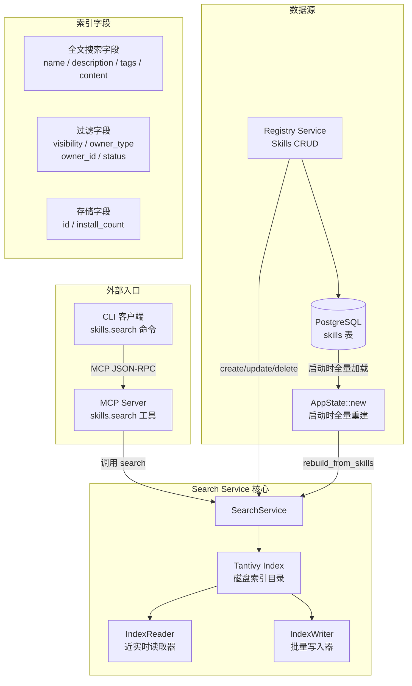
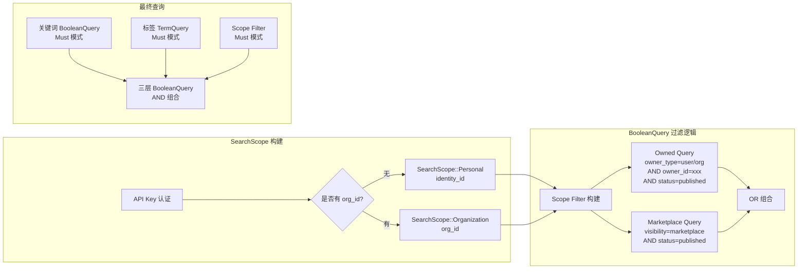

Search 服务是 Skill Garden 平台中负责**全文搜索**与**可见性过滤**的核心基础设施层。它基于 Tantivy（Rust 生态中的高性能全文搜索引擎，Lucene 的 Rust 替代品）构建，为 `skills.search` MCP 工具提供毫秒级的关键词检索能力，同时将 RBAC 权限模型的可见性规则直接编码到索引查询中，避免回查数据库进行二次过滤。

## 设计动机：为什么选择 Tantivy 而非数据库 LIKE 查询？

在平台早期版本中，搜索功能依赖于 PostgreSQL 的 `LIKE '%keyword%'` 或 `tsvector` 全文检索。随着 Skill 数量增长至数千条，以及标签过滤、可见性过滤等复合查询需求的引入，数据库层面的全文搜索出现了两个瓶颈：其一，`LIKE` 查询无法利用索引，全表扫描导致延迟随数据量线性增长；其二，可见性过滤需要 JOIN 多张权限表，查询复杂度急剧上升。Tantivy 的引入将这两个问题统一解决——它在索引构建阶段就将**可见性标签**（visibility、owner_type、owner_id、status）作为独立的 `STRING` 字段写入倒排索引，使得搜索时可以在一次索引查询中同时完成关键词匹配和权限过滤，无需回数据库做二次校验。Sources: [search.rs](src/services/search.rs#L1-L10)

## 架构总览



Search 服务在系统启动时通过 `AppState::new` 从 PostgreSQL 加载所有已发布的 Skill，调用 `rebuild_from_skills` 全量重建索引。运行期间，Registry 服务在创建、更新、删除 Skill 时，主动调用 `add_skill`、`update_skill`、`delete_skill` 方法维持索引与数据库的同步。这种**写时同步 + 启动时全量重建**的双重策略确保了索引的一致性和灾难恢复能力。Sources: [lib.rs](src/lib.rs#L156-L195), [search.rs](src/services/search.rs#L76-L120)

## 索引 Schema 设计：全文搜索与过滤的分离

Tantivy 的 Schema 设计体现了清晰的职责分离——全文搜索字段使用 `TEXT` 类型（分词后索引），过滤字段使用 `STRING` 类型（精确匹配，不分词），存储字段使用 `STORED` 标记（仅存储，不索引）：

| 字段 | 类型 | 用途 | 示例值 |
|------|------|------|--------|
| `id` | `STRING \| STORED` | 唯一标识，精确匹配用于删除 | `skill-gpt4-python-1.0.0` |
| `name` | `TEXT \| STORED` | 全文搜索+展示 | `"GPT-4 Python Assistant"` |
| `description` | `TEXT \| STORED` | 全文搜索+展示 | `"A Python coding assistant..."` |
| `tags` | `TEXT \| STORED` | 分词后支持标签匹配 | `"python ai coding"` |
| `content` | `TEXT` | 全文搜索（不存储，降低索引体积） | `SKILL.md 内容` |
| `install_count` | `STORED` | 仅存储，用于搜索结果中展示 | `"42"` |
| `visibility` | `STRING \| STORED` | 可见性过滤 | `marketplace` |
| `owner_type` | `STRING \| STORED` | 所有者类型过滤 | `user` / `organization` |
| `owner_id` | `STRING \| STORED` | 所有者 ID 过滤 | UUID 字符串 |
| `status` | `STRING \| STORED` | 生命周期状态过滤 | `published` |

`tags` 字段虽然是 `TEXT` 类型，但在搜索时同时支持两种使用方式：作为 QueryParser 的多字段搜索目标之一（用户输入关键词时自动匹配），以及通过 `TermQuery` 进行精确标签过滤（当客户端显式传入 `tags` 参数时）。这种双重能力使得标签既可以被关键词搜索命中，也可以作为独立的过滤维度。Sources: [search.rs](src/services/search.rs#L51-L68)

## 可见性过滤：一次索引查询的权限边界

Search 服务最为关键的设计是**将权限规则编码为 Tantivy BooleanQuery**，在索引层完成可见性过滤，无需回数据库查询。这一设计通过 `SearchScope` 枚举和 `scope_filter` 方法实现：



`scope_filter` 方法构建的 BooleanQuery 本质上是两个子查询的 OR 组合：**属于我的**（`owner_type=xxx AND owner_id=yyy AND status=published`）OR **市场已发布的**（`visibility=marketplace AND status=published`）。这意味着：

- **个人 API Key 用户**：可以看到自己所有的已发布 Skill（无论可见性设置） + 所有市场已发布的 Skill
- **组织 API Key 用户**：可以看到该组织所有的已发布 Skill + 所有市场已发布的 Skill
- **未认证用户**：scope 参数为 `None`，不附加任何可见性过滤，仅返回所有匹配关键词的结果（上层 MCP 层会做二次过滤）

这种设计的精妙之处在于，即使一个 Skill 的可见性设置为 `OrgVisible`，只要它的状态是 `published` 且属于当前用户/组织，就能被搜索到——可见性在搜索层面的含义是"谁可以看到"，而不是"是否可以搜索到"。Sources: [search.rs](src/services/search.rs#L153-L236)

## 核心方法详解

### 搜索方法：`search`

```rust
pub fn search(
    &self,
    query_str: &str,       // 用户输入的关键词
    tags: Option<&[String]>, // 可选标签过滤
    limit: usize,           // 返回结果数量上限
    scope: Option<&SearchScope>, // 可见性过滤范围
) -> Result<Vec<SearchResult>, AppError>
```

搜索执行流程分为三层 BooleanQuery 的 AND 组合：
1. **关键词层**：使用 `QueryParser` 对 `name`、`description`、`tags`、`content` 四个字段进行分词匹配，解析为 Tantivy 的 Query 对象。如果关键词为空，则跳过这一层。
2. **标签层**：如果客户端传入了 `tags` 参数，对每个标签使用 `TermQuery` 进行精确匹配。标签在索引中虽然是 `TEXT` 类型，但 `TermQuery` 会匹配分词后的 token，因此标签的精确过滤依赖于 Tantivy 的分词器将标签作为一个完整的 token 保留。
3. **Scope 层**：通过 `scope_filter` 构建可见性过滤条件。

如果三层都为空（无关键词、无标签、无 scope），则退化使用 `AllQuery` 返回所有文档——这在管理后台的全量浏览场景中会用到，但在实际 MCP 调用中，scope 几乎总是存在的。Sources: [search.rs](src/services/search.rs#L238-L329)

### 索引维护方法

索引的写入操作通过 `IndexWriter` 完成，所有写入后都会调用 `writer.commit()` 和 `reader.reload()` 确保查询端立即可见：

| 方法 | 操作 | 调用时机 |
|------|------|----------|
| `add_skill` | 添加新文档 | Registry 创建 Skill 且 `status == "published"` 时 |
| `delete_skill` | 通过 TermQuery 匹配 `id` 字段删除 | Registry 删除 Skill 或状态变为非 `published` 时 |
| `update_skill` | 先删后加 | Registry 更新 Skill 且状态为 `published` 时 |
| `rebuild_from_skills` | 全量删除 + 批量添加 | 系统启动时索引为空，或管理员手动触发重建 |

`rebuild_from_skills` 方法在启动时被 `AppState::new` 调用，条件是 `search.doc_count() == 0`。它从数据库加载所有 Skill，过滤出 `status == "published"` 的条目，批量写入索引。这一策略确保了索引从空的初始状态能够自动恢复，但在生产环境中，如果索引文件损坏或丢失，重启服务即可自动重建。Sources: [search.rs](src/services/search.rs#L76-L120), [lib.rs](src/lib.rs#L156-L195)

## 与 MCP 层的协作

Search 服务通过 MCP Server 暴露为 `skills.search` 工具。MCP 层在调用 Search 服务之前，会完成两个关键步骤：

1. **Scope 构建**：从 API Key 认证结果中提取 `identity_id` 和 `org_id`，构建 `SearchScope::Personal` 或 `SearchScope::Organization`。如果 API Key 是个人类型（无关联组织），则使用 `Personal` 范围；如果是组织类型，则使用 `Organization` 范围。这种设计确保了组织 API Key 无法搜索到个人 Skill，个人 API Key 也无法搜索到组织 Skill——除非 Skill 是市场已发布的。Sources: [server.rs](src/mcp/server.rs#L464-L487)

2. **MCP 层二次过滤**：虽然 Search 服务已经在索引层完成了可见性过滤，但 MCP 层的 `filter_skills_visible_mcp` 方法仍然保留了对 `skills.list`、`skills.info` 等不使用 Search 服务的工具的过滤逻辑。对于 `skills.search` 返回的结果，Search 服务返回的是 `SearchResult`（仅包含 `skill_id`、`score`、`install_count`），不包含完整的可见性信息，因此 MCP 层不需要对搜索结果做二次过滤——索引层的过滤已经足够。Sources: [server.rs](src/mcp/server.rs#L1400-L1450)

## CLI 客户端的搜索体验

CLI 客户端通过 MCP JSON-RPC 协议调用 `skills.search` 工具：

```bash
skill-garden search "python assistant" --limit 10
```

CLI 的 `search` 命令将用户输入包装为 `skills.search` 的 MCP 调用，传入 `query` 和 `limit` 参数。返回的 `SearchResult` 列表包含 `skill_id`、`score` 和 `install_count` 三个字段，CLI 客户端在此基础上通过 `skills.info` 工具获取完整的 Skill 详情用于展示。这种**搜索与详情分离**的设计避免了在搜索结果中传输大量不需要的字段，降低了网络开销。Sources: [commands.rs](src/cli/commands.rs#L56-L80)

## 关键设计决策

**为什么 `visibility` 使用 `STRING` 而非 `TEXT`？** 可见性过滤需要精确匹配——`visibility=marketplace` 不应该匹配到 `visibility=marketplace_pending`。`STRING` 类型在 Tantivy 中不做分词处理，存储为完整的 token，使得 `TermQuery` 可以精确命中。如果使用 `TEXT` 类型，Tantivy 的分词器可能会将 `marketplace` 拆分为 `market` 和 `place`，导致过滤失效。

**为什么 `content` 字段只索引不存储？** SKILL.md 的内容通常较长，存储在索引中会显著增加索引体积。搜索结果只需要返回 `skill_id`，客户端可以通过 `skills.info` 获取完整的 SKILL.md 内容。因此 `content` 字段仅标记为 `TEXT`（可搜索），不加 `STORED` 标记。这体现了 Tantivy 索引中"搜索字段"与"展示字段"的分离原则。

**为什么索引写入缓冲区大小为 50MB？** `IndexWriter` 的缓冲区大小（`index.writer(50_000_000)`）决定了每次 `commit` 前内存中缓存的文档数量。50MB 是一个平衡值——对于典型的 Skill 文档大小（几 KB 到几十 KB），50MB 缓冲区可以容纳数千篇文档，在批量重建时减少 I/O 次数，同时不会占用过多内存。Sources: [search.rs](src/services/search.rs#L70-L74)

## 下一步阅读

建议阅读以下相关文档以构建完整的搜索与权限体系认知：

- **[Registry 服务：Skills 注册、搜索索引与文件存储](13-registry-fu-wu-skills-zhu-ce-sou-suo-suo-yin-yu-wen-jian-cun-chu)**：了解 Search 服务如何与 Registry 服务协同工作，包括创建/更新 Skill 时索引的同步机制
- **[Permission 服务：多层级权限上下文构建与缓存](15-permission-fu-wu-duo-ceng-ji-quan-xian-shang-xia-wen-gou-jian-yu-huan-cun)**：理解 Skill 可见性在权限模型中的完整语义，以及 SearchScope 与权限上下文的关系
- **[CLI 命令行工具：搜索、安装、评价 Skills](25-cli-ming-ling-xing-gong-ju-sou-suo-an-zhuang-ping-jie-skills)**：查看 CLI 客户端如何调用 `skills.search` 工具及其展示逻辑
- **[Skill 资产模型：生命周期、版本、可见性与市场状态](6-skill-zi-chan-mo-xing-sheng-ming-zhou-qi-ban-ben-ke-jian-xing-yu-shi-chang-zhuang-tai)**：理解 `visibility`、`status`、`marketplace_status` 三个维度的完整语义