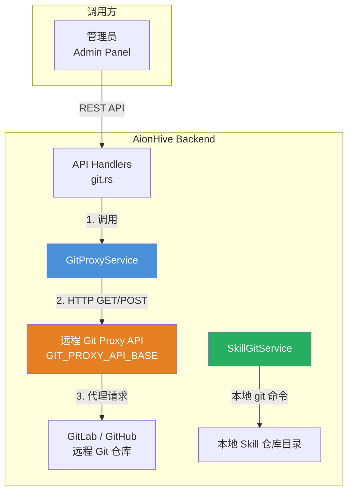

## 定位与设计意图

GitProxy 服务是 AionHive 架构中面向**远程 Git 仓库**的操作代理层。它解决了一个核心问题：平台需要以只读方式访问远程 Git 仓库（如 GitLab、GitHub 等）中的内容——浏览分支、获取文件、比较差异、验证仓库地址合法性——但不希望在每个后端服务中直接暴露 HTTP 客户端逻辑和远程 API 地址。GitProxy 作为轻量级门面（facade），将所有这些远程 Git 操作统一封装在一个服务中，对外提供简洁的 Rust 方法调用接口。

与本地 Git 版本管理服务 `SkillGitService`（负责 ZIP 解压 + 本地 Git 仓库 + 推送到 GitLab）不同，GitProxy 不涉及本地 Git 仓库的创建或管理，它纯粹是一个**远程 API 的 HTTP 客户端包装器**。两者定位对比：

| 维度 | GitProxy 服务 | SkillGit 服务 |
|------|---------------|---------------|
| 职责 | 远程仓库只读操作（浏览、读取、比较） | 本地仓库版本管理（ZIP 解压、tag、推送） |
| 通信方式 | HTTP 请求到远程 Git Proxy API | 本地文件系统 + `git` 命令 + GitLab API |
| 数据流方向 | 远程 → 本地（读取） | 本地 → 远程（推送） |
| 权限保护 | 仅管理员可调用 | 技能作者/组织成员可操作 |

Sources: [src/services/git_proxy.rs](src/services/git_proxy.rs#L1-L4), [src/services/skill_git.rs](src/services/skill_git.rs#L1-L5)

## 架构位置

在整体服务架构中，GitProxy 位于最底层的外部系统集成层，不与数据库直接交互，也不缓存任何远程数据。它通过 `reqwest` HTTP 客户端向一个独立的 Git Proxy 服务（如 GitLab API 的代理封装）发送请求，然后将结果反序列化为内部模型返回给调用方。



`GitProxyService` 被注入到 `AppState` 和 `AppRouterState` 中，通过 `Arc` 共享引用在所有 HTTP handler 中可用。其初始化在 `AppState::new()` 中以 `GitProxyService::default()` 完成，默认配置从环境变量 `GIT_PROXY_API_BASE` 读取（回退到 `http://localhost:8081`）。

Sources: [src/lib.rs](src/lib.rs#L216), [src/api/http_state.rs](src/http_state.rs#L84), [src/main.rs](src/main.rs#L278)

## 核心数据模型

GitProxy 服务定义了 6 个结构化数据模型，均为 `Serialize + Deserialize`，用于在服务内部与远程 API 之间传递数据：

```rust
// 分支引用：包含名称和最新 commit SHA
GitRef { name: String, commit: String, committed_at: i64 }

// 文件内容：路径、Base64 编码内容、大小
GitFile { path: String, content: String, size: u64 }

// 差异比较：两个 commit 之间的变更统计
GitDiff { from_commit: String, to_commit: String, 
          files_changed: Vec<String>, additions: u64, deletions: u64 }

// 仓库元数据：远程仓库的标识信息
GitRepo { id: String, name: String, clone_url: String, 
          default_branch: String, created_at: String }

// 提交信息：单个 commit 的元数据
GitCommit { sha: String, message: String, author: String, timestamp: String }

// Webhook 配置：远程仓库事件通知注册
Webhook { id: String, url: String, events: Vec<String>, active: bool }
```

Sources: [src/services/git_proxy.rs](src/services/git_proxy.rs#L12-L58)

## 操作接口全景

GitProxyService 提供 9 个公开异步方法，所有方法均返回 `Result<T, AppError>`，错误类型统一为 `AppError::InternalError`：

### 只读查询操作

**`list_branches(repo_id) -> Vec<String>`** — 获取仓库的所有分支名称列表。内部调用 `GET /repos/{repo_id}/branches`，从响应中提取 `name` 字段。返回简洁的分支名列表，适合用于分支选择器 UI。

**`get_branches_with_refs(repo_id) -> Vec<GitRef>`** — 获取分支列表及其关联的 commit SHA。与 `list_branches` 使用相同的 API 端点，但解析更丰富的响应结构（包含 `commit.sha`），返回 `GitRef` 对象。注意 `committed_at` 字段在此方法中默认设置为 0，因为远程 API 响应中不包含时间戳。

**`get_commits(repo_id, limit) -> Vec<GitRef>`** — 获取仓库的最近 commit 列表。调用 `GET /repos/{repo_id}/commits?limit={limit}`，解析 `sha`、`commit.author.timestamp` 字段。commit SHA 被截取前 7 位作为 `name`，完整 SHA 作为 `commit`，时间戳通过 RFC 3339 解析后转为 Unix 时间戳。

**`get_file_at_commit(repo_id, path, commit) -> GitFile`** — 获取指定 commit 中某个文件的内容。调用 `GET /repos/{repo_id}/contents/{path}?ref={commit}`，返回文件路径、Base64 编码的内容和文件大小。

**`read_file(repo_id, path) -> GitFile`** — 读取默认分支（`main`）上指定文件的内容。是 `get_file_at_commit` 的便捷封装，自动使用 `config.default_branch` 作为 commit 参数。

**`get_diff(repo_id, from_commit, to_commit) -> GitDiff`** — 比较两个 commit 之间的差异。调用 `GET /repos/{repo_id}/compare/{from}...{to}`，返回变更文件列表、新增行数和删除行数。

### 验证与健康检查

**`validate_git_url(git_url) -> bool`** — 验证 Git 仓库 URL 的合法性。先进行本地前缀检查（仅接受 `http://` 和 `https://` 协议），然后调用远程 API `GET /repos/validate?url={git_url}`。只有当远程 API 返回 2xx 状态码时返回 `true`，否则返回 `false`。注意：此处的 `git_url` 是远程仓库 URL，不是本地 Skill 的 `git_url` 字段。

**`health_check() -> bool`** — 检查 Git Proxy 服务的健康状态。调用 `GET /health`，设置 5 秒超时。成功返回 `true`，任何错误（网络超时、连接拒绝等）均返回 `false`。

### Webhook 管理

**`create_webhook(repo_id, callback_url, events) -> Webhook`** — 在远程仓库上注册一个 Webhook。发送 `POST /repos/{repo_id}/hooks`，请求体包含 `url`（回调地址）和 `events`（触发事件列表）。返回包含 Webhook ID、URL、事件列表和激活状态的 `Webhook` 对象。

**`delete_webhook(repo_id, webhook_id) -> ()`** — 删除一个已注册的 Webhook。发送 `DELETE /repos/{repo_id}/hooks/{webhook_id}`。特别处理 404 状态码（Webhook 已不存在）作为成功处理，实现幂等删除语义。

Sources: [src/services/git_proxy.rs](src/services/git_proxy.rs#L102-L431)

## REST API 暴露与权限控制

GitProxy 的功能通过 6 个 REST API 端点暴露给管理后台，所有端点**均要求管理员权限**（通过 `require_admin` 校验）：

| 方法 | 路由 | Handler | 对应服务方法 |
|------|------|---------|-------------|
| GET | `/api/v1/admin/git/:repo_id/branches` | `list_git_branches_handler` | `list_branches` |
| GET | `/api/v1/admin/git/:repo_id/commits/:limit` | `get_git_commits_handler` | `get_commits` |
| GET | `/api/v1/admin/git/:repo_id/file/*path` | `get_git_file_handler` | `get_file_at_commit` |
| GET | `/api/v1/admin/git/:repo_id/diff/:from/:to` | `get_git_diff_handler` | `get_diff` |
| POST | `/api/v1/admin/git/validate` | `validate_git_url_handler` | `validate_git_url` |
| GET | `/api/v1/admin/git/health` | `get_git_proxy_health_handler` | `health_check` |

所有 handler 遵循相同的模式：从 `State` 中提取 `git_proxy` 服务，调用对应方法，将结果包装为 JSON 响应。错误处理统一通过 `ApiError::InternalError` 传递。`get_git_file_handler` 和 `get_git_diff_handler` 返回结构化字段而非通用 `data` 包装，便于前端直接消费。

Sources: [src/api/routes.rs](src/routes.rs#L367-L388), [src/api/handlers/git.rs](src/api/handlers/git.rs#L1-L123)

## 配置与初始化

GitProxy 服务通过 `GitProxyConfig` 结构体进行配置：

```rust
GitProxyConfig {
    api_base: String,          // 远程 Git Proxy API 基础 URL
    default_branch: String,    // 默认分支名称（默认 "main"）
    timeout_seconds: u64,      // HTTP 请求超时秒数（默认 30）
}
```

配置优先级：`GitProxyConfig::default()` 从环境变量 `GIT_PROXY_API_BASE` 读取 API 基础 URL（回退到 `http://localhost:8081`），然后可通过 `GitProxyService::new(config)` 传入自定义配置进行覆盖。

在 `AppState::new()` 中，服务以 `GitProxyService::default()` 初始化，这意味着**GitProxy 服务默认是懒加载的**——即使远程 Git Proxy API 不可用，后端服务仍可正常启动，仅当管理员实际调用 Git 相关 API 时才会触发连接错误。

Sources: [src/services/git_proxy.rs](src/services/git_proxy.rs#L60-L96), [src/lib.rs](src/lib.rs#L216)

## 与 SkillGit 服务的协作关系

理解 GitProxy 与 SkillGit 服务的关系需要区分两个不同的工作流：

**工作流 A — 本地 Skill 版本管理（SkillGit 服务的职责）**：当用户通过管理后台上传 ZIP 包时，`SkillGitService` 负责解压、创建本地 Git 仓库、打 tag、以及可选地推送到 GitLab 远程仓库。这个过程完全在 AionHive 服务器本地完成，不经过 GitProxy 服务。

**工作流 B — 远程 Git 仓库浏览（GitProxy 的职责）**：当管理员需要在管理后台查看某个远程 Git 仓库（如 GitLab 上的 Skill 仓库）的分支、提交历史、文件内容时，GitProxy 服务代理这些请求到远程 Git Proxy API。

两者在数据流上不直接交互，但通过 `gitlab.rs` 中的 handler 形成间接关联——`list_skill_git_tags_handler`、`sync_skill_from_gitlab_handler` 等 handler 使用 `SkillGitService` 的 GitLab 远程同步功能，而 `list_git_branches_handler` 等 handler 使用 `GitProxyService` 的远程仓库浏览功能。它们从不同维度对 Skill 的 Git 资产进行操作。

Sources: [src/api/handlers/gitlab.rs](src/api/handlers/gitlab.rs#L10-L47), [src/api/handlers/git.rs](src/api/handlers/git.rs#L9-L26)

## 使用场景

GitProxy 服务当前被设计为面向管理后台的管理员工具，主要有三个使用场景：

1. **远程仓库审计**：管理员可以通过管理后台浏览远程 Git 仓库的分支和提交历史，验证 Skill 的版本演进是否符合预期。

2. **文件内容审查**：在审核 Skill 发布请求时，管理员可以查看远程仓库中特定 commit 的文件内容，确认代码质量。

3. **版本差异对比**：在两个版本之间浏览差异统计（变更文件、新增/删除行数），辅助版本发布决策。

4. **健康监控**：通过 `health_check` 端点监控 Git Proxy 服务的连通性，`get_git_proxy_health_handler` 还会返回当前配置的 `api_base` 值，方便调试。

Sources: [src/api/handlers/git.rs](src/api/handlers/git.rs#L108-L123)

## 进一步阅读

- 了解本地 Git 仓库版本管理，请参阅 [SkillGit 服务：ZIP 上传解压、Git 版本管理与发布](17-skillgit-fu-wu-zip-shang-chuan-jie-ya-git-ban-ben-guan-li-yu-fa-bu)
- 了解 GitLab 远程同步（SkillGit 服务的扩展），请参考同一页面中的"远程同步"章节
- 了解 API 路由设计与认证机制，请参阅 [API 路由设计与认证机制（JWT + API Key）](10-api-lu-you-she-ji-yu-ren-zheng-ji-zhi-jwt-api-key)
- 了解 Handler 模式中的权限校验，请参阅 [Handler 模式：请求处理、权限校验与错误处理](11-handler-mo-shi-qing-qiu-chu-li-quan-xian-xiao-yan-yu-cuo-wu-chu-li)