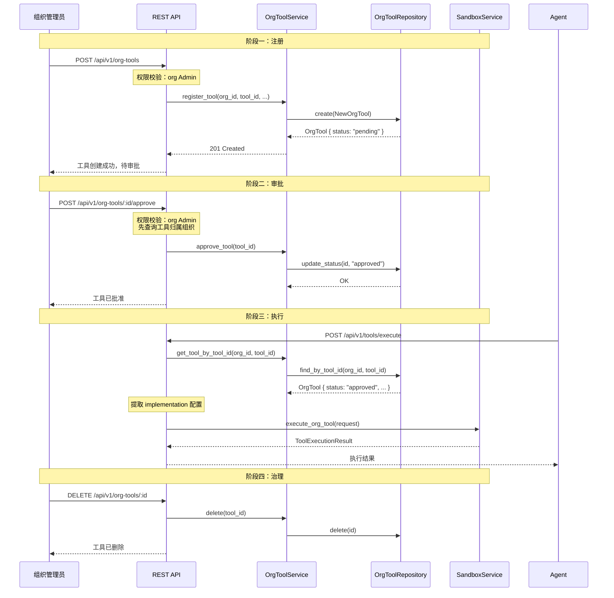

OrgTool 服务是 AionHive 多租户体系中的一项关键基础设施，它允许组织（Organization）注册、审批和管理**私有 CLI 工具**，这些工具通过 Docker 容器在沙箱中隔离执行，并通过 MCP 会话的路由机制与平台工具、Agent 本地工具统一编排。OrgTool 填补了"平台内置工具"与"Agent 自身能力"之间的空白，使组织能够将内部运维脚本、数据管道、Git 工作流等封装为标准化工具，在组织范围内安全可控地暴露给 AI Agent 使用。

Sources: [src/services/org_tool.rs](src/services/org_tool.rs#L1-L108), [src/models/org_tool.rs](src/models/org_tool.rs#L1-L58)

## 数据模型：工具注册的核心契约

OrgTool 的数据模型围绕**工具身份**与**审批状态**两个核心维度设计。每个工具在创建时即被分配一个全局唯一的 `id`（UUID），同时通过 `org_id` + `tool_id` 的组合唯一约束确保同一组织内不会出现工具 ID 冲突。

```sql
CREATE TABLE org_tools (
    id UUID PRIMARY KEY DEFAULT uuid_generate_v4(),
    tool_id VARCHAR(255) NOT NULL,
    org_id UUID NOT NULL,
    name VARCHAR(255) NOT NULL,
    description TEXT,
    schema JSONB NOT NULL,
    implementation JSONB NOT NULL,
    status VARCHAR(50) NOT NULL DEFAULT 'pending',
    created_at TIMESTAMPTZ NOT NULL DEFAULT NOW(),
    CONSTRAINT fk_org_tools_org FOREIGN KEY (org_id) REFERENCES organizations(id) ON DELETE CASCADE,
    UNIQUE(org_id, tool_id)
);
```

Sources: [src/db/migrations/006_add_org_tools.sql](src/db/migrations/006_add_org_tools.sql#L1-L20)

模型中值得特别关注的三个字段：

- **`schema`（JSONB）**：描述工具的输入参数结构，遵循 JSON Schema 规范。这是 Agent 在调用工具时理解参数约束的依据，类似于 OpenAPI 的 requestBody 定义。
- **`implementation`（JSONB）**：描述工具的执行方式，目前包含 `docker_image`（容器镜像）、`timeout_seconds`（超时控制）、`cli_path`（CLI 路径）和 `cmd`（自定义命令数组）。`implementation` 的灵活性在于它允许同一工具在不同环境下有不同的执行策略——例如开发环境使用本地 CLI 镜像，生产环境使用带有审计日志的定制镜像。
- **`status`（枚举字符串）**：三态审批流程——`pending`（待审批）、`approved`（已批准）、`rejected`（已拒绝）。只有 `approved` 状态的工具才能被实际执行。

Rust 模型层通过 `ToolStatus` 枚举精确映射这三种状态，并通过 `ToolImplementation` 结构体对 `implementation` JSON 进行类型化访问：

```rust
pub enum ToolStatus {
    Pending,
    Approved,
    Rejected,
}

pub struct ToolImplementation {
    pub tool_type: String,
    pub cli_path: String,
    pub docker_image: Option<String>,
    pub timeout_seconds: Option<u32>,
}
```

Sources: [src/models/org_tool.rs](src/models/org_tool.rs#L17-L37)

## 架构定位：三路由体系中的组织工具

理解 OrgTool 的价值，需要将其置于 AionHive 的**工具三路由体系**中审视。系统将所有工具调用分为三类，由 `ToolRouterService` 统一裁决：

```
┌─────────────────────────────────────────────────────────────┐
│                  工具调用路由决策树                          │
│                                                             │
│  工具调用请求 (tool_id)                                      │
│        │                                                     │
│        ▼                                                     │
│  是平台内置工具？                                            │
│  (browse, qa, exec, storage)                                 │
│        │                                                     │
│    ┌───┴───┐                                                 │
│    │  YES  │ → RouteTarget::Platform                         │
│    └───┬───┘   → 由 SandboxService 执行平台镜像              │
│        │                                                     │
│        ▼                                                     │
│  是组织注册工具？                                             │
│  (org_tools 表中 approved 状态)                               │
│        │                                                     │
│    ┌───┴───┐                                                 │
│    │  YES  │ → RouteTarget::OrgTool(tool_id)                  │
│    └───┬───┘   → 由 SandboxService 执行组织镜像              │
│        │                                                     │
│        ▼                                                     │
│  默认 → RouteTarget::Local                                    │
│       → Agent 自身能力实现                                    │
└─────────────────────────────────────────────────────────────┘
```

这种设计遵循了**关注点分离**原则：平台工具由系统维护，组织工具由组织管理员管理，Agent 本地工具由 Agent 自身声明。三者互不干扰，通过统一的 `ToolRouter` 在 MCP 会话层聚合。

Sources: [src/services/tool_router.rs](src/services/tool_router.rs#L1-L91), [src/models/session.rs](src/models/session.rs#L55-L75)

## 完整生命周期：从注册到执行

OrgTool 的生命周期跨越四个阶段，涉及三层架构的协作：



Sources: [src/api/handlers/org_tools.rs](src/api/handlers/org_tools.rs#L1-L149), [src/api/handlers/sandboxes.rs](src/api/handlers/sandboxes.rs#L50-L120)

### 阶段一：注册（Register）

注册是流程的起点。组织管理员（`OrgRole::Admin`）通过 REST API 提交工具定义。`RegisterOrgToolBody` 包含以下字段：

| 字段 | 类型 | 必需 | 说明 |
|------|------|------|------|
| `org_id` | UUID | 是 | 所属组织 ID |
| `tool_id` | String | 是 | 工具标识符（组织内唯一） |
| `name` | String | 是 | 工具显示名称 |
| `description` | String | 是 | 工具功能描述 |
| `schema` | JSON (可选) | 否 | 输入参数 JSON Schema，默认为 `{}` |
| `implementation` | JSON (可选) | 否 | 执行配置，默认为 `{}` |

注册时，系统自动将 `status` 设置为 `pending`，意味着工具在审批通过前不可执行。数据库层通过 `UNIQUE(org_id, tool_id)` 约束防止重复注册，违反时返回 `DbError::AlreadyExists`。

Sources: [src/api/models.rs](src/api/models.rs#L380-L395), [src/db/repositories/org_tool.rs](src/db/repositories/org_tool.rs#L48-L72)

### 阶段二：审批（Approve / Reject）

审批是安全管控的核心环节。`approve_org_tool_handler` 的设计包含一个关键的安全细节：**先查询工具归属，再校验权限**。这意味着审批者必须是对应组织的 Admin 成员，而非任意组织的管理员都可以审批他人组织的工具：

```rust
// 先获取工具，确定其所属组织
let tool = state.org_tool.get_tool(tool_id).await?
    .ok_or_else(|| ApiError::NotFound(...))?;

// 再校验当前用户是否为该组织的 Admin
require_org_member(&state, &agent_context, tool.org_id,
    Some(OrgRole::Admin)).await?;
```

拒绝流程（`reject_org_tool_handler`）的权限校验相对宽松，当前仅检查 `AgentContext` 的存在性。这种不对称设计值得注意——在实际生产部署中，建议对拒绝操作也施加与批准相同的组织 Admin 权限校验，以确保审批流程的完整性。

Sources: [src/api/handlers/org_tools.rs](src/api/handlers/org_tools.rs#L81-L126)

### 阶段三：执行（Execute）

执行是工具价值的最终体现。`execute_tool_handler` 的流程包含三层防护：

1. **状态校验**：仅 `status == "approved"` 的工具允许执行，否则返回 `403 Forbidden`
2. **配置注入**：从 `implementation` JSON 中提取 `docker_image`、`timeout_seconds`、`cmd`，允许请求参数覆盖默认值
3. **沙箱执行**：将请求委托给 `SandboxService.execute_org_tool()`，由后者在隔离的 Docker 容器中运行

执行请求被封装为 `ToolExecutionRequest`：

```rust
pub struct ToolExecutionRequest {
    pub tool_id: String,
    pub org_id: String,
    pub parameters: HashMap<String, serde_json::Value>,
    pub timeout_seconds: u64,
    pub docker_image: Option<String>,   // 可覆盖 impl 中的镜像
    pub session_id: Option<String>,
    pub cmd: Option<Vec<String>>,        // 可覆盖 impl 中的命令
}
```

Sandbox 服务内部使用**容器池化**机制：每个工具（由 `org:{org_id}/tool:{tool_id}` 标识）拥有独立的 FIFO 信号量队列，空闲容器被复用，超时或过期的容器被后台清理任务回收。这种设计避免了每次执行都创建新容器的开销，同时通过 `max_per_tool`（默认 5）和 `max_containers`（默认 50）两个参数控制资源使用上限。

Sources: [src/api/handlers/sandboxes.rs](src/api/handlers/sandboxes.rs#L50-L120), [src/services/sandbox.rs](src/services/sandbox.rs#L450-L530)

### 阶段四：治理（Delete / List）

工具的生命周期终结于删除操作。`delete_org_tool_handler` 要求调用者具有**系统管理员**权限（`require_admin`），而非仅组织管理员——这反映了该操作的高风险性：删除不可恢复，且可能影响正在进行的会话。

列表查询提供两个维度：
- `list_all()`：返回所有组织的所有工具（系统级视图）
- `list_org_tools(org_id)`：返回指定组织的工具（组织级视图）
- `list_approved_tools(org_id)`：仅返回已批准的工具（用于构建 Agent 可用的工具列表）

查询参数 `approved_only` 允许客户端按需过滤，避免拉取大量待审批数据。

Sources: [src/api/handlers/org_tools.rs](src/api/handlers/org_tools.rs#L37-L80), [src/api/handlers/org_tools.rs](src/api/handlers/org_tools.rs#L127-L149)

## 服务层与 Repository 的协作模式

OrgToolService 作为业务逻辑层，对 `OrgToolRepository` 进行了薄封装。这种设计遵循了清晰的职责分离：

```
┌─────────────────────────────────────────────────────┐
│  OrgToolService (业务编排)                           │
│  ├── register_tool()  → 验证 + 创建                 │
│  ├── approve_tool()   → 状态变更                    │
│  ├── reject_tool()    → 状态变更                    │
│  ├── list_org_tools() → 查询代理                    │
│  ├── list_all()       → 查询代理                    │
│  ├── get_tool()       → 查询代理                    │
│  ├── get_tool_by_tool_id() → 查询代理               │
│  └── delete()         → 删除代理                    │
└─────────────────────────────────────────────────────┘
         │
         ▼
┌─────────────────────────────────────────────────────┐
│  OrgToolRepository (数据访问)                        │
│  ├── create()        → INSERT INTO org_tools        │
│  ├── find_by_id()    → SELECT ... WHERE id = $1     │
│  ├── find_by_org()   → SELECT ... WHERE org_id = $1 │
│  ├── find_approved_by_org() → + status = 'approved' │
│  ├── find_all()      → 全表扫描                     │
│  ├── update_status() → UPDATE ... SET status = $1   │
│  ├── find_by_tool_id() → WHERE org_id AND tool_id   │
│  └── delete()        → DELETE FROM org_tools        │
└─────────────────────────────────────────────────────┘
```

Repository 层直接操作 SQL，使用 `sqlx::query_as` 将结果映射到 `OrgToolRow` 中间结构体，再通过 `From` trait 转换为对外暴露的 `OrgTool`。这种 `Row → Domain` 的转换模式隔离了数据库 schema 与业务模型，是典型的 Repository 模式实践。

Sources: [src/services/org_tool.rs](src/services/org_tool.rs#L1-L108), [src/db/repositories/org_tool.rs](src/db/repositories/org_tool.rs#L1-L200)

## REST API 端点总览

| 方法 | 路径 | Handler | 权限要求 | 功能 |
|------|------|---------|---------|------|
| POST | `/api/v1/org-tools` | `register_org_tool_handler` | 组织 Admin | 注册新工具 |
| GET | `/api/v1/org-tools` | `list_all_org_tools_handler` | 任意认证 | 列出所有工具 |
| GET | `/api/v1/org-tools/:id` | `list_org_tools_handler` | 任意认证 | 查询单个工具或按组织过滤 |
| POST | `/api/v1/org-tools/:id/approve` | `approve_org_tool_handler` | 组织 Admin | 批准工具 |
| POST | `/api/v1/org-tools/:id/reject` | `reject_org_tool_handler` | 任意认证 | 拒绝工具 |
| DELETE | `/api/v1/org-tools/:id` | `delete_org_tool_handler` | 系统 Admin | 删除工具 |

Sources: [src/api/routes.rs](src/api/routes.rs#L370-L380)

## 与 MCP 会话的集成

OrgTool 与 MCP 会话的集成发生在两个层面：

1. **会话声明阶段**：当 Agent 通过 MCP 协议声明能力时，`SessionService.declare_capabilities()` 构建 `ToolRouter`，将 Agent 声明的能力路由到 `Local`，将平台工具路由到 `Platform`。目前 `declare_capabilities` 尚未自动注入组织工具——这意味着组织工具的路由需要**显式通过工具执行端点**调用，而非通过 MCP 的 `tools/call` 自动发现。

2. **工具执行阶段**：`execute_tool_handler` 接收 `org_id` 和 `tool_id`，通过 `OrgToolService.get_tool_by_tool_id()` 查找工具定义，然后委托 Sandbox 执行。这个流程独立于 MCP 会话的路由器，是一种"带外"调用模式。

这种设计取舍意味着：在当前版本中，组织工具不会被 Agent 自动发现和调用，而是需要通过专门的 API 端点显式触发。未来版本可以考虑在会话声明阶段查询组织已批准的工单列表，并将其注入 `ToolRouter`，使组织工具能够像平台工具一样被 Agent 自动路由。

Sources: [src/services/session.rs](src/services/session.rs#L145-L190), [src/services/tool_router.rs](src/services/tool_router.rs#L40-L60)

## 安全边界与最佳实践

基于对代码的深入分析，OrgTool 服务在以下方面建立了安全边界：

- **工具隔离**：所有组织工具在 Docker 容器中执行，容器网络隔离、资源受限，防止恶意工具影响宿主机或其他容器
- **审批门禁**：`pending → approved/rejected` 的状态机确保只有经过审核的工具才能被执行
- **组织归属**：`org_id` 外键约束将工具绑定到特定组织，跨组织访问被数据库层和组织权限校验双重拦截
- **删除保护**：删除操作需要系统 Admin 权限，防止组织管理员误删关键工具

但以下安全考量值得关注：
- `reject_org_tool_handler` 当前缺少组织 Admin 权限校验，理论上任何认证用户都可以拒绝任意组织的工具
- 工具执行时未记录审计日志，在合规审计场景下可能存在追溯盲区
- `implementation.cmd` 允许自定义命令，若镜像内容不可信，可能存在命令注入风险——建议对 `cmd` 参数进行白名单校验

Sources: [src/api/handlers/org_tools.rs](src/api/handlers/org_tools.rs#L112-L126), [src/services/sandbox.rs](src/services/sandbox.rs#L450-L530)

## 下一步阅读

- 继续了解工具执行的底层实现：[Sandbox 服务：Docker 容器隔离执行与工具池管理](14-sandbox-fu-wu-docker-rong-qi-ge-chi-zhi-xing-yu-gong-ju-chi-guan-li)
- 理解 MCP 会话如何路由工具调用：[Session 服务：MCP 会话生命周期与工具路由](16-session-fu-wu-mcp-hui-hua-sheng-ming-zhou-qi-yu-gong-ju-lu-you)
- 探索组织在更广泛权限体系中的角色：[RBAC 权限模型：System/Tenant/Org/Group 四级角色体系](8-rbac-quan-xian-mo-xing-system-tenant-org-group-si-ji-jiao-se-ti-xi)