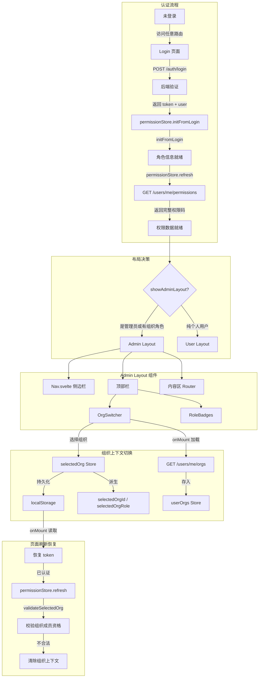

Admin 管理后台是 AionHive 系统的**运营控制平面**，承担着用户认证、权限初始化、组织上下文切换与导航路由三大核心职责。整个前端基于 Svelte + svelte-routing 构建，采用 **Store 驱动的响应式架构**，通过 `auth`、`permission`、`org` 三个核心 Store 协同管理应用状态。本文档深入剖析从登录到进入主界面的完整链路，以及组织上下文的切换机制。

## 一、认证流程：从登录到 Layout 决策

认证流程分为两个阶段：**登录阶段**（获取凭证与基础角色信息）和 **权限刷新阶段**（获取完整权限码列表）。整个流程由 `App.svelte` 的 `showLogin`、`permissionsLoading`、`showAdminLayout` 三级响应式声明驱动。

### 1.1 登录入口

用户在 `/login` 页面提交用户名与密码，调用 `api.adminLogin()` 向后端发送 `POST /api/v1/auth/login` 请求。后端返回 `UserLoginResponse` 结构，包含 JWT token 和完整的用户信息（角色、组织、租户等）。登录成功后，前端执行两个关键步骤：

**第一步**：`permissionStore.initFromLogin(user)` 初始化权限 Store。从 `user` 中提取 `system_roles`、`tenant_roles` 和 `organizations`（作为 orgRoles 的初始数据），此时 `permissions` 集合仅用 systemRoles 作为占位符，`loaded` 标记设为 `true`。同时，`validateSelectedOrg()` 校验 localStorage 中持久化的 `selected_org` 是否仍是当前用户的有效组织——如果不是，则清除旧的组织上下文，防止上一用户遗留的组织信息污染新登录用户的界面。

**第二步**：`auth.login(token, username, is_admin)` 将 token 写入 localStorage 的 `admin_token` 键，同时更新 `auth` Store 的响应式状态。此处的 `is_admin` 由后端在登录时判断：用户满足 `is_system_admin` 列标记、拥有 `super_admin` 或 `marketplace_admin` 系统角色、或担任 `tenant_admin` 租户角色，均视为管理员。

**第三步**：`permissionStore.refresh()` 立即调用 `GET /api/v1/users/me/permissions` 拉取完整的权限数据。这一步至关重要，因为登录响应仅包含角色名称，而导航菜单的权限过滤需要精确的 `permission_code`（如 `org:read`、`skill:approve_review`）。`refresh()` 返回的 `MyPermissionsResponse` 包含 `system_roles`、`tenant_roles`、`org_roles`、`group_roles` 四层角色，以及一个完整的 `permissions` 字符串数组（后端通过 `PermissionService.collect_all_permissions()` 聚合用户所有可用的权限码）。

Sources: [admin/src/routes/Login.svelte](admin/src/routes/Login.svelte#L13-L53), [admin/src/stores/auth.js](admin/src/stores/auth.js#L29-L64), [admin/src/stores/permission.js](admin/src/stores/permission.js#L16-L39), [src/api/handlers/users.rs](src/api/handlers/users.rs#L52-L109), [src/api/models.rs](src/api/models.rs#L249-L317)

### 1.2 页面刷新与 Token 持久化

当用户刷新页面时，`auth` Store 从 localStorage 恢复 `admin_token`、`username`、`identityId` 和 `is_admin` 状态。`App.svelte` 的 `onMount` 检测到 `$isAuthenticated === true` 后，调用 `permissionStore.refresh()` 重新拉取权限数据。在权限数据加载完成之前，`permissionsLoading` 为 `true`，页面显示旋转加载动画，**防止 Admin/User 布局切换的闪烁**。

401 场景的处理尤为精细。`api.js` 的 `request()` 核心函数在收到 401 响应时，会检查后端返回的错误消息是否包含 `token`、`expired`、`invalid` 或 `凭证` 等关键词。只有真正的 Token 过期才会清除 localStorage 并跳转登录页；如果是权限不足（403 语义的 401），则仅抛出错误，不清除用户的登录状态。跳转前，当前路径被保存到 `login_redirect`，以便登录后恢复回跳。

Sources: [admin/src/App.svelte](admin/src/App.svelte#L62-L81), [admin/src/lib/api.js](admin/src/lib/api.js#L90-L110), [admin/src/stores/auth.js](admin/src/stores/auth.js#L11-L27)

### 1.3 Layout 决策逻辑

`App.svelte` 通过三个响应式声明决定当前渲染的布局层：

```javascript
$: showLogin = !$isAuthenticated;                    // 未登录 → 登录页
$: permissionsLoading = $isAuthenticated && !$permissionStore.loaded;  // 加载中 → 旋转动画
$: showAdminLayout = $permissionStore.loaded && ($isAdmin || isAnyAdmin() || hasOrgRole);
```

`showAdminLayout` 的判定逻辑意味着：**只有至少拥有一个组织角色的用户，或拥有任何管理角色的用户，才会进入 Admin 布局**。纯个人用户（无组织成员身份、无任何管理角色）进入 User 布局，看到的是 `UserNav.svelte` 提供的简化导航。这种双布局设计使得同一套代码同时服务于运营管理员和普通用户，后端的同一登录接口统一处理两种角色，前端根据角色数据自适应渲染。

Sources: [admin/src/App.svelte](admin/src/App.svelte#L43-L60)

## 二、权限初始化：从角色到权限码的二级加载

权限初始化采用**二级加载策略**，这是整个前端架构中最精妙的设计之一。

### 2.1 第一级：登录响应中的角色信息

登录响应 `UserInfoResponse` 已经包含了 `system_roles`（如 `["super_admin", "marketplace_admin"]`）、`tenant_roles`（如 `[{tenant_id, tenant_name, role_name: "tenant_admin"}]`）和 `organizations`（每个组织携带 `role` 字段，如 `"owner"`、`"admin"`、`"reviewer"` 等）。这些数据足以让 `permissionStore.loaded` 立即设为 `true`，从而避免用户看到长时间的加载状态。

### 2.2 第二级：权限刷新获取完整码表

随后立即发起的 `permissionStore.refresh()` 调用 `GET /api/v1/users/me/permissions`，返回完整的 `MyPermissionsResponse`：

```json
{
  "system_roles": ["super_admin"],
  "tenant_roles": [{"tenant_id": "...", "tenant_name": "租户A", "role_name": "tenant_admin"}],
  "org_roles": [{"org_id": "...", "org_name": "组织A", "role_name": "admin"}],
  "group_roles": [{"group_id": "...", "group_name": "分组X", "role_name": "manager"}],
  "permissions": ["org:read", "org:update", "skill:create", "skill:approve_review", ...]
}
```

这里的 `permissions` 集合是**后端 PermissionService 聚合后的最终权限码列表**，包含了从系统角色、租户角色、组织角色、分组角色四个层级继承下来的所有权限。前端通过 `new Set(data.permissions)` 将其转换为 Set 结构，后续的 `hasPermission()` 查询具有 O(1) 时间复杂度的性能优势。

### 2.3 纯函数权限查询工具

`permission.js` 提供了多个导出函数，可在任意位置（不限于 Svelte 组件）调用：

- `hasPermission(code)` — 检查用户是否有指定权限码，`super_admin` 或通配符 `*` 自动拥有所有权限
- `hasSystemRole(role)` — 检查系统角色，`super_admin` 自动通过
- `hasOrgRole(orgId, ...roles)` — 检查用户在指定组织是否有某个角色
- `getTenantIdsWithRole(roleName)` — 获取用户为某角色的租户 ID 列表
- `getOrgIdsWithRole(...roleNames)` — 获取用户在某角色下的组织 ID 列表
- `isAnyAdmin()` — 判断是否为任意级别管理员（系统或租户）
- `isPureUser()` — 判断是否为纯个人用户

这些函数通过 `get(permissionStore)` 读取 Store 的当前快照，不依赖 Svelte 的响应式订阅，因此可以在 `api.js` 的回调中、事件处理器中、甚至非组件模块中安全调用。

Sources: [admin/src/stores/permission.js](admin/src/stores/permission.js#L42L116), [src/api/handlers/users.rs](src/api/handlers/users.rs#L347-L400)

## 三、布局结构：双布局 + 组件化导航

### 3.1 Admin 布局：带角色过滤的侧边栏

Admin 布局由 `Nav.svelte` 侧边栏 + 顶部栏（OrgSwitcher + RoleBadges）+ 内容区组成。侧边栏的导航条目来自 `adminNavRoutes` 配置表，每个条目声明其所需的权限码：

```javascript
{ href: '/marketplace',  label: 'Marketplace',   icon: 'marketplace',  need: null },
{ href: '/skills',       label: 'Skills',        icon: 'skills',       need: null },
{ href: '/review',       label: 'Review',        icon: 'review',       need: 'skill:approve_review' },
{ href: '/marketplace-roles', label: 'Marketplace Roles', icon: 'roles',  need: 'marketplace:role_assign' },
```

`Nav.svelte` 的 `filteredGroups` 计算属性在 `$permissionStore.loaded` 后，对每个组下的子条目调用 `canSee()` 函数进行权限过滤：

```javascript
function canSee(child, state) {
  if (!child.need) return true;                    // need: null 所有人可见
  if (child.systemRole) return state.systemRoles.includes(child.systemRole) || ...;
  return hasPermission(child.need);                // 检查权限码
}
```

在权限加载完成之前，侧边栏显示**骨架屏动画**，避免先渲染全部菜单再闪变为过滤结果的不良体验。侧边栏还支持折叠模式（`sidebarCollapsed`），将宽度从 244px 收缩至 64px，仅显示图标。

Sources: [admin/src/components/Nav.svelte](admin/src/components/Nav.svelte#L74-L88), [admin/src/config/nav-routes.js](admin/src/config/nav-routes.js#L1-L96)

### 3.2 User 布局：更简洁的用户导航

`UserNav.svelte` 提供面向普通用户的导航面板，包含 Home、Marketplace、My Skills、Submissions、Profile 和 API Keys 等入口。如果用户拥有组织角色（`$permissionStore.orgRoles.length > 0`），则额外显示 Organizations 分组。退出登录时，`auth.logout()` 清除所有 localStorage 键并跳转到 `/login`。

Sources: [admin/src/components/UserNav.svelte](admin/src/components/UserNav.svelte#L1-L113)

### 3.3 角色徽章展示

`RoleBadges.svelte` 组件位于顶部栏右侧，从 `permissionStore` 中提取用户的系统角色、租户角色和组织角色，去重后按优先级显示。角色类型使用不同的颜色区分：`super_admin` 为红色、`tenant_admin` 为蓝色、`org:owner` 为琥珀色等。该组件在 Admin 和 User 两种布局中均可见，为用户提供即时的角色身份感知。

Sources: [admin/src/components/RoleBadges.svelte](admin/src/components/RoleBadges.svelte#L1-L75)

## 四、组织上下文切换：OrgSwitcher 的设计与数据流

组织上下文切换是 Admin 布局中**最复杂的交互模式**，涉及三个 Store 的协同、localStorage 持久化、以及 API 数据的异步加载。

### 4.1 数据模型

`org.js` Store 定义了两个可写 Store 和多个派生 Store：

- `selectedOrg` — 当前选中的组织对象 `{id, name, slug, role}`，持久化到 localStorage 的 `selected_org` 键
- `userOrgs` — 用户所属组织列表，由 `OrgSwitcher` 组件在挂载时从 `GET /api/v1/users/me/orgs` 异步加载
- `selectedOrgId` / `selectedOrgSlug` / `selectedOrgRole` — 从 `selectedOrg` 派生的便捷访问器
- `isPersonalSpace` — 判断当前是否为个人空间（`selectedOrg === null` 或 `id === '__personal__'`）

### 4.2 组件行为

`OrgSwitcher.svelte` 组件在 `onMount` 时调用 `api.getUserOrgs()` 获取用户所属组织列表。如果 `selectedOrg` 尚未选择（页面首次加载），则自动选择第一个组织作为默认上下文。组件的 `showPersonal` 属性控制是否显示"Personal Space"选项，该选项由 `App.svelte` 根据当前路由判断：仅 skill 相关页面（`/skills`、`/review`）保留个人空间，组织/分组管理页面不展示个人空间选项。

选择组织时，`selectOrg()` 函数将 `selectedOrg` 设置为 `{id, name, slug, role}` 或 `null`（个人空间）。由于 `selectedOrg.subscribe()` 自动将变更持久化到 localStorage，用户刷新页面后仍能恢复上一次的组织上下文。

### 4.3 上下文安全校验

`permissionStore.initFromLogin()` 和 `initFromPermissions()` 在初始化时都会调用 `validateSelectedOrg()`。该函数检查 localStorage 中的 `selected_org` 是否在当前用户的 `orgRoles` 列表中。如果用户已经不属于该组织（例如被管理员移除），则自动清除组织上下文，避免用户看到已退出组织的管理界面。`__personal__` 标记始终有效，不受此校验影响。

Sources: [admin/src/stores/org.js](admin/src/stores/org.js#L1-L33), [admin/src/components/OrgSwitcher.svelte](admin/src/components/OrgSwitcher.svelte#L1-L133), [admin/src/stores/permission.js](admin/src/stores/permission.js#L98-L116)

### 4.4 组织上下文对路由的影响

`App.svelte` 中 `showOrgSwitcher` 的计算逻辑决定了哪些页面需要显示组织切换器：

```javascript
$: showOrgSwitcher = /^\/(skills|review|organizations|groups|org-tools)(\?|$)/.test($currentPath);
```

这意味着并非所有 Admin 页面都显示 OrgSwitcher——Dashboard、Identities、API Keys、System Settings 等系统级管理页面不依赖组织上下文，因此不显示切换器。这与**权限模型的分层设计**一致：系统级操作不绑定特定组织，而 Skill 审核、组织成员管理等操作需要明确当前操作的组织上下文。

## 五、注册流程与账号创建

注册页面 `/register` 调用 `api.userRegister()` 发送 `POST /api/v1/auth/register`。后端创建用户后自动分配默认 `skill_user` 角色，返回 JWT token。注册成功后前端跳转到 `/login` 而不是直接登录，这是有意为之的设计——用户需要主动登录来确认密码有效，同时触发完整的权限初始化流程。

Sources: [admin/src/routes/Register.svelte](admin/src/routes/Register.svelte#L1-L37), [src/api/handlers/users.rs](src/api/handlers/users.rs#L111-L180)

## 六、架构全景图



## 七、关键设计决策与最佳实践

**二级权限加载策略**：登录响应即包含角色信息，使 `permissionStore.loaded` 立即为 `true`，避免白屏等待。随后刷新获取完整权限码，确保导航菜单精准过滤。

**401 细粒度处理**：仅在 Token 真正过期时清除登录状态并跳转，权限不足的 401 错误仅抛出异常，不破坏用户当前会话。

**组织上下文的持久化与安全校验**：`selectedOrg` 持久化到 localStorage，但每次权限初始化时校验成员资格，兼顾用户体验与安全性。

**双布局架构**：通过同一套后端 API 和前端 Store，同时服务于管理员和普通用户，避免了为不同角色构建独立前端应用的成本。

**骨架屏过渡**：Nav 侧边栏在权限加载期间显示骨架屏动画，消除了菜单从全部可见到过滤后的闪烁感。

## 延伸阅读

- 前端权限的精细粒度控制，请参考 [前端权限系统：Store 驱动的角色判断与 UI 动态渲染](23-qian-duan-quan-xian-xi-tong-store-qu-dong-de-jiao-se-pan-duan-yu-ui-dong-tai-xuan-ran)
- 后端权限上下文构建的完整机制，请参考 [Permission 服务：多层级权限上下文构建与缓存](15-permission-fu-wu-duo-ceng-ji-quan-xian-shang-xia-wen-gou-jian-yu-huan-cun)
- 四层角色体系的模型定义，请参考 [RBAC 权限模型：System/Tenant/Org/Group 四级角色体系](8-rbac-quan-xian-mo-xing-system-tenant-org-group-si-ji-jiao-se-ti-xi)
- 身份与租户模型的基础概念，请参考 [身份与租户模型：Identity、Tenant、Organization 多级体系](7-shen-fen-yu-zu-hu-mo-xing-identity-tenant-organization-duo-ji-ti-xi)