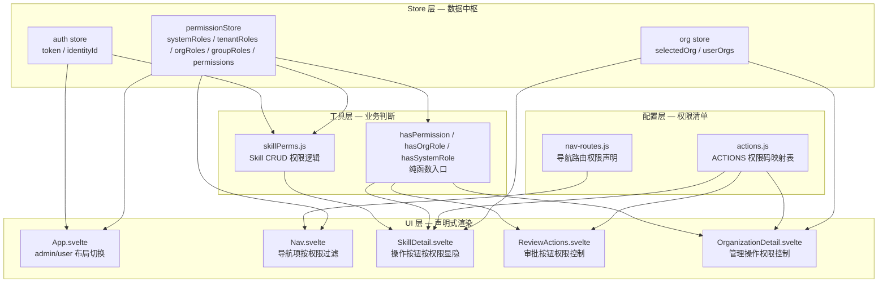
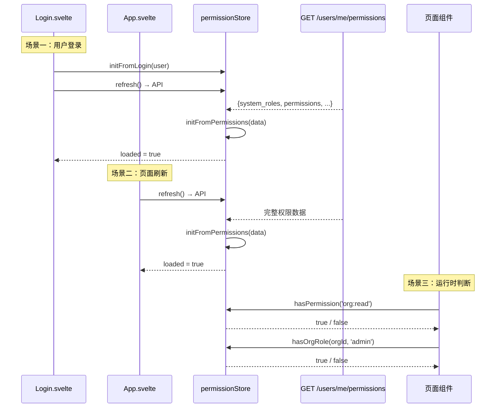

管理后台（Svelte SPA）采用 **Store 驱动的声明式权限架构**：所有权限数据集中存储在 `permissionStore` 中，页面组件通过纯函数 `hasPermission(code)` 或 `hasOrgRole(orgId, role)` 进行声明式判断，将权限校验与 UI 渲染逻辑解耦。系统遵循 **"宽松显隐 + 后端兜底"** 的安全原则——前端不做过度的按钮隐藏，后端 handler 层做最终权限判决，避免因前端权限数据不一致导致功能不可用。

Sources: [permission.js](admin/src/stores/permission.js#L1-L172), [skillPerms.js](admin/src/lib/skillPerms.js#L36-L44)

## 三层架构概览

前端权限系统由三个层次构成，职责清晰、逐层收敛：



**各层职责**：

| 层次 | 文件 | 核心职责 |
|------|------|----------|
| **Store 层** | `stores/permission.js` | 存储所有角色和权限数据，提供 `initFromLogin`/`initFromPermissions` 初始化入口，暴露纯函数查询接口 |
| **Store 层** | `stores/auth.js` | 用户认证状态（token、identityId），提供 `login`/`logout` 方法 |
| **Store 层** | `stores/org.js` | 组织上下文（已选组织、用户组织列表），持久化到 localStorage |
| **配置层** | `config/actions.js` | 以页面为单位的操作权限码映射表，组件通过 `ACTIONS.PageName.action` 引用 |
| **配置层** | `config/nav-routes.js` | 导航路由的定义与权限声明，layout 引擎自动过滤不可见 tab |
| **工具层** | `lib/skillPerms.js` | Skill 领域特有的 CRUD 权限判断，与后端 `check_skill_permission` 逻辑对齐 |
| **UI 层** | 各 `.svelte` 页面组件 | 在模板中使用 `{#if hasPermission(code)}` 或 `{#if canEditSkill(skill)}` 进行条件渲染 |

Sources: [permission.js](admin/src/stores/permission.js#L1-L172), [actions.js](admin/src/config/actions.js#L1-L135), [nav-routes.js](admin/src/config/nav-routes.js#L1-L96), [skillPerms.js](admin/src/lib/skillPerms.js#L1-L164)

## 核心 Store：permissionStore 的设计与数据流

### 数据结构

`permissionStore` 是一个 Svelte `writable` store，其状态结构如下：

```javascript
{
  systemRoles: ['super_admin'],           // 系统级角色列表
  tenantRoles: [{                         // 租户角色列表
    tenant_id: 'uuid',
    tenant_name: 'Tenant A',
    role: 'tenant_admin'
  }],
  orgRoles: [{                            // 组织角色列表
    org_id: 'uuid',
    org_name: 'Org A',
    role: 'admin'
  }],
  groupRoles: [{                          // 分组角色列表
    group_id: 'uuid',
    group_name: 'Team Alpha',
    role: 'developer'
  }],
  permissions: Set(['org:read']),        // 权限码集合（RBAC 解析后的扁平化结果）
  loaded: false                           // 是否已加载完成
}
```

Sources: [permission.js](admin/src/stores/permission.js#L4-L18)

### 三种初始化路径

权限数据在三种场景下被初始化，分别对应不同的数据源：

**1. 登录时 (`initFromLogin`)**

用户登录成功后，`Login.svelte` 立即调用 `permissionStore.initFromLogin(user)`，从登录响应中的 `user` 对象解析系统角色、租户角色和组织角色。此时 `permissions` 字段仅使用角色名作为临时判断依据（`new Set(systemRoles)`），因为完整的权限码（如 `org:read`、`group:create`）需要单独从服务端拉取。登录后立即调用 `permissionStore.refresh()` 补充完整权限码。

```javascript
// Login.svelte — 登录成功后
const res = await api.adminLogin(username, password);
const user = res.user || {};
permissionStore.initFromLogin(user);
auth.login(res.token, user.username, is_admin_user);
await permissionStore.refresh();  // 补充完整权限码
```

Sources: [permission.js](admin/src/stores/permission.js#L20-L38), [Login.svelte](admin/src/routes/Login.svelte#L21-L37)

**2. 页面刷新时 (`refresh` → `initFromPermissions`)**

`App.svelte` 的 `onMount` 中，如果用户已登录则调用 `permissionStore.refresh()`。该方法调用 `GET /users/me/permissions` 接口，获取服务端运算后的完整权限数据，包括：
- `system_roles` — 系统角色列表
- `tenant_roles` — 租户角色（含租户名称和角色名）
- `org_roles` — 组织角色（含组织名称和角色名）
- `group_roles` — 分组角色（含分组名称和角色名）
- `permissions` — 扁平化的权限码数组（如 `["org:read", "group:create", "skill:update"]`）

这些数据通过 `initFromPermissions` 一次性写入 store。

Sources: [permission.js](admin/src/stores/permission.js#L40-L67), [App.svelte](admin/src/routes/Login.svelte#L139-L148)

**3. 登出时 (`reset`)**

用户登出时，`auth.logout()` 延迟调用 `permissionStore.reset()` 清空所有权限数据，恢复为未加载状态（`loaded: false`），防止下一个登录用户看到上一个用户的权限缓存。

Sources: [permission.js](admin/src/stores/permission.js#L69-L79), [auth.js](admin/src/stores/auth.js#L43-L50)

### 数据流全景



Sources: [permission.js](admin/src/stores/permission.js#L20-L79), [App.svelte](admin/src/routes/Login.svelte#L139-L148)

## 声明式权限判断函数

`permissionStore` 暴露一组**纯函数**（不依赖 Svelte reactivity，可在任意位置调用），组件通过 `import { hasPermission } from '../stores/permission.js'` 引入并使用：

### 核心函数

| 函数 | 签名 | 用途 | 特殊规则 |
|------|------|------|----------|
| `hasPermission` | `(code: string) => boolean` | 检查用户是否有指定权限码 | `super_admin` 或拥有 `*` 通配符时始终返回 `true` |
| `hasSystemRole` | `(role: string) => boolean` | 检查用户是否有指定系统角色 | `super_admin` 匹配任意角色 |
| `hasOrgRole` | `(orgId: string, ...roles: string[]) => boolean` | 检查用户在指定组织中是否有给定角色之一 | `super_admin` 始终返回 `true` |
| `getTenantIdsWithRole` | `(roleName: string) => string[]` | 获取用户在某角色下的租户 ID 列表 | — |
| `getOrgIdsWithRole` | `(...roleNames: string[]) => string[]` | 获取用户在某角色下的组织 ID 列表 | — |
| `isAnyAdmin` | `() => boolean` | 判断用户是否为任意级别管理员 | 检查系统角色 + 租户角色 |
| `isPureUser` | `() => boolean` | 判断用户是否为纯个人用户（无任何管理角色） | `!isAnyAdmin()` |

Sources: [permission.js](admin/src/stores/permission.js#L84-L142)

### 设计要点

**通配符与 Super Admin 的短路逻辑**：`hasPermission` 中，如果 `systemRoles` 包含 `super_admin` 或 `permissions` 集合包含 `*`，则所有权限检查短路返回 `true`。这确保了超级管理员不会因为权限码缺失而被 UI 拦截。

**纯函数 + `get(store)` 模式**：这些函数通过 Svelte 的 `get()` 函数直接读取 store 的当前值，而非订阅 store 的响应式变化。这意味着它们可以在普通 JavaScript 模块（如 `skillPerms.js`）或事件回调中安全调用，不受 Svelte 组件生命周期的限制。

Sources: [permission.js](admin/src/stores/permission.js#L84-L97)

## 配置层：操作权限码与导航权限

### ACTIONS 映射表

`config/actions.js` 以页面为维度，将 UI 操作映射到后端权限码。每个页面组件只需引用 `ACTIONS.PageName.actionName`，无需硬编码权限码字符串：

```javascript
// 在组件中
import { ACTIONS } from '../config/actions.js';
const ACT = ACTIONS.OrganizationDetail;

// 模板中
{#if hasPermission(ACT.editSettings)}
  <button>Edit Settings</button>
{/if}
```

`ACTIONS` 覆盖了 13 个主要页面的操作权限，包括 Tenants、Identities、Organizations、Marketplace、Skills、Review、Groups、API Keys 等。每个页面定义 `create`、`edit`、`delete`、`view` 等通用操作，以及特定于页面的操作（如 `inviteMember`、`marketFeature`、`marketApprove`）。

Sources: [actions.js](admin/src/config/actions.js#L1-L135)

### 导航路由权限过滤

`config/nav-routes.js` 定义了两套导航体系：

- **`adminNavRoutes`** — 管理员导航（7 组，涵盖 Overview、Users、Organizations、Content、Account、System、Infrastructure）
- **`userNavRoutes`** — 用户导航（1 组，含 Dashboard、Marketplace、My Skills、Submissions、Profile、API Keys）

每个导航 tab 通过 `need` 字段声明所需权限码，`Nav.svelte` 的 `canSee()` 函数根据 `permissionStore` 的状态自动过滤不可见的 tab：

```javascript
function canSee(child, state) {
  if (!child.need) return true;                       // 无需权限，所有人可见
  if (child.systemRole) {                              // 系统角色检查
    return state.systemRoles.includes(child.systemRole)
        || state.systemRoles.includes('super_admin');
  }
  return hasPermission(child.need);                    // 权限码检查
}
```

`Nav.svelte` 在权限数据未加载时（`!$permissionStore.loaded`）渲染骨架屏（skeleton loading），避免"先全量渲染再闪变为过滤结果"的视觉抖动。加载完成后，通过 `filteredGroups` 计算属性生成最终的可见导航项列表。

Sources: [nav-routes.js](admin/src/config/nav-routes.js#L1-L96), [Nav.svelte](admin/src/components/Nav.svelte#L64-L75)

## 布局决策：Admin vs User 布局的自动切换

`App.svelte` 根据用户权限动态决定使用管理员布局还是普通用户布局，避免手动配置的麻烦：

```javascript
// App.svelte 中的布局决策逻辑
$: hasOrgRole = ($permissionStore.orgRoles || []).length > 0;
$: showAdminLayout = $permissionStore.loaded 
    && ($isAdmin || isAnyAdmin() || hasOrgRole);
```

**布局切换条件**：只要 `permissionStore.loaded` 为 `true`，且用户满足以下任意条件之一，即进入 Admin 布局：
1. `isAdmin`（`auth store` 中的 `is_admin` 标志）
2. `isAnyAdmin()`（拥有任何系统角色或租户管理角色）
3. `hasOrgRole`（至少属于一个组织）

**加载状态保护**：当用户已登录但权限数据仍在加载中（`permissionsLoading`），渲染一个全屏加载指示器，防止布局在 Admin 和 User 之间闪烁切换。

**组织上下文切换器**：`OrgSwitcher` 组件仅在特定页面显示（通过正则匹配当前路径），且区分是否展示"Personal Space"选项——组织/分组管理页面不展示个人空间，Skill 相关页面才展示。

Sources: [App.svelte](admin/src/routes/Login.svelte#L32-L53)

## Skill 领域权限：宽松策略与后端兜底

`lib/skillPerms.js` 实现了 Skill 资产特有的 CRUD 权限判断逻辑，与后端 `check_skill_permission` 函数的规则对齐。其核心设计原则是"**宽松显隐 + 后端兜底**"——前端不过度隐藏按钮，后端 handler 层做最终权限判决。

### 角色级别定义

```javascript
const ORG_ROLE_LEVEL = {
  member: 0,      // 普通成员
  developer: 1,   // 开发者（可创建/编辑/提交审核）
  reviewer: 2,    // 审核者（可审批/驳回）
  admin: 3,       // 管理员（可删除/发布/管理成员）
  owner: 4,       // 所有者（最高权限）
};
```

Sources: [skillPerms.js](admin/src/lib/skillPerms.js#L47-L54)

### 操作权限速查表

| 操作 | 个人 Skill | 组织 Skill | 特殊规则 |
|------|-----------|-----------|----------|
| **创建** | 已认证即可 | Developer+ | `canCreateOrgSkill(orgId)` 需指定组织 |
| **编辑** | owner 本人 | Developer+ | 市场 Skill 禁止普通用户编辑 |
| **删除** | owner 本人 | Admin+ | 市场 Skill 仅 `marketplace_admin` 可删除 |
| **发布** | owner 本人 | Admin+ | — |
| **提交审核** | owner 本人 | Developer+ | — |
| **审批/驳回** | owner 本人（自审批） | Reviewer+ | 不能审自己 |
| **市场操作** | marketplace_admin/reviewer | marketplace_admin/reviewer | 需系统角色 |

Sources: [skillPerms.js](admin/src/lib/skillPerms.js#L56-L132)

### 实际使用示例

在 `ReviewActions.svelte` 中，审批按钮的可见性同时检查 RBAC 权限码和 Skill 级权限，两者任一满足即可：

```javascript
// ReviewActions.svelte
$: canApprove = hasPermission(ACT.approve) || canApproveReject(skill);
$: canReject = hasPermission(ACT.reject) || canApproveReject(skill);
```

在 `SkillDetail.svelte` 中，编辑权限同样结合了多种判断维度：

```javascript
$: canEdit = !isMarketplaceView && (isSuperAdmin || isMarketAdmin || (skill && (
  // 个人 Skill：只有作者本人可编辑
  (skill.owner_type === 'user' && skill.author_identity_id === $auth.identityId) ||
  // 组织 Skill：org admin/owner/developer 可编辑
  (skill.owner_type === 'organization' && (isOrgSkillAdmin || isOrgSkillDeveloper))
)));
```

Sources: [ReviewActions.svelte](admin/src/components/ReviewActions.svelte#L20-L21), [SkillDetail.svelte](admin/src/routes/SkillDetail.svelte#L44-L56)

## 组织上下文与权限的联动

`stores/org.js` 管理用户的组织上下文，与 permissionStore 形成联动关系：

**持久化机制**：`selectedOrg` 写入 localStorage（key: `selected_org`），页面刷新后自动恢复。当用户切换组织时，`OrgSwitcher` 更新 store，所有依赖 `$selectedOrg` 的页面自动重新渲染。

**权限校验联动**：`permissionStore.initFromLogin()` 和 `initFromPermissions()` 都会调用 `validateSelectedOrg()`，检查持久化的组织上下文是否仍属于当前用户。如果用户已被移出该组织，自动清除组织上下文，防止数据残留。

**组织上下文的应用**：多个页面组件依赖 `$selectedOrg` 来过滤数据或判断权限：
- `Review.svelte` 根据 `$selectedOrg.id` 加载对应组织的待审核 Skill
- `Skills.svelte` 根据 `$isPersonalSpace` 决定是否创建个人或组织 Skill
- `OrganizationDetail.svelte` 使用 `hasOrgRole(id, ...roles)` 判断当前用户在该组织中的管理权限

Sources: [org.js](admin/src/stores/org.js#L1-L33), [permission.js](admin/src/stores/permission.js#L104-L122)

## 错误处理与安全边界

**401 智能处理**：`api.js` 中的 `request()` 函数在收到 401 响应时，会检查错误消息是否包含 token 相关关键词（`token`、`expired`、`invalid`、`凭证`）。只有真正的 token 过期才清除本地 token 并跳转登录页；其他 401 仅作为权限不足错误抛出，不破坏当前会话。这避免了一次 403 权限不足导致用户被强制登出的糟糕体验。

**错误消息中文友好化**：`humanize()` 函数将后端返回的技术错误码（如 `permission_denied`）映射为中文用户友好消息（如"权限不足，请联系管理员"），并支持根据 HTTP 状态码返回默认描述。

**API 错误结构化**：`ApiError` 类封装了 `status`、`code`、`message` 三个字段，前端组件可根据 `error.status` 或 `error.code` 做差异化展示，而非仅显示字符串消息。

Sources: [api.js](admin/src/lib/api.js#L1-L105)

## 最佳实践总结

1. **权限判断优先使用 `hasPermission(code)` 而非 `hasSystemRole(role)`**：权限码更细粒度，且与后端 RBAC 体系对齐；角色判断过于粗粒度，应留给后端处理。

2. **Skill 操作使用 `skillPerms.js` 而非直接 `hasPermission`**：`skillPerms.js` 封装了 Skill 特有的所有者判断、组织角色级别比较等逻辑，避免在每个页面组件中重复编写。

3. **导航路由权限声明在 `nav-routes.js` 中维护**：无需在每个页面组件中重复写权限判断，`Nav.svelte` 自动过滤。

4. **操作权限码在 `actions.js` 集中定义**：避免硬编码字符串，组件间共享一致，修改权限码只需改一处。

5. **遵循"宽松显隐 + 后端兜底"原则**：前端只做 UI 元素的显隐控制，真正的权限判决交给后端 handler 层，避免因前端权限数据延迟或错误导致功能不可用的连锁反应。

---

**下一步阅读**：了解了权限系统如何驱动 UI 渲染后，建议继续阅读 [核心管理页面：Skills 审核、组织管理、租户管理、审计日志](24-he-xin-guan-li-ye-mian-skills-shen-he-zu-zhi-guan-li-zu-hu-guan-li-shen-ji-ri-zhi)，查看权限系统在实际页面中的综合应用。如果想深入了解后端权限服务的构建，可参考 [Permission 服务：多层级权限上下文构建与缓存](15-permission-fu-wu-duo-ceng-ji-quan-xian-shang-xia-wen-gou-jian-yu-huan-cun)。