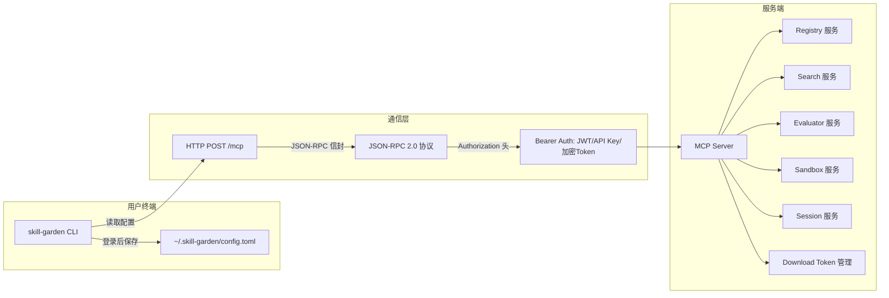
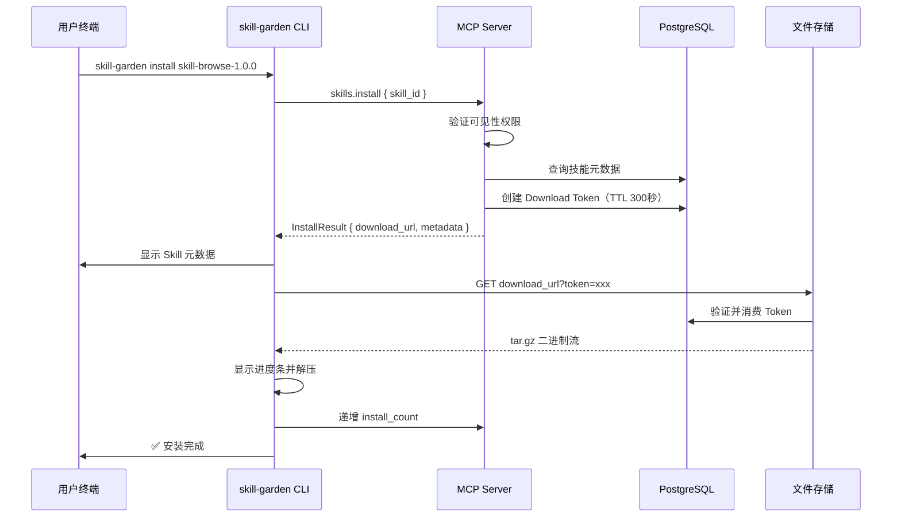
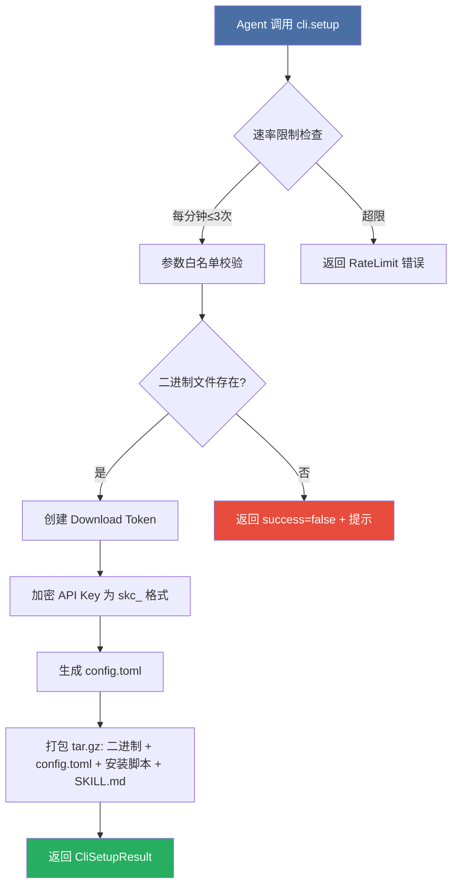

Skill Garden CLI 是一个轻量级的独立二进制工具，通过 MCP JSON-RPC 协议与服务端通信，为终端用户和 AI Agent 提供 Skills 的搜索、浏览、安装、评价等核心操作。它不依赖服务端组件（如 PostgreSQL、Tantivy、Docker），仅需一个 HTTP 端点即可完成全部交互，是连接 Skill Garden 生态的便携式网关。

Sources: [src/cli/mod.rs](src/cli/mod.rs#L1-L9), [Cargo.toml](Cargo.toml#L1-L60)

## 架构设计：轻量级 Client 模式

CLI 的架构遵循极简原则——它本质上是一个 MCP JSON-RPC 客户端，所有操作都通过 `POST /mcp` 端点委托给服务端执行。这种设计使得 CLI 的编译产物极小（仅依赖 `clap`、`reqwest`、`serde_json`、`indicatif` 等轻量库），而将搜索索引、数据库查询、文件存储等重型工作全部留给服务端。



CLI 的通信协议选择 MCP（Model Context Protocol）而非直接调用 REST API，原因有三：一是 MCP 天然支持 AI Agent 的 tool 调用模式，Agent 可以直接通过 `tools/call` 来使用 CLI 的完整功能；二是 JSON-RPC 2.0 的请求/响应模型提供了统一的错误处理机制；三是 MCP 的 tool 声明式 schema 支持自动生成客户端 SDK。

Sources: [src/cli/client.rs](src/cli/client.rs#L1-L50), [src/mcp/server.rs](src/mcp/server.rs#L1-L100)

## 认证与配置管理

CLI 的认证体系分三个层次，按优先级从高到低依次为：**命令行参数**（`-S`/`-T`）→ **配置文件**（`~/.skill-garden/config.toml`）→ **交互式输入**（仅 `login` 命令）。这种三层回退机制确保 CLI 既能在完全无头（headless）环境中通过环境变量或参数使用，也能在交互式终端中提供流畅的首次体验。

### 配置文件结构

配置文件以 TOML 格式存储在 `~/.skill-garden/config.toml`，包含三个可选字段：

| 字段 | 类型 | 说明 | 示例 |
|------|------|------|------|
| `server` | String | Skill Garden 服务端地址 | `https://hub.skill-garden.dev` |
| `token` | String | API Key（`sk_` 前缀）或加密 Token（`skc_` 前缀） | `sk_xxxxxxxxxxxx` |
| `skills_dir` | String | Skill 默认安装目录 | `/home/user/.agent/skills` |

`login` 命令会调用 `skills.list` 验证 API Key 有效性，验证通过后自动保存配置；`logout` 命令则删除配置文件。`config show` 和 `config set` 命令支持运行时查看和修改配置项，其中 `token` 字段在显示时会自动脱敏。

Sources: [src/cli/config.rs](src/cli/config.rs#L1-L68), [src/cli/commands.rs](src/cli/commands.rs#L1-L50)

## 命令体系详解

CLI 提供 11 个命令，覆盖了 Skill 的发现、获取、评估和配置管理全流程。所有命令都通过 `ApiClient` 结构体中的 `call_tool` 方法发起 MCP 请求，该方法将命令参数封装为 JSON-RPC 2.0 的 `tools/call` 请求，通过 `Authorization: Bearer <token>` 头部传递认证信息。

### 认证与身份管理

| 命令 | 功能 | 是否需要认证 | 对应 MCP Tool |
|------|------|:----------:|:------------:|
| `login <server> [--token]` | 验证 API Key 并保存配置 | 是 | `skills.list` |
| `logout` | 删除本地配置文件 | 否 | 无 |
| `whoami` | 查看当前登录身份 | 是 | `session.info` |

`login` 命令在首次使用时支持交互式输入 API Key（不提供 `--token` 参数时自动进入交互模式），这使得在无 GUI 的服务器环境中也能便捷完成初始化。`whoami` 命令优先尝试 `session.info` 获取完整会话信息，如果失败则会降级为通过 `skills.list` 验证 API Key 有效性。

Sources: [src/bin/cli.rs](src/bin/cli.rs#L1-L213), [src/cli/commands.rs](src/cli/commands.rs#L50-L100)

### 技能发现

| 命令 | 功能 | 参数 | 对应 MCP Tool |
|------|------|------|:------------:|
| `search <query>` | 全文搜索技能 | `--limit`（默认 20） | `skills.search` |
| `list` | 分页列出技能 | `--page`（默认 1）, `--page-size`（默认 20） | `skills.list` |
| `info <skill-id>` | 查看技能详情 | skill_id 必填 | `skills.info` |
| `versions <name>` | 查看版本历史 | name 必填 | `skills.versions` |
| `popular` | 热门技能排行 | `--limit`（默认 20） | `skills.popular` |

`search` 命令使用服务端的 Tantivy 全文索引引擎，支持按关键词和标签过滤。返回结果包含 `skill_id`、`version`、`score`（相关性分数）和 `description`。`info` 命令返回完整的 Skill 详情，包括元数据、依赖关系、工具列表和 SKILL.md 内容预览（前 500 字符）。`list` 和 `popular` 命令均按安装次数排序，并显示技能的市场状态（`status` 字段）。

### 可见性过滤规则

CLI 检索到的技能列表经过了服务端 MCP Server 的可见性过滤，过滤规则严格遵循 API Key 的 scope：

- **未认证用户**：仅能查看 `published` 状态且 `visibility = Marketplace` 的公开技能
- **个人 API Key**（无组织绑定）：可查看个人拥有的所有技能（任何状态）+ 市场已发布的技能
- **组织 API Key**（绑定组织）：可查看该组织拥有的所有技能 + 市场已发布的技能，**不能**查看组织成员的个人技能

这种设计确保了组织数据隔离——即使在同一个组织内，成员的个人技能也不会被组织 API Key 暴露。

Sources: [src/mcp/server.rs](src/mcp/server.rs#L460-L560), [src/mcp/server.rs](src/mcp/server.rs#L1400-L1500)

### 技能安装：Token 驱动的安全下载

`install <skill-id>` 命令是 CLI 最复杂的操作，其流程分为三个阶段：



安装流程的关键设计点是 **Download Token 机制**：服务端在响应 `skills.install` 时先生成一个有效期 300 秒的一次性 Token，将其签名到下载 URL 中。实际的 tar.gz 下载由 CLI 的 `download_tarball` 方法直接发起 HTTP GET 请求，此时服务端 `download_token_repo.validate_and_consume()` 方法验证 Token 有效性并立即消费（标记为已使用），防止重放攻击。

安装的目标目录遵循优先级规则：`--dir` 参数 > `config.skills_dir` > `./skills/<skill-name>/`。CLI 使用 `indicatif` 库提供实时进度条反馈，显示下载速度和完成百分比。

Sources: [src/cli/client.rs](src/cli/client.rs#L200-L394), [src/cli/commands.rs](src/cli/commands.rs#L100-L200), [src/models/skill.rs](src/models/skill.rs#L200-L280)

## 自助分发：cli.setup 协议

一个独特的设计是 CLI 的**自助分发能力**——通过 MCP 的 `cli.setup` 工具，AI Agent 或用户可以直接从服务端获取 CLI 二进制本身。这意味着 CLI 的安装不依赖包管理器或外部下载站，整个 Skill Garden 生态可以完全自举。

`cli.setup` 的工作流程如下：

1. Agent 调用 `cli.setup` 并传入 `platform` 和 `arch` 参数（支持大量别名兼容，如 `darwin`→`macos`、`amd64`→`x86_64`、`arm64`→`aarch64`）
2. 服务端进行速率限制检查（每个 identity 每分钟最多 3 次）
3. 服务端查找 `cli-dist/{version}/{os}-{arch}/` 目录下的预编译二进制
4. 生成一次性下载 Token（300 秒有效期），并将**加密后的 API Key**（AES-256-GCM，`skc_` 前缀）写入 `config.toml`
5. 返回 `CliSetupResult`，包含下载 URL、安装指引和预填配置的 tar.gz 包



`config.toml` 中的 API Key 使用 AES-256-GCM 加密，密钥从环境变量 `AION_HIVE_CLI_ENCRYPTION_KEY` 读取（32 字节 hex）。加密后的 Token 以 `skc_` 前缀标识，服务端在 `handle_jsonrpc` 中自动检测并解密。这种设计确保即使 tar.gz 包在传输过程中被截获，API Key 也不会明文泄露。

CLI 的跨平台构建通过 `deploy/build-cli.ps1` 脚本完成，支持 6 个目标平台：`windows-x86_64`、`windows-aarch64`、`linux-x86_64`、`linux-aarch64`、`macos-x86_64`、`macos-aarch64`。构建时使用 `--no-default-features --features cli` 标志，排除所有服务端依赖，确保二进制体积最小化。

Sources: [src/mcp/server.rs](src/mcp/server.rs#L1220-L1450), [src/utils/cli_token.rs](src/utils/cli_token.rs#L1-L144), [deploy/build-cli.ps1](deploy/build-cli.ps1#L1-L165)

## 技能评价与统计

CLI 通过 `stats <skill-id>` 命令和对应的 MCP `skills.stats` 工具，提供了对技能执行质量的量化评估能力。统计信息由服务端的 `EvaluatorService` 聚合管理，包含以下维度：

| 指标 | 类型 | 说明 |
|------|------|------|
| `total_evaluations` | u64 | 总执行次数 |
| `success_count` | u64 | 成功次数 |
| `failure_count` | u64 | 失败次数 |
| `success_rate` | f64 | 成功率（0.0 ~ 1.0） |
| `avg_duration_ms` | f64 | 平均执行耗时（毫秒） |
| `confidence` | String | 置信度等级（基于贝叶斯加权） |
| `tags` | Vec\<String\> | 评价标签（reliable, fast, stable, experimental） |

评价数据通过 `evaluate_skill` MCP 工具提交，AI Agent 在执行完一个 Skill 后，可以调用该工具上报执行结果（成功/失败、耗时、错误类型、标签）。服务端的 `EvaluatorService` 对这些数据进行聚合统计，并计算置信度分数。

统计信息中的 `confidence` 字段反映了评价的**可信度**——它基于贝叶斯加权算法，考量了评价数量、评分一致性、评价者信誉等多维因素，避免了少量评价导致的统计偏差。这为 Agent 选择可靠 Skill 提供了量化依据。

Sources: [src/cli/client.rs](src/cli/client.rs#L150-L200), [src/mcp/server.rs](src/mcp/server.rs#L900-L960)

## 构建与分发

CLI 的构建流程独立于服务端，通过 feature flags 实现条件编译：

```bash
# 构建 CLI 二进制（仅包含轻量依赖）
cargo build --release --no-default-features --features cli

# 跨平台构建（通过 build-cli.ps1 自动化）
.\deploy\build-cli.ps1 -Targets "windows-x86_64,linux-x86_64,macos-x86_64"
```

构建产物输出到 `cli-dist/{version}/{os}-{arch}/` 目录，每个平台目录包含：
- `skill-garden`（或 `skill-garden.exe`）— 静态链接的可执行文件
- 安装脚本（`install.sh` / `install.ps1`）— 自动复制到系统 PATH

CLI 的 `Cargo.toml` 通过 `[features]` 严格分离依赖：`server` 特性引入 `axum`、`sqlx`、`tantivy`、`bollard` 等重型依赖；`cli` 特性仅引入 `clap`、`dirs`、`toml`、`indicatif` 等客户端库。这种设计使得 CLI 的编译时间从数分钟缩短到 30 秒以内，二进制体积控制在 10MB 左右。

Sources: [Cargo.toml](Cargo.toml#L1-L60), [deploy/build-cli.ps1](deploy/build-cli.ps1#L1-L165)

## 最佳实践与使用场景

### 场景一：Agent 自助安装 CLI

AI Agent 可以通过 MCP 协议直接调用 `cli.setup` 获取 CLI 二进制，无需人工干预：

```
Agent → MCP: tools/call cli.setup { platform: "linux", arch: "x86_64" }
Server → Agent: CliSetupResult { download_url, instructions, ... }
Agent → 下载 tar.gz → 解压 → 运行 install.sh → 验证 whoami
```

### 场景二：批量 Skills 部署

在 CI/CD 流水线中，可以使用 CLI 的 `login` + `search` + `install` 组合实现自动化部署：

```
skill-garden login https://hub.internal.io --token $API_KEY
skill-garden search "data-processing" --limit 50 | while read id; do
    skill-garden install "$id" --dir /opt/agents/skills
done
```

### 场景三：运行时质量监控

AI Agent 在每次执行 Skill 后，应调用 `evaluate_skill` 上报结果，以便服务端持续积累统计信息：

```
Agent → MCP: tools/call evaluate_skill {
    skill_id: "skill-browse-1.0.0",
    agent_id: "agent-42",
    success: true,
    duration_ms: 1250,
    tags: ["fast", "reliable"]
}
```

Sources: [src/mcp/server.rs](src/mcp/server.rs#L1600-L1800), [src/cli/commands.rs](src/cli/commands.rs#L200-L347)

## 下一步阅读

CLI 的完整功能建立在服务端多个核心服务之上，建议按以下顺序深入了解：

- [技能资产模型：生命周期、版本、可见性与市场状态](6-skill-zi-chan-mo-xing-sheng-ming-zhou-qi-ban-ben-ke-jian-xing-yu-shi-chang-zhuang-tai) — 理解 CLI 搜索和安装的 Skill 数据结构
- [API 路由设计与认证机制（JWT + API Key）](10-api-lu-you-she-ji-yu-ren-zheng-ji-zhi-jwt-api-key) — 了解 CLI 背后的认证体系
- [Registry 服务：Skills 注册、搜索索引与文件存储](13-registry-fu-wu-skills-zhu-ce-sou-suo-suo-yin-yu-wen-jian-cun-chu) — CLI install 命令背后的存储和索引机制
- [Evaluator 服务：评价收集、统计聚合与 Webhook 转发](18-evaluator-fu-wu-ping-jie-shou-ji-tong-ji-ju-he-yu-webhook-zhuan-fa) — 深入了解 stats 命令背后的统计引擎
- [部署脚本与构建流程](26-bu-shu-jiao-ben-yu-gou-jian-liu-cheng) — 了解 CLI 跨平台构建的完整 CI/CD 流程