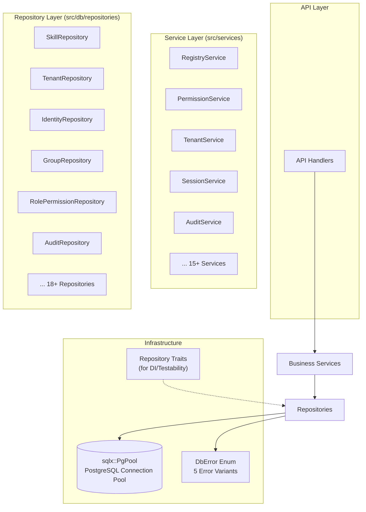
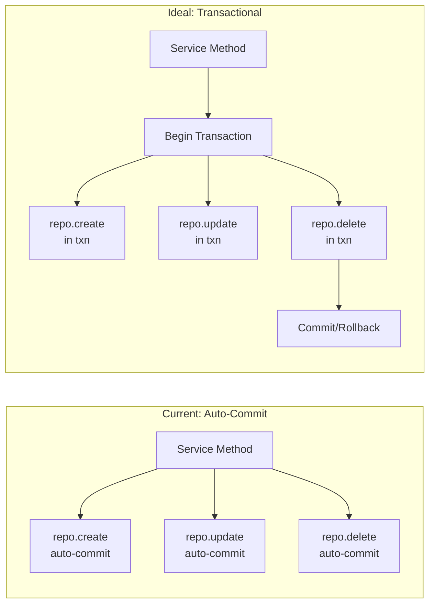

Repository 模式是 SkillGarden 后端（AionHive）的数据库访问层核心架构模式。该层位于 `src/db` 模块下，以 **24 个具体 Repository** 覆盖了从 Skills、Tenants、Identities 到 RBAC 权限体系的全部数据实体。本文深入剖析其设计原则、实现模式、服务层集成方式，以及当前事务管理策略的权衡。

---

## 架构总览：三层数据访问模型

Repository 层在整体架构中处于中间位置，上承业务服务（Services），下接 SQLx 连接池，形成清晰的职责分层：



Sources: [src/db/mod.rs](src/db/mod.rs#L1-L11), [src/db/repositories/mod.rs](src/db/repositories/mod.rs#L1-L53)

**核心设计要点**：Repository 不包含业务逻辑，仅负责数据映射和基本的 CRUD 操作。业务规则（如权限校验、状态机转换、数据验证）由 Service 层封装。这种分离使 Repository 保持轻量、可测试，且可被多个 Service 复用。

---

## Repository 统一结构模式

### 1. 标准构造器模式

所有 24 个 Repository 遵循完全一致的构造模式——接收 `sqlx::PgPool` 的引用，通过 `new` 方法构造自身实例：

```rust
#[derive(Clone)]
pub struct GroupRepository {
    pool: PgPool,
}

impl GroupRepository {
    pub fn new(pool: PgPool) -> Self {
        Self { pool }
    }
}
```

Sources: [src/db/repositories/group.rs](src/db/repositories/group.rs#L10-L18)

这种模式带来两个关键特性：**Clone 派生** 使得 Repository 可在多个服务间安全共享（`PgPool` 内部是 `Arc` 封装）；**单一 Pool 依赖** 确保所有 Repository 复用同一个连接池，无需单独的事务管理器。

### 2. 双层数据映射策略

每个 Repository 维护两套数据结构，分别服务于数据库读写和外部接口：

| 层级 | 命名约定 | 注解 | 用途 |
|------|----------|------|------|
| 内部 Row | `*Row`（如 `TenantRow`） | `#[derive(sqlx::FromRow)]` | 直接映射 SQL 查询结果，字段名与列名严格对应 |
| 公开 Domain | `Skill`, `Tenant`, `Identity` 等 | 手写 `From<*Row>` 实现 | 对外暴露的数据结构，可包含计算字段或类型转换 |

以 TenantRepository 为例：

```rust
#[derive(sqlx::FromRow)]
struct TenantRow {
    id: Uuid,
    name: String,
    slug: String,
    status: String,
    // ...
}

impl From<TenantRow> for Tenant {
    fn from(row: TenantRow) -> Self {
        Self {
            id: row.id,
            name: row.name,
            status: TenantStatus::from(row.status.as_str()),
            // 字符串 → 枚举转换
        }
    }
}
```

Sources: [src/db/repositories/tenant.rs](src/db/repositories/tenant.rs#L155-L190)

这种双层映射的策略意义在于：**数据库模型与领域模型解耦**。当数据库 schema 变更时，只需调整 `*Row` 和 `From` 实现，领域模型（定义在 `src/models/`）无需修改。反之，当领域模型增加计算字段时，不必改动数据库查询。

### 3. 统一错误处理

所有 Repository 方法返回 `DbResult<T>`，即 `Result<T, DbError>`。`DbError` 枚举定义了五种语义明确的错误类型：

```rust
pub enum DbError {
    ConnectionError(String),   // 连接失败
    QueryError(String),        // 查询执行错误
    NotFound(String),          // 资源不存在（rows_affected == 0）
    AlreadyExists(String),     // 唯一约束冲突
    ValidationError(String),   // 输入参数校验失败
}
```

Sources: [src/db/error.rs](src/db/error.rs#L1-L24)

错误映射策略的典型模式——在 `fetch_one` 和 `execute` 后通过 `map_err` 将 sqlx 错误转换为领域错误：

```rust
// 在 SkillRepository::create 中：
.fetch_one(&self.pool)
.await
.map_err(|e| {
    if e.to_string().contains("duplicate key") {
        DbError::AlreadyExists(format!("Skill {} already exists", id))
    } else {
        DbError::QueryError(e.to_string())
    }
})?;

// 在 SystemRoleAssignmentRepository::revoke 中：
if result.rows_affected() == 0 {
    return Err(DbError::NotFound(format!("role assignment {} for identity {}", ...)));
}
```

Sources: [src/db/repositories/skill.rs](src/db/repositories/skill.rs#L153-L159), [src/db/repositories/system_role_assignment.rs](src/db/repositories/system_role_assignment.rs#L78-L82)

Service 层通过 `From<DbError> for AppError` 实现自动转换，将数据层错误映射为 API 层可理解的错误响应。

---

## CRUD 操作模式详解

### 创建（Create）模式

创建操作遵循 `INSERT ... RETURNING *` 模式，利用 PostgreSQL 的 `RETURNING` 子句一次性获取完整数据行：

```rust
pub async fn create(&self, new_tenant: NewTenant) -> DbResult<Tenant> {
    let tenant = sqlx::query_as::<_, TenantRow>(
        r#"
        INSERT INTO tenants (name, slug, billing_plan, sso_config, settings)
        VALUES ($1, $2, $3, $4, $5)
        RETURNING id, name, slug, status, billing_plan, sso_config, settings, created_by, created_at, updated_at
        "#,
    )
    .bind(&new_tenant.name)
    // ...
    .fetch_one(&self.pool)
    .await
    .map_err(|e| { /* ... */ })?;

    Ok(tenant.into())
}
```

Sources: [src/db/repositories/tenant.rs](src/db/repositories/tenant.rs#L22-L50)

**关键优化**：一些 Repository 在创建时使用 `ON CONFLICT DO NOTHING` 实现幂等写入（如 `group_skill::associate_skill`、`system_role_assignment::assign`），避免重复插入错误。

### 查询（Read）模式

查询操作分为两类：

**单一查询**（`find_by_*`）使用 `fetch_optional`，返回 `Option<T>`：

```rust
pub async fn find_by_id(&self, id: Uuid) -> DbResult<Option<Tenant>> {
    let tenant = sqlx::query_as::<_, TenantRow>(
        "SELECT ... FROM tenants WHERE id = $1"
    )
    .bind(id)
    .fetch_optional(&self.pool)
    .await
    .map_err(|e| DbError::QueryError(e.to_string()))?;

    Ok(tenant.map(|t| t.into()))
}
```

**批量查询**（`list_*`）使用 `fetch_all`，返回 `Vec<T>`。部分查询支持动态条件，如 `session::list_all` 根据 `status` 参数选择不同的 WHERE 子句：

```rust
pub async fn list_all(&self, limit: i64, offset: i64, status: Option<&str>) -> DbResult<Vec<Session>> {
    let sessions = match status {
        Some("active") => { /* 条件 A */ }
        Some("ended")  => { /* 条件 B */ }
        _              => { /* 全量查询 */ }
    }
    // ...
}
```

Sources: [src/db/repositories/session.rs](src/db/repositories/session.rs#L89-L143)

**N+1 查询优化**：`TenantRepository::find_names_by_ids` 使用 `WHERE id = ANY($1)` 批量查询，解决「循环查询每个租户名称」的 N+1 性能问题。`RolePermissionRepository::list_by_roles_batch` 使用 `UNNEST` 实现多组 `(role_level, role_name)` 权限的批量查询。

### 更新（Update）模式

更新操作有两种风格：

**全字段覆盖**：先读取当前值，再合并更新字段（如 `TenantRepository::update`、`IdentityRepository::update`）：

```rust
pub async fn update(&self, id: Uuid, update: TenantUpdate) -> DbResult<Tenant> {
    let current = self.find_by_id(id).await?
        .ok_or_else(|| DbError::NotFound("Tenant not found".to_string()))?;

    let name = update.name.unwrap_or(current.name);
    let slug = update.slug.unwrap_or(current.slug);
    // 合并所有字段...

    // 执行 UPDATE ... RETURNING
}
```

Sources: [src/db/repositories/tenant.rs](src/db/repositories/tenant.rs#L110-L143)

**按需更新**：仅更新非空字段（如 `SkillRepository::update`）。每个字段独立执行 UPDATE 语句，避免不必要的写操作：

```rust
pub async fn update(&self, skill_id: &str, description: Option<&str>, ...) -> DbResult<()> {
    if let Some(desc) = description {
        sqlx::query("UPDATE skills SET description = $1, updated_at = NOW() WHERE id = $2")
            .bind(desc).bind(skill_id).execute(&self.pool).await?;
    }
    // content, visibility, tags 同理...
}
```

Sources: [src/db/repositories/skill.rs](src/db/repositories/skill.rs#L426-L485)

### 删除（Delete）模式

删除操作直接使用 `DELETE` 语句，部分 Repository 提供软删除（通过 `status` 标记为 `'revoked'` 或 `'archived'`）而非物理删除。

---

## 事务管理策略：当前实现与权衡

当前代码库的一个关键架构决策是：**Repository 层不管理事务**。所有 Repository 方法直接操作 `PgPool`，每条 SQL 语句在各自的数据库连接上自动提交。



**这一设计的取舍**：

| 方面 | 当前状态（无事务） | 理想状态（有事务） |
|------|-------------------|-------------------|
| 一致性 | 无原子性保证——`create` 中插入主表成功但插入标签表失败时，数据部分写入 | 整个操作原子化，部分失败即回滚全部 |
| 复杂度 | 低——所有方法直接操作 pool，无需传递事务上下文 | 高——需要 `sqlx::Transaction` 参数穿透所有层 |
| 性能 | 单条语句级锁定，并发度高 | 长事务增加锁竞争和死锁概率 |
| 实现成本 | 零 | 需重构所有 Repository 方法签名 |

**实际影响**：`SkillRepository::create` 是一个典型例子——它顺序执行三步操作（插入 skills 主记录、插入 skill_tags、插入 skill_dependencies），如果第二步或第三步失败，第一步已写入的数据不会被回滚。在生产环境中，这可能导致孤立的技能记录或标签数据不一致。

**迁移路径**：如果要引入事务支持，最可行的方案是采用「可选事务上下文」模式——为 Repository 额外提供接受 `&mut Transaction` 的方法，同时保留现有的 `PgPool` 方法供非事务场景使用。`AgentRepository::pool()` 方法（返回 `&PgPool`）已为此埋下伏笔，允许 Service 层直接获取连接池来手动管理事务。

---

## 依赖注入与可测试性架构

`src/db/traits.rs` 定义了三个 Repository Trait（`SkillRepositoryTrait`、`EvaluationRepositoryTrait`、`AuditRepositoryTrait`），为依赖注入和单元测试提供抽象接口：

```rust
#[allow(async_fn_in_trait)]
pub trait SkillRepositoryTrait: Send + Sync {
    async fn create(&self, new_skill: NewSkill) -> DbResult<Skill>;
    async fn find_by_id(&self, skill_id: &str) -> DbResult<Option<Skill>>;
    // ...
}

// 为 Box<T> 提供 blanket 实现，允许 trait object 使用
impl<T: SkillRepositoryTrait + ?Sized> SkillRepositoryTrait for Box<T> {
    async fn create(&self, new_skill: NewSkill) -> DbResult<Skill> {
        (**self).create(new_skill).await
    }
    // ...
}
```

Sources: [src/db/traits.rs](src/db/traits.rs#L1-L88)

**设计意图**：Trait 允许在测试中注入 `MockSkillRepository` 替代真实数据库。然而，目前仅有三个核心 Repository 定义了 Trait，其余 21 个 Repository 直接被 Service 通过具体类型引用。这意味着：

- `RegistryService` 直接依赖 `SkillRepository`（具体类型），但通过 `#[cfg(test)]` 模块可以模拟
- `PermissionService` 直接依赖 7 个具体 Repository，缺乏抽象层
- 要全面实现可测试性，需要为每个 Repository 创建对应的 Trait

**分层架构关系**：`AppRouterState`（[src/api/http_state.rs](src/api/http_state.rs#L70-L103)）同时持有 Repository 和 Service 的实例。Service 封装 Repository 并添加业务逻辑，Handler 调用 Service 而不是直接操作 Repository。Repository 仅在极少数场景下被 Handler 直接访问（如 `agent_repo`、`audit_repo` 用于审计日志记录）。

---

## 关键模式：兼容性适配器

`AuditRepositoryCompat` 是一个值得关注的架构模式——它通过 **Adapter 模式** 实现数据库迁移的平滑过渡：

```rust
pub struct AuditRepositoryCompat {
    new_repo: AuditLogRepository,
}

impl AuditRepositoryCompat {
    pub fn new(new_repo: AuditLogRepository) -> Self {
        Self { new_repo }
    }

    // 接受旧接口的 NewAuditLog，写入新表 audit_log_entries
    pub async fn create(&self, new_log: NewAuditLog) -> DbResult<AuditLog> {
        let request = CreateAuditLogRequest {
            // 字段映射逻辑...
        };
        self.new_repo.create(request).await
    }
}
```

Sources: [src/db/repositories/audit_compat.rs](src/db/repositories/audit_compat.rs#L1-L60)

**设计考量**：在将审计日志从旧表迁移到新表时，直接修改 28+ 个调用点成本过高。通过 Adapter 保持旧接口不变，新代码逐步迁移到 `AuditService::write_entry()` 接口，最终移除 Adapter——这是典型的「Strangler Fig 模式」在数据访问层的应用。

---

## 总结与最佳实践

**Repository 模式的核心优势**在本项目中体现为：

1. **关注点分离**——数据访问逻辑与业务逻辑解耦，Repository 专注于 SQL 执行和类型映射
2. **一致性**——24 个 Repository 遵循统一的结构模式，降低认知负荷
3. **可组合性**——Service 可以组合多个 Repository 完成复杂业务流程
4. **可替换性**——Trait 抽象层为测试和未来切换 ORM 提供基础

**当前架构的改进空间**：

- **事务支持**：对于涉及多表写入的操作（如创建 Skill 同时写入主表、标签表和依赖表），应引入事务机制确保原子性
- **Trait 覆盖**：为所有 Repository 定义 Trait 接口，全面启用依赖注入
- **批量操作优化**：部分 Repository 的列表查询存在逐个查询关联表的 N+1 问题，可进一步优化为 JOIN 或子查询

---

## 导航

- 继续深入了解数据库层：阅读 [数据库迁移体系：从 001 到 040 的演进路线](28-shu-ju-ku-qian-yi-ti-xi-cong-001-dao-040-de-yan-jin-lu-xian)，了解 40 个迁移文件如何构建完整的数据库 schema
- 回溯上层架构：阅读 [整体架构：Rust 后端 + Svelte 管理后台 + CLI 工具链](5-zheng-ti-jia-gou-rust-hou-duan-svelte-guan-li-hou-tai-cli-gong-ju-lian)，理解 Repository 层在整体架构中的位置