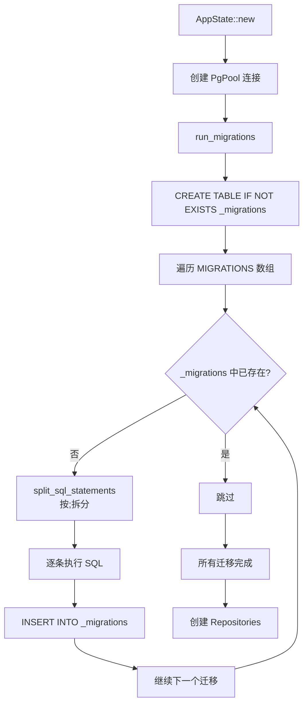
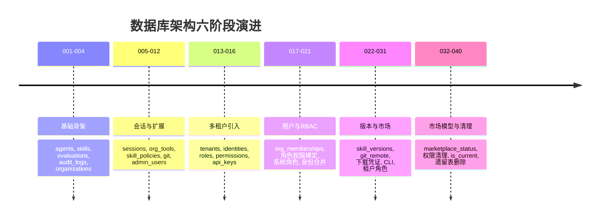

本页深入剖析 AionHive 的数据库迁移体系——一个**纯手工打造的 SQL 迁移框架**，以及从 `001_initial_schema` 到 `040_remove_market_admin_tenant_read` 共 40 个迁移文件所呈现的数据库架构演进史。你将理解：迁移引擎如何工作，40 个迁移如何划分为六个清晰的演进阶段，以及每个阶段解决了哪些核心架构问题。

## 迁移引擎：编译期嵌入 + 运行时追踪

AionHive 没有采用 `sqlx::migrate!` 宏或任何第三方迁移库，而是实现了一套**极简但可靠的嵌入式迁移引擎**。其核心设计围绕三个关键决策展开。

**编译期静态嵌入**。所有 40 个 `.sql` 文件通过 `include_str!` 宏在编译时嵌入到二进制中，构成一个静态的 `MIGRATIONS` 常量数组。每个元素是一个 `(&str, &str)` 元组——迁移名称和完整的 SQL 文本。这意味着迁移文件与二进制一一对应，不存在运行时文件查找失败的风险，也无需在部署时额外传输 SQL 文件。Sources: [migrations.rs](src/db/migrations.rs#L8-L169)

**基于 `_migrations` 表的幂等执行**。在 `run_migrations()` 函数中，引擎首先确保 `_migrations` 表存在（`CREATE TABLE IF NOT EXISTS`），然后遍历 `MIGRATIONS` 数组，对每个迁移检查 `SELECT EXISTS(SELECT 1 FROM _migrations WHERE name = $1)`。只有尚未记录的迁移才会被执行，执行完毕后立即写入 `_migrations` 表。这种设计天然支持**增量部署**：新版本只需添加新的迁移文件，旧版本已执行的迁移不会重复运行。Sources: [migrations.rs](src/db/migrations.rs#L178-L226)

**朴素的分号拆分策略**。SQL 语句按 `;` 分割后逐条执行，而非将整个迁移文件作为单一事务提交。这意味着如果某个迁移包含多条 DDL 语句，中间某条失败时，之前的语句已经生效——这是有意为之的权衡，因为 PostgreSQL 不支持在事务中回滚 DDL（如 `ALTER TABLE` 的某些变体）。这种设计选择需要在编写迁移时特别注意语句的幂等性（大量使用 `IF NOT EXISTS` 和 `IF EXISTS`）。Sources: [migrations.rs](src/db/migrations.rs#L171-L176)

**启动时自动执行**。迁移在 `AppState::new()` 中作为初始化流程的第一个数据库操作调用，位于所有 Repository 创建之前。这意味着在服务启动任何业务逻辑之前，数据库结构已经处于最新状态。Sources: [lib.rs](src/lib.rs#L137-L146)

## 六阶段演进路线图

40 个迁移文件并非随意堆砌，而是清晰地对应着项目从单用户原型到企业级多租户平台的架构跃迁。每个阶段都有明确的主题和核心关注点。

### 第一阶段（001-004）：基础骨架

最初的四个迁移构建了系统的**核心数据基座**。`001_initial_schema` 创建了 `agents`（JWT 认证主体）、`skills`（资产核心表含唯一键 `UNIQUE(name, version)`）、`skill_tags`（多对多标签）、`skill_dependencies`（多对多依赖）、`evaluations`（评价记录）和 `audit_logs`（审计日志）。Sources: [001_initial_schema.sql](src/db/migrations/001_initial_schema.sql#L1-L80)

`002_add_skill_status` 立即为 `skills` 表增加了 `status` 字段，值为 `draft`、`pending_review`、`published`、`rejected`——这是技能生命周期的雏形。`003_seed_admin_agent` 是一个数据种子迁移，将 `admin-1` 代理的 `roles` 设置为 `['admin']`。`004_add_organizations` 引入了 `organizations` 表，此时仅有 `id`、`name`、`settings`、`created_at` 四个字段，为后续多租户埋下伏笔。Sources: [002_add_skill_status.sql](src/db/migrations/002_add_skill_status.sql#L1-L8), [004_add_organizations.sql](src/db/migrations/004_add_organizations.sql#L1-L12)

### 第二阶段（005-012）：会话与功能扩展

这一阶段的核心是引入**MCP 会话机制**和**组织级工具注册**。`005_add_sessions` 创建了 `sessions` 表，用于追踪 MCP 协议会话的生命周期。`006_add_org_tools` 引入了 `org_tools` 表，允许组织注册自定义工具。`007_add_skill_policies` 增加了 `skill_policies` 表和 `visibility` 字段，初步定义了技能的可见性范围（`private`、`org_visible`、`marketplace`、`shared`）。Sources: [007_add_skill_policies.sql](src/db/migrations/007_add_skill_policies.sql)

`008_add_skill_git_and_org_fields` 为 skills 表添加了 `git_url` 字段，将 Git 版本管理引入技能生命周期。`009_add_agent_id_column` 和 `010_add_admin_users` 共同构建了**管理员身份系统**——创建了 `admin_users` 表并插入了默认的 admin 用户。`011_add_session_skill_fields` 和 `012_add_session_context` 进一步丰富了会话模型，增加了 `session_contexts` 表以支持会话级上下文传递。Sources: [010_add_admin_users.sql](src/db/migrations/010_add_admin_users.sql#L1-L18)

### 第三阶段（013-016）：多租户架构的引入

这是整个演进过程中**最具转折意义**的阶段。`013_add_tenants` 引入了完整的租户模型：创建了 `tenants` 表，为 `organizations` 增加了 `tenant_id`、`slug`、`org_type`、`description`、`status`、`updated_at` 字段，并创建了 `groups` 表（组织下的分组）。Sources: [013_add_tenants.sql](src/db/migrations/013_add_tenants.sql#L1-L55)

`014_add_identities_and_roles` 构建了**身份与权限的核心抽象**：`identities` 表作为 User 和 Agent 的统一抽象，`memberships` 表作为组成员关系，`roles` 表定义角色，`identity_roles` 表分配角色，`permissions` 表定义权限点。这个迁移插入了 20 个初始权限和 5 个默认角色（`super_admin`、`marketplace_admin`、`tenant_admin`、`org_admin`、`skill_developer`）。Sources: [014_add_identities_and_roles.sql](src/db/migrations/014_add_identities_and_roles.sql#L1-L128)

`015_add_api_keys_and_audit` 创建了 `api_keys` 表，支持程序化访问。`016_drop_skills_agent_fk` 删除了 `skills` 表对 `agents` 的外键引用——这是**重构信号**：系统正在从 Agent 中心模型向 Identity 中心模型迁移。

### 第四阶段（017-021）：用户模型与 RBAC 体系

这一阶段完成了从 Agent 模型到 Identity 模型的**全面切换**。`017_add_user_model_and_org_memberships` 大幅扩展了 `identities` 表（添加 `username`、`display_name`、`password_hash`），创建了 `org_memberships` 表（用户-组织多对多关系），并为 `tenants` 和 `organizations` 补充了缺失字段。Sources: [017_add_user_model_and_org_memberships.sql](src/db/migrations/017_add_user_model_and_org_memberships.sql#L1-L64)

`018_add_rbac_and_group_skills` 是**权限体系的重构里程碑**：创建了 `role_permissions` 表（角色-权限绑定）、`group_permission_overrides` 表（组级权限覆盖）、`group_skills` 表（Group-Skill 关联）、`licenses` 表（许可证计费管理），并插入了 50+ 个细粒度权限点和 200+ 条角色-权限绑定。这标志着权限模型从粗粒度的 JSON 数组变成了精细的关系型结构。Sources: [018_add_rbac_and_group_skills.sql](src/db/migrations/018_add_rbac_and_group_skills.sql#L1-L389)

`019_add_system_role_assignments` 创建了 `system_role_assignments` 表，用于系统级角色分配。`020_add_organization_slug_unique` 为组织 `slug` 添加了唯一约束。`021_merge_admin_users_into_identities` 执行了**数据迁移手术**：将 `admin_users` 表的数据合并到 `identities` 表中，然后删除 `admin_users` 表——两个独立的认证体系终于合二为一。Sources: [021_merge_admin_users_into_identities.sql](src/db/migrations/021_merge_admin_users_into_identities.sql#L1-L56)

### 第五阶段（022-031）：版本管理与市场基础设施

这一阶段聚焦于**技能版本管理的工业化**。`022_add_skill_versions` 创建了 `skill_versions` 表，跟踪每次版本上传对应的 Git 提交哈希和标签。`023_add_git_remote_url` 为 skills 表增加了远程 Git URL 支持。`024_enhance_agents` 增强了 agents 表。`025_fix_sessions_identity` 修复了会话与身份的关系。Sources: [022_add_skill_versions.sql](src/db/migrations/022_add_skill_versions.sql#L1-L27)

`026_rbac_and_download_tokens` 创建了 `download_tokens` 表——这是一个**安全关键设计**：每次技能安装生成一个一次性下载凭证，记录使用者身份和 API Key，`used_at` 字段标记是否已被使用，从而实现可审计的下载流程。同时使 `api_keys.organization_id` 变为可空，支持个人用户创建 API Key。Sources: [026_rbac_and_download_tokens.sql](src/db/migrations/026_rbac_and_download_tokens.sql#L1-L56)

`027_cli_and_review_enhancements` 和 `028_add_admin_unpublished` 持续完善 CLI 和管理后台功能。`029_add_unified_admin_auth` 通过四阶段计划统一了管理后台认证，引入 `system:admin:access` 权限码。`030_add_tenant_role_assignments` 创建了 `tenant_role_assignments` 表。`031_seed_admin_user` 再次种子化管理员用户。

### 第六阶段（032-040）：市场模型重塑与架构清理

这是**最近期的演进阶段**，核心目标是实现双轨制发布模型（内部发布 vs 市场发布）并清理历史遗留。`032_add_marketplace_status` 引入了 `marketplace_status` 字段（值为 `NULL`、`pending_review`、`listed`、`rejected`、`delisted`、`unlisted`）和 `pre_marketplace_visibility` 字段（保存提交前的原始可见性），从而将市场状态与技能自身状态解耦。Sources: [032_add_marketplace_status.sql](src/db/migrations/032_add_marketplace_status.sql#L1-L39)

`033_add_marketplace_permissions` 为双轨模型添加了新的权限码：`skill:publish`（内部发布）和 `skill:publish_to_marketplace`（提交市场审核），并创建了 `marketplace_reviewer` 角色。`034_cleanup_legacy_permissions` 执行了**权限清理**——删除了 21 个被取代的旧权限码，这是架构演进中的必要债务偿还。Sources: [033_add_marketplace_permissions.sql](src/db/migrations/033_add_marketplace_permissions.sql#L1-L114), [034_cleanup_legacy_permissions.sql](src/db/migrations/034_cleanup_legacy_permissions.sql#L1-L30)

`035_add_pending_delist_status` 在 `marketplace_status` 的 CHECK 约束中增加了 `pending_delist` 状态，支持作者发起下架请求的工作流。`036_add_draft_content` 增加了 `draft_content` 字段（JSONB 类型），并扩展了 `marketplace_status` 和 `status` 的 CHECK 约束以包含 `pending_update`。Sources: [036_add_draft_content.sql](src/db/migrations/036_add_draft_content.sql#L1-L19)

`037_remove_market_admin_internal_review` 从 `marketplace_admin` 角色中移除了 `skill:approve_review` 和 `skill:reject_review` 权限——市场管理员不应具备内部审核权限，这是权限分离原则的体现。`038_add_is_current_and_tenant_perms` 引入了 `is_current` 标志位，用于标记技能版本管理中的当前有效版本，并为 `tenant_admin` 角色赋予了跨组织的管理权限。`039_drop_unused_organization_identities` 删除了 `organization_identities` 表——一张在 014 中创建但从未被 Rust 代码使用过的孤儿表。Sources: [039_drop_unused_organization_identities.sql](src/db/migrations/039_drop_unused_organization_identities.sql#L1-L5)

`040_remove_market_admin_tenant_read` 是当前最新的迁移，从 `marketplace_admin` 角色中移除了 `tenant:read` 权限。原因是该权限导致管理后台侧边栏错误地显示了"组织"分组标题，而市场审核操作实际上并不依赖 `tenant:read`。Sources: [040_remove_market_admin_tenant_read.sql](src/db/migrations/040_remove_market_admin_tenant_read.sql#L1-L12)

## 演进模式与架构原则

回顾 40 个迁移，可以提炼出几条贯穿始终的架构模式。

**先增后删的渐进重构**。系统从不直接删除旧结构，而是先添加新结构、迁移数据、验证正确性，再在后续迁移中清理旧物。例如：`admin_users`→`identities` 的合并跨越了 010、021 两个迁移；`marketplace_status` 替代 `admin_unpublished` 经历了 032 添加、034 标记废弃、后续清理的完整周期。这种模式保证了零停机迁移的可能性。

**约束即文档**。迁移中大量使用 `CHECK` 约束（如 `chk_marketplace_status`、`chk_skills_status`、`chk_pre_marketplace_visibility`）来编码业务规则。这些约束不仅保护数据完整性，更是**可执行的架构文档**——任何开发者通过查看约束定义就能理解可接受的状态值。约束的变更（如 035 添加 `pending_delist`）清晰地反映了业务规则的变化。Sources: [036_add_draft_content.sql](src/db/migrations/036_add_draft_content.sql#L6-L18)

**编译期安全的静态设计**。`include_str!` + `MIGRATIONS` 常量数组的设计虽然牺牲了运行时动态加载的灵活性，但换来了**编译期完整性保证**——不可能出现 SQL 文件缺失或路径错误。`_migrations` 表的幂等检查确保了同一迁移不会被重复执行，这使得迁移文件既可以追加新内容，也可以修正历史数据。

**权限模型的持续精细化**。从 014 的粗粒度 JSON 权限数组，到 018 的 `role_permissions` 关系表，再到 033 的市场专有权限和 038 的租户级管理权限——权限粒度在不断细化，scope_restriction 从 `none` 到 `org`、`own`、`group`、`tenant` 的演进反映了权限作用域的精确定义需求。

## 下一步阅读

要深入理解迁移所服务的业务模型，建议按以下路径阅读：

- [Skill 资产模型：生命周期、版本、可见性与市场状态](6-skill-zi-chan-mo-xing-sheng-ming-zhou-qi-ban-ben-ke-jian-xing-yu-shi-chang-zhuang-tai) — 了解 skills 表各字段的语义
- [身份与租户模型：Identity、Tenant、Organization 多级体系](7-shen-fen-yu-zu-hu-mo-xing-identity-tenant-organization-duo-ji-ti-xi) — 把握多租户建模的核心设计
- [RBAC 权限模型：System/Tenant/Org/Group 四级角色体系](8-rbac-quan-xian-mo-xing-system-tenant-org-group-si-ji-jiao-se-ti-xi) — 深入理解 role_permissions 和权限继承
- [Repository 模式：PostgreSQL 数据访问与事务管理](27-repository-mo-shi-postgresql-shu-ju-fang-wen-yu-shi-wu-guan-li) — 了解应用层如何与迁移后的数据库交互