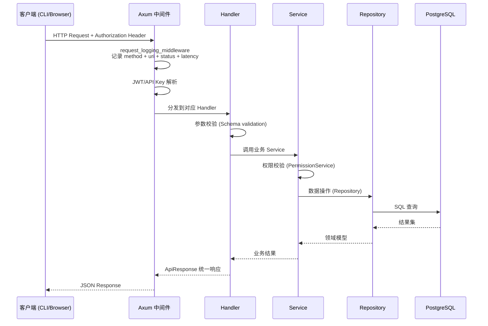
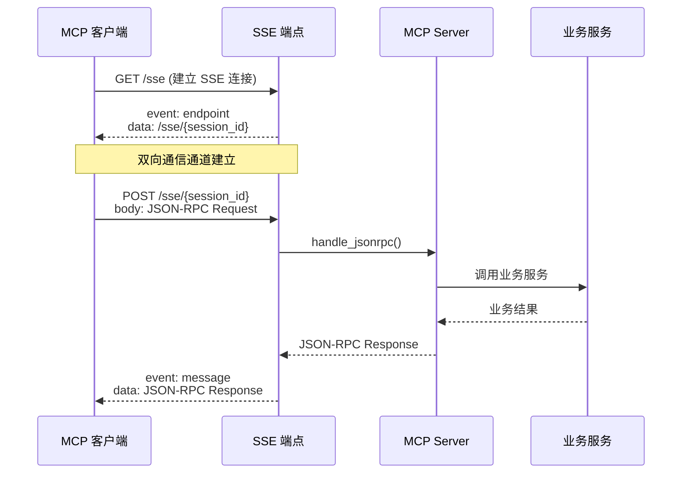

AionHive（Skill Garden）是一个**企业级 AI Skills 共享平台**，采用三端分离的架构设计：Rust 后端提供核心业务能力与 REST API，Svelte 管理后台提供 Web 管理界面，CLI 工具链提供命令行交互。三者通过 HTTP/HTTPS 通信，共享同一套数据模型与权限体系。整个系统围绕 **Skills（技能资产）** 的生命周期管理展开，从注册、审核、版本控制到发布、安装、评价，形成完整的闭环。Sources: [Cargo.toml](Cargo.toml#L1-L18), [src/main.rs](src/main.rs#L1-L10)

## 架构总览

```mermaid
graph TB
    subgraph "客户端层"
        CLI["skill-garden CLI<br/>Rust 二进制"]
        BROWSER["浏览器<br/>Svelte SPA"]
        MCP_CLIENT["MCP 客户端<br/>AI Agent / IDE"]
    end

    subgraph "HTTP 网关层"
        AXUM["Axum HTTP Server<br/>端口 8080"]
        MIDDLEWARE["请求日志中间件<br/>request_logging_middleware"]
        SSE["SSE 实时通信<br/>/sse → /sse/:session_id"]
    end

    subgraph "API 路由层"
        REST["REST API<br/>/api/v1/*"]
        MCP["MCP 协议端点<br/>/mcp (JSON-RPC)"]
        HEALTH["健康检查<br/>/health"]
    end

    subgraph "业务服务层"
        REGISTRY["RegistryService<br/>Skill 注册与发现"]
        SEARCH["SearchService<br/>Tantivy 全文索引"]
        SANDBOX["SandboxService<br/>Docker 容器隔离"]
        SESSION["SessionService<br/>MCP 会话管理"]
        PERMISSION["PermissionService<br/>多层级权限校验"]
        EVALUATOR["EvaluatorService<br/>评价与置信度"]
        SKILLGIT["SkillGitService<br/>ZIP/Git 版本管理"]
        GITPROXY["GitProxyService<br/>远程 Git 代理"]
        ORGTOOL["OrgToolService<br/>组织级工具注册"]
        TOOLROUTER["ToolRouterService<br/>工具路由分发"]
        DEPENDENCY["SkillDependencyService<br/>依赖解析"]
    end

    subgraph "管理服务层"
        TENANT["TenantService<br/>租户管理"]
        IDENTITY["IdentityService<br/>身份管理"]
        ROLE["RoleService<br/>角色管理"]
        GROUP["GroupService<br/>组织分组"]
        APIKEY["ApiKeyService<br/>API 密钥管理"]
        AUDIT["AuditService<br/>审计日志"]
        SYSROLE["SystemRoleAssignmentService<br/>系统角色分配"]
        TENANTROLE["TenantRoleAssignmentService<br/>租户角色分配"]
        ROLEPERM["RolePermissionService<br/>角色权限映射"]
    end

    subgraph "数据访问层"
        REPOS["Repository 模式<br/>SQLx + PostgreSQL"]
        MIGRATIONS["数据库迁移<br/>001 ~ 040"]
    end

    subgraph "数据存储"
        PG[("PostgreSQL<br/>Skills / 用户 / 权限")]
        FS[("文件系统<br/>Registry / 评价 / 索引")]
        DOCKER[("Docker Daemon<br/>沙箱容器")]
    end

    CLI -->|HTTP REST| AXUM
    BROWSER -->|HTTP REST| AXUM
    MCP_CLIENT -->|JSON-RPC| MCP
    MCP_CLIENT -->|SSE| SSE

    AXUM --> MIDDLEWARE
    MIDDLEWARE --> REST
    MIDDLEWARE --> MCP
    MIDDLEWARE --> SSE
    MIDDLEWARE --> HEALTH

    REST --> REGISTRY
    REST --> SEARCH
    REST --> SANDBOX
    REST --> SESSION
    REST --> EVALUATOR
    REST --> SKILLGIT
    REST --> GITPROXY
    REST --> ORGTOOL
    REST --> DEPENDENCY

    REST --> PERMISSION
    PERMISSION --> TENANT
    PERMISSION --> IDENTITY
    PERMISSION --> ROLE
    PERMISSION --> GROUP
    PERMISSION --> APIKEY
    PERMISSION --> SYSROLE
    PERMISSION --> TENANTROLE
    PERMISSION --> ROLEPERM

    REGISTRY --> REPOS
    SEARCH --> FS
    SANDBOX --> DOCKER
    EVALUATOR --> FS
    SKILLGIT --> FS
    REPOS --> PG
    AUDIT --> REPOS

    MCP --> REGISTRY
    MCP --> SEARCH
    MCP --> SANDBOX
    MCP --> SESSION
    MCP --> TOOLROUTER
    MCP --> EVALUATOR
    MCP --> PERMISSION
```



上图展示了系统的完整架构层次。核心设计思想是**分层解耦**：HTTP 网关层只负责协议转换和请求分发，不包含业务逻辑；业务服务层封装所有领域能力，彼此独立可替换；数据访问层通过 Repository 模式抽象数据库操作，使上层服务不依赖具体数据库实现。Sources: [src/main.rs](src/main.rs#L220-L290), [src/api/mod.rs](src/api/mod.rs#L1-L17)

## 三端架构详解

### Rust 后端 — 服务端核心

Rust 后端是整个系统的中枢，以 `aion-hive` 库 crate 为核心，通过 Cargo feature 机制拆分为 `server` 和 `cli` 两个编译目标。`server` 二进制运行 Axum HTTP 服务器，`skill-garden` 二进制提供 CLI 工具。Sources: [Cargo.toml](Cargo.toml#L20-L33), [src/lib.rs](src/lib.rs#L1-L20)

**代码分层结构**：

| 层次 | 目录 | 职责 | 关键技术 |
|------|------|------|----------|
| HTTP 网关 | `src/api/` | 路由注册、请求认证、错误处理、SSE 通信 | Axum 0.7, JWT, SSE |
| 数据模型 | `src/models/` | 领域实体定义（Skill、Identity、Tenant 等 20+ 实体） | Serde, chrono, uuid |
| 业务服务 | `src/services/` | 核心业务逻辑（注册、搜索、沙箱、会话、权限等 14 个服务） | async-trait, tokio |
| 管理服务 | `src/services/admin/` | 租户/身份/角色/API Key 管理（9 个服务） | bcrypt, jsonwebtoken |
| 数据访问 | `src/db/repositories/` | Repository 模式封装 PostgreSQL 操作（25+ 仓库） | SQLx 0.8, PostgreSQL |
| 数据库迁移 | `src/db/migrations/` | 40 个版本化迁移脚本 | SQL |
| MCP 协议 | `src/mcp/` | MCP 服务器实现（JSON-RPC + SSE） | rmcp 1.0 |
| CLI 客户端 | `src/cli/` | 命令行工具实现 | clap, reqwest, indicatif |
| 工具函数 | `src/utils/` | 速率限制、文件锁、输入验证 | dashmap, fs2 |

**AppState** 是后端的核心状态容器，在 `src/lib.rs` 中定义，聚合了所有服务实例。运行时分为两层：`AppState`（全量服务，在 `main.rs` 的 `main()` 中初始化）和 `AppRouterState`（精简版，仅包含 API 路由需要的服务，在 `run_http_server()` 中构建）。这种双层设计避免了 MCP 服务器初始化时携带不必要的依赖。Sources: [src/lib.rs](src/lib.rs#L60-L100), [src/api/http_state.rs](src/api/http_state.rs#L60-L104)

**认证机制**采用双通道设计：
- **JWT Bearer Token**：管理后台用户通过 `/api/v1/auth/login` 获取，用于 Web 会话
- **API Key (sk_ 前缀)**：CLI 和 AI Agent 使用，通过 `/api/v1/api-keys` 管理，支持过期时间和撤销

JWT 和 API Key 在 `src/api/jwt.rs` 和 `src/services/admin/api_key.rs` 中分别实现，两者在 `src/mcp/server.rs` 的 `resolve_identity_from_api_key()` 方法中统一解析为 `AgentContext`，供后续权限校验使用。Sources: [src/api/jwt.rs](src/api/jwt.rs#L1), [src/mcp/server.rs](src/mcp/server.rs#L120-L180)

### Svelte 管理后台 — Web 管理界面

管理后台位于 `admin/` 目录，是一个基于 Svelte + Vite + Tailwind CSS 的单页应用。它通过 REST API 与后端通信，不直接操作数据库。Sources: [admin/package.json](admin/package.json), [admin/vite.config.js](admin/vite.config.js)

**前端架构**：

| 模块 | 目录 | 核心文件 | 职责 |
|------|------|----------|------|
| 路由入口 | `admin/src/` | `App.svelte` | 双布局路由（Admin Layout / User Layout） |
| 认证 Store | `admin/src/stores/` | `auth.js` | JWT 存储、登录/登出、身份解析 |
| 权限 Store | `admin/src/stores/` | `permission.js` | 角色列表、权限码集合、层级判断函数 |
| 组织 Store | `admin/src/stores/` | `org.js` | 组织上下文切换、个人空间模式 |
| API 客户端 | `admin/src/lib/` | `api.js` | 统一 fetch 封装、错误处理、中文消息映射 |
| 配置 | `admin/src/config/` | `nav-routes.js`, `actions.js` | 导航路由权限配置、操作按钮权限映射 |
| 组件 | `admin/src/components/` | 19 个组件 | Nav, OrgSwitcher, RoleBadges, Toast 等 |
| 页面 | `admin/src/routes/` | 27 个页面 | Skills, Review, Marketplace, Tenants 等 |

**双布局机制**是前端的核心设计。`App.svelte` 根据用户角色动态切换布局：
- **Admin Layout**：左侧导航栏 + 顶部组织切换器，适用于 `super_admin`、`tenant_admin`、`marketplace_admin` 等系统角色用户，以及拥有组织角色的用户
- **User Layout**：简化导航，适用于纯个人用户（无管理角色）

布局切换通过 `permissionStore` 的 `loaded` 状态控制，避免页面刷新时出现布局闪烁。Sources: [admin/src/App.svelte](admin/src/App.svelte#L1-L179)

**权限驱动渲染**是前端的另一核心设计。`permission.js` 提供 `hasPermission(code)`、`hasSystemRole(role)`、`hasOrgRole(orgId, ...roles)` 等纯函数，供导航路由和组件在渲染时调用。`nav-routes.js` 为每个导航项声明 `need` 字段（权限码或角色名），布局引擎自动过滤用户不可见的页面。Sources: [admin/src/stores/permission.js](admin/src/stores/permission.js#L1-L172), [admin/src/config/nav-routes.js](admin/src/config/nav-routes.js#L1-L96)

### CLI 工具链 — 命令行交互

CLI 工具位于 `src/bin/cli.rs`，编译为 `skill-garden` 二进制，通过 `cli` feature 控制编译。它不依赖 PostgreSQL、Tantivy、Docker 等后端组件，仅通过 HTTP REST API 与服务器通信。Sources: [src/bin/cli.rs](src/bin/cli.rs#L1-L30), [src/cli/mod.rs](src/cli/mod.rs#L1-L9)

**命令清单**：

| 命令 | 功能 | 认证要求 |
|------|------|----------|
| `login <server> [--token]` | 登录并保存凭据 | 需要 API Key |
| `logout` | 清除本地配置 | 无 |
| `whoami` | 查看当前身份 | 已登录 |
| `search <query> [--limit]` | 全文搜索 Skills | 可选 |
| `list [--page] [--page-size]` | 分页列出 Skills | 可选 |
| `info <skill-id>` | 查看 Skill 详情 | 可选 |
| `install <skill-id> [--dir]` | 下载并安装 Skill | 已登录 |
| `versions <name>` | 查看版本历史 | 可选 |
| `popular [--limit]` | 热门排行 | 可选 |
| `stats <skill-id>` | 使用统计 | 可选 |
| `config [show \| set <key> <val>]` | 配置管理 | 无 |

CLI 的配置存储在 `~/.skill-garden/config.toml`，包含 `server`、`token`、`skills_dir` 三项。安装命令将 Skill 的 tarball 下载到本地并解压，支持通过 `--dir` 参数或配置文件指定安装目录。Sources: [src/cli/config.rs](src/cli/config.rs), [src/cli/commands.rs](src/cli/commands.rs#L1-L347)

## 通信协议与数据流

### REST API 设计

所有 HTTP API 遵循 `/api/v1/{resource}` 命名规范，以 `src/api/routes.rs` 中的路由定义为准。API 路由按功能域分拆为 30+ handler 文件，每个 handler 文件对应一个资源类型。Sources: [src/api/routes.rs](src/api/routes.rs#L1-L541), [src/api/handlers/mod.rs](src/api/handlers/mod.rs#L1-L73)



**请求处理管道**：
1. **中间件层**：`request_logging_middleware` 记录每个请求的方法、URI、状态码和延迟
2. **认证解析**：从 `Authorization` 头提取 JWT 或 API Key，解析为 `AgentContext`
3. **Handler 调度**：根据路由匹配到对应 handler 函数
4. **参数校验**：使用 `src/schemas/validation.rs` 中的 Schema 驱动校验
5. **权限校验**：`PermissionService` 根据当前用户角色和操作类型判断是否授权
6. **业务执行**：Service 层完成具体业务逻辑
7. **统一响应**：所有响应通过 `ApiResponse` 结构体封装，包含 `success`、`data`、`error` 字段

### MCP 协议与 SSE 实时通信

MCP（Model Context Protocol）是 AI Agent 与 AionHive 交互的核心协议，支持 JSON-RPC over HTTP 和 SSE 两种传输方式。Sources: [src/mcp/server.rs](src/mcp/server.rs#L1-L50)

**SSE 通信流程**：



SSE 会话管理在 `src/api/http_state.rs` 的 `SseState` 中实现，支持自动清理空闲会话（默认 5 分钟超时）。后台有两个清理任务：一个清理 SSE 内存会话（每 60 秒），一个清理数据库会话（每 120 秒，30 分钟空闲超时）。Sources: [src/api/http_state.rs](src/api/http_state.rs#L20-L60), [src/main.rs](src/main.rs#L255-L280)

## 核心服务架构

### 业务服务层

业务服务层包含 14 个核心服务，每个服务封装独立的领域能力：

| 服务 | 文件 | 核心职责 | 依赖 |
|------|------|----------|------|
| `RegistryService` | `src/services/registry.rs` | Skill CRUD、下载令牌生成、文件存储 | SkillRepository, Storage |
| `SearchService` | `src/services/search.rs` | Tantivy 全文索引、可见性过滤 | 文件系统索引 |
| `SandboxService` | `src/services/sandbox.rs` | Docker 容器隔离执行、工具池管理 | Docker Daemon |
| `SessionService` | `src/services/session.rs` | MCP 会话生命周期、状态管理 | SessionRepository |
| `PermissionService` | `src/services/permission.rs` | 多层级权限上下文构建、缓存 | 所有管理服务 |
| `EvaluatorService` | `src/services/evaluator.rs` | 评价收集、统计聚合、Webhook 转发 | EvaluationRepository |
| `SkillGitService` | `src/services/skill_git.rs` | ZIP 上传解压、Git 版本管理 | 文件系统 |
| `GitProxyService` | `src/services/git_proxy.rs` | 远程 Git 仓库操作代理 | Git 命令 |
| `OrgToolService` | `src/services/org_tool.rs` | 组织级工具注册与审批 | OrgToolRepository |
| `ToolRouterService` | `src/services/tool_router.rs` | 工具路由分发 | SessionService |
| `SkillDependencyService` | `src/services/skill_dependency.rs` | 依赖解析与版本约束 | SkillRepository |
| `OrganizationService` | `src/services/organization.rs` | 组织管理 | OrganizationRepository |
| `StorageService` | `src/services/storage.rs` | 原子文件存储与文件锁 | 文件系统 |

### 管理服务层

管理服务层在 `src/services/admin/` 下，提供 RBAC 权限体系的支撑能力：

| 服务 | 文件 | 核心职责 |
|------|------|----------|
| `TenantService` | `src/services/admin/tenant.rs` | 租户 CRUD、状态管理 |
| `IdentityService` | `src/services/admin/identity.rs` | 身份注册、认证、密码管理 |
| `RoleService` | `src/services/admin/role.rs` | 角色定义、作用域管理 |
| `GroupService` | `src/services/admin/group.rs` | 组织分组与成员管理 |
| `ApiKeyService` | `src/services/admin/api_key.rs` | API Key 生成、验证、撤销 |
| `AuditService` | `src/services/admin/audit.rs` | 审计日志写入与查询 |
| `SystemRoleAssignmentService` | `src/services/admin/system_role_assignment.rs` | 系统级别角色分配 |
| `TenantRoleAssignmentService` | `src/services/admin/tenant_role_assignment.rs` | 租户级别角色分配 |
| `RolePermissionService` | `src/services/admin/role_permission.rs` | 角色-权限映射管理 |

## 数据模型与数据库

### 领域模型体系

`src/models/` 下定义了 20+ 个领域实体，核心模型包括：

- **Skill**：技能资产，包含生命周期状态（draft/published/archived）、可见性（private/shared/org_visible/marketplace）、版本号、依赖关系、安装计数等
- **Identity**：用户身份，支持密码登录和 API Key 认证
- **Tenant**：租户，多租户隔离的顶层实体
- **Organization**：组织，隶属于租户，包含成员和分组
- **Group**：组织内的分组，用于精细权限控制
- **Role**：角色定义，支持 System/Tenant/Org/Group 四级作用域
- **Session**：MCP 会话，记录工具调用状态和路由信息
- **Evaluation**：评价，包含置信度、错误类型、标签等结构化指标

Sources: [src/models/mod.rs](src/models/mod.rs#L1-L46)

### Repository 模式

所有数据库操作通过 Repository 模式封装，每个 Repository 对应一个数据库表。Repository 定义在 `src/db/repositories/` 下，通过 `sqlx::PgPool` 执行 SQL 查询。`src/db/traits.rs` 定义了 `SkillRepositoryTrait`、`EvaluationRepositoryTrait`、`AuditRepositoryTrait` 三个 trait，支持依赖注入和单元测试。Sources: [src/db/traits.rs](src/db/traits.rs#L1-L88), [src/db/repositories/mod.rs](src/db/repositories/mod.rs#L1-L53)

### 数据库迁移

迁移脚本位于 `src/db/migrations/`，从 `001_initial_schema.sql` 到 `040_remove_market_admin_tenant_read.sql`，覆盖了从初始建表到多租户、RBAC、Marketplace 审批等完整演进路径。迁移在 `AppState::new()` 中自动执行，确保数据库 schema 与代码版本匹配。Sources: [src/db/migrations.rs](src/db/migrations.rs), [src/db/migrations/](src/db/migrations/)

## 部署与构建

### 构建流程

Cargo.toml 定义了三个编译目标，通过 feature 控制编译范围：

| 目标 | 二进制名 | 路径 | 依赖 feature |
|------|----------|------|-------------|
| 服务器 | `server` | `src/main.rs` | `server`（默认） |
| CLI | `skill-garden` | `src/bin/cli.rs` | `cli` |
| 测试 | `integration` | `tests/integration.rs` | 开发依赖 |

构建命令示例：
```bash
cargo build --release                         # 编译 server（默认）
cargo build --release --features cli --bin skill-garden  # 编译 CLI
cargo build --release --features server,cli   # 同时编译两者
```

Sources: [Cargo.toml](Cargo.toml#L95-L118)

### 部署脚本

`deploy/` 目录包含 CLI 分发的构建脚本：
- `build-cli.ps1`：Windows 平台 CLI 构建与分发
- `build-cli.sh`：Unix 平台 CLI 构建与分发

`cli-dist/` 目录存放构建好的 CLI 安装包，包含安装脚本和说明文档。Sources: [deploy/](deploy/), [cli-dist/](cli-dist/)

## 下一步阅读建议

完成本页的整体架构概览后，建议按以下顺序深入各子系统：

1. **核心数据模型**：从 [Skill 资产模型](6-skill-zi-chan-mo-xing-sheng-ming-zhou-qi-ban-ben-ke-jian-xing-yu-shi-chang-zhuang-tai) 开始，理解系统核心资产的定义
2. **身份与权限**：依次阅读 [身份与租户模型](7-shen-fen-yu-zu-hu-mo-xing-identity-tenant-organization-duo-ji-ti-xi) 和 [RBAC 权限模型](8-rbac-quan-xian-mo-xing-system-tenant-org-group-si-ji-jiao-se-ti-xi)，掌握多级权限体系
3. **API 层**：通过 [API 路由设计与认证机制](10-api-lu-you-she-ji-yu-ren-zheng-ji-zhi-jwt-api-key) 了解接口设计
4. **业务服务**：按 [Registry 服务](13-registry-fu-wu-skills-zhu-ce-sou-suo-suo-yin-yu-wen-jian-cun-chu) → [Sandbox 服务](14-sandbox-fu-wu-docker-rong-qi-ge-chi-zhi-xing-yu-gong-ju-chi-guan-li) → [Session 服务](16-session-fu-wu-mcp-hui-hua-sheng-ming-zhou-qi-yu-gong-ju-lu-you) 的顺序深入核心业务流程
5. **管理后台**：阅读 [Admin 布局](22-admin-bu-ju-ren-zheng-liu-cheng-quan-xian-chu-shi-hua-yu-zu-zhi-shang-xia-wen-qie-huan) 了解前端架构设计
6. **CLI 与部署**：最后通过 [CLI 命令行工具](25-cli-ming-ling-xing-gong-ju-sou-suo-an-zhuang-ping-jie-skills) 了解终端交互方式