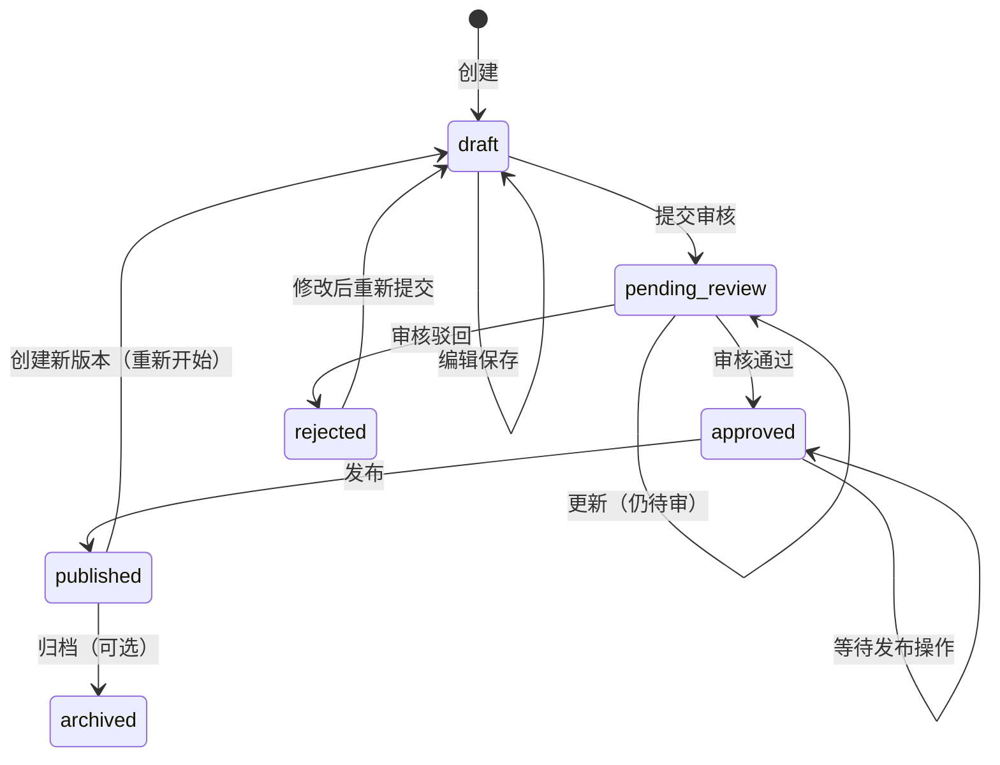
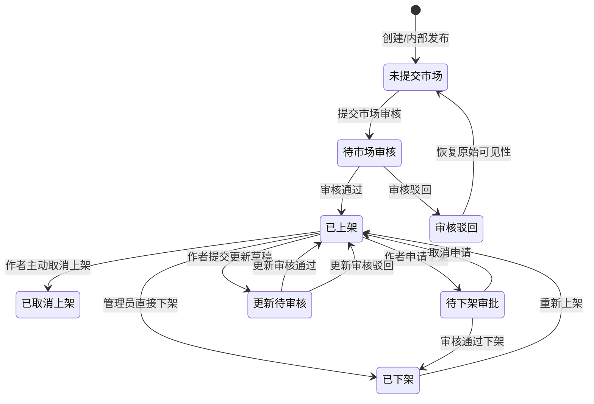
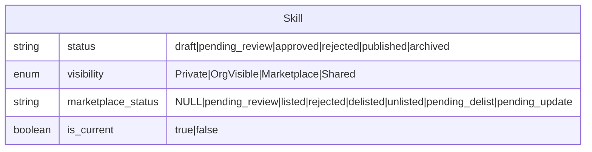

Skill 是系统的核心数字资产，其模型设计围绕三条主线展开：**生命周期状态机**（从草稿到发布）、**可见性控制**（谁能看到）、**市场双轨制**（内部发布与市场审核并行）。这三条线在 `skills` 表上以多个独立字段协同工作，构成了一个灵活但精确的状态空间。理解这一模型是掌握整个系统权限、搜索、版本管理的前提。

---

## 核心数据结构

Skill 的 Rust 模型定义在 `Skill` 结构体中，其数据库持久化对应 `skills` 表。每个 Skill 有一个唯一 ID，格式固定为 `skill-{name}-{version}`，例如 `skill-browse-1.0.0`。这个 ID 既是主键，也是语义化标识——从 ID 可直接解析出技能名称和版本号。`Skill::generate_id()` 和 `extract_skill_name()` 方法分别执行正向生成和反向解析，后者通过寻找最后一个 `-` 段（版本号必须包含 `.`）来正确处理名称本身可能含连字符的情况。

Sources: [skill.rs](src/models/skill.rs#L1-L200), [registry.rs](src/services/registry.rs#L700-L800)

### 字段体系

Skill 模型的字段可划分为以下几组：

| 分组 | 字段 | 说明 |
|------|------|------|
| 标识 | `id`, `name`, `version` | id = skill-{name}-{version}，版本遵守 semver |
| 内容 | `description`, `content`, `tags`, `tools`, `dependencies` | `content` 即 SKILL.md 全文；`tools` 为引用的工具列表 |
| 归属 | `author_agent_id`, `author_identity_id`, `owner_type`, `owner_id` | `owner_type` 为 `user` 或 `organization` |
| 生命周期 | `status`, `reviewed_by`, `reviewed_at`, `review_comment` | status 控制完整生命周期流转 |
| 可见性 | `visibility` | 枚举：Private / OrgVisible / Marketplace / Shared |
| 市场 | `marketplace_status`, `pre_marketplace_visibility`, `draft_content` | 市场双轨制的三个核心字段 |
| 版本 | `is_current`（数据库层） | 标记当前生效版本 |

`SkillMetadata` 是 `Skill` 的轻量版（不含 `content`），用于列表展示。`SkillDetail` 包含完整内容加可选的统计信息。`InstallResult` 是安装响应的专用结构，包含下载 URL（带签名 Token，5 分钟有效期）和安装指引。

Sources: [skill.rs](src/models/skill.rs#L1-L469), [repository/skill.rs](src/db/repositories/skill.rs#L1-L200)

---

## 生命周期状态机

`status` 字段是 Skill 生命周期的核心控制变量，其合法值及流转规则由数据库 CHECK 约束和业务逻辑共同维护。

### 状态定义

```
status: 'draft' | 'pending_review' | 'approved' | 'rejected' | 'published' | 'archived'
```

### 完整流转图



该状态机由 `workflow.rs` 中的 5 个核心 handler 驱动：`submit_review_skill_handler`（draft → pending_review）、`approve_skill_handler`（pending_review → approved）、`reject_skill_handler`（pending_review → rejected）、`publish_skill_handler`（approved → published）。每条状态变更都会生成审计日志，记录操作者、操作时间和可选评论。

Sources: [workflow.rs](src/api/handlers/workflow.rs#L1-L650), [migration 027](src/db/migrations/027_cli_and_review_enhancements.sql#L1-L43), [migration 036](src/db/migrations/036_add_draft_content.sql#L1-L19)

### 审核记录

审核人信息完整记录在 `reviewed_by`（审核人 Identity ID）、`reviewed_at`（审核时间）、`review_comment`（审核评论）三个字段中。`update_status` 方法在更新状态时，如果提供了 `reviewed_by` 参数，则自动设置 `reviewed_at` 为当前时间——这意味着只有 `approved` 和 `rejected` 状态会附带审核时间戳，其他状态变更不会覆盖审核记录。

Sources: [repository/skill.rs](src/db/repositories/skill.rs#L500-L600)

### 版本切换与 is_current 标记

当新版本被创建时，`is_current` 的管理遵循一套精密的规则：

1. **新版本创建时**：`is_current = true`，同时旧已发布版本**保持** `is_current = true`（保证市场用户仍可见）
2. **审核通过并发布时**：旧版本 `is_current = false`，新版本保持 `true`——市场用户自动切换到新版本
3. **驳回时**：新版本的 `is_current` 保持 `true` 但无实际影响，因为该版本 `status = rejected` 不会被搜索/列表展示

`list_all` 方法默认只查询 `is_current = true` 的记录，确保索引重建和列表展示不会出现重复。`idx_skills_name_current` 部分索引（`WHERE is_current = true`）优化了按名称查询当前版本的性能。

Sources: [repository/skill.rs](src/db/repositories/skill.rs#L1-L200), [migration 038](src/db/migrations/038_add_is_current_and_tenant_perms.sql#L1-L70)

---

## 可见性系统

`visibility` 字段控制 Skill 的可见范围，是权限过滤的首要依据。四个级别从严格到开放：

| 级别 | 数据库值 | 可见范围 |
|------|----------|----------|
| Private | `private` | 仅所有者本人 |
| OrgVisible | `org_visible` | 同组织所有成员 |
| Shared | `shared` | 特定共享范围（预留） |
| Marketplace | `marketplace` | 所有人（需经过市场审核流程） |

`Visibility` 枚举的默认值在 `SkillPolicy` 上下文中是 `OrgVisible`，但在 `Skill::new()` 创建方法中默认是 `Private`——前者用于组织级策略，后者用于个人创建。

### 可见性过滤逻辑

`filter_skills_visible_to` 方法实现了完整的可见性过滤规则，该逻辑与 `Permission` 服务的 `check_skill_perm` 的 Read 操作保持一致：

- 无身份（匿名用户）：仅能看到 `published + Marketplace` 的 Skill
- 有身份的个人所有者：看到自己的所有 Skill（任何状态）
- 组织成员：看到本组织的所有 Skill（任何状态）
- 市场管理员：看到所有已提交市场的 Skill（任何 `marketplace_status`）

Sources: [skill_policy.rs](src/models/skill_policy.rs#L1-L55), [registry.rs](src/services/registry.rs#L600-L700)

---

## 市场双轨制

这是系统最精巧的设计之一。一个 Skill 可以「内部发布」（仅组织内可见）和「上架市场」（全局可见）两个轨道独立运行，通过 `marketplace_status` 字段与 `visibility` 字段协同管理。

### marketplace_status 状态集

```
marketplace_status: NULL | 'pending_review' | 'listed' | 'rejected' | 'delisted' | 'unlisted' | 'pending_delist' | 'pending_update'
```

### 完整市场状态机



### 核心设计：pre_marketplace_visibility

提交市场前，系统会保存当前 `visibility` 到 `pre_marketplace_visibility` 字段。当 Skill 被下架（delisted）或驳回（rejected）时，恢复为该原始可见性。这保证了：

- 一个 `OrgVisible` 的 Skill 提交市场 → 审核通过后 `visibility = Marketplace`，`pre_marketplace_visibility = 'org_visible'`
- 被下架后 → `visibility` 恢复为 `org_visible`，Skill 回到组织内部可见状态

### 操作流程示例

**场景：作者提交已发布 Skill 到市场**

1. 前置条件：`status = published`，`marketplace_status IS NULL`
2. 校验：`check_skill_perm(identity_id, &skill, PublishToMarketplace)`
3. 保存原始可见性：`set_pre_marketplace_visibility(skill_id, &skill.visibility)`
4. 设置市场状态：`update_marketplace_status(skill_id, "pending_review")`
5. 审计日志记录

**场景：管理员审核通过**

1. 校验：`marketplace_status = 'pending_review'`
2. 设置 `marketplace_status = 'listed'`
3. 设置 `visibility = 'marketplace'`
4. 审计日志记录

**场景：管理员下架已上架 Skill**

1. 校验：`marketplace_status = 'listed'`
2. 设置 `marketplace_status = 'delisted'`
3. 恢复可见性：`visibility = pre_marketplace_visibility`（默认 `'private'`）
4. 向后兼容：同时设置 `admin_unpublished = true`

Sources: [marketplace.rs](src/api/handlers/marketplace.rs#L1-L200), [workflow.rs](src/api/handlers/workflow.rs#L200-L400), [migration 032](src/db/migrations/032_add_marketplace_status.sql#L1-L39), [migration 035](src/db/migrations/035_add_pending_delist_status.sql#L1-L13)

### 更新草稿机制

对于已上架市场的 Skill，任何内容变更（tags/description/content）都不应直接生效，以避免用户看到不完整或未经审核的修改。`draft_content` JSONB 字段和 `pending_update` 市场状态共同实现了这一机制：

```
已上架 (listed)
  │
  ├─ 作者编辑 tags/description/content
  │     └─ 写入 draft_content，marketplace_status → pending_update
  │
  ├─ 市场管理员审核
  │     ├─ 通过：draft_content 合并到主字段，marketplace_status → listed
  │     └─ 驳回：清空 draft_content，marketplace_status → listed（恢复原状）
  │
  └─ 作者取消更新
        └─ 清空 draft_content，marketplace_status → listed
```

`draft_content` 的结构为 JSON 对象，包含 `description`、`tags`、`content` 等可能变更的字段。审核期间，市场用户看到的仍然是旧版本（主字段未变），审核通过后一次性合并。

Sources: [migration 036](src/db/migrations/036_add_draft_content.sql#L1-L19), [skill-update-workflow.md](docs/skill-update-workflow.md#L1-L100)

---

## 版本管理

版本管理通过三个层面协同工作：数据库 `skills` 表的多版本行、`skill_versions` 版本历史表、以及 Git 仓库的 tag 系统。

### 版本存储模型

| 层面 | 存储位置 | 用途 |
|------|----------|------|
| skills 表 | 多行（同名不同版本） | 主数据存储，`is_current` 标记当前版本 |
| skill_versions 表 | 独立表 | 版本历史索引，含 Git commit hash、tag、changelog |
| Git 仓库 | 文件系统 git-repos/ | 完整文件历史，tag 标记每个发布版本 |

### 版本创建流程

1. **ZIP 上传**：`skill_upload.rs` 中的 handler 接收 ZIP 文件，`SkillGitService` 解压到 `git-repos/skill-{name}/` 目录
2. **Git 提交**：`git add . → git commit -m "v{version}"`，自动创建初始 commit
3. **数据库记录**：在 `skills` 表创建新行，`status = 'pending_review'`，`is_current = true`
4. **版本记录**：`VersionRepository` 在 `skill_versions` 表写入一行，记录版本元数据

### 审核通过时的版本固化

当审核通过（`approve_skill_handler`）时，系统执行三个关键操作：

1. **Git Tag**：`git tag -a v{version} -m "v{version}: Approved version"`，将当前 commit 标记为发布版本
2. **版本记录**：写入 `skill_versions` 表，记录 `git_tag`、文件数、总大小
3. **Tarball 生成**：`generate_release_tarball` 创建 `releases/{name}/v{version}.tar.gz`，供后续安装下载

### 版本回退

`rollback_skill_handler` 实现了版本回退机制：

1. 校验权限（作者或组织成员）
2. `git checkout v{target_version}` 恢复文件到目标版本
3. 创建新 commit（**不打 tag**，保持历史不变）
4. 自动生成新版本号（如 1.1.0 → 1.1.1-rollback.1）
5. 创建新 `skill` 行，`status = 'pending_review'`，走正常审核流程
6. 审核通过后，旧版本 `is_current = false`，新版本生效

Sources: [skill_git.rs](src/services/skill_git.rs#L1-L100), [workflow.rs](src/api/handlers/workflow.rs#L400-L650), [migration 022](src/db/migrations/022_add_skill_versions.sql#L1-L27)

---

## 安装与下载链路

安装流程与版本管理和市场状态紧密相关。`get_skill_files` 方法生成 `InstallResult`，包含：

1. **文件统计**：优先从 `releases/{name}/v{version}.tar.gz` 读取，回退到 Git 仓库统计
2. **下载凭证**：`DownloadTokenRepository` 创建 5 分钟有效的 Token（UUID 随机值），存入数据库
3. **下载 URL**：`/api/v1/skills/{name}/download/{version}?token={token}`，不暴露任何身份信息
4. **安装计数**：每次下载成功后递增 `install_count`

这个过程是**无状态的**——下载链接不绑定具体用户，Token 仅作为一次性凭证。安装者得到的是完整的 tar.gz 包，包含 binary + config.toml + 安装脚本 + SKILL.md。

Sources: [registry.rs](src/services/registry.rs#L400-L600)

---

## 状态空间总览

综合以上所有维度，一个 Skill 在任意时刻的状态由四个字段共同定义：



| 典型场景 | status | visibility | marketplace_status | is_current |
|----------|--------|------------|-------------------|------------|
| 刚创建的草稿 | `draft` | `Private` | NULL | true |
| 提交内部审核 | `pending_review` | `Private` | NULL | true |
| 审核通过待发布 | `approved` | `Private` | NULL | true |
| 内部已发布 | `published` | `OrgVisible` | NULL | true |
| 已提交市场待审 | `published` | `OrgVisible` | `pending_review` | true |
| 市场上架可见 | `published` | `Marketplace` | `listed` | true |
| 市场上架被驳回 | `published` | `OrgVisible` | `rejected` | true |
| 市场下架 | `published` | `OrgVisible` | `delisted` | true |
| 旧版本 | `published` | `Marketplace` | `listed` | **false** |
| 更新待审 | `published` | `Marketplace` | `pending_update` | true |

这种设计确保了 Skill 的**内部可见性**（`visibility`）和**市场曝光状态**（`marketplace_status`）可以独立演化，同时 `pre_marketplace_visibility` 作为安全网，保证从市场撤回时能优雅地回到原来的可见范围。

---

## 下一步阅读

理解 Skill 模型后，建议按以下路径深入：

- [身份与租户模型：Identity、Tenant、Organization 多级体系](7-shen-fen-yu-zu-hu-mo-xing-identity-tenant-organization-duo-ji-ti-xi) — 了解 Skill 的归属关系（owner_type + owner_id）如何与身份体系对接
- [RBAC 权限模型：System/Tenant/Org/Group 四级角色体系](8-rbac-quan-xian-mo-xing-system-tenant-org-group-si-ji-jiao-se-ti-xi) — 理解 `skill:approve_review`、`skill:publish_to_marketplace` 等权限如何控制状态流转
- [Registry 服务：Skills 注册、搜索索引与文件存储](13-registry-fu-wu-skills-zhu-ce-sou-suo-suo-yin-yu-wen-jian-cun-chu) — 查看 Skill CRUD 的完整实现
- [SkillGit 服务：ZIP 上传解压、Git 版本管理与发布](17-skillgit-fu-wu-zip-shang-chuan-jie-ya-git-ban-ben-guan-li-yu-fa-bu) — 深入了解版本管理和 Git 集成的实现细节