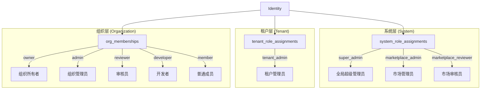

## 概述

Skill Garden 的身份与租户体系采用 **GitHub 风格的多级实体架构**，将平台抽象为 Identity（身份）、Tenant（租户）、Organization（组织）三个层级，配合 Group（组）作为第四级可选结构。这套模型的核心设计哲学是：**用户是一等公民**，可以独立存在（个人账户），也可以同时加入多个组织；Skill 的归属权明确归属于用户或组织，权限控制由此层层递进。

Sources: [docs/MULTI_TENANT_ADMIN_DESIGN.md](docs/MULTI_TENANT_ADMIN_DESIGN.md#L1-L50)

## 三体架构：Identity → Tenant → Organization

### 架构总览

```mermaid
erDiagram
    Identity ||--o{ OrgMembership : "belongs to"
    Identity ||--o{ SystemRoleAssignment : "has system role"
    Identity ||--o{ TenantRoleAssignment : "has tenant role"
    Tenant ||--o{ Organization : "contains"
    Tenant ||--o{ TenantRoleAssignment : "defines"
    Organization ||--o{ OrgMembership : "has members"
    Organization ||--o{ Group : "contains sub-groups"
    Identity ||--o{ Group }o-- Organization : "member of group via"
    Organization ||--o{ Skill : "owns skills"
    Identity ||--o{ Skill : "owns personal skills"
```

**层级关系说明**：Tenant 是企业级隔离容器，承载多个 Organization；Organization 是 Skill 协作与所有权的基本单元；Identity 是用户/Agent/系统账号的统一抽象，可跨 Tenant 和 Organization 存在。Group 作为 Organization 内部的子结构，用于精细权限管理（详见 [RBAC 权限模型](8-rbac-quan-xian-mo-xing-system-tenant-org-group-si-ji-jiao-se-ti-xi)）。

Sources: [src/models/identity.rs](src/models/identity.rs#L1-L30), [src/models/tenant.rs](src/models/tenant.rs#L1-L20), [src/models/organization.rs](src/models/organization.rs#L1-L20)

### 设计原则

| 原则 | 说明 |
|------|------|
| **Identity 统一抽象** | 人类用户、AI Agent、外部服务、系统账号——全部抽象为 Identity，通过 `identity_type` 区分 |
| **用户独立存在** | 用户可以不加入任何组织（个人账户），拥有个人 Skill |
| **Skill 所有权明确** | 每个 Skill 归属一个 Owner（User 或 Organization），编辑权由所有权和角色共同决定 |
| **审核在组织内完成** | Skill 提交到 Marketplace 前，由所属组织的 Reviewer/Admin 在组织内部审核 |
| **公开只读共享** | Marketplace Skill 跨组织可发现、安装、使用，但不能修改源代码 |

Sources: [docs/MULTI_TENANT_ADMIN_DESIGN.md](docs/MULTI_TENANT_ADMIN_DESIGN.md#L20-L55)

## Identity — 统一身份抽象

### 定义与字段

Identity 是整个系统的身份核心，它统一了四类实体：

```rust
pub struct Identity {
    pub id: Uuid,
    pub identity_type: IdentityType,   // User | Agent | ExternalAgent | System
    pub external_id: Option<String>,   // 外部系统 ID（如 SSO、GitHub）
    pub username: Option<String>,      // 唯一用户名
    pub display_name: Option<String>,  // 显示名称
    pub name: String,                  // 必填名称
    pub email: Option<String>,         // 唯一邮箱
    pub avatar_url: Option<String>,
    pub password_hash: Option<String>, // bcrypt 哈希
    pub is_system_admin: bool,         // 系统管理员标记（来自 admin_users 迁移）
    pub status: IdentityStatus,        // Active | Inactive | Suspended | Deleted
    pub metadata: serde_json::Value,   // 扩展元数据
    pub created_at: DateTime<Utc>,
    pub updated_at: DateTime<Utc>,
}
```

Sources: [src/models/identity.rs](src/models/identity.rs#L10-L30)

### IdentityType 的四种变体

| 类型 | 认证方式 | 典型场景 | 密码字段 |
|------|---------|----------|---------|
| `User` | 用户名+密码 / SSO | 平台管理员、开发者 | 有（bcrypt） |
| `Agent` | agent_id + secret / API Key | Claude、GPT 等 AI Agent | 无 |
| `ExternalAgent` | 外部系统认证 | 第三方集成、GitLab Webhook | 无 |
| `System` | 内部信任 | 系统级操作、admin_users 迁移来源 | 有（仅系统账户） |

**设计考量**：`is_system_admin` 字段是历史遗留产物——在迁移 021 中，`admin_users` 表被合并到 `identities` 表，所有原 admin 用户被标记为 `is_system_admin=true`，`identity_type='system'`。现代系统角色分配应使用 `system_role_assignments` 表（见下文），而非依赖此字段。

Sources: [src/models/identity.rs](src/models/identity.rs#L32-L70), [src/db/migrations/021_merge_admin_users_into_identities.sql](src/db/migrations/021_merge_admin_users_into_identities.sql#L1-L56)

### 数据库演进

Identity 模型经历了三次关键迁移：

1. **迁移 014**（`add_identities_and_roles`）：创建最初的 `identities` 表，包含 `identity_type`、`external_id`、`name`、`email`、`status`、`metadata` 基础字段
2. **迁移 017**（`add_user_model_and_org_memberships`）：扩展表结构，添加 `username`（唯一）、`display_name`、`password_hash` 字段，使其匹配设计文档中的 Users 模型，并建立 `org_memberships` 表
3. **迁移 021**（`merge_admin_users_into_identities`）：将 `admin_users` 表合并到 `identities`，添加 `is_system_admin` 布尔标志，统一身份管理体系

Sources: [src/db/migrations/014_add_identities_and_roles.sql](src/db/migrations/014_add_identities_and_roles.sql#L1-L30), [src/db/migrations/017_add_user_model_and_org_memberships.sql](src/db/migrations/017_add_user_model_and_org_memberships.sql#L1-L30), [src/db/migrations/021_merge_admin_users_into_identities.sql](src/db/migrations/021_merge_admin_users_into_identities.sql#L1-L20)

## Tenant — 企业级租户容器

### 定义与字段

Tenant 是最高级别的隔离单元，对应企业客户。每个 Tenant 拥有独立的计费计划、SSO 配置和全局设置，并包含多个 Organization。

```rust
pub struct Tenant {
    pub id: Uuid,
    pub name: String,
    pub slug: String,                   // 唯一标识符，用于 URL 和 API
    pub status: TenantStatus,           // Active | Suspended | Deleted
    pub billing_plan: Option<String>,   // free | pro | enterprise
    pub sso_config: Option<serde_json::Value>, // SSO/OIDC 配置
    pub settings: serde_json::Value,    // 租户级全局配置
    pub created_by: Option<Uuid>,       // 创建者 Identity
    pub created_at: DateTime<Utc>,
    pub updated_at: DateTime<Utc>,
}
```

Sources: [src/models/tenant.rs](src/models/tenant.rs#L8-L25)

### 关键特性

**租户级角色分配**通过 `tenant_role_assignments` 表实现（迁移 030），目前支持 `tenant_admin` 角色。Tenant Admin 可以管理其租户下的所有组织、成员和 Skill，但不能越级管理系统级资源（如其他租户、全局审计日志）。

```sql
-- 迁移 030 定义的 tenant_role_assignments 表
CREATE TABLE tenant_role_assignments (
    id UUID PRIMARY KEY DEFAULT gen_random_uuid(),
    identity_id UUID NOT NULL REFERENCES identities(id) ON DELETE CASCADE,
    tenant_id UUID NOT NULL REFERENCES tenants(id) ON DELETE CASCADE,
    role_name VARCHAR(50) NOT NULL,       -- 'tenant_admin'
    assigned_by UUID REFERENCES identities(id),
    assigned_at TIMESTAMPTZ DEFAULT NOW(),
    UNIQUE(identity_id, tenant_id, role_name)
);
```

**Tenant Admin 的权限范围**包括：读取和更新租户设置、管理 SSO 配置、读取和更新计费信息、管理租户成员（邀请/移除）、在租户内创建/删除组织、读取租户内所有组织和 Skill。这些权限在 `role_permissions` 表中定义，`scope_restriction` 字段为 `'tenant'` 表示限制在租户范围内。

Sources: [src/db/migrations/030_add_tenant_role_assignments.sql](src/db/migrations/030_add_tenant_role_assignments.sql#L1-L57)

### 租户与组织的关联

Organization 通过 `tenant_id` 外键关联到 Tenant：

```sql
-- 迁移 013 在 organizations 表添加了 tenant_id 字段
ALTER TABLE organizations ADD COLUMN tenant_id UUID REFERENCES tenants(id) ON DELETE SET NULL;
```

**关键约束**：`ON DELETE SET NULL` 意味着删除 Tenant 后，其下属 Organization 不会级联删除，而是变为独立组织（`tenant_id = NULL`）。这避免了误操作导致组织数据丢失。同时，迁移 020 添加了 `UNIQUE(tenant_id, slug)` 约束，确保同一租户内的组织 slug 唯一。

Sources: [src/db/migrations/013_add_tenants.sql](src/db/migrations/013_add_tenants.sql#L20-L30), [src/db/migrations/020_add_organization_slug_unique.sql](src/db/migrations/020_add_organization_slug_unique.sql#L1-L5)

## Organization — 协作与所有权单元

### 定义与字段

Organization 是 Skill Garden 的核心协作单元，类似于 GitHub 的 Organization。它是 Skill 所有权的基本单位——组织可以拥有 Skills，成员可以在组织内协作开发。

```rust
pub struct Organization {
    pub id: Uuid,
    pub name: String,
    pub slug: Option<String>,           // URL 友好标识符
    pub display_name: Option<String>,
    pub description: Option<String>,
    pub tenant_id: Option<Uuid>,        // 所属租户（可选，独立组织可为空）
    pub tenant_name: Option<String>,    // 冗余字段，JOIN 查询填充
    pub org_type: Option<String>,       // 组织类型
    pub visibility: Option<String>,     // public | private
    pub avatar_url: Option<String>,
    pub status: Option<String>,         // active | suspended | deleted
    pub settings: JsonValue,            // 组织级策略配置
    pub created_at: DateTime<Utc>,
    pub updated_at: Option<DateTime<Utc>>,
}
```

Sources: [src/models/organization.rs](src/models/organization.rs#L8-L28)

### Marketplace Review 组织

系统启动时默认创建一个名为 `Marketplace Review` 的特殊组织（迁移 004 创建，迁移 013 补充 slug）。该组织没有 `tenant_id`（`tenant_id = NULL`），是系统级组织。具有 `marketplace_admin` 或 `marketplace_reviewer` 系统角色的 Identity 可以访问该组织下的 Skill 审核队列，对提交到市场（Marketplace）的 Skill 进行全局审核。

Sources: [src/db/migrations/013_add_tenants.sql](src/db/migrations/013_add_tenants.sql#L33-L36)

### 数据库演进

Organization 表经历了四次关键扩展：

| 迁移 | 变更内容 |
|------|---------|
| 004 (初始) | 创建 `organizations` 表，仅包含 `id`、`name`、`settings`、`created_at` |
| 013 (多租户) | 添加 `slug`、`tenant_id`、`org_type`、`description`、`status`、`updated_at` |
| 017 (用户模型) | 添加 `display_name`、`avatar_url`、`visibility` |
| 020 (唯一约束) | 添加 `UNIQUE(tenant_id, slug)` 约束 |

Sources: [src/db/migrations/004_add_organizations.sql](src/db/migrations/004_add_organizations.sql#L1-L12), [src/db/migrations/013_add_tenants.sql](src/db/migrations/013_add_tenants.sql#L20-L30), [src/db/migrations/017_add_user_model_and_org_memberships.sql](src/db/migrations/017_add_user_model_and_org_memberships.sql#L60-L64), [src/db/migrations/020_add_organization_slug_unique.sql](src/db/migrations/020_add_organization_slug_unique.sql#L1-L5)

## OrgMembership — 组织成员关系

### 模型与角色层级

OrgMembership 是 Identity 与 Organization 之间的多对多关系，每个成员在组织中拥有一个角色。角色层级从高到低共五级：

```rust
pub enum OrgRole {
    Owner,      // 组织所有者（最高权限，可转让组织）
    Admin,      // 组织管理员（管理成员、Skill、设置）
    Reviewer,   // Skill 审核员（审核组织内提交的 Skill）
    Developer,  // 开发者（创建和编辑 Skill，可提交审核）
    Member,     // 普通成员（查看和使用 Skill）
}
```

**角色比较机制**：`OrgRole` 手动实现了 `PartialOrd` 和 `Ord`，确保权限比较的正确性——`Owner > Admin > Reviewer > Developer > Member`。代码注释明确说明不能使用 `#[derive(PartialOrd)]`，因为该派生会按声明顺序递增（`Owner=0 < Member=4`），与权限层级相反。

Sources: [src/models/org_membership.rs](src/models/org_membership.rs#L8-L50)

### 数据库与查询

```sql
-- 迁移 017 创建的 org_memberships 表
CREATE TABLE org_memberships (
    id UUID PRIMARY KEY DEFAULT gen_random_uuid(),
    identity_id UUID NOT NULL REFERENCES identities(id) ON DELETE CASCADE,
    organization_id UUID NOT NULL REFERENCES organizations(id) ON DELETE CASCADE,
    role VARCHAR(50) NOT NULL DEFAULT 'member',
    joined_at TIMESTAMPTZ DEFAULT NOW(),
    invited_by UUID REFERENCES identities(id),
    UNIQUE(identity_id, organization_id)
);
```

**关键约束**：`UNIQUE(identity_id, organization_id)` 确保一个用户在一个组织中只有一个角色。`ON DELETE CASCADE` 在删除 Identity 或 Organization 时自动清理成员关系。

Repository 层提供了丰富的查询方法：
- `add_member` — 使用 `ON CONFLICT DO UPDATE` 实现幂等添加（冲突时更新角色）
- `get_member` / `is_member` — 检查成员资格
- `get_role` — 获取用户在组织中的角色名称
- `list_members` — 通过 JOIN identities 表获取完整的成员信息（含用户名、邮箱、头像）
- `list_user_organizations` / `list_user_orgs_full` — 获取用户加入的所有组织

Sources: [src/db/repositories/org_membership.rs](src/db/repositories/org_membership.rs#L1-L108)

## 系统角色与租户角色的分配机制

### 三层角色分配体系

系统通过三张独立的表实现分层角色分配，与 Identity → Tenant → Organization 的层级结构一一对应：



**分配逻辑**：
- `system_role_assignments`：仅 `super_admin` 可分配 `super_admin` 和 `marketplace_admin` 角色；`marketplace_admin` 可分配 `marketplace_reviewer` 角色
- `tenant_role_assignments`：`super_admin` 或拥有 `tenant_admin` 权限的 Identity 可分配 `tenant_admin` 角色
- `org_memberships`：组织 Owner/Admin 可管理本组织成员角色

Sources: [src/models/system_role_assignment.rs](src/models/system_role_assignment.rs#L1-L44), [src/models/tenant_role_assignment.rs](src/models/tenant_role_assignment.rs#L1-L22), [src/db/migrations/019_add_system_role_assignments.sql](src/db/migrations/019_add_system_role_assignments.sql#L1-L15)

## 权限上下文构建

### PermissionContext 数据结构

权限服务（PermissionService）通过 `build_context` 方法，将 Identity 在四个层级的所有角色汇总为一个 `PermissionContext`：

```rust
pub struct PermissionContext {
    pub identity_id: Uuid,
    pub system_roles: HashSet<String>,           // 系统角色集合
    pub tenant_roles: Vec<(Uuid, String)>,        // (租户ID, 角色名)
    pub org_roles: Vec<(Uuid, String)>,           // (组织ID, 角色名)
    pub group_roles: Vec<(Uuid, String)>,         // (组ID, 角色名)
}
```

**缓存机制**：`build_context` 的结果会以 5 秒 TTL 缓存到内存中，减少高频权限查询对数据库的压力。同一用户短时间内的多次请求共享同一个 context。

Sources: [src/services/permission.rs](src/services/permission.rs#L400-L460)

### 权限校验流程

权限校验以 `check_skill_permission` 方法为例，遵循以下优先级：

1. **超级管理员**（`system_role_assignments` 中的 `super_admin`）——拥有所有权限，直接放行
2. **租户管理员**（`tenant_role_assignments` 中的 `tenant_admin`）——对其租户下所有 Skill 拥有全部权限
3. **Skill 所有者**——个人 Skill 的 owner 拥有全部权限
4. **组织角色**——根据 Skill 的所属组织，检查用户在组织中的角色：
   - `Admin` 及以上：可编辑和组织内任何 Skill
   - `Developer`：可编辑自己创建的 Skill（own scope）
   - `Reviewer` 及以上：可审核 Skill 提交
   - `Member`：仅可查看和使用

Sources: [src/services/permission.rs](src/services/permission.rs#L200-L350)

## API 路由结构

### 管理员 API 端点

Identity、Tenant、Organization 的管理 API 全部位于 `/api/v1/admin/` 前缀下，需要 `require_admin` 权限校验：

| 资源 | 路由 | 方法 | 说明 |
|------|------|------|------|
| Identities | `/api/v1/admin/identities` | GET/POST | 列表/创建身份 |
| Identities | `/api/v1/admin/identities/:id` | GET/PUT/DELETE | 获取/更新/删除身份 |
| Tenants | `/api/v1/admin/tenants` | GET/POST | 列表/创建租户 |
| Tenants | `/api/v1/admin/tenants/:id` | GET/PUT/DELETE | 获取/更新/删除租户 |
| Organizations | `/api/v1/admin/orgs/:org_id/members` | GET/POST/DELETE | 管理组织成员 |
| System Roles | `/api/v1/admin/system-role-assignments` | GET/POST/DELETE | 管理系统角色分配 |
| Tenant Roles | `/api/v1/admin/tenant-role-assignments` | GET/POST/DELETE | 管理租户角色分配 |

### 用户自助 API 端点

用户可通过 `/api/v1/users/me` 系列端点管理自己的身份信息和组织关系：

| 路由 | 方法 | 说明 |
|------|------|------|
| `/api/v1/users/me` | GET/PUT/DELETE | 获取/更新/删除当前用户信息 |
| `/api/v1/users/me/orgs` | GET | 获取用户加入的所有组织 |
| `/api/v1/users/me/permissions` | GET | 获取当前用户的权限上下文 |

### 组织操作 API 端点

组织操作支持通过 ID 和 slug 两种方式访问：

| 路由 | 方法 | 说明 |
|------|------|------|
| `/api/v1/organizations` | GET/POST | 列表/创建组织 |
| `/api/v1/organizations/:id` | GET/PUT/DELETE | 按 ID 操作组织 |
| `/api/v1/orgs/:slug` | GET | 按 slug 获取组织 |
| `/api/v1/orgs/:slug/members` | GET/POST | 管理组织成员（slug 方式） |
| `/api/v1/orgs/:slug/skills` | GET/POST | 组织 Skill 管理 |
| `/api/v1/orgs/:slug/reviews` | GET | 组织审核队列 |

Sources: [src/api/routes.rs](src/api/routes.rs#L200-L400)

## 实际使用模式

### 创建新租户及其组织

```
POST /api/v1/admin/tenants
{
  "name": "Acme Corp",
  "slug": "acme",
  "billing_plan": "pro"
}
```

创建后，使用返回的 `tenant_id` 创建组织：

```
POST /api/v1/organizations
{
  "name": "Engineering",
  "slug": "engineering",
  "tenant_id": "<tenant-uuid>",
  "display_name": "工程团队"
}
```

### 为用户分配组织角色

```
POST /api/v1/orgs/engineering/members
{
  "identity_id": "<user-uuid>",
  "role": "developer"
}
```

### 提升用户为租户管理员

```
POST /api/v1/admin/tenant-role-assignments
{
  "identity_id": "<user-uuid>",
  "tenant_id": "<tenant-uuid>",
  "role_name": "tenant_admin"
}
```

Sources: [src/api/handlers/tenants.rs](src/api/handlers/tenants.rs#L1-L158), [src/api/handlers/orgs.rs](src/api/handlers/orgs.rs#L1-L100)

## 进一步阅读

- 要理解基于此身份模型构建的完整权限体系，请参见 [RBAC 权限模型：System/Tenant/Org/Group 四级角色体系](8-rbac-quan-xian-mo-xing-system-tenant-org-group-si-ji-jiao-se-ti-xi)
- 要了解权限上下文如何在 API 请求处理中使用，请参见 [Handler 模式：请求处理、权限校验与错误处理](11-handler-mo-shi-qing-qiu-chu-li-quan-xian-xiao-yan-yu-cuo-wu-chu-li)
- 要查看前端如何利用此身份模型切换组织上下文，请参见 [Admin 布局：认证流程、权限初始化与组织上下文切换](22-admin-bu-ju-ren-zheng-liu-cheng-quan-xian-chu-shi-hua-yu-zu-zhi-shang-xia-wen-qie-huan)