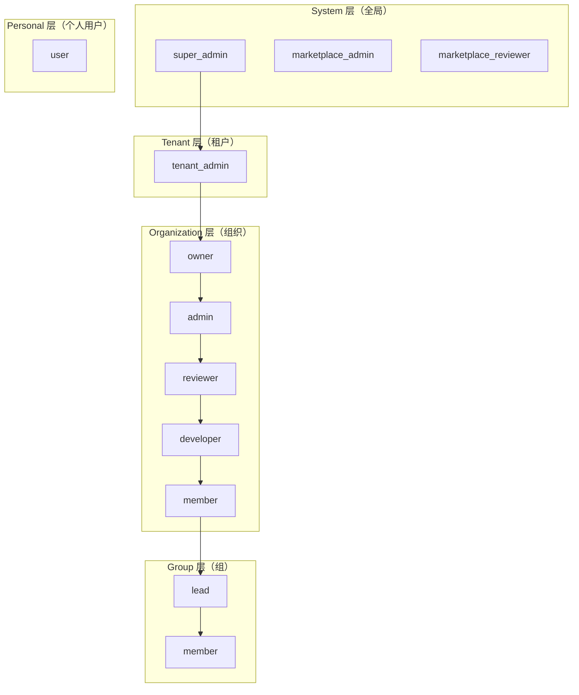
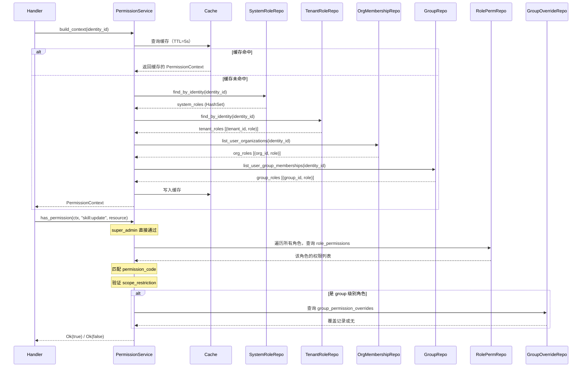
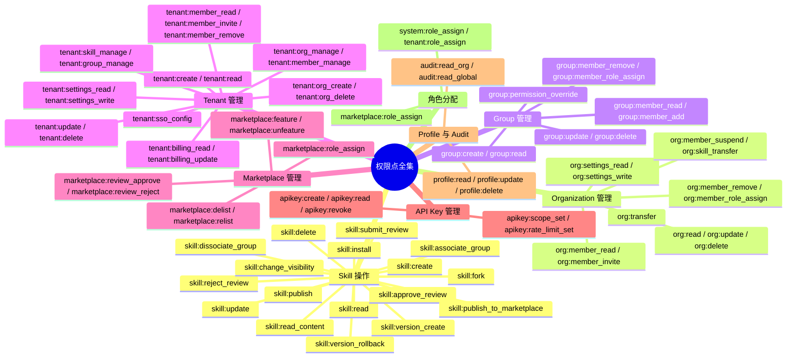

本页面完整解析 Skill Garden 的 **四级角色权限体系**，涵盖 System（系统级）、Tenant（租户级）、Organization（组织级）和 Group（组级）四个层级。你将理解：角色如何定义和分配、权限点如何绑定到角色、权限评估的完整流程（从 `build_context` 到 `has_permission`），以及专为 Skill 操作优化的 `check_skill_permission` 快速路径。该体系是实现多租户隔离、组织自治和细粒度权限控制的核心基础。

## 架构总览：四级塔式结构

权限模型呈 **自上而下逐层收窄** 的塔式结构：顶层（System）拥有全局影响，底层（Group）仅作用于特定组内资源。每个层级有独立的角色定义和分配表，通过 `role_permissions` 表统一绑定权限码。



**核心设计原则**：每一层级的角色仅在该层级的范围内生效。System 角色作用于全局，Tenant 角色作用于特定租户及其下所有组织，Organization 角色作用于特定组织及其下所有组，Group 角色仅作用于特定组。权限作用域通过 `scope_restriction` 字段（`none`/`own`/`org`/`tenant`/`group`/`global`）进一步细化。

Sources: [src/models/role.rs](src/models/role.rs#L1-L153), [src/models/system_role_assignment.rs](src/models/system_role_assignment.rs#L1-L44)

## 数据模型：四张角色分配表 + 一张权限绑定表

### 角色分配表（四层独立存储）

每一层级的角色分配各自使用独立的数据库表，避免跨层级耦合：

| 层级 | 表名 | 存储内容 | 角色示例 |
|------|------|---------|---------|
| System | `system_role_assignments` | `(identity_id, role_name, assigned_by)` | `super_admin`, `marketplace_admin`, `marketplace_reviewer` |
| Tenant | `tenant_role_assignments` | `(identity_id, tenant_id, role_name, assigned_by)` | `tenant_admin` |
| Organization | `org_memberships` | `(identity_id, organization_id, role, invited_by)` | `owner` → `admin` → `reviewer` → `developer` → `member` |
| Group | `memberships` | `(identity_id, group_id, role)` | `lead`, `member` |

**关键区别**：System 和 Tenant 层的角色分配是**显式分配**（通过 `assign`/`revoke` 操作管理），而 Organization 和 Group 层的角色分配是**成员身份绑定**（加入组织/组时指定角色）。

Sources: [src/db/migrations/019_add_system_role_assignments.sql](src/db/migrations/019_add_system_role_assignments.sql#L1-L15), [src/db/migrations/030_add_tenant_role_assignments.sql](src/db/migrations/030_add_tenant_role_assignments.sql#L1-L57), [src/db/migrations/017_add_user_model_and_org_memberships.sql](src/db/migrations/017_add_user_model_and_org_memberships.sql#L1-L64)

### 权限绑定表：role_permissions

`role_permissions` 表是所有层级角色与权限点的统一绑定枢纽，结构为 `(role_level, role_name, permission_code, scope_restriction)`：

- `role_level`：角色层级标识，取值 `system` / `tenant` / `organization` / `group` / `personal`
- `role_name`：角色名称
- `permission_code`：权限点代码，如 `skill:create`、`org:read`、`group:delete`
- `scope_restriction`：作用域限制，控制权限的生效范围

```sql
-- 示例：组织 owner 拥有 skill:create 权限，作用域为 org
INSERT INTO role_permissions (role_level, role_name, permission_code, scope_restriction)
VALUES ('organization', 'owner', 'skill:create', 'org');

-- 示例：个人用户拥有 skill:update 权限，作用域为 own（仅自己创建的资源）
INSERT INTO role_permissions (role_level, role_name, permission_code, scope_restriction)
VALUES ('personal', 'user', 'skill:update', 'own');
```

**scope_restriction 取值含义**：

| 取值 | 含义 | 适用场景 |
|------|------|---------|
| `none` | 无限制，在同一层级内全局生效 | tenant_admin 的 tenant:read |
| `own` | 仅作用于用户自己创建的资源 | personal user 的 skill:update |
| `org` | 仅作用于用户所属组织的资源 | organization member 的 skill:read |
| `tenant` | 仅作用于用户所属租户的资源 | tenant_admin 的 org:read |
| `group` | 仅作用于用户所属组的资源 | group lead 的 group:update |
| `global` | 跨层级全局生效 | super_admin 的 skill:read |

Sources: [src/db/migrations/018_add_rbac_and_group_skills.sql](src/db/migrations/018_add_rbac_and_group_skills.sql#L1-L200), [src/models/role_permission.rs](src/models/role_permission.rs#L1-L22)

## 四层角色详解

### System 层：全局管理角色

System 层是最高权限层级，角色通过 `system_role_assignments` 表直接分配给 Identity。当前定义三个系统角色：

| 角色 | 典型权限 | 分配者 | 适用场景 |
|------|---------|--------|---------|
| `super_admin` | 全部权限（通配符 `*`） | 仅 super_admin 自身 | 系统运维、全局配置、租户管理 |
| `marketplace_admin` | 市场审核、精选/下架、全局只读 | super_admin | 技能市场运营管理 |
| `marketplace_reviewer` | 审核通过/拒绝、下架、全局只读 | super_admin | 技能市场审核员 |

System 角色的权限默认不设 scope 限制（`scope_restriction = 'none'` 或 `'global'`），即拥有跨租户、跨组织的全局影响能力。迁移 040 中特意移除了 `marketplace_admin` 的 `tenant:read` 权限，以防止市场管理员看到租户管理界面——这是权限粒度精细化调整的典型实例。

Sources: [src/models/system_role_assignment.rs](src/models/system_role_assignment.rs#L17-L44), [src/db/migrations/040_remove_market_admin_tenant_read.sql](src/db/migrations/040_remove_market_admin_tenant_read.sql#L1-L12)

### Tenant 层：租户管理角色

Tenant 层通过 `tenant_role_assignments` 表将角色绑定到 `(identity, tenant)` 对。当前定义唯一的角色 `tenant_admin`：

`tenant_admin` 在其管理的租户范围内拥有 **几乎等同于 super_admin 的管控能力**，包括：
- 租户配置管理（`tenant:read`, `tenant:update`, `tenant:sso_config`, `tenant:settings_write`）
- 成员管理（`tenant:member_read`, `tenant:member_invite`, `tenant:member_remove`）
- 组织管理（`tenant:org_create`, `tenant:org_delete`）
- 跨组织资源管理（`org:read`, `org:member_read`, `skill:read`, `skill:update`, `group:read` 等）——迁移 038 大幅扩展了 tenant_admin 的权限范围

**重要设计取舍**：tenant_admin 的权限经历了两阶段演进。迁移 030 初始定义时，tenant_admin 对组织资源的权限有限（只读 + 安装）；迁移 038 将其扩展为几乎全权管理（包括 `skill:update`, `skill:delete`, `org:update`, `org:delete`, `group:create` 等），仅在 scope 上受限于 `tenant` 而非 `none`。这意味着 tenant_admin 可以在其租户内执行任何管理操作，但不能跨租户。

Sources: [src/db/migrations/030_add_tenant_role_assignments.sql](src/db/migrations/030_add_tenant_role_assignments.sql#L1-L57), [src/db/migrations/038_add_is_current_and_tenant_perms.sql](src/db/migrations/038_add_is_current_and_tenant_perms.sql#L1-L70)

### Organization 层：组织角色体系

Organization 层是 RBAC 体系中最复杂的层级，通过 `org_memberships` 表建立 `(identity, organization, role)` 三元组。五个组织角色按权限等级排序：

```
Owner > Admin > Reviewer > Developer > Member
```

**角色权限全景**（以迁移 018 定义为准）：

| 权限域 | Owner | Admin | Reviewer | Developer | Member |
|--------|:-----:|:-----:|:--------:|:---------:|:-----:|
| 组织管理 (`org:*`) | ✅ 全部 | ✅ 除 delete/transfer | ❌ | ❌ | ❌ |
| 成员管理 (`org:member_*`) | ✅ 全部 | ✅ 全部 | ❌ | ❌ | ❌ |
| Skill 创建/读/安装 | ✅ | ✅ | ✅ Read Only | ✅ Create/Read/Install | ✅ Read/Install |
| Skill 更新/删除 | ✅ | ✅ | ❌ | ✅ (own scope) | ❌ |
| Skill 审核 (approve/reject) | ✅ | ✅ | ✅ | ❌ | ❌ |
| Skill 发布 | ✅ | ✅ | ❌ | ❌ | ❌ |
| Skill 提交审核 | ✅ | ✅ | ✅ | ✅ | ❌ |
| 分组管理 (`group:*`) | ✅ 全部 | ✅ 全部 | ✅ Read Only | ✅ Read Only | ✅ Read Only |
| API Key 管理 | ✅ 全部 | ✅ 全部 | ✅ 有限 | ✅ 有限 | ✅ 有限 |

**scope_restriction 的 org 语义**：Organization 层角色的权限默认带有 `scope_restriction = 'org'`，意味着该权限仅对用户所属组织内的资源生效。当 `has_permission()` 检查权限时，会验证资源 `organization_id` 是否匹配用户 `org_roles` 中的组织 ID。

**Developer 的 own scope**：Developer 的 `skill:update`、`skill:delete`、`skill:version_create` 的 scope_restriction 为 `'own'`，这意味着 Developer 只能编辑自己创建的 Skill，不能编辑组织中其他 Developer 创建的 Skill。这是 RBAC 中"资源所有权"概念的体现。

**OrgRole 的排序实现**：`OrgRole` 枚举手动实现了 `Ord` trait，定义了 `Member(0) < Developer(1) < Reviewer(2) < Admin(3) < Owner(4)` 的等级排序，使得权限检查可以通过 `role >= OrgRole::Reviewer` 等方式简洁表达。

Sources: [src/models/org_membership.rs](src/models/org_membership.rs#L1-L108), [src/db/migrations/018_add_rbac_and_group_skills.sql](src/db/migrations/018_add_rbac_and_group_skills.sql#L200-L389)

### Group 层：组内角色

Group 层通过 `memberships` 表（迁移 014 创建，迁移 017 添加 `role` 字段）建立 `(identity, group, role)` 三元组。两个组内角色：

| 角色 | 权限范围 | 典型权限 |
|------|---------|---------|
| `lead` | 组内全部 21 项权限 | 组 CRUD、成员管理、Skill 操作（CRUD/审核/发布/关联）、权限覆盖 |
| `member` | 组内 9 项权限 | 组只读、Skill 只读/安装/更新/版本创建/提交审核 |

**Group 层权限的 scope 语义**：Group 角色的 `scope_restriction` 均为 `'group'`，意味着：
- `lead` 的 `group:delete` 只能删除自己所在的组，不能删除组织内其他组
- `lead` 的 `skill:delete` 只能删除关联到该组的 Skill

**Group Permission Override 机制**：`group_permission_overrides` 表允许针对特定 group 的特定角色进行**精细化的权限覆盖**：

| 场景 | SQL 操作 |
|------|---------|
| 限制 lead 不能删除组 | `INSERT OVERRIDE (group_id, 'lead', 'group:delete', false)` |
| 允许 member 创建 Skill | `INSERT OVERRIDE (group_id, 'member', 'skill:create', true)` |

覆盖规则：`granted = true` 强制授予（即使全局 `role_permissions` 没有），`granted = false` 强制拒绝（即使全局 `role_permissions` 有）。在 `has_permission()` 中，group 级别的权限检查会先查 `group_permission_overrides` 表，有覆盖记录则按覆盖决定，无覆盖记录则默认允许（向后兼容设计）。

**⚠️ 当前状态**：Group 层权限的 `build_context()` 加载尚未启用（`group_roles` 在 `PermissionContext` 中固定为空向量），这是已知的未完成功能。详见设计文档的修复方案。

Sources: [src/models/group.rs](src/models/group.rs#L1-L111), [src/models/group_permission_override.rs](src/models/group_permission_override.rs#L1-L24), [docs/group-permission-design.md](docs/group-permission-design.md#L1-L388)

### Personal 层：个人用户角色

独立于四级塔式结构之外，存在一个 `personal` 层级，代表**不隶属于任何组织的个人用户**。唯一的角色 `user` 拥有 17 项权限，scope_restriction 均为 `'own'`，即仅能操作自己创建的资源：

| 权限域 | 权限码 |
|--------|--------|
| Skill 管理 | `skill:create`, `skill:read`, `skill:update`, `skill:delete`, `skill:install`, `skill:fork` |
| Skill 版本 | `skill:version_create`, `skill:version_rollback` |
| Skill 审核 | `skill:submit_review` |
| Skill 可见性 | `skill:change_visibility` |
| API Key 管理 | `apikey:create`, `apikey:read`, `apikey:revoke` |
| 个人资料 | `profile:read`, `profile:update`, `profile:delete` |

Sources: [src/db/migrations/018_add_rbac_and_group_skills.sql](src/db/migrations/018_add_rbac_and_group_skills.sql#L340-L389)

## 权限评估引擎：PermissionService 的核心流程

权限评估分为两个层次：**通用路径**（`build_context` → `has_permission`）和 **Skill 专用路径**（`check_skill_permission`）。

### 通用路径：build_context + has_permission



**`PermissionContext` 结构**：包含五个字段，分别对应四级角色 + 用户身份标识：

```rust
pub struct PermissionContext {
    pub identity_id: Uuid,
    pub system_roles: HashSet<String>,           // 系统级角色名集合
    pub tenant_roles: Vec<(Uuid, String)>,        // (租户ID, 角色名)
    pub org_roles: Vec<(Uuid, String)>,           // (组织ID, 角色名)
    pub group_roles: Vec<(Uuid, String)>,         // (组ID, 角色名)
}
```

**`has_permission()` 三步走**：
1. **super_admin 短路**：如果用户是 super_admin，直接返回 `true`，跳过所有后续检查
2. **角色遍历**：按 system → tenant → organization → group 的顺序，遍历所有角色条目，逐一查询 `role_permissions` 表获取该角色的权限列表
3. **scope 验证**：对匹配 `permission_code` 的权限条目，根据 `scope_restriction` 验证资源归属：
   - `none`：直接通过
   - `own`：验证 `resource.author_identity_id == ctx.identity_id`
   - `tenant`：验证角色绑定的 `tenant_id` 匹配资源的 `tenant_id`
   - `org`：验证角色绑定的 `org_id` 匹配资源的 `organization_id`
   - `group`：验证角色绑定的 `group_id` 匹配资源的 `group_id`
   - 对于 group 级别角色，还会查询 `group_permission_overrides` 表进行覆盖判断

**5 秒 TTL 缓存**：`context_cache` 是一个 `Arc<Mutex<HashMap<Uuid, ContextCacheEntry>>>`，对同一用户 5 秒内的多次 `build_context` 调用直接返回缓存结果，减少高频权限查询的数据库负载。

Sources: [src/services/permission.rs](src/services/permission.rs#L500-L699), [src/services/permission.rs](src/services/permission.rs#L1-L200)

### Skill 专用路径：check_skill_permission

`check_skill_permission` 是专为 Skill 操作优化的快速权限检查路径，**不构建完整的 PermissionContext**，而是通过独立的数据库查询进行决策。它接受以下参数：

```rust
pub async fn check_skill_permission(
    &self,
    identity_id: Uuid,
    skill_owner_type: &str,          // "user" 或 "organization"
    skill_owner_id: Option<Uuid>,     // 所有者的 ID
    skill_author_identity_id: Option<Uuid>,  // 创建者的 ID
    skill_status: &str,              // "published", "draft", "pending_review" 等
    skill_visibility: &str,          // "marketplace", "org_visible", "private"
    skill_marketplace_status: Option<&str>,  // 市场状态
    action: SkillAction,             // 操作类型
) -> Result<(), String>
```

**决策树**（适用于所有动作的通用前置检查 + 按动作类型的分支逻辑）：

```
check_skill_permission(identity_id, skill, action):
  1. super_admin? → ✅ 允许所有
  2. tenant_admin? → ✅ 允许所有（其租户范围内）
  3. 按 action 类型分支：
     a. Read:
        - 已发布的市场 Skill → ✅ 所有人可读
        - 所有者 → ✅
        - 同组织成员 → ✅
        - 市场管理员（含 reviewer）→ ✅ 可读已提交市场的 Skill
     b. Update/Delete:
        - 个人所有者 → ✅
        - 组织 Admin+ → ✅ 可编辑任何
        - 组织 Developer → ✅ 仅可编辑自己创建的（own scope）
     c. SubmitReview:
        - 个人所有者 → ✅
        - 组织 Developer+ → ✅
     d. Approve/Reject:
        - 组织内不能审核自己的 Skill
        - 组织 Reviewer+ → ✅
     e. Publish / PublishToMarketplace:
        - 个人所有者 → ✅
        - 组织 Admin+ → ✅
```

**为什么需要独立路径**？`check_skill_permission` 将 Skill 的权限逻辑集中在一个函数中，避免了在多个 Handler 中重复编写相同的权限判断代码。它比通用的 `has_permission` 更高效（不需要构建完整的 context），但灵活性较低（仅适用于 Skill 操作）。

Sources: [src/services/permission.rs](src/services/permission.rs#L200-L500)

## 前端权限集成：Store 驱动的角色判断

前端通过 `permissionStore`（Svelte writable store）同步后端权限状态，实现 UI 的动态渲染。Store 初始化后，提供四个维度的角色判断函数：

| 函数 | 用途 | 后端对应 |
|------|------|---------|
| `hasPermission(code)` | 检查是否有特定权限码 | `has_permission()` |
| `hasSystemRole(role)` | 检查是否有系统角色 | `system_role_assignments` |
| `hasOrgRole(orgId, ...roles)` | 检查在组织中的角色 | `org_memberships` |
| `isAnyAdmin()` | 判断是否为任意管理员 | 汇总 system + tenant 角色 |
| `isPureUser()` | 判断是否为纯个人用户 | 非管理员 |

**数据流**：用户登录 → `auth.login()` → `permissionStore.initFromLogin(user)`（基于登录响应初始化）→ 可选调用 `permissionStore.refresh()`（调用 `GET /users/me/permissions` 刷新完整权限列表）。

**组织上下文持久化**：`localStorage` 存储 `selected_org` 用于跨页面/跨会话保持组织上下文。`validateSelectedOrg()` 函数在每次权限初始化时校验当前用户是否仍属于该组织，若不属于则清除，防止用户切换或权限变更后遗留无效状态。

Sources: [admin/src/stores/permission.js](admin/src/stores/permission.js#L1-L172), [admin/src/stores/auth.js](admin/src/stores/auth.js#L1-L90)

## 权限点全景：从 skill:create 到 marketplace:feature

迁移 018 定义了 48+ 个基础权限点，迁移 030 和 033 追加了市场/租户管理权限，迁移 038 进一步扩展了租户管理权限。以下是按资源类型分类的完整权限点清单：



Sources: [src/db/migrations/018_add_rbac_and_group_skills.sql](src/db/migrations/018_add_rbac_and_group_skills.sql#L1-L200), [src/db/migrations/033_add_marketplace_permissions.sql](src/db/migrations/033_add_marketplace_permissions.sql#L1-L114), [src/db/migrations/038_add_is_current_and_tenant_perms.sql](src/db/migrations/038_add_is_current_and_tenant_perms.sql#L1-L70)

## 最佳实践与设计模式

**权限检查的两种路径选择**：
- **Skill 操作**：优先使用 `check_skill_permission`，它封装了 Skill 所有操作类型的完整决策树，代码更简洁
- **通用资源操作**：使用 `build_context` + `has_permission`，灵活性更高，支持任意资源类型和 scope 限制

**Role 与 Permission 的分离设计**：角色是权限的载体，权限是原子操作。这种分离使得：
- 可以新增角色而不修改权限定义
- 可以调整角色与权限的绑定而不影响业务代码
- 可以通过 `group_permission_overrides` 在组级别微调权限

**scope_restriction 的层次化验证**：权限验证时，scope 的匹配是"从具体到抽象"的——先匹配精确的 `group_id`，再匹配 `org_id`，然后 `tenant_id`，最后 fallback 到 `owner_id`。这种设计使得同一个 permission_code 可以在不同角色中拥有不同的生效范围。

**迁移演进见证**：从迁移 014（初始角色定义）到迁移 040（移除 market_admin 的 tenant:read），权限体系经历了十数次迭代，每次迁移都体现了对权限粒度的精细化调整。建议阅读 [数据库迁移体系：从 001 到 040 的演进路线](28-shu-ju-ku-qian-yi-ti-xi-cong-001-dao-040-de-yan-jin-lu-xian) 了解完整演进历史。

---

**继续阅读**：
- [身份与租户模型：Identity、Tenant、Organization 多级体系](7-shen-fen-yu-zu-hu-mo-xing-identity-tenant-organization-duo-ji-ti-xi) — 理解 RBAC 的"主体"（Identity）和"资源域"（Tenant/Organization）
- [Permission 服务：多层级权限上下文构建与缓存](15-permission-fu-wu-duo-ceng-ji-quan-xian-shang-xia-wen-gou-jian-yu-huan-cun) — 深入 PermissionService 的实现细节
- [前端权限系统：Store 驱动的角色判断与 UI 动态渲染](23-qian-duan-quan-xian-xi-tong-store-qu-dong-de-jiao-se-pan-duan-yu-ui-dong-tai-xuan-ran) — 了解前端如何消费后端权限数据