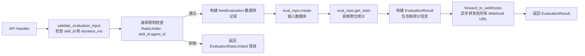
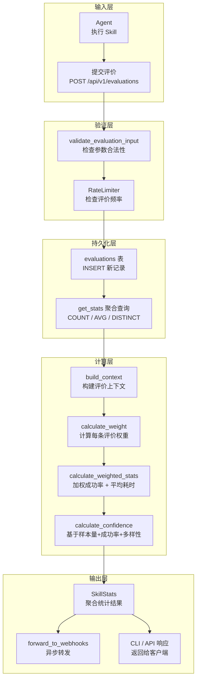

评价与置信度模型是 Skill Garden 体系中用于量化 Skill 质量的子系统。它定义了 Agent 如何提交评价、系统如何聚合统计、置信度如何计算，以及结果如何通过 Webhook 向外分发。这一模型不依赖人工评分，而是以**自动化运行指标（成功/失败、执行耗时、错误类型）**和**语义标签（可靠、快速、稳定、实验性）**为输入，通过加权统计算法生成可量化的质量信号。

## 核心数据模型：评价、统计与置信度等级

评价体系自底向上由三个层次构成：原始评价记录（Evaluation）、聚合统计（SkillStats）、置信度等级（ConfidenceLevel）。原始评价是 Agent 执行 Skill 后提交的单条记录，聚合统计是对同一 Skill 下所有评价的加权汇总，置信度等级则是基于统计阈值的定性分类。

**Evaluation** 记录包含以下核心字段：`skill_id` 标识被评价的 Skill，`agent_id` 标识评价者，`success` 布尔值标记执行成功与否，`duration_ms` 记录执行耗时，可选的 `error_type` 枚举（Timeout / Crash / LogicError / Other）描述失败原因，以及 `tags` 向量（Reliable / Fast / Stable / Experimental）承载语义标签。每条评价自动生成 UUID 型 `id` 和时间戳 `timestamp`。Sources: [evaluation.rs](src/models/evaluation.rs#L26-L61)

**SkillStats** 是评价系统的核心输出，在返回给 CLI 客户端时还包含 `local_version` 和 `upgrade_available` 字段用于版本升级提示，但其统计核心在于五个指标：`success_rate`（加权成功率，0-1）、`avg_duration_ms`（加权平均执行时间）、`total_evaluations`（总评价数）、`unique_agents`（评价过的唯一 Agent 数）、`confidence`（置信度，0-1）。Sources: [evaluation.rs](src/models/evaluation.rs#L88-L123)

**ConfidenceLevel** 是一个三值枚举（Low / Medium / High），其判定逻辑简洁直观：总评价数少于 3 条为 Low；超过 10 条且成功率高于 0.8 为 High；其余情况为 Medium。这一分类在 `SkillStats::confidence_level()` 方法中实现，为 CLI 和 UI 提供直观的置信度指示。Sources: [evaluation.rs](src/models/evaluation.rs#L79-L86, L113-L123)

## 数据库持久化：evaluations 表与 Repository 层

评价数据存储在 PostgreSQL 的 `evaluations` 表中，该表在 001 号迁移中创建。表结构包含 `id`（UUID 主键）、`skill_id`（外键关联 skills 表）、`agent_id`（外键关联 agents 表）、`success`（布尔值）、`duration_ms`（大整数）、`error_type`（可选字符串）、`tags`（字符串数组）、`timestamp`（带时区时间戳）。为优化查询性能，表上建有 `skill_id`、`agent_id` 和 `timestamp` 三个索引。Sources: [001_initial_schema.sql](src/db/migrations/001_initial_schema.sql#L46-L64)

**EvaluationRepository** 封装了所有数据库操作。`create` 方法插入新评价记录并返回完整行数据；`get_stats` 方法通过单条 SQL 聚合查询计算总评价数、成功数、平均耗时、去重 Agent 数，再调用 `get_top_tags` 获取高频标签，最后调用 `calculate_confidence` 计算置信度。`list_by_skill` 按时间倒序返回指定 Skill 的评价列表，可设置 LIMIT；`find_by_id` 和 `delete_by_id` 支持单条评价的查找和删除操作。Sources: [evaluation.rs](src/db/repositories/evaluation.rs#L41-L186)

Repository 层实现了**两层置信度计算**：`get_stats` 中的 `calculate_confidence` 方法基于样本量线性映射——总评价数少于 3 时返回 `total / 3.0`，3 到 10 之间时返回 `(total - 3.0) / 7.0 + 0.5`，超过 10 时返回 1.0。这一算法与 `weight.rs` 中的置信度计算不同，前者仅基于样本量，后者则同时考虑成功率与唯一成功 Agent 数。Sources: [evaluation.rs](src/db/repositories/evaluation.rs#L178-L186)

## 权重计算引擎：多维评价上下文与加权聚合

纯粹的统计平均无法反映评价质量的差异。`weight.rs` 实现了一套**多维权重计算引擎**，对每条评价根据其上下文动态赋予不同权重，使统计结果更鲁棒。

**EvalContext** 是权重计算的核心上下文结构，包含六个布尔维度：`has_success_history`（该 Agent 是否有过成功历史）、`is_recent`（是否在 24 小时内提交）、`matches_majority`（是否与多数评价一致）、`is_singleton`（是否是唯一评价）、`too_fast`（执行时间是否小于 1 秒）、`too_slow`（是否超过平均耗时 10 倍）。Sources: [weight.rs](src/utils/weight.rs#L6-L20)

**WeightConfig** 定义了所有权重常量：基础权重为 1.0；加分项包括成功历史加分（+0.2）、近期评价加分（+0.1）、与多数一致加分（+0.3）；扣分项包括唯一评价惩罚（-0.5）、过快惩罚（-0.3）、过慢惩罚（-0.2）。权重最小值被限定为 0.1，防止极端情况下降至零。Sources: [weight.rs](src/utils/weight.rs#L22-L42)

`calculate_weight` 函数接收一条评价和其上下文，从基础权重 1.0 开始逐一应用加分和扣分，返回最终权重值。`build_context` 函数则根据当前评价、总评价数、成功数、平均耗时和是否有成功历史，构建完整的上下文结构。这两个函数的分离使得权重计算逻辑可独立测试。Sources: [weight.rs](src/utils/weight.rs#L44-L96)

**加权统计计算**由 `calculate_weighted_stats` 函数完成，流程如下：

```mermaid
flowchart TD
    A[输入: 评价列表] --> B[按 agent_id 分组<br/>计算每个 Agent 的成功历史]
    B --> C[计算平均执行时间]
    C --> D[计算总成功数]
    D --> E[遍历每条评价]
    E --> F[构建 EvalContext<br/>build_context]
    F --> G[计算权重<br/>calculate_weight]
    G --> H{评价成功?}
    H -->|是| I[累加加权成功值]
    H -->|否| J[仅累加总权重]
    I --> K[还有下一条?]
    J --> K
    K -->|是| E
    K -->|否| L[计算加权成功率<br/>weighted_success / total_weight]
    L --> M[计算置信度<br/>calculate_confidence]
    M --> N[返回 (success_rate, avg_duration, confidence)]
```

这一算法在 `weight.rs` 的 `calculate_weighted_stats` 函数中实现，是评价系统统计计算的核心路径。Sources: [weight.rs](src/utils/weight.rs#L98-L156)

## 置信度计算：从样本量到多维信号

系统中存在**两套置信度计算逻辑**，服务于不同的使用场景：

| 计算位置 | 函数 | 输入参数 | 输出范围 | 设计目标 |
|---------|------|---------|---------|---------|
| Repository 层 | `calculate_confidence(total)` | 仅有总评价数 | 0.0 ~ 1.0 | 数据库快速查询，SQL 聚合后直接计算 |
| Weight 引擎 | `calculate_confidence(total, success_rate, unique_success)` | 总评价数、成功率、唯一成功 Agent 数 | 0.3 ~ 0.9 | 精确加权统计，用于 CLI 展示 |

Repository 层的计算逻辑简单直接：总评价数少于 3 时返回 `total / 3.0`（最大 1.0），3 到 10 之间时返回 `(total - 3.0) / 7.0 + 0.5`，超过 10 时返回 1.0。这一设计保证了置信度随样本量单调递增，但仅反映"数据量"而非"数据质量"。Sources: [evaluation.rs](src/db/repositories/evaluation.rs#L178-L186)

Weight 引擎的置信度计算则更为精细：总评价数少于 3 时返回 0.3（低置信度）；3 到 10 之间返回 0.5（中等置信度）；超过 10 条时，若成功率高于 0.8 且至少有 2 个不同的成功 Agent，则返回 0.9（高置信度），若成功率高于 0.5 则返回 0.7，否则返回 0.4。这一算法同时考虑了**样本量、成功率、多样性**三个维度，更能反映 Skill 的真实可靠程度。Sources: [weight.rs](src/utils/weight.rs#L158-L171)

## Evaluator 服务：评价收集、速率限制与 Webhook 转发

**EvaluatorService** 是评价系统的业务逻辑编排层，位于 `src/services/evaluator.rs`。它接收来自 API Handler 的请求，依次执行输入验证、速率限制检查、数据库持久化、统计计算和 Webhook 转发。

`add_evaluation` 方法是核心入口，其完整流程如下：



Sources: [evaluator.rs](src/services/evaluator.rs#L88-L151)

**输入验证**由 `validate_evaluation_input` 函数执行，检查 `skill_id` 不能为空，`duration_ms` 不能超过 1 小时（3,600,000ms）。Sources: [validation.rs](src/schemas/validation.rs#L177-L199)

**速率限制**基于 `skill_id:agent_id` 组合键，使用 `RateLimiter` 实现，默认配置为每 24 小时窗口内最多 10 次评价提交。`get_remaining` 方法可查询剩余可用次数。Sources: [evaluator.rs](src/services/evaluator.rs#L100-L103, L283-L286); [rate_limiter.rs](src/utils/rate_limiter.rs#L10-L24)

**Webhook 转发**支持通过环境变量 `AION_HIVE_EVAL_WEBHOOK_URLS` 配置多个 URL（逗号分隔），`add_evaluation` 完成后异步地 POST 完整的 `EvaluationResult` JSON 到所有配置的 Webhook。这一机制使得外部系统可以实时接收评价事件，触发自定义工作流（如自动通知、持续集成）。Sources: [evaluator.rs](src/services/evaluator.rs#L27-L86)

## API 层：评价 CRUD 与权限控制

评价相关的 API 端点定义在 `src/api/routes.rs` 中，处理逻辑在 `src/api/handlers/evaluations.rs` 中实现。

**POST /api/v1/evaluations** 是创建评价的端点，接收 `CreateEvaluationBody`（包含 `skill_id`、`success`、`duration_ms`、`error_type`、`tags`），使用 `AgentContext` 提取 `subject` 作为评价者身份，返回 `EvaluationCreatedResponse`（包含 `message`、`evaluation_id`、`new_stats`）。请求体中的 `error_type` 和 `tags` 字符串会被映射为枚举类型，不匹配的标签会被静默过滤。Sources: [evaluations.rs](src/api/handlers/evaluations.rs#L12-L58); [models.rs](src/api/models.rs#L79-L104)

**GET /api/v1/evaluations?skill_id=xxx** 列出指定 Skill 的评价列表，返回 `EvaluationItemResponse` 数组。**GET /api/v1/evaluations/:id** 获取单条评价详情。**DELETE /api/v1/evaluations/:id** 删除评价，但强制进行**所有权检查**：只有评价创建者（通过 `agent_id` 匹配）或管理员可以删除，删除操作同时记录审计日志。Sources: [evaluations.rs](src/api/handlers/evaluations.rs#L60-L182); [models.rs](src/api/models.rs#L1080-L1096)

## 错误处理体系

评价系统定义了两种专用错误类型：`EvaluationInvalid`（验证失败，如 skill_id 为空或执行时间过长）和 `EvaluationRateLimited`（超过速率限制），对应错误码 `EVALUATION_INVALID` 和 `EVALUATION_RATE_LIMITED`。Sources: [error.rs](src/models/error.rs#L26-L28, L56-L57, L101-L105)

## 评价生命周期与架构全景

将上述所有组件串联起来，评价数据的完整生命周期可以概括为：



## 设计要点与演进方向

当前评价体系的设计体现了几个关键决策：

**评价来源的匿名聚合**：评价以 `agent_id` 为标识，但不关联用户身份，使得评价系统可以在不暴露个人隐私的前提下积累质量数据。`unique_agents` 指标在置信度计算中起到关键作用，防止少数 Agent 的重复评价主导统计结果。

**权重的多维惩罚机制**：`is_singleton`（唯一评价）惩罚 0.5 是最重的惩罚项，反映了系统对"孤证"的保守态度。`too_fast` 和 `too_slow` 惩罚则过滤了异常执行时间，防止因环境问题导致的极端值扭曲统计结果。

**两阶段置信度计算**：Repository 层提供快速查询（仅基于样本量），Weight 引擎提供精确计算（结合成功率与多样性）。这种分层设计允许不同场景选择适合的计算精度——API 列表页用快速查询，CLI 详情页用精确计算。

**Webhook 的可扩展性**：通过 `AION_HIVE_EVAL_WEBHOOK_URLS` 环境变量配置，评价结果可以实时推送到外部系统，为未来集成 CI/CD 流水线、自动化测试报告、社区积分系统等留下了扩展空间。

---

**下一步阅读建议**：理解评价数据如何被消费，可以继续阅读 [Evaluator 服务：评价收集、统计聚合与 Webhook 转发](18-evaluator-fu-wu-ping-jie-shou-ji-tong-ji-ju-he-yu-webhook-zhuan-fa) 深入了解服务层的实现细节；要了解评价数据如何与 Skill 生命周期关联，请参考 [Skill 资产模型：生命周期、版本、可见性与市场状态](6-skill-zi-chan-mo-xing-sheng-ming-zhou-qi-ban-ben-ke-jian-xing-yu-shi-chang-zhuang-tai)。