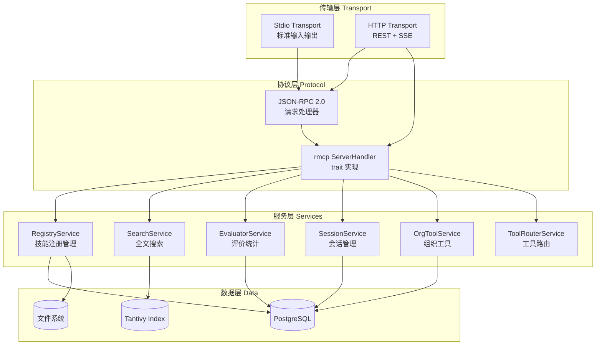
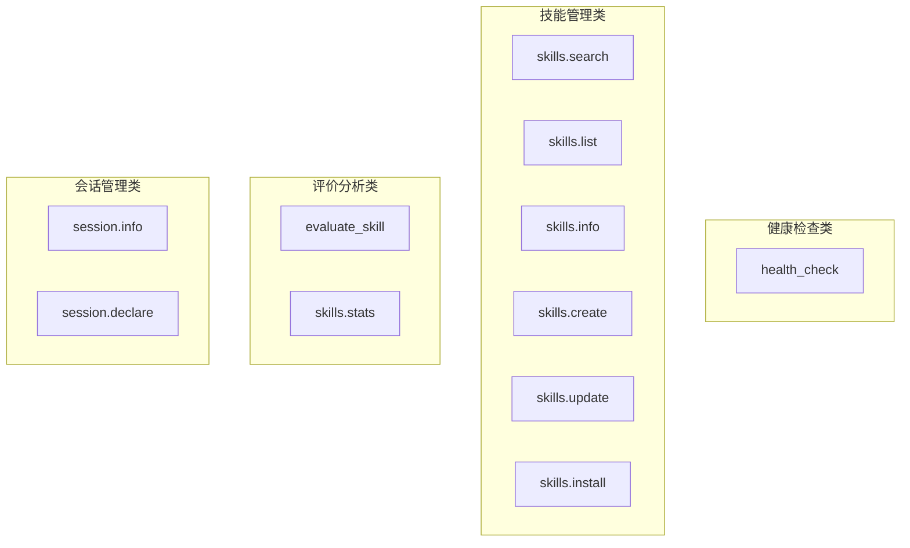

本文档详细阐述 AionHive 项目中 MCP (Model Context Protocol) Server 的架构设计与实现细节。MCP Server 作为 AI Agent 与 Skills 平台之间的桥梁，通过标准化的工具调用协议实现技能发现、调用与评价功能。

## 架构概览

MCP Server 采用分层架构设计，底层基于 `rmcp 1.0` 库实现协议处理，中间层整合企业级服务（注册、搜索、评价），上层暴露统一的工具调用接口。



## 核心组件结构

### McpServer 主结构体

`McpServer` 是 MCP Server 的核心实现，整合了所有业务服务并处理工具调用请求。结构体定义于 [src/mcp/server.rs#L23-L31](src/mcp/server.rs#L23-L31)：

```rust
pub struct McpServer {
    registry: RegistryService,       // 技能注册服务
    search: SearchService,           // 全文搜索服务
    evaluator: EvaluatorService,     // 评价统计服务
    session: SessionService,         // 会话管理服务
    org_tool: OrgToolService,        // 组织工具服务
    tool_router: ToolRouterService, // 工具路由服务
    agent_context: Option<AgentContext>, // Agent 认证上下文
}
```

### AgentContext 认证上下文

`AgentContext` 封装了通过 JWT Token 解析出的 Agent 身份信息，用于访问控制和会话关联。定义于 [src/mcp/server.rs#L34-L41](src/mcp/server.rs#L34-L41)：

```rust
#[derive(Debug, Clone)]
pub struct AgentContext {
    pub agent_id: String,           // Agent 唯一标识
    pub org_id: Option<uuid::Uuid>,  // 组织 ID（多租户支持）
    pub session_id: Option<uuid::Uuid>, // 当前会话 ID
    pub roles: Vec<String>,         // 角色列表
    pub scope: Vec<String>,         // 权限范围
}
```

## 服务初始化与依赖注入

### 构造方法

`McpServer::new()` 接收 6 个服务实例作为构造参数，并在初始化时从环境变量 `AION_HIVE_JWT_TOKEN` 解析认证信息。实现见 [src/mcp/server.rs#L43-L63](src/mcp/server.rs#L43-L63)：

```rust
impl McpServer {
    pub fn new(
        registry: RegistryService,
        search: SearchService,
        evaluator: EvaluatorService,
        session: SessionService,
        org_tool: OrgToolService,
        tool_router: ToolRouterService,
    ) -> Self {
        // 从环境变量提取并验证 JWT
        let agent_context = Self::extract_jwt_from_env();
        Self {
            registry, search, evaluator, session,
            org_tool, tool_router, agent_context,
        }
    }
}
```

### JWT 认证提取

从环境变量提取 JWT 并验证的逻辑定义于 [src/mcp/server.rs#L66-L76](src/mcp/server.rs#L66-L76)：

```rust
fn extract_jwt_from_env() -> Option<AgentContext> {
    let token = std::env::var("AION_HIVE_JWT_TOKEN").ok()?;
    let claims = verify_token(&token).ok()?;
    Some(AgentContext {
        agent_id: claims.agent_id,
        org_id: claims.org_id,
        session_id: claims.session_id,
        roles: claims.roles,
        scope: claims.scope,
    })
}
```

## 传输模式支持

MCP Server 支持两种传输模式，满足不同部署场景的需求：

| 传输模式 | 使用场景 | 配置方式 | 认证方式 |
|---------|---------|---------|---------|
| **Stdio** | 本地 CLI 集成 | 直接启动进程 | 环境变量 JWT |
| **HTTP/SSE** | Web 服务部署 | REST API + SSE | 请求头/参数 JWT |

### Stdio 传输模式

Stdio 模式使用标准输入输出进行通信，适合本地集成场景。实现于 [src/mcp/server.rs#L88-L92](src/mcp/server.rs#L88-L92)：

```rust
pub async fn run(self) -> Result<(), Box<dyn std::error::Error + Send + Sync>> {
    let (stdin, stdout) = stdio();
    serve_server(self, (stdin, stdout)).await?;
    Ok(())
}
```

### HTTP/SSE 传输模式

HTTP 模式通过 REST API 处理 JSON-RPC 请求，支持 Server-Sent Events 进行响应推送。HTTP 入口处理函数定义于 [src/main.rs#L38-L48](src/main.rs#L38-L48)：

```rust
async fn mcp_handler(
    State(state): State<Arc<AppRouterState>>,
    body: String,
) -> impl IntoResponse {
    let server = state.http.mcp_server.read().await;
    let result = server.handle_jsonrpc(&body).await;
    // 返回 JSON-RPC 响应
}
```

SSE 端点用于建立持久连接，实现双向通信：

```rust
async fn sse_handler(
    State(state): State<Arc<AppRouterState>>,
) -> impl IntoResponse {
    // 建立 SSE 连接，返回消息端点
}
```

## 工具定义与注册

### 工具列表定义

所有可用工具通过 `tools()` 静态方法定义，统一管理工具的元数据和输入模式。定义于 [src/mcp/server.rs#L386-L518](src/mcp/server.rs#L386-L518)：

```rust
fn tools() -> Vec<Tool> {
    vec![
        Tool::new("health_check", "Check if the MCP server is healthy", ...),
        Tool::new("skills.search", "Search skills by query and optional tags", ...),
        Tool::new("skills.list", "List all available skills", ...),
        Tool::new("skills.info", "Get detailed information about a skill", ...),
        Tool::new("skills.create", "Create a new skill", ...),
        Tool::new("skills.update", "Update an existing skill", ...),
        Tool::new("skills.install", "Mark a skill as installed", ...),
        Tool::new("evaluate_skill", "Submit an evaluation for a skill", ...),
        Tool::new("skills.stats", "Get statistics for a skill", ...),
        Tool::new("session.info", "Get current session information", ...),
        Tool::new("session.declare", "Declare agent capabilities", ...),
    ]
}
```

### 工具分类说明



**工具参数设计示例**：

| 工具名称 | 必需参数 | 可选参数 | 返回类型 |
|---------|---------|---------|---------|
| `skills.search` | - | query, tags, limit | SearchResult[] |
| `skills.info` | skill_id | - | Skill |
| `skills.create` | name, description, content | tags, version | Skill |
| `evaluate_skill` | skill_id, agent_id, success, duration_ms | error_type, tags | EvalResult |

## ServerHandler Trait 实现

MCP Server 实现了 `rmcp::ServerHandler` trait，定义了协议的标准化接口。实现于 [src/mcp/server.rs#L529-L780](src/mcp/server.rs#L529-L780)：

### 获取服务器信息

```rust
impl ServerHandler for McpServer {
    fn get_info(&self) -> ServerInfo {
        rmcp::model::InitializeResult::new(ServerCapabilities::default())
            .with_server_info(Implementation::new("aion-hive", env!("CARGO_PKG_VERSION")))
            .with_instructions("Enterprise Skills Sharing Platform for AI Agents")
    }
}
```

### 列出工具实现

```rust
async fn list_tools(
    &self,
    _request: Option<rmcp::model::PaginatedRequestParams>,
    _context: rmcp::service::RequestContext<RoleServer>,
) -> Result<ListToolsResult, rmcp::ErrorData> {
    Ok(ListToolsResult {
        tools: Self::tools(),
        ..Default::default()
    })
}
```

### 调用工具实现

`call_tool` 方法是核心的工具调用入口，根据工具名称路由到对应的业务逻辑：

```rust
async fn call_tool(
    &self,
    request: CallToolRequestParams,
    _context: rmcp::service::RequestContext<RoleServer>,
) -> Result<CallToolResult, rmcp::ErrorData> {
    let name = request.name.as_ref();
    let args = request.arguments.unwrap_or_default();

    let result = match name {
        "skills.search" => { /* 搜索逻辑 */ }
        "skills.list" => { /* 列表逻辑 */ }
        "skills.info" => { /* 详情逻辑 */ }
        "skills.create" => { /* 创建逻辑 */ }
        "evaluate_skill" => { /* 评价逻辑 */ }
        // ...
    };

    Ok(result)
}
```

## 核心工具调用逻辑

### 技能搜索 (skills.search)

搜索功能委托给 `SearchService`，支持关键词和标签过滤。实现于 [src/mcp/server.rs#L558-L577](src/mcp/server.rs#L558-L577)：

```rust
"skills.search" => {
    let query = args.get("query").and_then(|v| v.as_str()).unwrap_or("").to_string();
    let tags = args.get("tags").and_then(|v| v.as_array()).map(|arr| {
        arr.iter().filter_map(|v| v.as_str().map(String::from)).collect()
    });
    let limit = args.get("limit").and_then(|v| v.as_u64()).unwrap_or(10) as usize;

    match self.search.search(&query, tags.as_deref(), limit) {
        Ok(results) => Self::json_success(serde_json::to_value(results).unwrap_or_default()),
        Err(e) => Self::json_error(format!("Search failed: {}", e)),
    }
}
```

### 技能创建 (skills.create)

创建功能整合 `RegistryService` 和 `SearchService`，实现技能创建与索引更新的原子操作。实现于 [src/mcp/server.rs#L607-L638](src/mcp/server.rs#L607-L638)：

```rust
"skills.create" => {
    let name = args.get("name").and_then(|v| v.as_str());
    let description = args.get("description").and_then(|v| v.as_str());
    let tags = args.get("tags").and_then(|v| v.as_array()).map(/* ... */);
    let content = args.get("content").and_then(|v| v.as_str());
    let version = args.get("version").and_then(|v| v.as_str()).unwrap_or("1.0.0");

    match (name, description, content) {
        (Some(name), Some(description), Some(content)) => {
            let new_skill = NewSkill {
                name: name.to_string(),
                description: description.to_string(),
                tags,
                content: content.to_string(),
                version: version.to_string(),
                // ...
            };
            match self.registry.create_skill(new_skill, "mcp-client", &self.search).await {
                Ok(skill) => Self::json_success(serde_json::to_value(skill).unwrap_or_default()),
                Err(e) => Self::json_error(format!("Create skill failed: {}", e)),
            }
        }
        _ => Self::json_error("name, description, and content are required".to_string()),
    }
}
```

### 技能评价 (evaluate_skill)

评价功能记录技能执行结果，用于置信度权重计算。实现于 [src/mcp/server.rs#L670-L712](src/mcp/server.rs#L670-L712)：

```rust
"skills.install" => {
    // 解析参数
    let skill_id = args.get("skill_id").and_then(|v| v.as_str());
    let agent_id = args.get("agent_id").and_then(|v| v.as_str());
    let success = args.get("success").and_then(|v| v.as_bool());
    let duration_ms = args.get("duration_ms").and_then(|v| v.as_u64());
    let error_type = /* 解析错误类型 */;
    let tags = /* 解析评价标签 */;

    match self.evaluator.add_evaluation(
        skill_id.to_string(),
        agent_id.to_string(),
        success,
        duration_ms,
        error_type,
        tags,
    ).await {
        Ok(result) => Self::json_success(/* ... */),
        Err(e) => Self::json_error(/* ... */),
    }
}
```

### 会话信息查询 (session.info)

会话信息需要 JWT 认证支持，根据 Token 中的会话 ID 返回对应的会话信息。实现于 [src/mcp/server.rs#L727-L758](src/mcp/server.rs#L727-L758)：

```rust
"session.info" => {
    let session_id = args.get("session_id").and_then(|v| v.as_str());

    // 验证 JWT 认证
    let ctx = match self.agent_context.as_ref() {
        Some(ctx) => ctx,
        None => return Ok(Self::json_error("JWT authentication required".to_string())),
    };

    // 验证会话 ID 匹配
    if let Some(req_session_id) = session_id {
        if let Some(jwt_session_id) = ctx.session_id {
            if req_session_id != jwt_session_id.to_string() {
                return Ok(Self::json_error("Session ID mismatch".to_string()));
            }
        }
    }

    // 返回会话信息
    let session_info = serde_json::json!({
        "session_id": ctx.session_id.map(|s| s.to_string()),
        "agent_id": ctx.agent_id,
        "org_id": ctx.org_id.map(|s| s.to_string()),
        "capabilities": ctx.scope,
        "roles": ctx.roles,
    });
    Self::json_success(session_info)
}
```

## JSON-RPC HTTP 处理

除了 `ServerHandler` trait，MCP Server 还实现了独立的 JSON-RPC 处理方法 `handle_jsonrpc()`，用于 HTTP 传输模式。实现于 [src/mcp/server.rs#L100-L195](src/mcp/server.rs#L100-L195)：

```rust
pub async fn handle_jsonrpc(&self, body: &str) -> Result<String, String> {
    let request: Value = serde_json::from_str(body)
        .map_err(|e| format!("Invalid JSON: {}", e))?;

    let method = request.get("method")
        .and_then(|v| v.as_str())
        .ok_or("Missing method")?;

    // 处理通知（无 id）
    if !request.get("id").is_some() {
        match method {
            "notifications/initialized" => return Ok("{}".to_string()),
            _ => return Err(format!("Unknown notification: {}", method)),
        }
    }

    let id = request.get("id");

    // 路由到对应处理
    let result = match method {
        "initialize" => { /* 初始化响应 */ }
        "tools/list" => { /* 工具列表 */ }
        "tools/call" => { /* 工具调用 */ }
        _ => return Err(format!("Unknown method: {}", method)),
    };

    Ok(serde_json::to_string(&result).unwrap_or_default())
}
```

## 响应格式化

工具调用结果通过 `json_success()` 和 `json_error()` 方法统一格式化。定义于 [src/mcp/server.rs#L520-L526](src/mcp/server.rs#L520-L526)：

```rust
fn json_error(msg: String) -> CallToolResult {
    CallToolResult::error(vec![Content::text(format!("{{\"error\": \"{}\"}}", msg))])
}

fn json_success(data: serde_json::Value) -> CallToolResult {
    CallToolResult::success(vec![Content::text(data.to_string())])
}
```

## 集成测试

MCP Server 的 E2E 测试使用 TypeScript 和 MCP SDK 实现。测试脚本位于 [tests/e2e/mcp_e2e_test.ts](tests/e2e/mcp_e2e_test.ts)：

```typescript
import { Client } from "@modelcontextprotocol/sdk@1.29.0/client";
import { StreamableHTTPClientTransport } from "@modelcontextprotocol/sdk@1.29.0/client/streamableHttp.js";

const MCP_SERVER_URL = "http://127.0.0.1:8080/mcp";

async function createClient() {
  const client = new Client({ name: "test-client", version: "1.0.0" });
  const transport = new StreamableHTTPClientTransport(MCP_SERVER_URL);
  await client.connect(transport);
  return client;
}

// 测试示例：健康检查
Deno.test({
  name: "MCP E2E - Health Check",
  async fn() {
    await withClient(async (client) => {
      const result = await client.callTool({
        name: "health_check",
        arguments: {},
      });
      // 验证结果
    });
  },
});
```

## 总结

MCP Server 实现采用了以下核心设计模式：

**依赖注入模式**：所有业务服务通过构造器注入，便于单元测试和模块替换。

**策略模式**：通过 `match` 语句根据工具名称路由到不同的处理策略，每种工具的逻辑相互独立。

**模板方法模式**：`ServerHandler` trait 定义了标准化接口，子类实现具体逻辑。

**认证上下文模式**：通过 `AgentContext` 封装认证信息，在整个请求生命周期中传递。

Sources: [src/mcp/server.rs](src/mcp/server.rs#L1-L781), [src/main.rs](src/main.rs#L1-L253), [src/api/jwt.rs](src/api/jwt.rs#L1-L201), [tests/e2e/mcp_e2e_test.ts](tests/e2e/mcp_e2e_test.ts#L1-L200)

---

**相关文档**：
- [MCP 协议接口](17-mcp-xie-yi-jie-kou) - 协议层面的详细定义
- [注册服务](11-zhu-ce-fu-wu) - 技能注册管理服务
- [搜索服务](12-sou-suo-fu-wu) - 全文搜索服务
- [评价服务](13-ping-jie-fu-wu) - 技能评价与统计
- [REST API 接口](18-rest-api-jie-kou) - HTTP API 端点说明