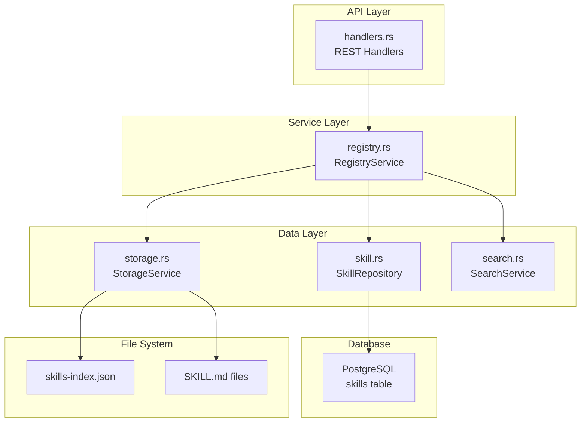
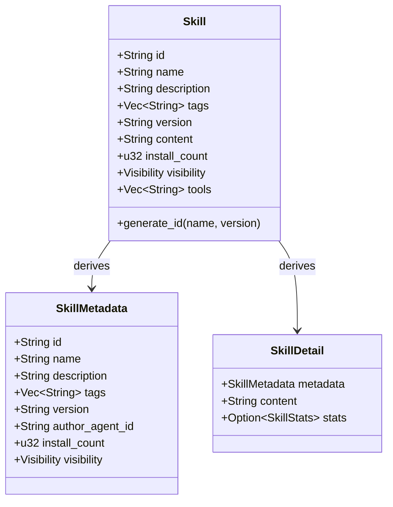
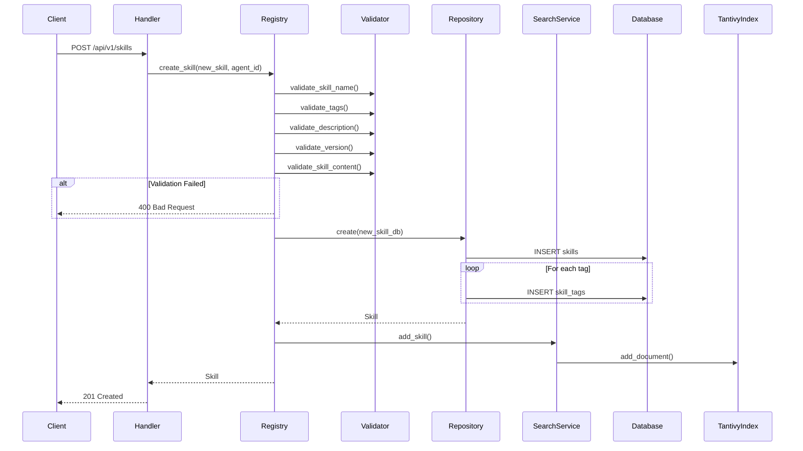
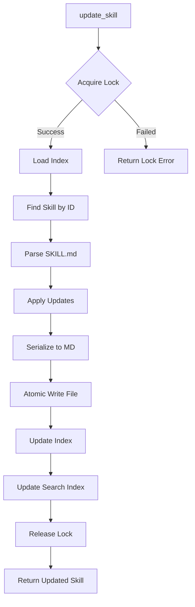
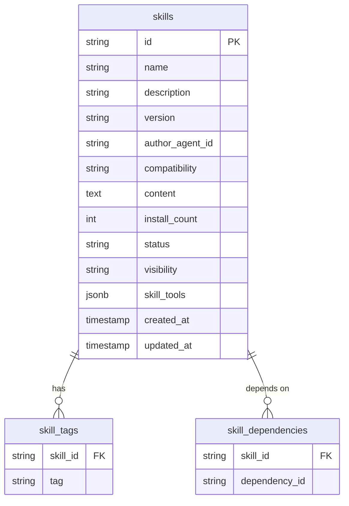
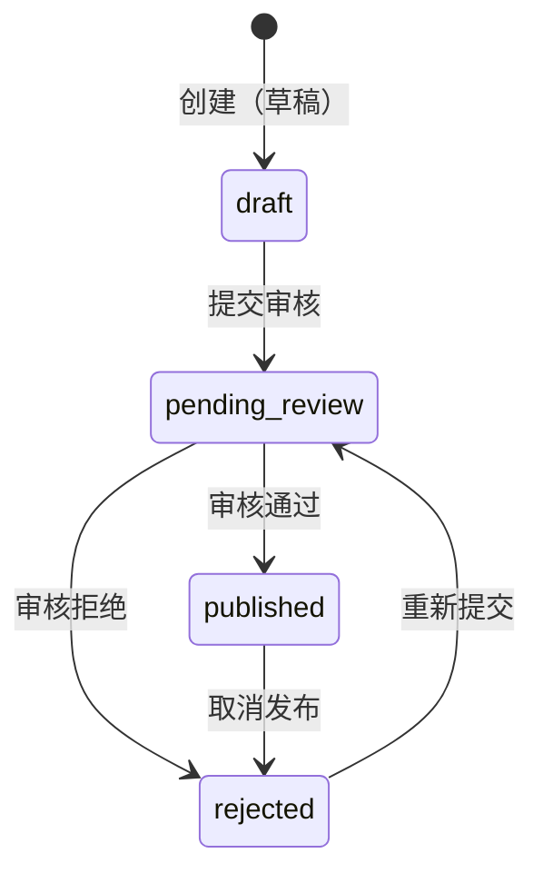

注册服务是 Anspire SkillGarden 的核心模块，负责 Skill 的完整生命周期管理——从创建、查询、更新到删除，同时集成了搜索索引同步和文件存储功能。作为系统的基础设施工具，它为 Agent 提供了 Skills 的注册与发现能力。

## 架构概览

注册服务采用分层架构设计，各层职责明确并通过依赖注入实现解耦：



这种设计确保了业务逻辑与数据访问的分离，StorageService 负责文件系统操作，SearchService 处理全文搜索索引，两者通过 RegistryService 协同工作。

Sources: [src/services/registry.rs](src/services/registry.rs#L1-L23)
Sources: [src/services/mod.rs](src/services/mod.rs#L1-L25)

## 核心数据结构

### Skill 模型

`Skill` 是系统的核心实体，包含 Skill 的所有属性：

| 字段 | 类型 | 说明 |
|------|------|------|
| `id` | String | 唯一标识符，格式 `skill-{name}-{version}` |
| `name` | String | Skill 名称，仅允许字母、数字、连字符和下划线 |
| `description` | String | Agent 可解析的描述文本 |
| `tags` | Vec<String> | 分类标签，最多 10 个 |
| `version` | String | 语义化版本号 (x.y.z) |
| `author_agent_id` | String | 创建者 Agent 标识 |
| `content` | String | SKILL.md 完整内容 |
| `visibility` | Visibility | 可见性策略 |
| `tools` | Vec<String> | Skill 引用的工具列表 |

Sources: [src/models/skill.rs](src/models/skill.rs#L7-L44)

### 数据模型层次

系统定义了三个不同粒度的数据模型以满足不同场景需求：



- **Skill**: 完整数据模型，用于详情查看和编辑
- **SkillMetadata**: 轻量级元数据，用于列表展示，不含 `content`
- **SkillDetail**: 详情视图，包含元数据、内容和统计信息

Sources: [src/models/skill.rs](src/models/skill.rs#L46-L139)

### 可见性策略

注册服务支持四种可见性级别，通过 `Visibility` 枚举实现：

| 枚举值 | 说明 | 适用场景 |
|--------|------|----------|
| `Private` | 私有，仅创建者可见 | 个人专用 Skill |
| `OrgVisible` | 组织内可见（默认） | 团队共享 Skill |
| `Marketplace` | 公开市场 | 社区贡献的 Skill |
| `Shared` | 指定 Agent 共享 | 定向协作场景 |

Sources: [src/models/skill_policy.rs](src/models/skill_policy.rs#L7-L29)

## 服务接口

### RegistryService

`RegistryService` 是注册服务的核心实现，提供以下方法：

| 方法 | 签名 | 功能描述 |
|------|------|----------|
| `create_skill` | `(NewSkill, &str, &SearchService) -> Result<Skill>` | 创建新 Skill |
| `update_skill` | `(skill_id, SkillUpdate, &str, &SearchService) -> Result<Skill>` | 更新 Skill |
| `delete_skill` | `(skill_id, &SearchService) -> Result<()>` | 删除 Skill |
| `get_skill` | `(skill_id) -> Result<Skill>` | 获取 Skill 详情 |
| `list_skills` | `() -> Result<Vec<SkillMetadata>>` | 列出所有 Skills |
| `count` | `() -> Result<u32>` | 获取 Skills 总数 |

Sources: [src/services/registry.rs](src/services/registry.rs#L16-L264)

### 创建流程

创建 Skill 的完整流程如下：



创建流程包含严格的输入验证、数据库持久化和搜索索引同步三个阶段。

Sources: [src/services/registry.rs](src/services/registry.rs#L66-L120)

### 更新流程

更新操作采用文件锁机制确保并发安全：



关键实现细节：
- 使用 `get_skill_lock()` 获取独占文件锁
- 支持部分更新（`description`、`tags`、`content` 独立可选）
- 更新后同步到搜索索引

Sources: [src/services/registry.rs](src/services/registry.rs#L122-L208)
Sources: [src/services/storage.rs](src/services/storage.rs#L177-L181)

## 数据验证

注册服务集成了多层次验证机制，确保数据质量和系统安全：

### 验证规则表

| 验证项 | 规则 | 错误类型 |
|--------|------|----------|
| 名称 | 非空，长度 ≤ 100，仅 `a-zA-Z0-9_-` | `InvalidSkillName` |
| 标签 | 最多 10 个，每个 ≤ 50 字符 | `TooManyTags` |
| 描述 | 长度 ≤ 2000 | `ValidationError` |
| 版本 | 符合 semver (x.y.z) | `InvalidVersion` |
| 内容 | ≤ 1MB，无恶意代码 | `MaliciousContent` |

Sources: [src/schemas/validation.rs](src/schemas/validation.rs#L1-L160)

### 恶意内容检测

系统检测以下危险模式：

```rust
const MALICIOUS_PATTERNS: &[&str] = &[
    "<script",           // XSS 注入
    "javascript:",       // JavaScript 协议
    "onerror=",          // 事件处理器注入
    "onclick=",          // 事件处理器注入
    "onload=",           // 事件处理器注入
    "onmouseover=",      // 事件处理器注入
    "eval(",             // 动态代码执行
    "innerHTML",         // DOM 操作
    "/etc/passwd",       // 路径遍历
    r"C:\Windows",       // Windows 路径遍历
    "..",                // 路径遍历
    "../",               // 路径遍历
    "file://",           // 本地文件协议
    "ftp://",            // FTP 协议
];
```

特别注意：代码块中的 `<script>` 标签会被排除，因为它们在 markdown 示例中是合法的。

Sources: [src/schemas/validation.rs](src/schemas/validation.rs#L12-L28)
Sources: [src/schemas/validation.rs](src/schemas/validation.rs#L100-L110)

## SKILL.md 文件格式

Skill 内容以 Markdown + YAML Frontmatter 格式存储：

```yaml
---
name: browse
description: A web browsing skill
tags: [web, http, scraping]
version: 1.0.0
author_agent_id: agent-123
created: 2024-01-15T10:30:00Z
updated: 2024-01-20T14:22:00Z
compatibility: ">=1.0.0"
dependencies: []
---

# SKILL.md Content

Your skill description and implementation here...
```

### Frontmatter 解析

注册服务实现了轻量级 frontmatter 解析器，支持以下字段：

| 字段 | 说明 |
|------|------|
| `name` | Skill 名称 |
| `description` | 描述文本 |
| `tags` | 标签数组 |
| `version` | 版本号 |
| `author_agent_id` | 作者 ID |
| `created` | 创建时间 (RFC3339) |
| `updated` | 更新时间 (RFC3339) |
| `compatibility` | 兼容性要求 |
| `dependencies` | 依赖列表 |

Sources: [src/services/registry.rs](src/services/registry.rs#L289-L399)

## REST API 接口

注册服务通过以下端点暴露功能：

### 端点概览

| 方法 | 路径 | 功能 |
|------|------|------|
| `GET` | `/api/v1/skills` | 列出 Skills（支持分页、标签、关键词过滤） |
| `POST` | `/api/v1/skills` | 创建新 Skill |
| `GET` | `/api/v1/skills/:id` | 获取 Skill 详情 |
| `PUT` | `/api/v1/skills/:id` | 更新 Skill |
| `DELETE` | `/api/v1/skills/:id` | 删除 Skill |
| `GET` | `/api/v1/skills/:id/stats` | 获取 Skill 统计信息 |

Sources: [src/api/routes.rs](src/api/routes.rs#L10-L17)

### 请求/响应示例

**创建 Skill 请求体**：

```json
{
  "name": "web-scraper",
  "description": "A skill for scraping web pages",
  "tags": ["web", "scraping", "http"],
  "content": "---\nname: web-scraper\n...\n\n# Web Scraper Skill\n\nThis skill provides...",
  "version": "1.0.0",
  "git_url": "https://github.com/agent/skills",
  "visibility": "org_visible",
  "tools": ["fetch", "parse-html"]
}
```

**创建成功响应**：

```json
{
  "message": "Skill created successfully",
  "skill_id": "skill-web-scraper-1.0.0"
}
```

**列表查询参数**：

| 参数 | 类型 | 说明 |
|------|------|------|
| `page` | usize | 页码，默认 1 |
| `page_size` | usize | 每页数量，默认 20，最大 100 |
| `tag` | string | 按标签过滤 |
| `keyword` | string | 关键词搜索（匹配名称和描述） |

Sources: [src/api/models.rs](src/api/models.rs#L32-L53)
Sources: [src/api/handlers.rs](src/api/handlers.rs#L30-L65)

## 数据库持久化

### Repository 模式

`SkillRepository` 封装所有数据库操作，使用 PostgreSQL 作为持久化存储：



### 状态机

Skill 拥有完整的状态流转：



有效的状态值：`draft`、`pending_review`、`published`、`rejected`

Sources: [src/db/repositories/skill.rs](src/db/repositories/skill.rs#L1-L155)
Sources: [src/db/repositories/skill.rs](src/db/repositories/skill.rs#L308-L324)

## 搜索集成

创建或更新 Skill 时，注册服务自动同步到 Tantivy 全文搜索引擎：

| 索引字段 | 类型 | 说明 |
|----------|------|------|
| `id` | STRING | 唯一标识符（存储） |
| `name` | TEXT | 名称（可搜索） |
| `description` | TEXT | 描述（可搜索） |
| `tags` | TEXT | 标签（可搜索） |
| `content` | TEXT | 内容（可搜索，不存储） |
| `install_count` | STRING | 安装次数（存储） |

Sources: [src/services/search.rs](src/services/search.rs#L48-L55)
Sources: [src/services/search.rs](src/services/search.rs#L86-L113)

## 与其他模块的集成

注册服务与以下模块存在依赖关系：

| 模块 | 集成方式 | 作用 |
|------|----------|------|
| [搜索服务](12-sou-suo-fu-wu) | 依赖注入 | 创建/更新/删除时同步索引 |
| [评价服务](13-ping-jie-fu-wu) | API 调用 | 获取 Skill 使用统计 |
| [存储服务](16-cun-chu-fu-wu) | 依赖注入 | 文件读写和原子写入 |
| 组织管理 | 数据库关联 | 多租户隔离 |

Sources: [src/services/registry.rs](src/services/registry.rs#L14)
Sources: [src/api/handlers.rs](src/api/handlers.rs#L74)

## 后续阅读

- [搜索服务](12-sou-suo-fu-wu)：了解全文搜索的实现细节
- [评价服务](13-ping-jie-fu-wu)：了解 Skill 统计数据的收集机制
- [存储服务](16-cun-chu-fu-wu)：了解原子写入和文件锁的实现
- [REST API 接口](18-rest-api-jie-kou)：完整的 API 参考文档