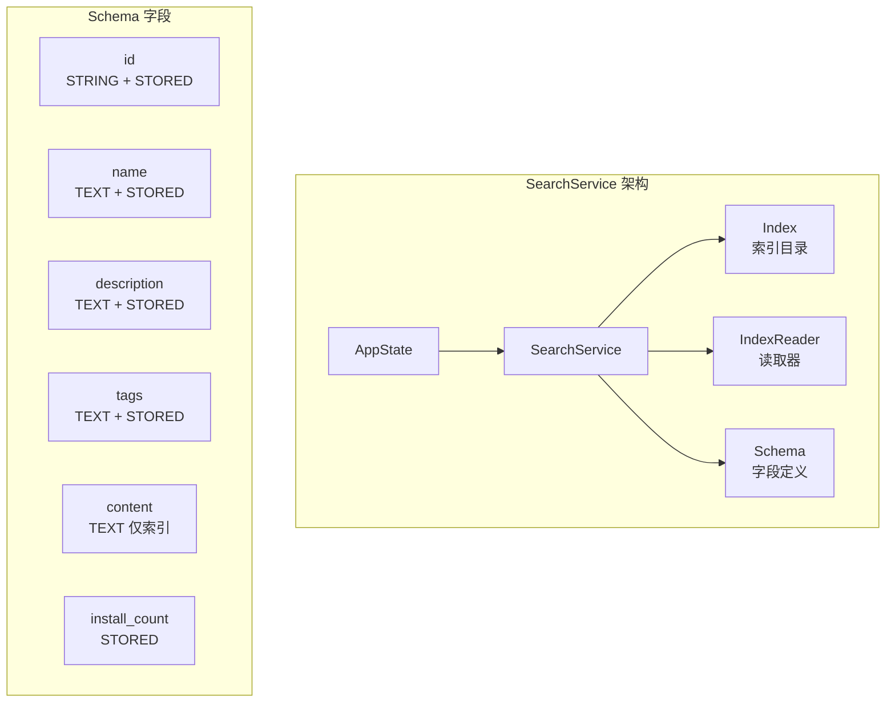
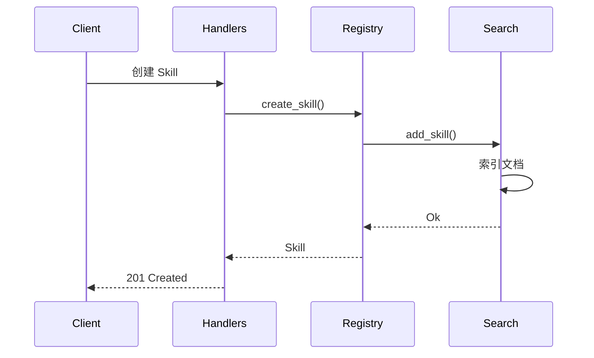

搜索服务是 Anspire SkillGarden 平台的核心组件之一，基于 **Tantivy 0.22** 全文搜索引擎实现，为 Skills 仓库提供高性能、可扩展的全文检索能力。与 [注册服务](11-zhu-ce-fu-wu) 紧密协作，确保 Skill 的创建、更新、删除操作与搜索索引保持同步。

## 技术选型

选择 Tantivy 作为搜索引擎的原因在于其**零拷贝设计**和**Rust 原生实现**带来的极致性能。Tantivy 是 Tantris 的后继者，被广泛用于生产环境中的全文搜索场景。

| 特性 | Tantivy | 替代方案对比 |
|------|---------|--------------|
| 性能 | 毫秒级查询响应 | ElasticSearch 需要网络开销 |
| 资源占用 | 极低（内存映射索引） | ElasticSearch 占用大 |
| 集成复杂度 | 简单（直接库调用） | ElasticSearch 需要集群管理 |
| 部署复杂度 | 无需额外进程 | ElasticSearch 需要独立部署 |

Sources: [Cargo.toml#L27-L28](Cargo.toml#L27-L28)

## 架构设计

### 核心数据结构

SearchService 的设计遵循简单的三层架构：**索引层**负责数据持久化，**读取层**提供并发查询能力，**Schema 层**定义可搜索字段。



Sources: [src/services/search.rs#L17-L22](src/services/search.rs#L17-L22), [src/services/search.rs#L48-L55](src/services/search.rs#L48-L55)

### 字段设计策略

索引 Schema 采用**差异化存储策略**：对于需要返回给客户端的字段（id、name、description、tags、install_count）使用 `STORED` 标志，而对于仅用于搜索匹配但不直接返回的内容（content）则不存储，以减少索引体积。

Sources: [src/services/search.rs#L53](src/services/search.rs#L53)

## 核心功能

### 索引管理

SearchService 提供完整的索引生命周期管理能力，包括创建、打开、批量重建等功能。

**初始化流程**支持两种模式：当索引目录存在 `meta.json` 时直接打开已有索引，否则创建新索引。这种设计确保了服务的幂等性，支持服务重启后的状态恢复。

Sources: [src/services/search.rs#L43-L77](src/services/search.rs#L43-L77)

```rust
// 索引初始化核心逻辑
let index = if index_path.join("meta.json").exists() {
    Index::open_in_dir(index_path)?  // 打开已有索引
} else {
    Index::create_in_dir(index_path, schema.clone())?  // 创建新索引
};
```

### 文档操作

搜索服务支持对索引文档的增删改查操作，所有写操作都会触发 `reader.reload()` 以确保读取器能看到最新数据。

| 方法 | 功能 | 内部实现 |
|------|------|----------|
| `add_skill()` | 添加 Skill 到索引 | writer.add_document() + commit() |
| `delete_skill()` | 从索引删除 | writer.delete_term() + commit() |
| `update_skill()` | 更新 Skill | delete + add 组合操作 |
| `search()` | 全文搜索 | QueryParser + TopDocs 收集器 |

Sources: [src/services/search.rs#L86-L135](src/services/search.rs#L86-L135)

### 全文搜索

search 方法是服务最核心的功能，支持多字段查询和标签过滤。

```rust
pub fn search(
    &self,
    query_str: &str,           // 搜索关键词
    tags: Option<&[String]>,   // 可选标签过滤
    limit: usize,             // 返回结果上限
) -> Result<Vec<SearchResult>, AppError>
```

**查询构建**：使用 Tantivy 的 QueryParser 解析查询字符串，搜索范围覆盖 name、description、tags、content 四个字段。当指定标签时，会将标签条件以 `tags:tag1 OR tags:tag2` 格式与主查询组合。

Sources: [src/services/search.rs#L137-L205](src/services/search.rs#L137-L205)

### 搜索结果

SearchResult 结构体封装了搜索结果的关键信息：

```rust
pub struct SearchResult {
    pub skill_id: String,      // Skill 唯一标识
    pub score: f32,           // 相关性得分
    pub install_count: u32,   // 安装次数（用于排序参考）
}
```

Sources: [src/services/search.rs#L268-L274](src/services/search.rs#L268-L274)

## 服务集成

### 应用状态集成

SearchService 作为 `AppState` 的核心成员之一，在应用启动时初始化，并传递给各个服务层。

Sources: [src/lib.rs#L43-L56](src/lib.rs#L43-L56), [src/lib.rs#L79](src/lib.rs#L79)

```rust
pub struct AppState {
    pub search: services::SearchService,
    // ... 其他服务
}
```

### 与 RegistryService 的协作

注册服务在执行 Skill 的创建、更新、删除操作时，会同步调用搜索服务以维护索引一致性。



Sources: [src/services/registry.rs#L66-L120](src/services/registry.rs#L66-L120), [src/api/handlers.rs#L84-L117](src/api/handlers.rs#L84-L117)

## MCP 协议暴露

搜索服务通过 MCP 协议的 `skills.search` 工具暴露给 AI Agent 使用。

Sources: [src/mcp/server.rs#L202-L221](src/mcp/server.rs#L202-L221), [src/mcp/server.rs#L393-L404](src/mcp/server.rs#L393-L404)

| 参数 | 类型 | 必填 | 说明 |
|------|------|------|------|
| query | string | 是 | 搜索查询词 |
| tags | string[] | 否 | 标签过滤条件 |
| limit | number | 否 | 结果数量限制，默认 10 |

```json
// MCP 工具调用示例
{
  "name": "skills.search",
  "arguments": {
    "query": "web scraping",
    "tags": ["python", "http"],
    "limit": 5
  }
}
```

## 索引重建

`rebuild_index` 方法提供全量索引重建能力，适用于索引损坏修复或批量导入场景。该方法会清空现有所有文档后重新索引提供的 Skill 列表。

Sources: [src/services/search.rs#L230-L265](src/services/search.rs#L230-L265)

## 性能特性

### 读取策略

使用 `ReloadPolicy::OnCommitWithDelay` 读取策略，在写入 commit 后延迟重载，减少频繁重载带来的性能开销。

Sources: [src/services/search.rs#L65-L68](src/services/search.rs#L65-L68)

### 写入配置

IndexWriter 使用 50MB 堆内存限制，适合中小规模索引场景。

Sources: [src/services/search.rs#L80-L84](src/services/search.rs#L80-L84)

## 错误处理

搜索服务使用统一的 `AppError` 错误类型，查询解析失败会返回 `ValidationError`，底层 Tantivy 错误会转换为 `InternalError`。

Sources: [src/models/error.rs#L119-L126](src/models/error.rs#L119-L126), [src/models/error.rs#L186-L191](src/models/error.rs#L186-L191)

## 后续学习路径

- [注册服务](11-zhu-ce-fu-wu) — 了解 Skill 的 CRUD 操作如何与搜索服务协作
- [评价服务](13-ping-jie-fu-wu) — 了解搜索结果如何与 Skill 统计数据结合
- [MCP 协议接口](17-mcp-xie-yi-jie-kou) — 深入了解通过 MCP 协议调用搜索的方法