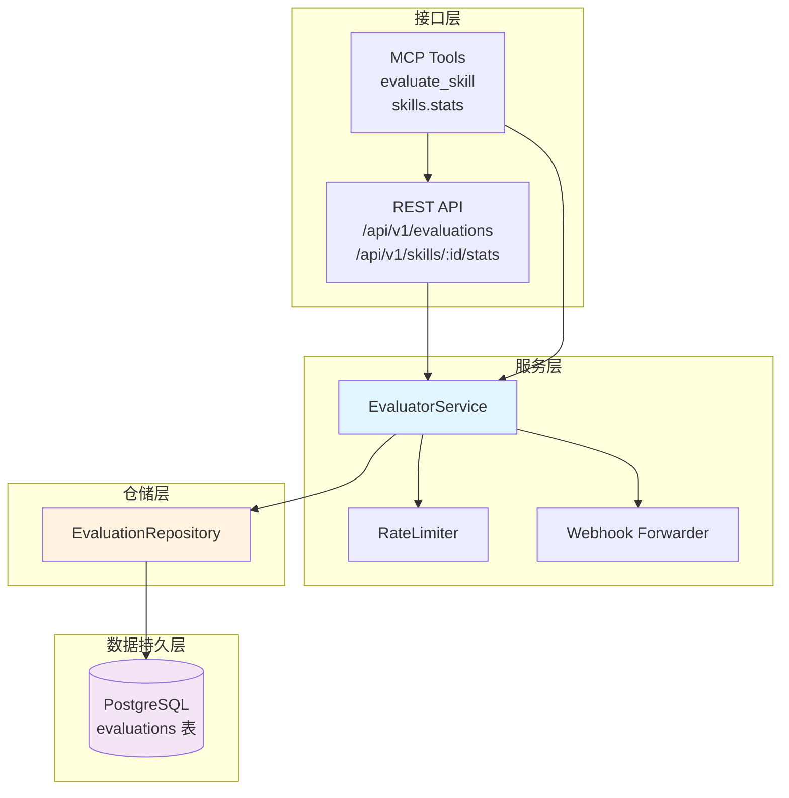

评价服务是 Anspire SkillGarden 平台的核心组件之一，负责收集、存储和分析 Agent 对 Skill 的执行评价数据。该服务基于众包评价机制，通过汇聚多方 Agent 的实际使用反馈来计算 Skill 的置信度，为智能路由和 Skill 推荐提供数据支撑。

## 架构概览

评价服务采用分层架构设计，从下至上依次为数据持久层、仓储层、服务层和接口层。各层职责清晰，通过 trait 抽象实现解耦，便于测试和扩展。



### 核心组件职责

| 组件 | 位置 | 职责 |
|------|------|------|
| `EvaluatorService` | `src/services/evaluator.rs` | 评价业务逻辑、webhook 转发、速率限制 |
| `EvaluationRepository` | `src/db/repositories/evaluation.rs` | 数据库 CRUD 操作、统计聚合 |
| `RateLimiter` | `src/utils/rate_limiter.rs` | 每个 Agent 对 Skill 的评价频率控制 |
| `SkillStats` | `src/models/evaluation.rs` | 统计数据模型、置信度等级计算 |

Sources: [evaluator.rs](src/services/evaluator.rs#L17-L25)
Sources: [evaluation.rs](src/models/evaluation.rs#L88-L123)

## 数据模型

### Evaluation 评价记录

单条评价记录包含执行结果、时间消耗、错误类型和标签等关键信息。系统通过 UUID 生成唯一标识，时间戳使用 UTC 标准时间。

```rust
pub struct Evaluation {
    pub id: String,                    // UUID 格式唯一标识
    pub skill_id: String,              // 被评价的 Skill ID
    pub agent_id: String,              // 评价 Agent 标识
    pub success: bool,                 // 执行是否成功
    pub duration_ms: u64,              // 执行耗时（毫秒）
    pub error_type: Option<ErrorType>,  // 错误类型（失败时）
    pub tags: Vec<EvalTag>,            // 评价标签
    pub timestamp: DateTime<Utc>,      // 评价时间
}
```

评价标签分为四种类型，用于描述 Skill 的特性：`Reliable`（可靠）、`Fast`（快速）、`Stable`（稳定）、`Experimental`（实验性）。错误类型则包括：`Timeout`（超时）、`Crash`（崩溃）、`LogicError`（逻辑错误）、`Other`（其他）。

Sources: [evaluation.rs](src/models/evaluation.rs#L26-L61)

### SkillStats 统计信息

统计信息是评价数据聚合的结果，用于呈现 Skill 的整体质量指标。

```rust
pub struct SkillStats {
    pub skill_id: String,
    pub success_rate: f64,              // 加权成功率 (0-1)
    pub avg_duration_ms: u64,            // 加权平均执行时间
    pub total_evaluations: u32,        // 总评价数
    pub unique_agents: u32,             // 评价过的唯一 Agent 数
    pub confidence: f64,                 // 置信度 (0-1)
    pub tags: Vec<String>,               // 聚合后的高频标签
    pub local_version: Option<String>,  // Agent 本地版本
    pub latest_version: String,         // 最新版本
    pub upgrade_available: bool,        // 是否有新版本
}
```

### 置信度等级计算

置信度采用渐进式计算策略，基于评价样本量动态调整：

```rust
pub fn confidence_level(&self) -> ConfidenceLevel {
    if self.total_evaluations < 3 {
        ConfidenceLevel::Low
    } else if self.total_evaluations > 10 && self.success_rate > 0.8 {
        ConfidenceLevel::High
    } else {
        ConfidenceLevel::Medium
    }
}
```

置信度计算规则：
- **Low（低）**：评价数 < 3，置信度 = 样本数 / 3
- **Medium（中）**：评价数 3-10，或成功率 ≤ 80%，置信度 = (样本数 - 3) / 7 + 0.5
- **High（高）**：评价数 > 10 且成功率 > 80%，置信度 = 1.0

Sources: [evaluation.rs](src/models/evaluation.rs#L113-L123)
Sources: [evaluation.rs](src/db/repositories/evaluation.rs#L153-L161)

## 服务接口

### REST API 接口

| 端点 | 方法 | 描述 |
|------|------|------|
| `/api/v1/evaluations` | POST | 提交 Skill 评价 |
| `/api/v1/skills/:id/stats` | GET | 获取 Skill 统计信息 |

**提交评价请求体：**

```json
{
    "skill_id": "skill-browse-1.0.0",
    "success": true,
    "duration_ms": 2500,
    "error_type": null,
    "tags": ["reliable", "fast"]
}
```

**响应体：**

```json
{
    "message": "Evaluation recorded successfully",
    "evaluation_id": "550e8400-e29b-41d4-a716-446655440000",
    "new_stats": {
        "skill_id": "skill-browse-1.0.0",
        "success_rate": 0.85,
        "avg_duration_ms": 2300,
        "total_evaluations": 12,
        "unique_agents": 5,
        "confidence": 1.0,
        "tags": ["reliable", "fast"],
        "latest_version": "1.0.0",
        "upgrade_available": false
    }
}
```

Sources: [routes.rs](src/api/routes.rs#L19)
Sources: [handlers.rs](src/api/handlers.rs#L176-L217)

### MCP Protocol 接口

通过 MCP 协议，Agent 可直接调用评价相关工具：

| 工具名称 | 参数 | 描述 |
|----------|------|------|
| `evaluate_skill` | skill_id, agent_id, success, duration_ms, error_type?, tags? | 提交 Skill 评价 |
| `skills.stats` | skill_id | 获取 Skill 统计信息 |

**调用示例：**

```json
{
    "name": "evaluate_skill",
    "arguments": {
        "skill_id": "skill-web-scraper-1.0.0",
        "agent_id": "agent-001",
        "success": true,
        "duration_ms": 3500,
        "tags": ["reliable", "stable"]
    }
}
```

Sources: [server.rs](src/mcp/server.rs#L467-L482)
Sources: [server.rs](src/mcp/server.rs#L322-L365)

## 数据持久化

### 数据库 Schema

评价数据存储在 PostgreSQL 的 `evaluations` 表中：

```sql
CREATE TABLE evaluations (
    id UUID PRIMARY KEY DEFAULT uuid_generate_v4(),
    skill_id VARCHAR(255) NOT NULL REFERENCES skills(id) ON DELETE CASCADE,
    agent_id VARCHAR(255) NOT NULL REFERENCES agents(agent_id),
    success BOOLEAN NOT NULL,
    duration_ms BIGINT NOT NULL,
    error_type VARCHAR(50),
    tags TEXT[] DEFAULT '{}',
    timestamp TIMESTAMPTZ NOT NULL DEFAULT NOW()
);

-- 性能索引
CREATE INDEX idx_evaluations_skill ON evaluations(skill_id);
CREATE INDEX idx_evaluations_agent ON evaluations(agent_id);
CREATE INDEX idx_evaluations_timestamp ON evaluations(timestamp DESC);
```

Sources: [001_initial_schema.sql](src/db/migrations/001_initial_schema.sql#L46-L64)

### 仓储层实现

`EvaluationRepository` 封装了所有数据库操作，包括创建评价记录和聚合统计查询：

```rust
pub async fn create(&self, new_eval: NewEvaluation) -> DbResult<Evaluation> {
    let id = Uuid::new_v4();
    sqlx::query_as::<_, EvaluationRow>(
        r#"INSERT INTO evaluations (...) VALUES (...) RETURNING ..."#
    )
    .bind(id)
    // ... 参数绑定
    .fetch_one(&self.pool)
    .await
}

pub async fn get_stats(&self, skill_id: &str) -> DbResult<SkillStats> {
    // 聚合查询：总评价数、成功数、平均耗时、唯一 Agent 数
    let stats_row = sqlx::query_as::<_, StatsRow>(
        r#"SELECT COUNT(*) as total,
                  COUNT(*) FILTER (WHERE success = true) as success_count,
                  AVG(duration_ms) as avg_duration,
                  COUNT(DISTINCT agent_id) as unique_agents
           FROM evaluations WHERE skill_id = $1"#
    )
    // ...
}
```

Sources: [evaluation.rs](src/db/repositories/evaluation.rs#L51-L73)
Sources: [evaluation.rs](src/db/repositories/evaluation.rs#L75-L113)

## 速率限制机制

评价服务实现了基于时间窗口的速率限制，防止单一 Agent 对特定 Skill 产生刷评价行为。

```rust
pub struct RateLimiter {
    config: RateLimitConfig,
    entries: Arc<RwLock<HashMap<String, RateLimitEntry>>>,
}

impl Default for RateLimitConfig {
    fn default() -> Self {
        Self {
            max_per_window: 10,      // 每窗口最多 10 次评价
            window_secs: 86400,     // 24 小时窗口
        }
    }
}
```

速率限制规则：
- 键格式：`{skill_id}:{agent_id}`
- 默认配置：每个 Agent 对同一 Skill 每天最多提交 10 次评价
- 超出限制返回 `AppError::EvaluationRateLimited`

Sources: [rate_limiter.rs](src/utils/rate_limiter.rs#L8-L24)
Sources: [evaluator.rs](src/services/evaluator.rs#L88-L91)

## Webhook 转发机制

评价服务支持配置多个 webhook URL，将每次评价结果实时转发到外部系统，实现与 CI/CD、监控系统或数据分析平台的集成。

```rust
pub fn new(data_dir: PathBuf, eval_repo: EvaluationRepository) -> Self {
    let webhook_urls = std::env::var("AION_HIVE_EVAL_WEBHOOK_URLS")
        .map(|s| s.split(',').map(str::trim).map(String::from).collect())
        .unwrap_or_default();
    // ...
}

async fn forward_to_webhooks(&self, evaluation: &EvaluationResult) {
    for webhook_url in &self.webhook_urls {
        self.http_client.post(webhook_url)
            .json(evaluation)
            .send()
            .await;
    }
}
```

环境变量配置：
- `AION_HIVE_EVAL_WEBHOOK_URLS`：逗号分隔的多个 webhook URL

Sources: [evaluator.rs](src/services/evaluator.rs#L28-L32)
Sources: [evaluator.rs](src/services/evaluator.rs#L55-L74)

## 输入验证

评价输入需通过严格验证，确保数据质量和系统安全：

```rust
pub fn validate_evaluation_input(skill_id: &str, duration_ms: u64) -> Result<(), AppError> {
    // skill_id 不能为空
    if skill_id.is_empty() {
        return Err(AppError::EvaluationInvalid("skill_id cannot be empty".to_string()));
    }
    
    // 执行时间不能超过 1 小时
    if duration_ms > 3_600_000 {
        return Err(AppError::EvaluationInvalid(format!(
            "Duration too long: {}ms (max 1 hour)", duration_ms
        )));
    }
    
    Ok(())
}
```

Sources: [validation.rs](src/schemas/validation.rs#L162-L185)

## 服务初始化

评价服务在应用启动时与其他服务一起初始化，通过依赖注入容器统一管理：

```rust
// main.rs
let pool = sqlx::PgPool::connect(&database_url).await?;
let eval_repo = EvaluationRepository::new(pool.clone());
let evaluator = EvaluatorService::new(
    state.data_dir.join("evaluations"),
    eval_repo
);

// 注入到 AppRouterState
let app_state = AppRouterState {
    evaluator,
    // ...
};
```

Sources: [main.rs](src/main.rs#L131-L137)
Sources: [http_state.rs](src/api/http_state.rs#L28-L42)

## 下一步

- 深入了解 [置信度权重机制](26-zhi-xin-du-quan-zhong-ji-zhi)，理解评价数据如何影响 Skill 路由决策
- 探索 [注册服务](11-zhu-ce-fu-wu)，了解 Skill 如何接收评价反馈并更新元数据
- 查看 [REST API 接口](18-rest-api-jie-kou) 完整文档