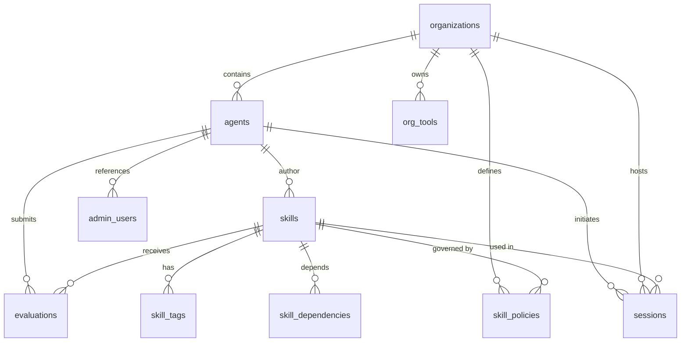
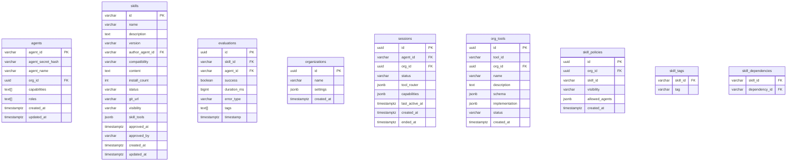

本文档详细介绍 Anspire-SkillGarden 项目的数据模型设计，涵盖领域模型、数据库表结构以及模型间的关联关系。项目采用 Rust 语言实现，使用 PostgreSQL 作为持久化存储，并通过 sqlx 实现异步数据库访问。

## 架构概览

数据模型层采用双层架构设计：**领域模型层**（`src/models/`）负责业务逻辑封装，**数据库仓储层**（`src/db/repositories/`）负责数据库操作。这种分离确保了业务逻辑与数据访问的解耦。



Sources: [src/models/mod.rs](src/models/mod.rs#L1-L20), [src/db/repositories/mod.rs](src/db/repositories/mod.rs#L1-L22)

## 核心实体模型

### Agent 模型

Agent 是系统的认证主体，代表可以注册和使用 Skills 的 AI 代理。系统通过 JWT 机制实现 Agent 的身份认证。

| 字段 | 类型 | 说明 |
|------|------|------|
| `id` | UUID | 内部唯一标识符 |
| `agent_id` | String | 业务主键，Agent 的唯一标识 |
| `agent_secret_hash` | String | bcrypt 加密的密钥哈希 |
| `agent_name` | Option\<String\> | Agent 显示名称 |
| `org_id` | Option\<UUID\> | 所属组织 ID |
| `capabilities` | Vec\<String\> | Agent 具备的能力列表 |
| `roles` | Vec\<String\> | Agent 角色列表 |
| `created_at` | DateTime | 创建时间 |
| `updated_at` | DateTime | 更新时间 |

Agent 模型的构造方法使用 bcrypt 对密钥进行哈希存储，确保密钥安全：

```rust
let secret_hash = hash(&new_agent.agent_secret, DEFAULT_COST)
    .map_err(|e| DbError::ValidationError(...))?;
```

Sources: [src/db/repositories/agent.rs](src/db/repositories/agent.rs#L10-L181)

### Skill 模型

Skill 是系统的核心实体，代表可复用的 AI 技能模块。每个 Skill 包含完整的 SKILL.md 内容定义其行为规范。

| 字段 | 类型 | 说明 |
|------|------|------|
| `id` | String | 格式: `skill-{name}-{version}` |
| `name` | String | Skill 名称 |
| `description` | String | Agent 可解析的描述 |
| `version` | String | 语义化版本号 (semver) |
| `author_agent_id` | String | 创建者 Agent ID |
| `compatibility` | String | 兼容性要求，默认 `>=1.0.0` |
| `content` | String | SKILL.md 完整内容 |
| `install_count` | u32 | 安装次数统计 |
| `git_url` | Option\<String\> | Git 仓库地址 |
| `visibility` | Visibility | 可见性级别 |
| `tools` | Vec\<String\> | 引用的工具列表 |
| `status` | String | 审核状态 |
| `approved_at` | Option\<DateTime\> | 审核通过时间 |
| `approved_by` | Option\<String\> | 审核人 ID |

Skill 唯一性约束由 `(name, version)` 组合键保证，ID 自动生成为 `skill-{name}-{version}` 格式：

```rust
pub fn generate_id(name: &str, version: &str) -> String {
    format!("skill-{}-{}", name, version)
}
```

Sources: [src/models/skill.rs](src/models/skill.rs#L7-L82), [src/db/repositories/skill.rs](src/db/repositories/skill.rs#L11-L64)

### Evaluation 模型

Evaluation 记录 Agent 对 Skill 的执行评价，用于计算置信度和成功率统计。

| 字段 | 类型 | 说明 |
|------|------|------|
| `id` | UUID | 评价唯一标识符 |
| `skill_id` | String | 被评价的 Skill ID |
| `agent_id` | String | 提交评价的 Agent |
| `success` | bool | 执行是否成功 |
| `duration_ms` | u64 | 执行耗时（毫秒） |
| `error_type` | Option\<ErrorType\> | 错误类型枚举 |
| `tags` | Vec\<EvalTag\> | 评价标签 |
| `timestamp` | DateTime | 评价时间 |

**错误类型枚举**定义如下：

```rust
pub enum ErrorType {
    Timeout,      // 执行超时
    Crash,        // 进程崩溃
    LogicError,   // 逻辑错误
    Other,        // 其他错误
}
```

**评价标签枚举**用于标记 Skill 特性：

```rust
pub enum EvalTag {
    Reliable,     // 可靠
    Fast,         // 快速
    Stable,       // 稳定
    Experimental, // 实验性
}
```

Sources: [src/models/evaluation.rs](src/models/evaluation.rs#L26-L60)

### SkillStats 统计模型

SkillStats 聚合单个 Skill 的评价统计数据，用于计算置信度和质量指标。

| 字段 | 类型 | 说明 |
|------|------|------|
| `skill_id` | String | Skill 标识符 |
| `success_rate` | f64 | 加权成功率 (0-1) |
| `avg_duration_ms` | u64 | 加权平均执行时间 |
| `total_evaluations` | u32 | 总评价数 |
| `unique_agents` | u32 | 评价过的唯一 Agent 数 |
| `confidence` | f64 | 置信度 (0-1) |
| `tags` | Vec\<String\> | 聚合后的高频标签 |

**置信度等级计算规则**：

```rust
pub fn confidence_level(&self) -> ConfidenceLevel {
    if self.total_evaluations < 3 {
        ConfidenceLevel::Low
    } else if self.total_evaluations > 10 && self.success_rate > 0.8 {
        ConfidenceLevel::High
    } else {
        ConfidenceLevel::Medium
    }
}
```

数据库统计查询通过聚合函数计算各项指标：

```sql
SELECT
    COUNT(*) as total,
    COUNT(*) FILTER (WHERE success = true) as success_count,
    AVG(duration_ms) as avg_duration,
    COUNT(DISTINCT agent_id) as unique_agents
FROM evaluations
WHERE skill_id = $1
```

Sources: [src/models/evaluation.rs](src/models/evaluation.rs#L88-L140), [src/db/repositories/evaluation.rs](src/db/repositories/evaluation.rs#L75-L113)

### Organization 模型

Organization 实现多租户隔离，每个组织拥有独立的 Agent、Session 和工具配置。

| 字段 | 类型 | 说明 |
|------|------|------|
| `id` | UUID | 组织唯一标识符 |
| `name` | String | 组织名称 |
| `settings` | JsonValue | 组织配置（JSON） |
| `created_at` | DateTime | 创建时间 |

Sources: [src/models/organization.rs](src/models/organization.rs#L8-L31), [src/db/repositories/organization.rs](src/db/repositories/organization.rs#L11-L131)

### Session 模型

Session 代表 Agent 在组织内的运行时会话，包含工具路由配置和可用能力列表。

| 字段 | 类型 | 说明 |
|------|------|------|
| `id` | UUID | 会话唯一标识符 |
| `agent_id` | String | 关联的 Agent ID |
| `org_id` | UUID | 所属组织 ID |
| `status` | SessionStatus | 会话状态 |
| `tool_router` | JsonValue | 工具路由配置 |
| `capabilities` | Vec\<String\> | 当前会话能力 |
| `created_at` | DateTime | 创建时间 |
| `last_active_at` | DateTime | 最后活跃时间 |
| `ended_at` | Option\<DateTime\> | 结束时间 |

**会话状态枚举**：

```rust
pub enum SessionStatus {
    Active,  // 活跃会话
    Ended,   // 已结束会话
}
```

**工具路由目标枚举**支持三种路由策略：

```rust
pub enum RouteTarget {
    Local,           // 本地工具
    Platform,        // 平台工具
    OrgTool(String), // 组织私有工具
}
```

Sources: [src/models/session.rs](src/models/session.rs#L9-L77), [src/db/repositories/session.rs](src/db/repositories/session.rs#L11-L192)

### OrgTool 模型

OrgTool 定义组织私有的自定义工具，实现组织级别的工具扩展能力。

| 字段 | 类型 | 说明 |
|------|------|------|
| `id` | UUID | 工具唯一标识符 |
| `tool_id` | String | 工具业务标识符 |
| `org_id` | UUID | 所属组织 ID |
| `name` | String | 工具显示名称 |
| `description` | String | 工具描述 |
| `schema` | JsonValue | 工具参数 schema |
| `implementation` | ToolImplementation | 实现配置 |
| `status` | ToolStatus | 审核状态 |
| `created_at` | DateTime | 创建时间 |

**工具状态枚举**：

```rust
pub enum ToolStatus {
    Pending,  // 待审核
    Approved, // 已批准
    Rejected, // 已拒绝
}
```

**工具实现配置**：

```rust
pub struct ToolImplementation {
    pub tool_type: String,           // 工具类型
    pub cli_path: String,             // CLI 路径
    pub docker_image: Option<String>, // Docker 镜像
    pub timeout_seconds: Option<u32>, // 超时配置
}
```

Sources: [src/models/org_tool.rs](src/models/org_tool.rs#L1-L57)

### SkillPolicy 模型

SkillPolicy 控制 Skill 在组织内的可见性和访问权限。

| 字段 | 类型 | 说明 |
|------|------|------|
| `id` | UUID | 策略唯一标识符 |
| `org_id` | UUID | 组织 ID |
| `skill_id` | UUID | Skill ID |
| `visibility` | Visibility | 可见性级别 |
| `allowed_agents` | Vec\<String\> | 允许访问的 Agent 列表 |
| `created_at` | DateTime | 创建时间 |

**可见性枚举**定义了四个级别：

```rust
pub enum Visibility {
    Private,      // 私有，仅允许列表中的 Agent
    OrgVisible,    // 组织内可见（默认）
    Marketplace,   // 市场公开
    Shared,        // 共享给特定组织
}
```

Sources: [src/models/skill_policy.rs](src/models/skill_policy.rs#L7-L42)

## 数据库表结构

### 主表清单

| 表名 | 用途 | 核心索引 |
|------|------|----------|
| `agents` | Agent 身份认证 | agent_id (PK) |
| `skills` | Skill 存储 | (name, version) UNIQUE |
| `skill_tags` | Skill 标签多对多 | (skill_id, tag) PK |
| `skill_dependencies` | Skill 依赖多对多 | (skill_id, dependency_id) PK |
| `evaluations` | 评价记录 | skill_id, agent_id, timestamp |
| `organizations` | 组织信息 | name |
| `sessions` | 会话管理 | agent_id, org_id, status |
| `org_tools` | 组织工具 | org_id, (org_id, tool_id) UNIQUE |
| `skill_policies` | 权限策略 | org_id, skill_id |
| `audit_logs` | 审计日志 | timestamp, agent_id |
| `admin_users` | 管理员用户 | username UNIQUE |

Sources: [src/db/migrations/001_initial_schema.sql](src/db/migrations/001_initial_schema.sql#L1-L80), [src/db/migrations/004_add_organizations.sql](src/db/migrations/004_add_organizations.sql#L1-L12), [src/db/migrations/005_add_sessions.sql](src/db/migrations/005_add_sessions.sql#L1-L22), [src/db/migrations/006_add_org_tools.sql](src/db/migrations/006_add_org_tools.sql#L1-L20), [src/db/migrations/007_add_skill_policies.sql](src/db/migrations/007_add_skill_policies.sql#L1-L17), [src/db/migrations/010_add_admin_users.sql](src/db/migrations/010_add_admin_users.sql#L1-L19)

### 表间关系图



## 仓储层设计

仓储层（Repository Pattern）通过 trait 接口定义数据访问操作，支持依赖注入和单元测试 mocking。

### 核心 Trait 接口

```rust
#[allow(async_fn_in_trait)]
pub trait AgentRepositoryTrait: Send + Sync {
    async fn create(&self, new_agent: NewAgent) -> DbResult<Agent>;
    async fn find_by_id(&self, agent_id: &str) -> DbResult<Option<Agent>>;
    async fn verify_secret(&self, agent_id: &str, secret: &str) -> DbResult<bool>;
    async fn update_roles(&self, agent_id: &str, roles: Vec<String>) -> DbResult<()>;
}

#[allow(async_fn_in_trait)]
pub trait SkillRepositoryTrait: Send + Sync {
    async fn create(&self, new_skill: NewSkill) -> DbResult<Skill>;
    async fn find_by_id(&self, skill_id: &str) -> DbResult<Option<Skill>>;
    async fn list(&self, limit: i64, offset: i64) -> DbResult<Vec<SkillMetadata>>;
    async fn count(&self) -> DbResult<i64>;
    async fn update(...) -> DbResult<()>;
    async fn delete(&self, skill_id: &str) -> DbResult<()>;
    async fn increment_install_count(&self, skill_id: &str) -> DbResult<()>;
}
```

Sources: [src/db/traits.rs](src/db/traits.rs#L1-L100)

### 模型层级对比

系统维护两套模型定义：**领域模型**用于 API 响应和业务逻辑，**仓储模型**用于数据库映射。

| 领域模型 | 仓储模型 | 用途 |
|----------|----------|------|
| `models::Skill` | `repositories::Skill` | 完整 Skill 实体 |
| `models::SkillMetadata` | `repositories::SkillMetadata` | 列表展示（不含 content） |
| `models::SkillDetail` | - | 详情页（包含统计） |
| `models::Organization` | `repositories::Organization` | 组织实体 |
| `models::Session` | `repositories::Session` | 会话实体 |

领域模型 `SkillDetail` 通过组合 `SkillMetadata` 和可选的 `SkillStats` 提供完整的 Skill 详情：

```rust
pub struct SkillDetail {
    pub metadata: SkillMetadata,
    pub content: String,
    pub stats: Option<SkillStats>,
}
```

Sources: [src/models/skill.rs](src/models/skill.rs#L122-L139)

## 错误处理模型

系统定义统一的错误码枚举和应用程序错误类型：

```rust
pub enum ErrorCode {
    Unknown,
    InternalError,
    SkillNotFound,
    SkillAlreadyExists,
    SkillInstallFailed,
    SkillCreateFailed,
    SkillUpdateFailed,
    SkillInvalidFormat,
    SkillTooLarge,
    MaliciousContent,
    InvalidSkillName,
    TooManyTags,
    EvaluationInvalid,
    EvaluationRateLimited,
    RegistryReadFailed,
    RegistryWriteFailed,
    RegistryLockFailed,
    FileNotFound,
    ValidationError,
    InvalidVersion,
}
```

API 响应使用统一的 `ApiResponse<T>` 封装：

```rust
pub struct ApiResponse<T> {
    pub success: bool,
    pub data: Option<T>,
    pub error: Option<ApiError>,
}
```

Sources: [src/models/error.rs](src/models/error.rs#L6-L66), [src/models/response.rs](src/models/response.rs#L7-L58)

## 迁移历史

数据库通过系列迁移脚本逐步演进：

| 迁移编号 | 文件 | 描述 |
|----------|------|------|
| 001 | `001_initial_schema.sql` | 初始表结构（agents, skills, evaluations, audit_logs） |
| 002 | `002_add_skill_status.sql` | 添加 Skill 审核状态 |
| 003 | `003_seed_admin_agent.sql` | 种子管理员 Agent |
| 004 | `004_add_organizations.sql` | 多租户组织支持 |
| 005 | `005_add_sessions.sql` | 会话管理 |
| 006 | `006_add_org_tools.sql` | 组织私有工具 |
| 007 | `007_add_skill_policies.sql` | Skill 可见性策略 |
| 008 | `008_add_skill_git_and_org_fields.sql` | Git 集成和字段扩展 |
| 009 | `009_add_agent_id_column.sql` | Agent ID 列规范化 |
| 010 | `010_add_admin_users.sql` | 人类管理员用户 |
| 011 | `011_add_session_skill_fields.sql` | 会话技能字段 |

Sources: [src/db/migrations.rs](src/db/migrations.rs#L1-L100)

## 相关文档

- [数据库迁移](15-shu-ju-ku-qian-yi) — 了解迁移管理和执行机制
- [存储服务](16-cun-chu-fu-wu) — 了解 Skill 文件存储实现
- [评价服务](13-ping-jie-fu-wu) — 了解置信度计算逻辑
- [REST API 接口](18-rest-api-jie-kou) — 了解 API 响应格式