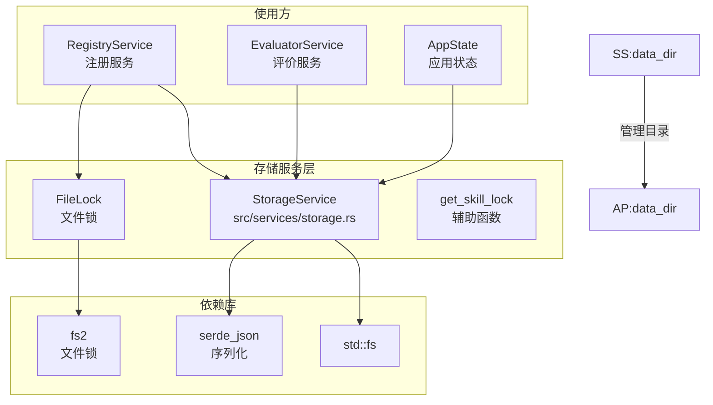
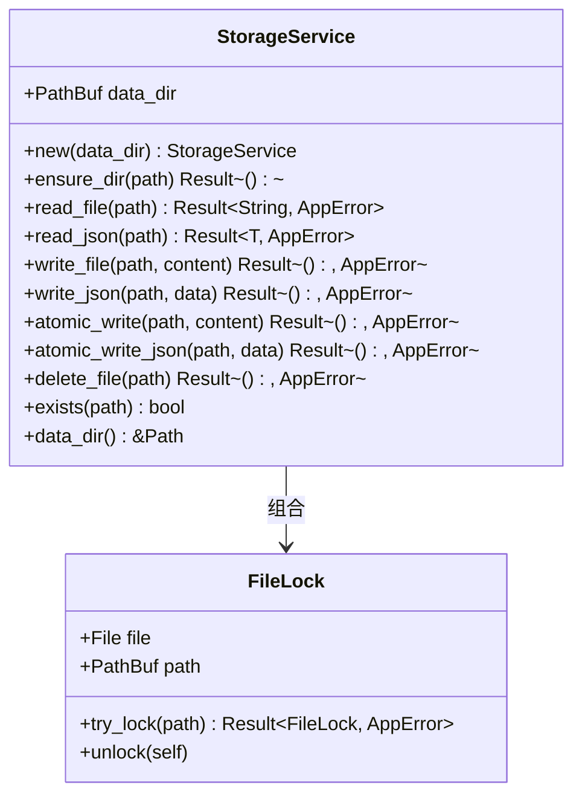
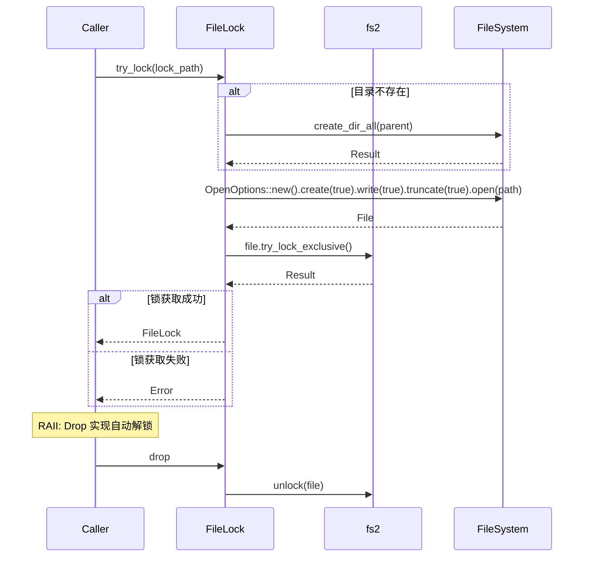
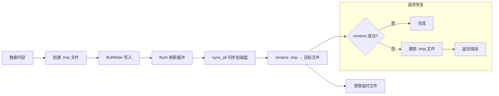
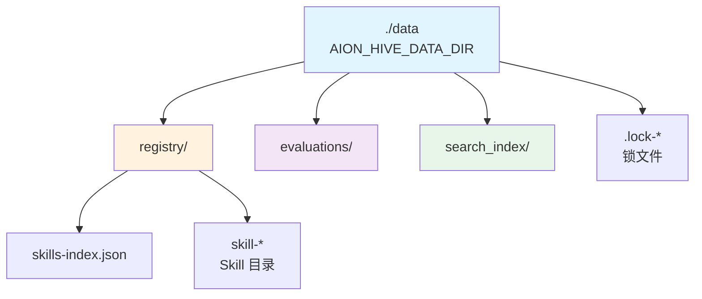

存储服务是 Anspire SkillGarden 基础设施层的核心组件，提供文件系统操作、原子写入和文件锁机制三大功能模块。它作为底层存储抽象，被注册服务、搜索服务等上层服务依赖，是确保系统数据一致性和可靠性的关键层。

## 架构概述

存储服务位于 `src/services/storage.rs`，采用简洁的分层设计：核心结构体 `StorageService` 提供文件操作能力，辅助结构体 `FileLock` 实现基于 `fs2` 库的文件锁机制。两者结合，共同保障了 Skill 数据的原子性和并发安全。



Sources: [src/services/storage.rs](src/services/storage.rs#L13-L17)
Sources: [src/services/mod.rs](src/services/mod.rs#L3)
Sources: [src/lib.rs](src/lib.rs#L28)

## 核心组件

### StorageService 结构体

`StorageService` 是存储服务的核心，封装了所有文件 I/O 操作。它包含一个 `data_dir` 字段表示根数据目录，所有文件操作都在此目录下进行。



Sources: [src/services/storage.rs](src/services/storage.rs#L13-L125)

### FileLock 文件锁

`FileLock` 基于 `fs2` 库实现排他锁机制，采用 RAII 模式确保锁的自动释放。其核心逻辑包括目录创建、文件打开和锁获取三个步骤。



Sources: [src/services/storage.rs](src/services/storage.rs#L127-L175)

## 文件操作 API

存储服务提供两套文件操作接口：常规读写和原子写入。

### 基础读写操作

| 方法 | 功能 | 错误类型 |
|------|------|----------|
| `read_file(path)` | 读取文件内容为字符串 | `FileNotFound` / `RegistryReadFailed` |
| `read_json<T>(path)` | 反序列化 JSON 文件 | `RegistryReadFailed` |
| `write_file(path, content)` | 写入字符串内容 | `RegistryWriteFailed` |
| `write_json<T>(path, data)` | 序列化对象为 JSON 并写入 | `RegistryWriteFailed` |
| `delete_file(path)` | 删除文件（幂等） | `RegistryWriteFailed` |
| `exists(path)` | 检查文件是否存在 | 无错误 |

所有写操作都会自动创建父目录，通过 `ensure_dir()` 方法确保路径存在。

Sources: [src/services/storage.rs](src/services/storage.rs#L25-L114)

### 原子写入机制

原子写入是存储服务最重要的特性之一，确保写入过程在系统崩溃时不会留下损坏的文件。它采用经典的"临时文件 + 重命名"模式：



原子写入的关键步骤如下：首先创建同目录下的 `.tmp` 临时文件，使用缓冲写入器提高性能；写入完成后调用 `sync_all()` 确保数据已同步到磁盘底层存储；最后执行原子重命名操作将临时文件转为目标文件。如果重命名失败，临时文件会被清理以避免垃圾残留。

Sources: [src/services/storage.rs](src/services/storage.rs#L65-L106)

## 文件锁机制

### 锁获取流程

`get_skill_lock()` 函数提供便捷的 Skill 级别锁获取接口，锁文件命名规范为 `.lock-{skill_name}`：

```mermaid
flowchart TB
    Start[获取 Skill 锁] --> GenPath[生成锁路径<br/>data_dir/.lock-{skill_name}]
    GenPath --> TryLock[FileLock::try_lock]
    
    TryLock --> CreateDir{目录存在?}
    CreateDir -->|否| MakeDir[创建父目录]
    MakeDir --> OpenFile
    CreateDir -->|是| OpenFile[打开/创建锁文件]
    
    OpenFile --> AcquireLock[try_lock_exclusive]
    AcquireLock --> CheckResult{锁获取成功?}
    
    CheckResult -->|成功| ReturnLock[返回 FileLock]
    CheckResult -->|失败| ReturnError[返回 RegistryLockFailed]
    
    ReturnLock --> End[锁持有中]
    ReturnError --> End
```

Sources: [src/services/storage.rs](src/services/storage.rs#L177-L181)

### RAII 自动释放

`FileLock` 通过实现 `Drop` trait 实现自动解锁，当 `FileLock` 实例离开作用域时自动调用 `unlock()` 释放文件锁。这种模式确保锁不会因代码异常而永久持有：

```rust
impl Drop for FileLock {
    fn drop(&mut self) {
        // FileLock 在 drop 时自动释放锁
    }
}
```

Sources: [src/services/storage.rs](src/services/storage.rs#L171-L175)

## 错误处理

存储服务定义了四种专用错误类型，均映射到 `ErrorCode` 枚举：

| 错误类型 | ErrorCode | 触发场景 |
|----------|-----------|----------|
| `FileNotFound` | `FILE_NOT_FOUND` | 文件不存在时读取 |
| `RegistryReadFailed` | `REGISTRY_READ_FAILED` | 读取 IO 错误、JSON 解析失败 |
| `RegistryWriteFailed` | `REGISTRY_WRITE_FAILED` | 写入 IO 错误、原子写入失败 |
| `RegistryLockFailed` | `REGISTRY_LOCK_FAILED` | 文件锁获取失败、目录创建失败 |

Sources: [src/models/error.rs](src/models/error.rs#L30-L34)
Sources: [src/models/error.rs](src/models/error.rs#L107-L117)

## 在系统中的应用

### 数据目录结构

应用启动时初始化以下数据目录结构，均由存储服务管理：



Sources: [src/main.rs](src/main.rs#L235-L238)

### RegistryService 集成

`RegistryService` 是存储服务的主要使用方，在 Skill 创建和更新时依赖原子写入确保索引一致性：

```rust
// RegistryService 组合 StorageService
pub struct RegistryService {
    skills_dir: PathBuf,
    registry_dir: PathBuf,
    storage: StorageService,
    skill_repo: SkillRepository,
}

// 原子写入索引
fn save_index(&self, index: &SkillsIndex) -> Result<(), AppError> {
    self.storage.atomic_write_json(&self.index_path(), index)
}

// 原子写入 Skill 内容
self.storage.atomic_write(&skill_md_path, &new_skill_md)?;
```

更新操作时获取文件锁防止并发冲突：

```rust
// 获取文件锁保护更新
let _lock = get_skill_lock(&name, &self.registry_dir)?;
self.update_skill_internal(skill_id, update, search).await
```

Sources: [src/services/registry.rs](src/services/registry.rs#L18-L23)
Sources: [src/services/registry.rs](src/services/registry.rs#L60-L63)
Sources: [src/services/registry.rs](src/services/registry.rs#L141-L146)

### AppState 初始化

存储服务在应用状态初始化时被实例化，作为全局共享资源：

```rust
impl AppState {
    pub async fn new(data_dir: PathBuf, skills_dir: PathBuf) -> anyhow::Result<Self> {
        let storage = services::StorageService::new(data_dir.clone());
        // ... 其他服务初始化
        Ok(Self {
            storage,
            // ...
        })
    }
}
```

Sources: [src/lib.rs](src/lib.rs#L59-L60)

## 配置与环境变量

存储服务通过环境变量配置数据目录位置：

| 变量名 | 默认值 | 说明 |
|--------|--------|------|
| `AION_HIVE_DATA_DIR` | `./data` | 主数据目录 |
| `AION_HIVE_SKILLS_DIR` | `./skills` | Skills 源代码目录 |

Sources: [.env.example](.env.example#L19-L20)
Sources: [src/main.rs](src/main.rs#L227-L233)

## 测试覆盖

存储服务包含完整的单元测试，验证所有核心功能：

| 测试用例 | 覆盖功能 |
|----------|----------|
| `test_storage_service_new` | 构造器初始化 |
| `test_storage_service_ensure_dir` | 目录创建 |
| `test_storage_service_write_and_read_file` | 基础读写 |
| `test_storage_service_read_file_not_found` | 文件不存在错误 |
| `test_storage_service_write_and_read_json` | JSON 序列化 |
| `test_storage_service_read_json_invalid` | JSON 解析错误 |
| `test_storage_service_exists` | 文件存在检查 |
| `test_storage_service_delete_file` | 文件删除 |
| `test_storage_service_atomic_write` | 原子写入 |
| `test_storage_service_atomic_write_json` | 原子 JSON 写入 |
| `test_storage_service_atomic_write_creates_parent_dirs` | 自动创建父目录 |
| `test_file_lock_debug` | FileLock 调试信息 |

Sources: [src/services/storage.rs](src/services/storage.rs#L183-L351)

## 下一步阅读

- [注册服务](11-zhu-ce-fu-wu) — 了解存储服务如何支撑 Skill 的注册与管理
- [数据模型](14-shu-ju-mo-xing) — 探索存储的 JSON 结构与数据库模型
- [系统架构](8-xi-tong-jia-gou) — 从宏观视角理解各服务间的协作关系