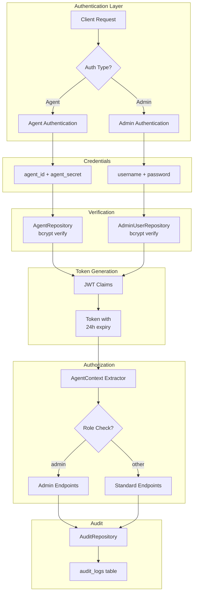
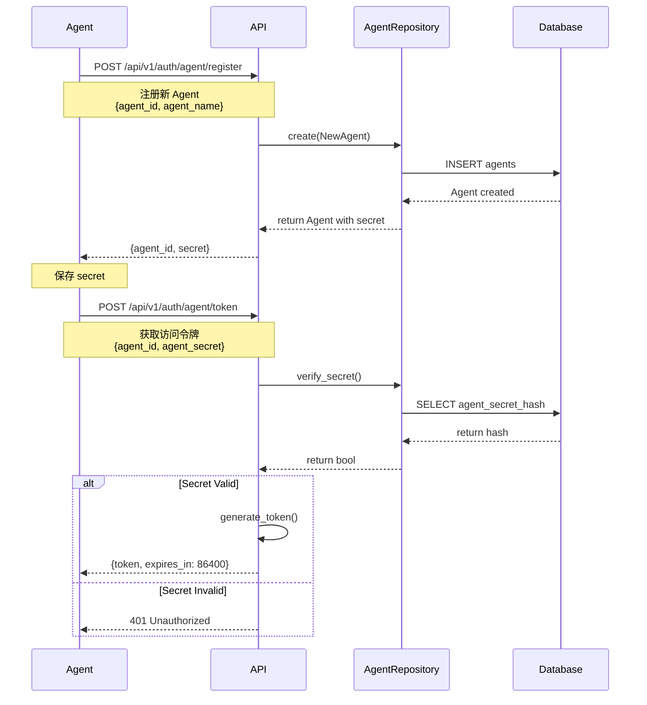
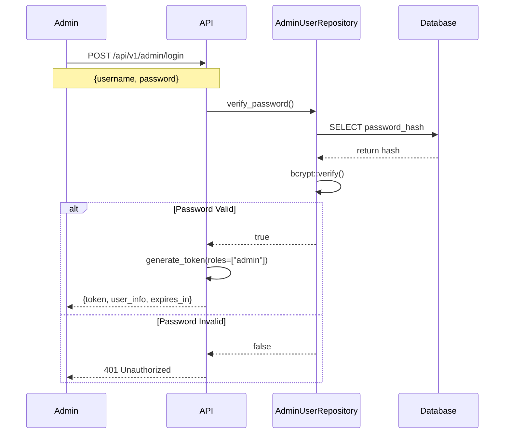
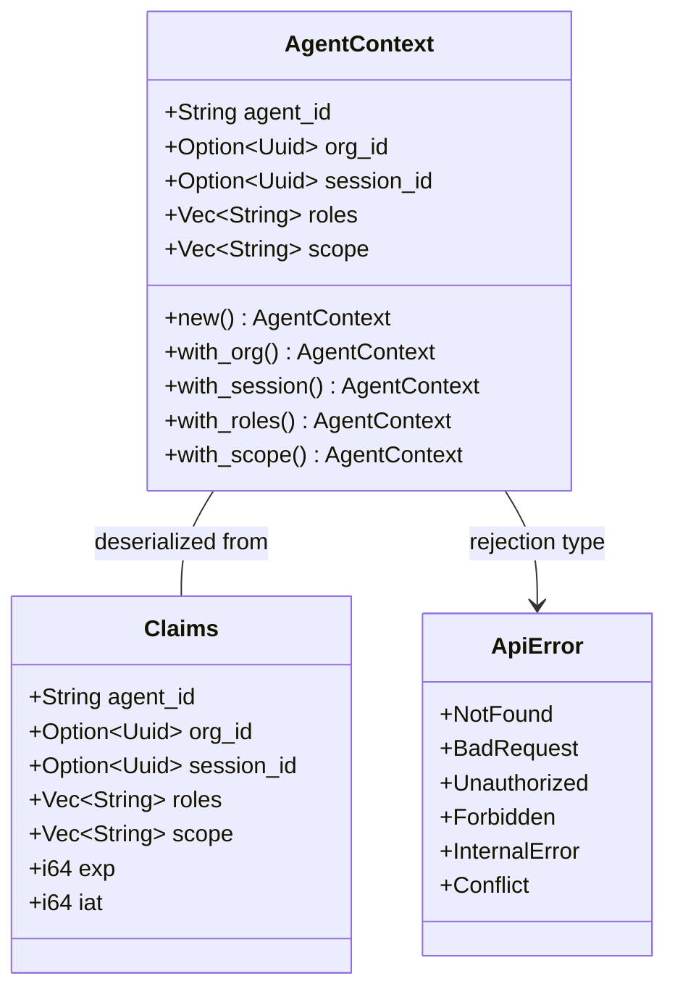

本页面详细阐述 Anspire SkillGarden 的认证与授权机制，涵盖 JWT 令牌管理、双因素认证流、基于角色的访问控制（RBAC）以及多租户隔离策略。该系统支持两类客户端：AI Agent（机器对机器）和管理员（人对机器），通过统一的 JWT 令牌机制实现安全访问控制。

## 系统架构概览



## 认证机制详解

### JWT 令牌结构

系统采用 JSON Web Token（JWT）进行无状态认证，令牌有效期为 24 小时。核心声明结构定义于 [jwt.rs:21-30](src/api/jwt.rs#L21-L30)：

| 字段 | 类型 | 描述 | 示例 |
|------|------|------|------|
| `agent_id` | String | 唯一代理标识符 | `"agent-001"` |
| `org_id` | Option\<Uuid\> | 所属组织 ID | `550e8400-e29b...` |
| `session_id` | Option\<Uuid\> | 会话 ID | `6ba7b810-9dad...` |
| `roles` | Vec\<String\> | 角色列表 | `["admin", "editor"]` |
| `scope` | Vec\<String\> | 权限范围 | `["read", "write"]` |
| `exp` | i64 | 过期时间戳 | `1709856000` |
| `iat` | i64 | 签发时间戳 | `1709769600` |

### Agent 认证流程

AI Agent 使用 `agent_id` 和 `agent_secret` 进行认证，适合机器对机器通信场景。完整流程如下：



注册端点处理逻辑见 [handlers.rs:219-246](src/api/handlers.rs#L219-L246)，令牌获取逻辑见 [handlers.rs:248-270](src/api/handlers.rs#L248-L270)。

### Admin 认证流程

管理员使用用户名和密码登录，适合人工操作场景。密码采用 bcrypt 算法哈希存储：



管理员认证实现见 [handlers.rs:272-318](src/api/handlers.rs#L272-L318)，密码验证逻辑见 [admin_user.rs:51-61](src/db/repositories/admin_user.rs#L51-L61)。

## 授权机制详解

### 角色与权限模型

系统采用 RBAC（基于角色的访问控制）模型，角色信息编码在 JWT 声明中：



### 受保护端点与角色要求

通过 Axum 的 `AgentContext` 提取器自动验证 JWT 并注入授权上下文：

| 端点 | 方法 | 认证要求 | 授权规则 |
|------|------|----------|----------|
| `/api/v1/skills` | GET | JWT | 公开可读 |
| `/api/v1/skills` | POST | JWT | 任何有效令牌 |
| `/api/v1/skills/:id` | DELETE | JWT | 任何有效令牌 |
| `/api/v1/admin/audit-logs` | GET | JWT | `roles` 包含 `"admin"` |
| `/api/v1/admin/skills/:id/approve` | POST | JWT | `roles` 包含 `"admin"` |
| `/api/v1/admin/skills/:id/reject` | POST | JWT | `roles` 包含 `"admin"` |

管理员端点的授权检查模式见 [handlers.rs:415-417](src/api/handlers.rs#L415-L417)：

```rust
if !roles.iter().any(|r| r == "admin") {
    return Err(ApiError::Unauthorized("Admin access required".to_string()));
}
```

### AgentContext 提取器实现

JWT 验证中间件通过 Axum 的 `FromRequestParts` trait 实现，在请求处理前自动验证令牌：

```mermaid
flowchart LR
    subgraph "HTTP Request"
        A[Authorization: Bearer xxx]
    end
    
    subgraph "FromRequestParts"
        B[Extract Header] --> C{Starts with<br/>"Bearer "?}
        C -->|Yes| D[Extract Token]
        C -->|No| E[Return 401]
        D --> F[verify_token]
        F --> G{Valid?}
        G -->|Yes| H[Create AgentContext]
        G -->|No| I[Return 401]
    end
    
    subgraph "Handler"
        J[Handler receives<br/>AgentContext]
    end
    
    H --> J
```

实现细节见 [jwt.rs:117-143](src/api/jwt.rs#L117-L143)。

## 多租户隔离策略

### 组织上下文

JWT 中可选携带 `org_id`，实现租户级别的资源隔离：

| 上下文字段 | 用途 | 适用场景 |
|-----------|------|----------|
| `org_id` | 组织归属 | 技能可见性、会话归属 |
| `session_id` | 会话追踪 | 工具路由、审计日志 |

组织创建和管理端点定义于 [routes.rs:28-32](src/api/routes.rs#L28-L32)。

### 技能可见性策略

技能可配置不同的可见性级别，定义于 [skill_policy.rs:17-23](src/models/skill_policy.rs#L17-L23)：

```rust
pub enum Visibility {
    Private,       // 仅创建者可见
    OrgVisible,    // 同组织内可见（默认）
    Marketplace,   // 市场公开
    Shared,        // 指定 Agent 共享
}
```

可见性检查逻辑由注册服务在技能检索时执行。

## 审计日志机制

所有敏感操作均记录审计日志，数据库结构见 [001_initial_schema.sql:67-76](src/db/migrations/001_initial_schema.sql#L67-L76)：

```sql
CREATE TABLE audit_logs (
    id UUID PRIMARY KEY DEFAULT uuid_generate_v4(),
    agent_id VARCHAR(255),
    action VARCHAR(100) NOT NULL,
    resource_type VARCHAR(50) NOT NULL,
    resource_id VARCHAR(255),
    details JSONB DEFAULT '{}',
    timestamp TIMESTAMPTZ NOT NULL DEFAULT NOW()
);
```

审计日志记录示例见 [handlers.rs:427-436](src/api/handlers.rs#L427-L436)：

```rust
state.audit_repo
    .create(NewAuditLog {
        agent_id: None,
        action: "skill_reviewed".to_string(),
        resource_type: "skill".to_string(),
        resource_id: Some(skill_id.clone()),
        details: serde_json::json!({"action": "approved"}),
    })
    .await
    .map_err(|e| ApiError::InternalError(e.to_string()))?;
```

## 安全配置

### 环境变量

认证相关的环境变量配置于 [`.env.example`](.env.example#L25)：

```bash
# JWT 签名密钥 - 生产环境必须修改
AION_HIVE_JWT_SECRET=change_this_secret_in_production
```

密钥获取逻辑见 [jwt.rs:15-18](src/api/jwt.rs#L15-L18)，若未设置环境变量则使用默认密钥（**仅用于开发**）。

### 密码哈希

使用 bcrypt 算法进行密码哈希，关键参数：

- **Cost Factor**: `DEFAULT_COST` (12)
- **库**: `bcrypt = "0.15"`

实现见 [admin_user.rs:64-65](src/db/repositories/admin_user.rs#L64-L65) 和 [agent.rs:46-47](src/db/repositories/agent.rs#L46-L47)。

## 错误处理

认证失败返回标准化的错误响应：

| HTTP 状态码 | ApiError 变体 | 触发条件 |
|-------------|---------------|----------|
| 401 Unauthorized | `Unauthorized` | 缺失令牌/令牌无效/凭据错误 |
| 403 Forbidden | `Forbidden` | 角色权限不足 |
| 500 Internal Server Error | `InternalError` | 服务器内部错误 |

错误类型定义见 [error.rs:11-19](src/api/error.rs#L11-L19)，响应转换见 [error.rs:34-52](src/api/error.rs#L34-L52)：

```json
{
    "error": "Invalid token: InvalidSignature",
    "status": 401
}
```

## 默认凭据

系统初始化时创建默认管理员用户（见 [010_add_admin_users.sql:14-18](src/db/migrations/010_add_admin_users.sql#L14-L18)）：

| 字段 | 值 |
|------|-----|
| Username | `admin` |
| Password | `admin123` |

**警告**: 生产部署前必须修改默认凭据。

## 相关文档

- [REST API 接口](18-rest-api-jie-kou) — 完整的 API 端点参考
- [数据模型](14-shu-ju-mo-xing) — 数据库实体定义
- [系统架构](8-xi-tong-jia-gou) — 整体架构概览
- [数据库迁移](15-shu-ju-ku-qian-yi) — 数据库 Schema 变更历史