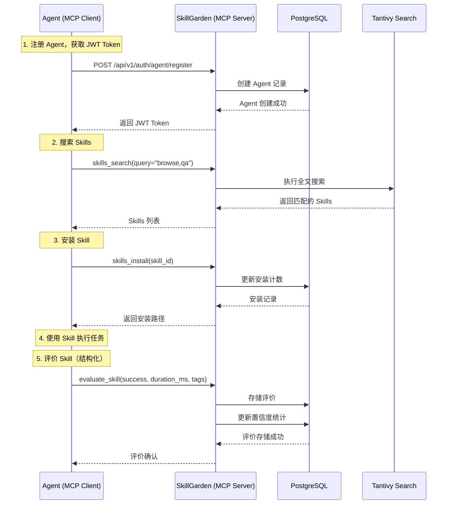

> 本文档面向**初次接触 SkillGarden 的开发者**，帮助你在 5 分钟内完成环境搭建并运行第一个 Skills 搜索任务。

---

## 1. 环境准备

在开始之前，请确保你的开发环境满足以下要求：

### 1.1 必要依赖

| 依赖 | 版本要求 | 安装说明 |
|------|----------|----------|
| **Rust** | 1.70+ | [rustup.rs](https://rustup.rs) 安装 |
| **PostgreSQL** | 15+ | [官网下载](https://postgresql.org) 或使用 Docker |
| **Cargo** | 最新版 | Rust 自带 |

### 1.2 验证安装

```bash
# 验证 Rust 工具链
rustc --version
# 输出示例: rustc 1.75.0

# 验证 PostgreSQL
psql --version
# 输出示例: psql (PostgreSQL) 15.4
```

Sources: [Cargo.toml](Cargo.toml#L1-L15)

---

## 2. 项目构建

### 2.1 克隆与依赖安装

```bash
# 克隆项目
git clone https://github.com/aionui/anspire-skillgarden
cd anspire-skillgarden

# 下载 Rust 依赖（首次可能需要几分钟）
cargo build --release
```

### 2.2 构建产物

构建成功后，可执行文件位于：

```
target/release/aion-hive.exe    # Windows
target/release/aion-hive         # Linux/macOS
```

Sources: [src/main.rs](src/main.rs#L1-L30)

---

## 3. 环境配置

### 3.1 创建配置文件

从示例文件复制并编辑：

```bash
# Windows PowerShell
copy .env.example .env

# Linux/macOS
cp .env.example .env
```

### 3.2 关键配置项

| 配置项 | 默认值 | 说明 |
|--------|--------|------|
| `DATABASE_URL` | `postgres://localhost:5432/aionhive` | PostgreSQL 连接字符串 |
| `AION_HIVE_HTTP_PORT` | `8080` | HTTP 服务器端口 |
| `AION_HIVE_DATA_DIR` | `./data` | 数据存储目录 |
| `AION_HIVE_SKILLS_DIR` | `./skills` | Skills 资产目录 |
| `AION_HIVE_JWT_SECRET` | - | JWT 签名密钥（生产环境必改） |

Sources: [.env.example](.env.example#L1-L31)

### 3.3 数据库初始化

```bash
# 创建数据库（PostgreSQL 命令行）
psql -U postgres -c "CREATE DATABASE aionhive;"

# 或使用 Docker
docker run -d \
  --name aionhive-db \
  -e POSTGRES_PASSWORD=password \
  -e POSTGRES_DB=aionhive \
  -p 5432:5432 \
  postgres:15
```

---

## 4. 启动服务

### 4.1 启动模式选择

SkillGarden 支持两种 MCP 传输模式：

| 模式 | 适用场景 | 端口 |
|------|----------|------|
| **HTTP** | Web 客户端、外部服务集成 | 8080 |
| **SSE** | 实时双向通信场景 | 8081 |

### 4.2 启动命令

```powershell
# 方式一：直接运行（使用默认配置）
cargo run

# 方式二：HTTP 模式启动
.\start-http-server.ps1 -Port 8080 -DataDir "./data"

# 方式三：SSE 模式启动
.\start-sse-server.ps1 -Port 8081 -DataDir "./test-data-sse"
```

Sources: [start-http-server.ps1](start-http-server.ps1#L1-L14), [start-sse-server.ps1](start-sse-server.ps1#L1-L14)

### 4.3 验证服务运行

```bash
# 健康检查
curl http://localhost:8080/health

# 预期输出
{
  "status": "OK",
  "version": "0.3.0",
  "skills_count": 0
}
```

Sources: [src/main.rs](src/main.rs#L48-L58)

---

## 5. 核心工作流程

### 5.1 Agent 与 SkillGarden 交互流程



Sources: [src/lib.rs](src/lib.rs#L1-L60), [src/mcp/server.rs](src/mcp/server.rs#L1-L100)

### 5.2 MCP 可用工具一览

| 工具名称 | 功能 | 主要参数 |
|----------|------|----------|
| `skills_search` | 全文搜索 Skills | `query` |
| `skills_list` | 列出所有 Skills | - |
| `skills_install` | 安装 Skill 到本地 | `skill_id` |
| `skills_info` | 查看 Skill 详情 | `skill_id` |
| `skills_stats` | 查看统计信息 | `skill_id` |
| `evaluate_skill` | 提交结构化评价 | `skill_id`, `success`, `duration_ms`, `error_type?`, `tags?` |
| `health_check` | 健康检查 | - |

Sources: [src/mcp/server.rs](src/mcp/server.rs#L100-L200), [setup/setup.md](setup/setup.md#L100-L150)

### 5.3 完整使用示例

```bash
# 1. 搜索 Skills
# MCP 工具调用格式
mcp__skillgarden__skills_search --query "browse qa"

# 2. 查看 Skill 统计（选择最佳）
mcp__skillgarden__skills_stats --skill_id "skill-browse-1.0.0"
# 返回: { avg_success_rate: 95, avg_duration_ms: 1200, total_installs: 5 }

# 3. 安装 Skill
mcp__skillgarden__skills_install --skill_id "skill-browse-1.0.0"

# 4. 使用后评价
mcp__skillgarden__evaluate_skill \
  --skill_id "skill-browse-1.0.0" \
  --success true \
  --duration_ms 1150 \
  --tags "reliable,fast"
```

Sources: [setup/setup.md](setup/setup.md#L150-L200)

---

## 6. 项目结构概览

```
anspire-skillgarden/
├── src/                          # Rust 源代码
│   ├── main.rs                   # 程序入口
│   ├── lib.rs                    # 核心库定义
│   ├── api/                      # HTTP API 层
│   │   ├── handlers.rs          # 请求处理器
│   │   ├── routes.rs            # 路由配置
│   │   └── jwt.rs               # JWT 认证
│   ├── mcp/                      # MCP Server 实现
│   │   └── server.rs            # MCP 协议处理
│   ├── models/                  # 数据模型
│   │   ├── skill.rs             # Skill 模型
│   │   └── evaluation.rs        # 评价模型
│   ├── services/                 # 业务服务
│   │   ├── registry.rs          # 注册服务
│   │   ├── search.rs            # 搜索服务
│   │   └── evaluator.rs         # 评价服务
│   └── db/                       # 数据库层
│       ├── migrations/          # 数据库迁移
│       └── repositories/        # 数据仓库
├── admin/                        # 管理平台前端 (Svelte)
├── tests/                        # 测试
│   └── e2e/                     # 端到端测试
├── .env.example                  # 环境变量示例
└── Cargo.toml                   # Rust 项目配置
```

Sources: [CLAUDE.md](CLAUDE.md#L1-L50)

---

## 7. 常见问题排查

### 7.1 启动失败

| 错误信息 | 可能原因 | 解决方案 |
|----------|----------|----------|
| `Connection refused` | PostgreSQL 未运行 | 启动 PostgreSQL 服务 |
| `Database does not exist` | 数据库未创建 | 执行 `CREATE DATABASE aionhive;` |
| `Port already in use` | 端口被占用 | 更换端口或停止占用进程 |

### 7.2 构建问题

```bash
# 清理并重新构建
cargo clean
cargo build --release

# 更新依赖
cargo update
```

### 7.3 数据库迁移

首次启动时，系统会自动执行数据库迁移。如果需要手动迁移：

```bash
# 查看迁移状态
psql $DATABASE_URL -c "SELECT * FROM schema_migrations;"
```

Sources: [src/db/migrations.rs](src/db/migrations.rs#L1-L50)

---

## 8. 下一步

完成快速开始后，你可以：

| 文档页面 | 内容 |
|----------|------|
| [核心概念](3-he-xin-gai-nian) | 深入理解 Skill、Evaluation、置信度等核心概念 |
| [系统架构](8-xi-tong-jia-gou) | 了解完整的系统架构设计 |
| [MCP 协议接口](17-mcp-xie-yi-jie-kou) | 掌握 MCP 工具的完整参数说明 |
| [环境配置](23-huan-jing-pei-zhi) | 了解更多环境变量配置选项 |