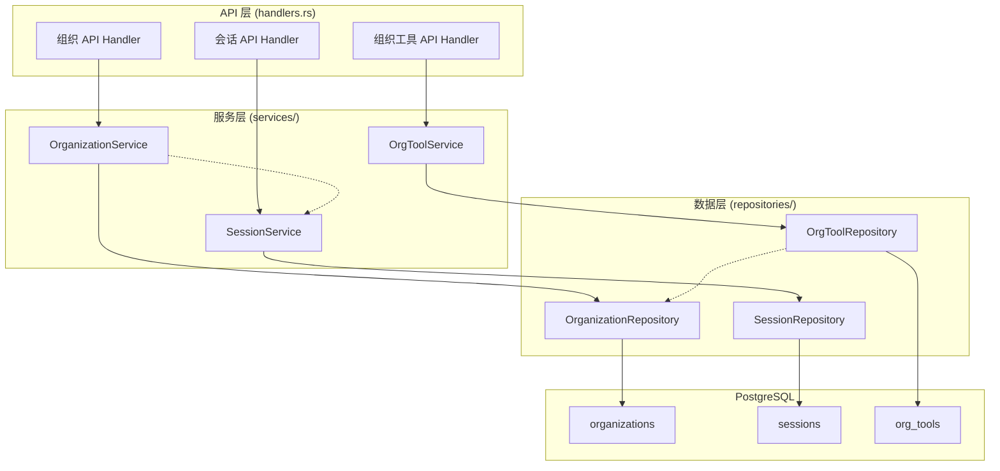
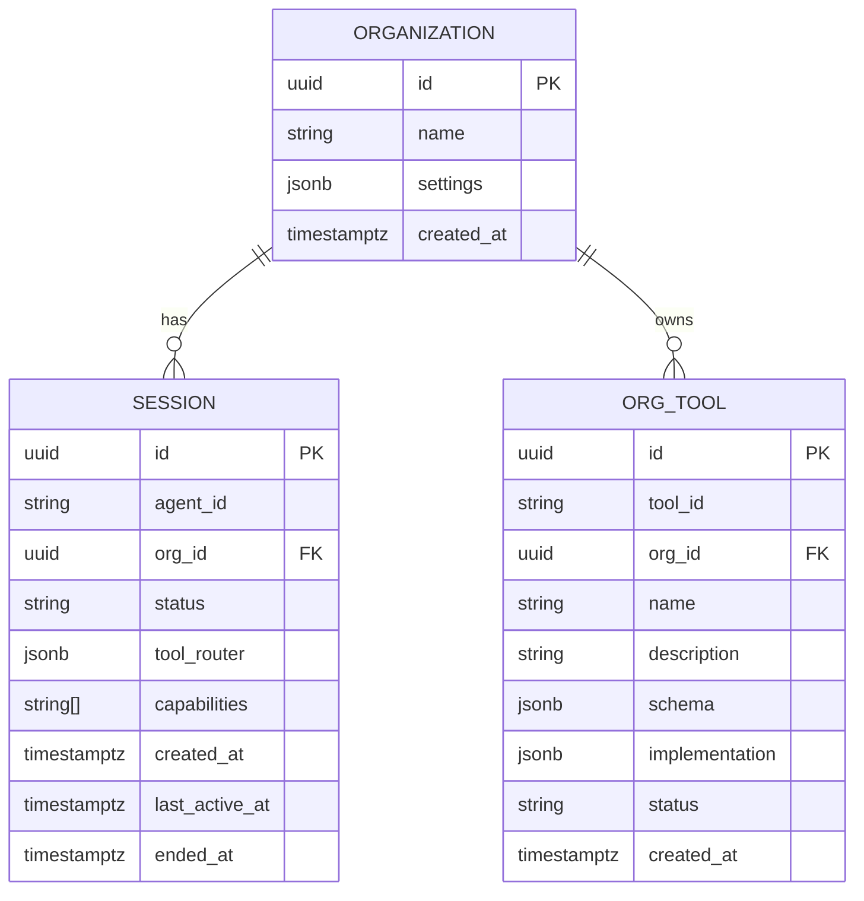
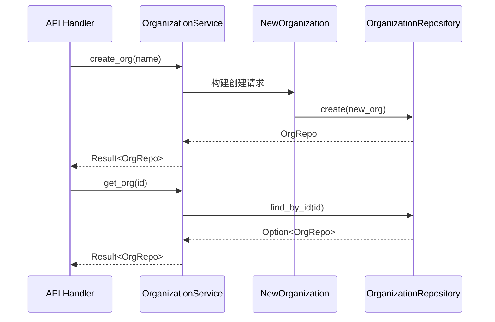
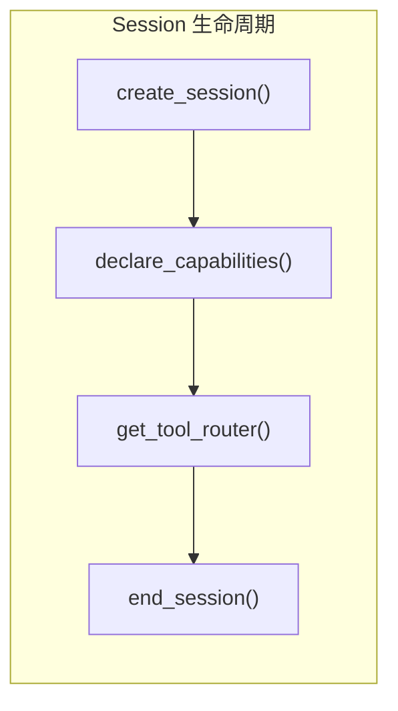
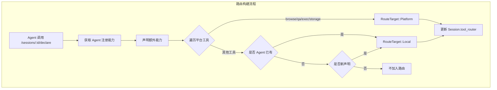

本文档详细描述 Anspire SkillGarden 项目中多租户组织管理模块的架构设计、数据模型、API 接口及业务逻辑。作为 v0.4 多租户扩展的核心组件，组织管理为平台提供了隔离的资源和会话管理能力。

## 架构概览

系统采用经典的三层架构设计：数据持久层 → 服务层 → API 层。组织管理模块与其他核心模块（如会话管理、工具路由）紧密协作，形成完整的多租户支撑体系。



Sources: [handlers.rs](src/api/handlers.rs#L479-L542), [organization.rs](src/services/organization.rs#L1-L59), [session.rs](src/services/session.rs#L1-L129)

## 数据模型

### 组织模型

组织（Organization）是多租户架构的顶级实体，为资源和会话提供隔离边界。



#### Organization 实体

| 字段 | 类型 | 说明 |
|------|------|------|
| `id` | UUID | 主键，自动生成 |
| `name` | VARCHAR(255) | 组织名称，必填 |
| `settings` | JSONB | 灵活的配置存储，默认 `{}` |
| `created_at` | TIMESTAMPTZ | 创建时间，自动记录 |

Sources: [organization.rs](src/models/organization.rs#L1-L32), [004_add_organizations.sql](src/db/migrations/004_add_organizations.sql#L1-L12)

### 会话模型

会话（Session）将 Agent 与组织关联，支持工具路由和能力声明。

| 字段 | 类型 | 说明 |
|------|------|------|
| `id` | UUID | 会话唯一标识 |
| `agent_id` | String | Agent 标识符 |
| `org_id` | UUID | 所属组织外键 |
| `status` | Enum | `Active` 或 `Ended` |
| `tool_router` | JSONB | 工具路由配置 |
| `capabilities` | Vec\<String\> | Agent 声明的能力列表 |
| `created_at` | DateTime | 创建时间 |
| `last_active_at` | DateTime | 最后活跃时间 |
| `ended_at` | Option\<DateTime\> | 结束时间 |

Sources: [session.rs](src/models/session.rs#L1-L78), [session.rs](src/db/repositories/session.rs#L1-L193)

### 组织工具模型

组织工具（OrgTool）允许组织注册自定义工具，实现组织级别的能力扩展。

| 字段 | 类型 | 说明 |
|------|------|------|
| `id` | UUID | 工具唯一标识 |
| `tool_id` | String | 工具标识符（可重复） |
| `org_id` | UUID | 所属组织 |
| `name` | String | 工具显示名称 |
| `description` | String | 工具描述 |
| `schema` | JSONB | 工具参数 schema |
| `implementation` | JSONB | 实现配置（CLI 路径、Docker 镜像等） |
| `status` | Enum | `Pending` → `Approved` / `Rejected` |
| `created_at` | DateTime | 创建时间 |

Sources: [org_tool.rs](src/models/org_tool.rs#L1-L58), [org_tool.rs](src/db/repositories/org_tool.rs#L1-L191)

## 服务层设计

服务层封装业务逻辑，提供类型安全的接口给 API 层使用。

### OrganizationService

组织服务提供标准的 CRUD 操作：



核心方法：

| 方法 | 参数 | 返回值 | 说明 |
|------|------|--------|------|
| `create_org` | `name: String` | `Result<OrgRepo>` | 创建新组织 |
| `get_org` | `id: Uuid` | `Result<OrgRepo>` | 获取单个组织 |
| `list_orgs` | `limit: i64, offset: i64` | `Result<Vec<OrgRepo>>` | 分页列表 |
| `update_org` | `id: Uuid, name: String` | `Result<OrgRepo>` | 更新组织名称 |
| `delete_org` | `id: Uuid` | `Result<()>` | 删除组织 |

Sources: [organization.rs](src/services/organization.rs#L1-L59)

### SessionService

会话服务管理 Agent 与组织的关联生命周期：



关键能力：
- **创建会话**：将 Agent 绑定到特定组织
- **能力声明**：动态构建工具路由表
- **路由获取**：支持工具执行时的路由决策

Sources: [session.rs](src/services/session.rs#L1-L129)

### OrgToolService

组织工具服务管理组织级别的工具注册和审批：

| 方法 | 说明 |
|------|------|
| `register_tool` | 注册新工具（初始状态为 Pending） |
| `approve_tool` | 审批通过工具 |
| `reject_tool` | 拒绝工具 |
| `list_org_tools` | 列出组织所有工具 |
| `list_approved_tools` | 仅列出已审批工具 |

Sources: [org_tool.rs](src/services/org_tool.rs#L1-L83)

## API 接口规范

### 组织管理端点

| 方法 | 路径 | 说明 | 认证 |
|------|------|------|------|
| `POST` | `/api/v1/organizations` | 创建组织 | Agent JWT |
| `GET` | `/api/v1/organizations` | 列表查询 | Agent JWT |
| `GET` | `/api/v1/organizations/:id` | 获取详情 | Agent JWT |
| `PUT` | `/api/v1/organizations/:id` | 更新组织 | Agent JWT |
| `DELETE` | `/api/v1/organizations/:id` | 删除组织 | Agent JWT |

Sources: [routes.rs](src/api/routes.rs#L28-L32)

#### 创建组织

**请求示例：**

```json
POST /api/v1/organizations
Content-Type: application/json

{
    "name": "Engineering Team Alpha"
}
```

**响应示例：**

```json
HTTP/1.1 201 Created

{
    "id": "550e8400-e29b-41d4-a716-446655440000",
    "name": "Engineering Team Alpha",
    "settings": {},
    "created_at": "2024-01-15T10:30:00Z"
}
```

Sources: [handlers.rs](src/api/handlers.rs#L485-L494)

#### 更新组织

**请求示例：**

```json
PUT /api/v1/organizations/550e8400-e29b-41d4-a716-446655440000
Content-Type: application/json

{
    "name": "Engineering Team Beta"
}
```

**响应示例：**

```json
HTTP/1.1 200 OK

{
    "id": "550e8400-e29b-41d4-a716-446655440000",
    "name": "Engineering Team Beta",
    "settings": {},
    "created_at": "2024-01-15T10:30:00Z"
}
```

Sources: [handlers.rs](src/api/handlers.rs#L521-L531)

#### 查询参数

| 参数 | 类型 | 默认值 | 说明 |
|------|------|--------|------|
| `limit` | i64 | 20 | 返回数量上限（最大 100） |
| `offset` | i64 | 0 | 偏移量 |

Sources: [models.rs](src/api/models.rs#L177-L180)

### 会话管理端点

| 方法 | 路径 | 说明 |
|------|------|------|
| `POST` | `/api/v1/sessions` | 创建会话 |
| `GET` | `/api/v1/sessions` | 列表查询 |
| `GET` | `/api/v1/sessions/:id` | 获取详情 |
| `POST` | `/api/v1/sessions/:id/end` | 结束会话 |
| `POST` | `/api/v1/sessions/:id/declare` | 声明能力 |

Sources: [routes.rs](src/api/routes.rs#L33-L37)

#### 创建会话

```json
POST /api/v1/sessions
{
    "agent_id": "agent-001",
    "org_id": "550e8400-e29b-41d4-a716-446655440000"
}
```

Sources: [handlers.rs](src/api/handlers.rs#L546-L555)

### 组织工具端点

| 方法 | 路径 | 说明 |
|------|------|------|
| `POST` | `/api/v1/org-tools` | 注册工具 |
| `GET` | `/api/v1/org-tools` | 列出所有工具 |
| `GET` | `/api/v1/org-tools/:org_id` | 按组织列出工具 |
| `POST` | `/api/v1/org-tools/:id/approve` | 审批通过 |
| `POST` | `/api/v1/org-tools/:id/reject` | 拒绝工具 |

Sources: [routes.rs](src/api/routes.rs#L38-L42)

#### 注册组织工具

```json
POST /api/v1/org-tools
{
    "org_id": "550e8400-e29b-41d4-a716-446655440000",
    "tool_id": "custom-scanner",
    "name": "Security Scanner",
    "description": "Organization-specific security scanning tool",
    "schema": {
        "type": "object",
        "properties": {
            "target": {"type": "string"}
        }
    },
    "implementation": {
        "tool_type": "cli",
        "cli_path": "/opt/scanner/bin/scan",
        "timeout_seconds": 300
    }
}
```

Sources: [handlers.rs](src/api/handlers.rs#L600-L675), [models.rs](src/api/models.rs#L204-L212)

## 工具路由机制

会话创建后，Agent 通过 `declare_capabilities` 接口声明自身能力，系统据此构建工具路由表：



**路由目标类型：**

| 目标 | 说明 |
|------|------|
| `Local` | Agent 本地执行 |
| `Platform` | 平台统一提供 |
| `OrgTool(String)` | 组织自定义工具 |

Sources: [session.rs](src/models/session.rs#L45-L77), [session.rs](src/services/session.rs#L75-L127)

## 数据库迁移

组织相关表结构通过迁移脚本创建：

**004_add_organizations.sql**
```sql
CREATE TABLE organizations (
    id UUID PRIMARY KEY DEFAULT uuid_generate_v4(),
    name VARCHAR(255) NOT NULL,
    settings JSONB DEFAULT '{}',
    created_at TIMESTAMPTZ NOT NULL DEFAULT NOW()
);

CREATE INDEX idx_organizations_name ON organizations(name);
```

Sources: [004_add_organizations.sql](src/db/migrations/004_add_organizations.sql#L1-L12)

**005_add_sessions.sql** 和 **006_add_org_tools.sql** 分别创建会话表和组织工具表：

Sources: [src/db/migrations](src/db/migrations)

## 错误处理

API 层统一使用 `ApiError` 封装错误：

| HTTP 状态码 | 场景 |
|-------------|------|
| `400 Bad Request` | 创建/更新失败、参数校验失败 |
| `401 Unauthorized` | 认证失败 |
| `404 Not Found` | 资源不存在 |
| `500 Internal Server Error` | 数据库或服务层错误 |

```rust
pub async fn get_org_handler(...) -> Result<impl IntoResponse, ApiError> {
    let org = state.organization.get_org(org_id)
        .await
        .map_err(|e| ApiError::NotFound(e.to_string()))?;
    // ...
}
```

Sources: [handlers.rs](src/api/handlers.rs#L496-L505)

## 相关文档

- [会话管理](21-hui-hua-guan-li) — 深入了解会话生命周期和能力声明
- [工具路由](22-gong-ju-lu-you) — 工具执行时的路由决策机制
- [REST API 接口](18-rest-api-jie-kou) — 完整的 API 参考