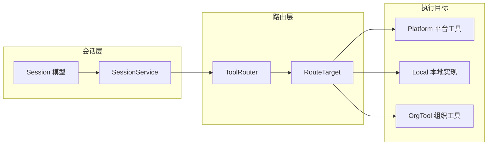
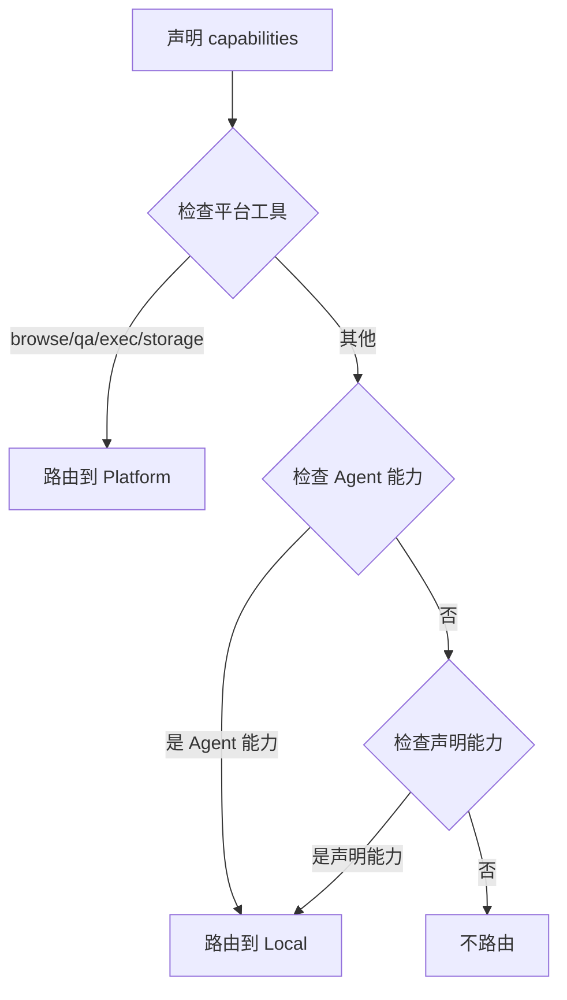
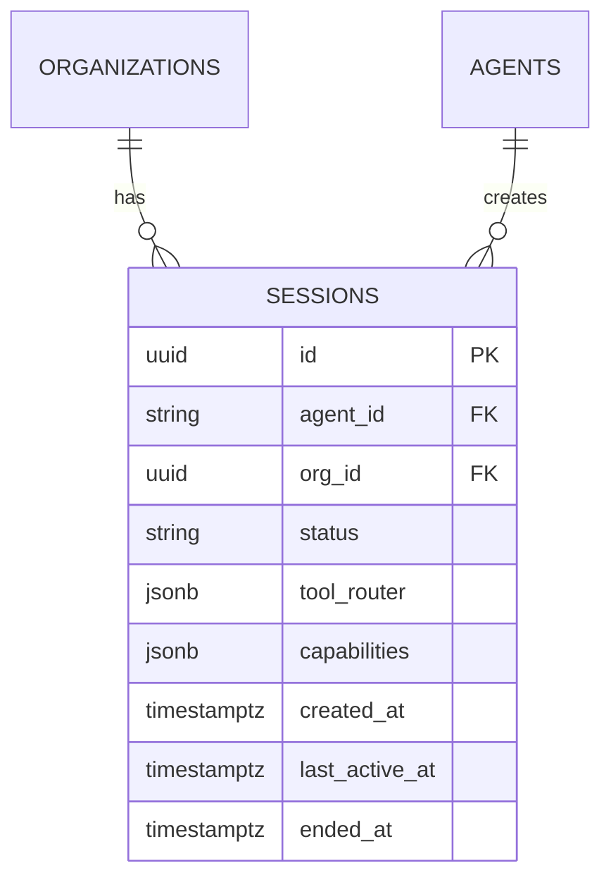

本文档详细阐述 Anspire SkillGarden 中会话（Session）管理的架构设计与实现机制。会话管理是多租户架构的核心组成部分，负责追踪 Agent 与平台之间的交互生命周期，并管理工具调用的路由决策。

## 核心概念

会话管理模块由三个主要组件构成：**Session 模型**、**SessionService** 和 **ToolRouter**。Session 代表 Agent 与组织之间的一个活跃工作上下文，ToolRouter 则决定工具调用应路由到哪个目标执行器。



## 数据模型

### Session 结构

会话模型定义于 `src/models/session.rs`，包含以下核心字段：

```rust
pub struct Session {
    pub id: Uuid,              // 会话唯一标识
    pub agent_id: Uuid,        // 关联的 Agent ID
    pub org_id: Uuid,          // 所属组织 ID
    pub status: SessionStatus, // 会话状态：Active | Ended
    pub tool_router: JsonValue, // 工具路由配置
    pub capabilities: Vec<String>, // Agent 声明的能力
    pub created_at: DateTime<Utc>,     // 创建时间
    pub last_active_at: DateTime<Utc>,  // 最后活跃时间
    pub ended_at: Option<DateTime<Utc>>, // 结束时间
}
```

会话的生命周期分为两个状态：`Active` 表示当前正在进行的会话，`Ended` 表示已结束的会话。系统自动追踪 `last_active_at` 时间戳，用于会话清理和监控。

Sources: [session.rs](src/models/session.rs#L1-L78)

### ToolRouter 路由模型

ToolRouter 管理工具标识符到执行目标的映射：

```rust
pub enum RouteTarget {
    Local,              // Agent 本地实现
    Platform,           // 平台内置工具
    OrgTool(String),    // 组织注册的工具
}
```

平台内置的工具集包括：`browse`、`qa`、`exec`、`storage`。这些工具始终路由到平台层，无法被覆盖。

Sources: [tool_router.rs](src/services/tool_router.rs#L1-L91)

## 数据库架构

会话数据持久化于 PostgreSQL，通过迁移脚本 `005_add_sessions.sql` 和 `011_add_session_skill_fields.sql` 创建表结构。

```sql
CREATE TABLE sessions (
    id UUID PRIMARY KEY DEFAULT uuid_generate_v4(),
    agent_id VARCHAR(255) NOT NULL,
    org_id UUID NOT NULL,
    status VARCHAR(50) NOT NULL DEFAULT 'active',
    tool_router JSONB DEFAULT '{}',
    capabilities JSONB DEFAULT '[]',
    last_active_at TIMESTAMPTZ NOT NULL DEFAULT NOW(),
    created_at TIMESTAMPTZ NOT NULL DEFAULT NOW(),
    ended_at TIMESTAMPTZ,
    CONSTRAINT fk_sessions_agent FOREIGN KEY (agent_id) REFERENCES agents(agent_id),
    CONSTRAINT fk_sessions_org FOREIGN KEY (org_id) REFERENCES organizations(id)
);
```

索引策略确保高频查询的性能：
- `idx_sessions_agent` - 按 Agent 查询会话
- `idx_sessions_org` - 按组织查询会话
- `idx_sessions_status` - 按状态过滤
- `idx_sessions_last_active` - 按活跃时间排序

Sources: [005_add_sessions.sql](src/db/migrations/005_add_sessions.sql#L1-L22)
Sources: [011_add_session_skill_fields.sql](src/db/migrations/011_add_session_skill_fields.sql#L1-L14)

## 服务层实现

### SessionService

`SessionService` 是会话管理的核心服务层，提供完整的 CRUD 操作和能力声明接口：

| 方法 | 职责 | 返回类型 |
|------|------|----------|
| `create_session` | 创建新会话 | `Session` |
| `get_session` | 根据 ID 获取会话 | `Option<Session>` |
| `list_sessions` | 分页列出会话，支持状态过滤 | `Vec<Session>` |
| `end_session` | 标记会话为已结束 | `()` |
| `get_active_session` | 获取 Agent 的当前活跃会话 | `Option<Session>` |
| `get_tool_router` | 获取会话的路由配置 | `Option<ToolRouter>` |
| `declare_capabilities` | 声明 Agent 额外能力并构建路由表 | `ToolRouter` |

Sources: [session.rs](src/services/session.rs#L1-L129)

### 能力声明与路由构建

`declare_capabilities` 方法实现工具路由的动态构建逻辑：



平台工具具有最高优先级，确保核心功能不可被覆盖。Agent 原生能力次之，最后才是动态声明的额外能力。

Sources: [session.rs](src/services/session.rs#L77-L129)

## API 端点

会话管理通过 REST API 暴露，路由配置定义于 `src/api/routes.rs`：

| 方法 | 路径 | 功能 |
|------|------|------|
| `POST` | `/api/v1/sessions` | 创建新会话 |
| `GET` | `/api/v1/sessions` | 列出所有会话（支持分页、状态过滤） |
| `GET` | `/api/v1/sessions/:id` | 获取指定会话详情 |
| `POST` | `/api/v1/sessions/:id/end` | 结束指定会话 |
| `POST` | `/api/v1/sessions/:id/declare` | 声明会话能力并获取路由表 |

Sources: [routes.rs](src/api/routes.rs#L1-44)

### 请求/响应模型

**创建会话请求体：**
```json
{
    "agent_id": "agent-uuid-string",
    "org_id": "550e8400-e29b-41d4-a716-446655440000"
}
```

**列出会话查询参数：**
```json
{
    "limit": 100,
    "offset": 0,
    "status": "active"  // 可选: "active", "ended", 或省略（全部）
}
```

**能力声明请求体：**
```json
{
    "capabilities": ["code_analysis", "git_operations"]
}
```

**能力声明响应：**
```json
{
    "routes": {
        "browse": "Platform",
        "qa": "Platform",
        "exec": "Platform",
        "storage": "Platform",
        "code_analysis": "Local",
        "git_operations": "Local"
    }
}
```

Sources: [models.rs](src/api/models.rs#L141-L200)

## 错误处理

会话操作的错误统一通过 `AppError` 类型处理：

| 错误场景 | 错误类型 | HTTP 状态码 |
|----------|----------|-------------|
| Session 不存在 | `InternalError` | 404 |
| 创建失败 | `InternalError` | 400 |
| 声明能力失败 | `ValidationError` | 400 |
| 数据库错误 | `InternalError` | 500 |

当调用 `declare_capabilities` 时，如果 Session 不存在，会返回 `ValidationError`：

```rust
.ok_or_else(|| AppError::ValidationError(format!("Session {} not found", session_id)))
```

Sources: [session.rs](src/services/session.rs#L91-L93)

## 与其他模块的集成

### 组织管理集成

每个会话必须关联一个有效的组织（`org_id`），外键约束确保数据完整性。组织删除时会级联删除其所有会话。



### Agent 集成

会话创建时验证 `agent_id` 的有效性。Agent 的原生能力（存储于 `agents.capabilities` 字段）参与工具路由的构建过程。

Sources: [agent.rs](src/db/repositories/agent.rs#L1-L181)

## 最佳实践

**会话生命周期管理：**
- Agent 启动时创建会话，退出时显式调用 `end_session`
- 避免长时间不活跃的会话积压，可配置定时清理任务

**能力声明策略：**
- 仅声明必要的额外能力，避免权限过大
- 平台工具不可被覆盖是安全设计的关键约束

**性能优化：**
- 利用 `last_active_at` 索引进行会话查询
- 批量操作时使用 `list_sessions` 的分页功能

## 扩展阅读

- [工具路由](22-gong-ju-lu-you) - 深入了解 ToolRouterService 的路由决策逻辑
- [组织管理](20-zu-zhi-guan-li) - 会话所属的组织管理机制
- [认证与授权](19-ren-zheng-yu-shou-quan) - Agent 身份验证与会话关联