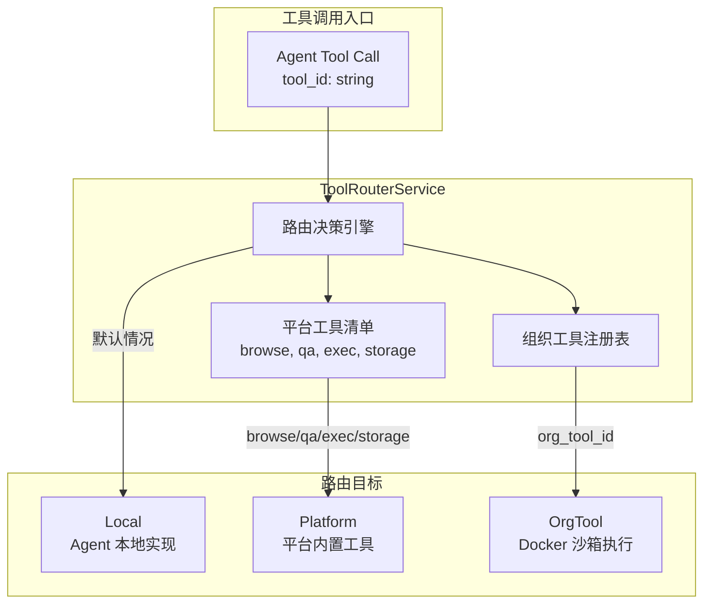
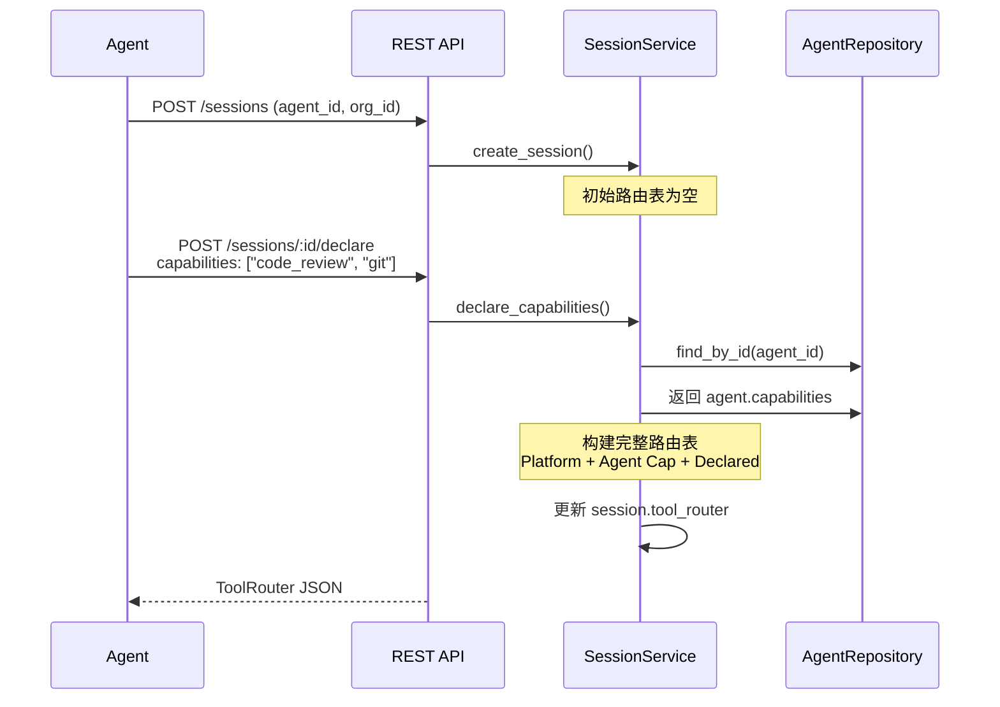
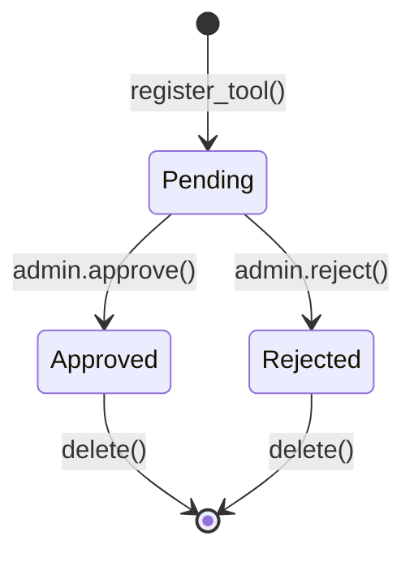
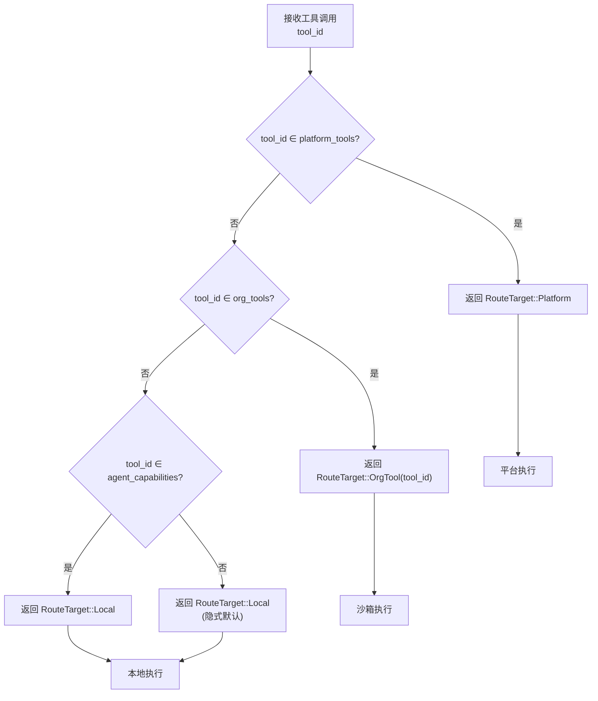

工具路由是 Anspire SkillGarden 多租户架构的核心组成部分，负责将 Agent 的工具调用请求智能地分发到正确的执行目标。本文档详细阐述工具路由的架构设计、数据模型、API 接口以及在会话生命周期中的集成方式。

## 系统架构概述

工具路由采用分层决策模型，支持三类路由目标：



Sources: [tool_router.rs](src/services/tool_router.rs#L1-L91), [session.rs](src/models/session.rs#L45-L77)

## 核心数据模型

### RouteTarget 枚举

路由目标定义了工具调用的三种可能去向：

```rust
#[derive(Debug, Clone, Serialize, Deserialize)]
pub enum RouteTarget {
    Local,                           // Agent 本地实现
    Platform,                        // 平台内置工具
    OrgTool(String),                 // 组织工具（携带 tool_id）
}
```

Sources: [session.rs](src/models/session.rs#L50-L55)

### ToolRouter 路由表

```rust
#[derive(Debug, Clone, Serialize, Deserialize)]
pub struct ToolRouter {
    pub routes: HashMap<String, RouteTarget>,
}

impl ToolRouter {
    pub fn new() -> Self { ... }
    pub fn add_route(&mut self, tool: String, target: RouteTarget) { ... }
    pub fn route(&self, tool_name: &str) -> Option<&RouteTarget> { ... }
}
```

Sources: [session.rs](src/models/session.rs#L45-L71)

### OrgTool 组织工具模型

```rust
#[derive(Debug, Clone, Serialize, Deserialize)]
pub struct OrgTool {
    pub id: Uuid,
    pub tool_id: String,           // 工具唯一标识符
    pub org_id: Uuid,              // 所属组织
    pub name: String,
    pub description: String,
    pub schema: JsonValue,          // 参数 JSON Schema
    pub implementation: ToolImplementation,
    pub status: ToolStatus,       // Pending | Approved | Rejected
    pub created_at: DateTime<Utc>,
}

#[derive(Debug, Clone, Serialize, Deserialize)]
pub struct ToolImplementation {
    pub tool_type: String,
    pub cli_path: String,
    pub docker_image: Option<String>,
    pub timeout_seconds: Option<u32>,
}
```

Sources: [org_tool.rs](src/models/org_tool.rs#L8-L34)

## 工具路由服务

`ToolRouterService` 是路由决策的核心引擎，提供两种主要能力：

Sources: [tool_router.rs](src/services/tool_router.rs#L5-L14)

### 路由决策方法

```rust
impl ToolRouterService {
    /// 单个工具路由决策
    pub fn route_tool(&self, tool_id: &str, org_tools: &[String]) -> RouteTarget {
        // 1. 平台工具优先
        if self.platform_tools.contains(&tool_id.to_string()) {
            return RouteTarget::Platform;
        }
        // 2. 组织工具次之
        if org_tools.contains(&tool_id.to_string()) {
            return RouteTarget::OrgTool(tool_id.to_string());
        }
        // 3. 默认本地
        RouteTarget::Local
    }

    /// 构建完整路由表
    pub fn build_routing_table(
        &self,
        agent_capabilities: &[String],
        org_tools: &[String],
    ) -> ToolRouter {
        // ... 构建完整路由表
    }
}
```

Sources: [tool_router.rs](src/services/tool_router.rs#L28-L72)

### 平台内置工具清单

```rust
platform_tools: vec![
    "browse".to_string(),   // 网页浏览
    "qa".to_string(),       // 问答系统
    "exec".to_string(),     // 命令执行
    "storage".to_string(),  // 存储服务
]
```

Sources: [tool_router.rs](src/services/tool_router.rs#L17-L26)

## 会话生命周期集成

工具路由与会话管理紧密集成，通过声明机制动态构建路由表：



Sources: [session.rs](src/services/session.rs#L75-L127), [handlers.rs](src/api/handlers.rs#L597-L607)

### 路由表构建逻辑

```rust
pub async fn declare_capabilities(
    &self,
    session_id: Uuid,
    capabilities: Vec<String>,
) -> Result<ToolRouter, AppError> {
    // 1. 获取 Agent 原生能力
    let agent_capabilities = agent.capabilities;
    
    // 2. 构建路由表
    let mut router = ToolRouter::new();
    
    // 平台工具 → Platform
    for tool in &["browse", "qa", "exec", "storage"] {
        router.add_route(tool.to_string(), RouteTarget::Platform);
    }
    
    // Agent 能力 → Local
    for cap in &agent_capabilities {
        if !platform_tools.contains(&cap.as_str()) {
            router.add_route(cap.clone(), RouteTarget::Local);
        }
    }
    
    // 声明能力 → Local
    for cap in &capabilities {
        // ... 去重处理
        router.add_route(cap.clone(), RouteTarget::Local);
    }
    
    // 3. 持久化到数据库
    self.session_repo.update_tool_router(session_id, router_json)
}
```

Sources: [session.rs](src/services/session.rs#L95-L127)

## 组织工具管理

### 组织工具生命周期



Sources: [org_tool.rs](src/models/org_tool.rs#L21-L26)

### OrgToolService 接口

| 方法 | 功能 | 返回类型 |
|------|------|----------|
| `register_tool()` | 注册新工具 | `Result<OrgToolRepo, AppError>` |
| `approve_tool()` | 审批通过 | `Result<(), AppError>` |
| `reject_tool()` | 拒绝 | `Result<(), AppError>` |
| `list_org_tools()` | 列出组织工具 | `Result<Vec<OrgToolRepo>, AppError>` |
| `list_approved_tools()` | 仅列出已批准 | `Result<Vec<OrgToolRepo>, AppError>` |

Sources: [org_tool.rs](src/services/org_tool.rs#L24-L82)

## 沙箱执行服务

`SandboxService` 负责在隔离的 Docker 容器中执行组织工具：

```rust
pub struct ToolExecutionRequest {
    pub tool_id: String,
    pub org_id: String,
    pub parameters: HashMap<String, serde_json::Value>,
    pub timeout_seconds: u64,
}

pub struct ToolExecutionResult {
    pub success: bool,
    pub output: Option<serde_json::Value>,
    pub error: Option<String>,
    pub execution_time_ms: u64,
}
```

Sources: [sandbox.rs](src/services/sandbox.rs#L7-L23)

**实现状态**: 当前为占位实现，计划通过 bollard SDK 与 Docker 守护进程集成，实现完整的容器化执行环境。

Sources: [sandbox.rs](src/services/sandbox.rs#L40-L60)

## REST API 接口

### 核心路由端点

| 端点 | 方法 | 描述 | 请求体 |
|------|------|------|--------|
| `/api/v1/sessions` | POST | 创建会话 | `{ "agent_id": string, "org_id": uuid }` |
| `/api/v1/sessions/:id/declare` | POST | 声明能力并获取路由表 | `{ "capabilities": string[] }` |
| `/api/v1/org-tools` | POST | 注册组织工具 | 见下表 |
| `/api/v1/org-tools/:org_id` | GET | 列出组织工具 | `?approved_only=true` |
| `/api/v1/org-tools/:id/approve` | POST | 审批工具 | - |
| `/api/v1/org-tools/:id/reject` | POST | 拒绝工具 | - |

Sources: [routes.rs](src/api/routes.rs#L27-L43)

### 注册组织工具请求体

```json
{
  "org_id": "uuid",
  "tool_id": "custom_scanner",
  "name": "Custom Security Scanner",
  "description": "Organization-specific security scanning tool",
  "schema": {
    "type": "object",
    "properties": {
      "target": { "type": "string" }
    }
  },
  "implementation": {
    "tool_type": "cli",
    "cli_path": "/usr/local/bin/scanner",
    "docker_image": "ghcr.io/myorg/scanner:latest",
    "timeout_seconds": 60
  }
}
```

Sources: [models.rs](src/api/models.rs#L204-L212)

### 路由表响应示例

```json
{
  "routes": {
    "browse": "Platform",
    "qa": "Platform", 
    "exec": "Platform",
    "storage": "Platform",
    "code_review": "Local",
    "git": "Local",
    "custom_scanner": {
      "OrgTool": "custom_scanner"
    }
  }
}
```

## 数据库架构

### sessions 表

```sql
CREATE TABLE sessions (
    id UUID PRIMARY KEY DEFAULT uuid_generate_v4(),
    agent_id VARCHAR(255) NOT NULL,
    org_id UUID NOT NULL,
    status VARCHAR(50) NOT NULL DEFAULT 'active',
    tool_router JSONB DEFAULT '{}',     -- 路由表持久化
    capabilities JSONB DEFAULT '[]',    -- 声明的能力
    last_active_at TIMESTAMPTZ NOT NULL DEFAULT NOW(),
    created_at TIMESTAMPTZ NOT NULL DEFAULT NOW(),
    ended_at TIMESTAMPTZ
);
```

Sources: [005_add_sessions.sql](src/db/migrations/005_add_sessions.sql#L1-L22)

### org_tools 表

```sql
CREATE TABLE org_tools (
    id UUID PRIMARY KEY DEFAULT uuid_generate_v4(),
    tool_id VARCHAR(255) NOT NULL,
    org_id UUID NOT NULL,
    name VARCHAR(255) NOT NULL,
    description TEXT,
    schema JSONB NOT NULL,              -- 参数规范
    implementation JSONB NOT NULL,      -- 执行配置
    status VARCHAR(50) NOT NULL DEFAULT 'pending',
    created_at TIMESTAMPTZ NOT NULL DEFAULT NOW(),
    UNIQUE(org_id, tool_id)            -- 组织内工具 ID 唯一
);
```

Sources: [006_add_org_tools.sql](src/db/migrations/006_add_org_tools.sql#L1-L20)

## 路由决策流程图



## 下一步阅读

- [会话管理](21-hui-hua-guan-li) — 深入了解会话的完整生命周期管理
- [组织管理](20-zu-zhi-guan-li) — 多租户组织架构与隔离
- [工具执行与沙箱](25-gong-ju-zhi-xing-yu-sha-xiang) — Docker 沙箱执行机制详解
- [置信度权重机制](26-zhi-xin-du-quan-zhong-ji-zhi) — 工具选择的置信度评估