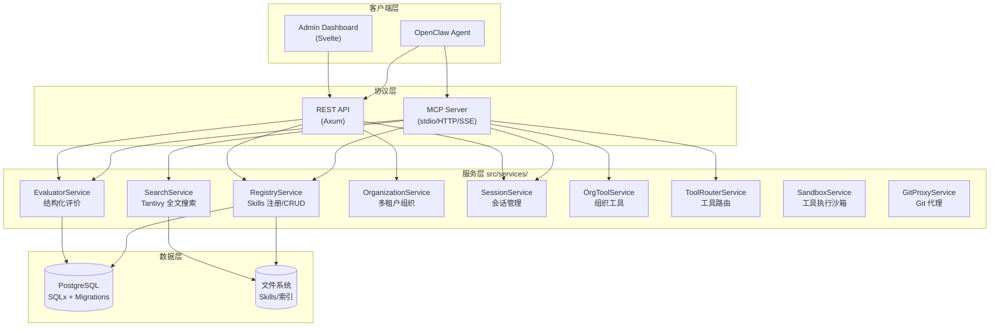
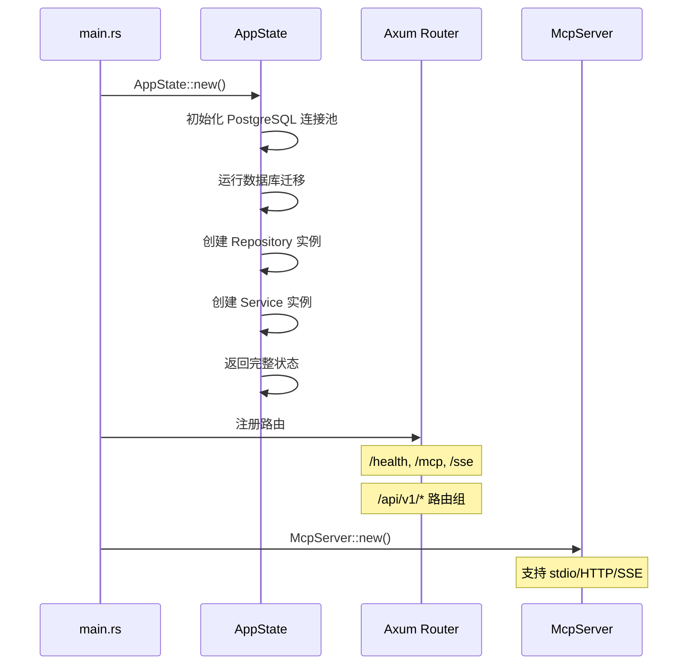
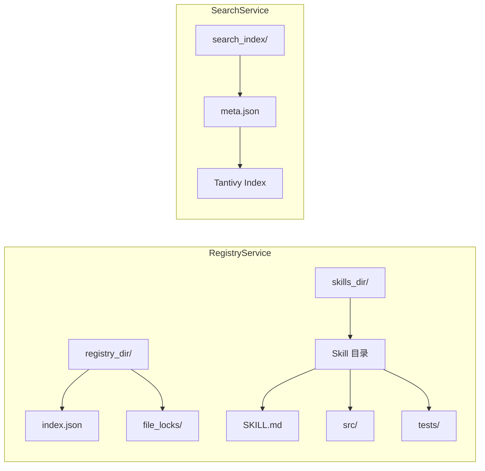
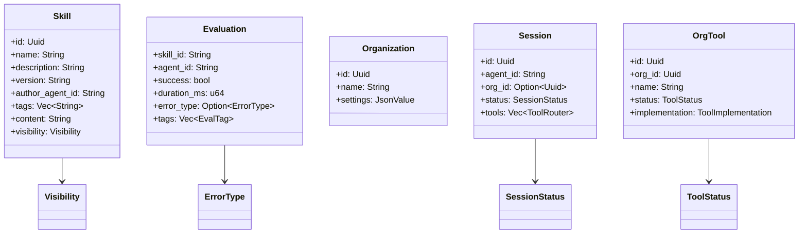
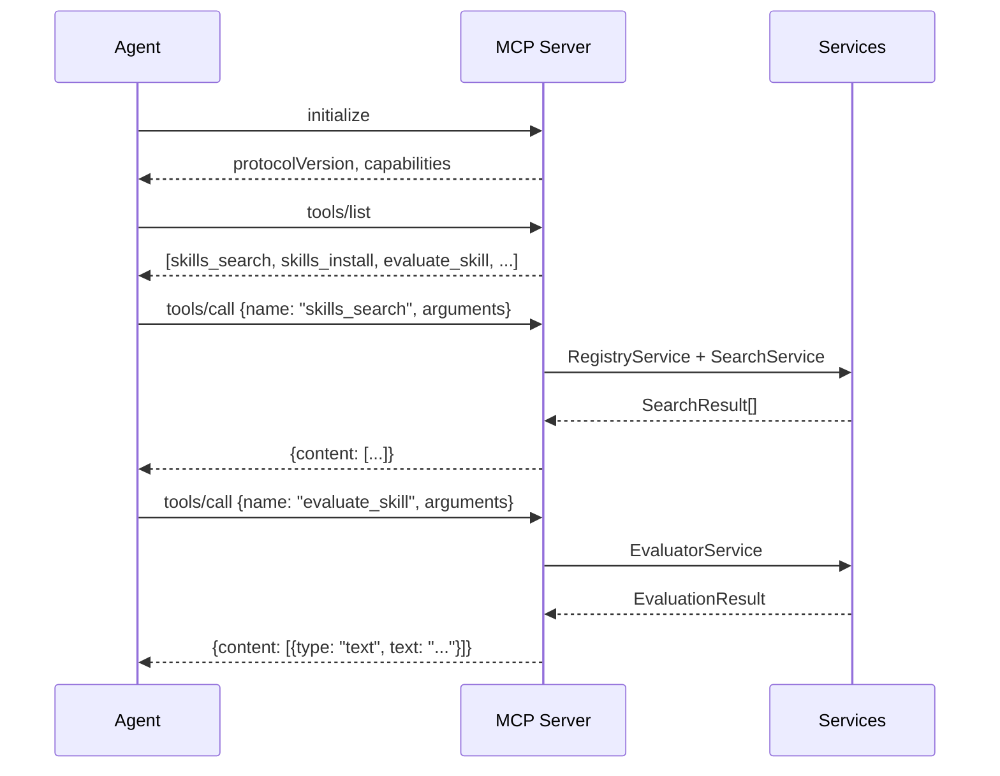
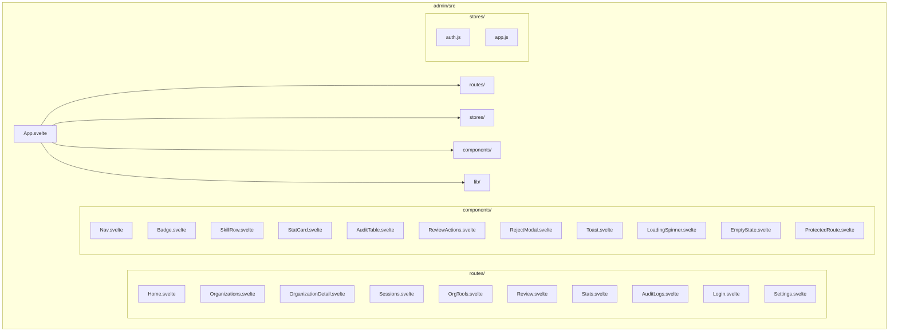
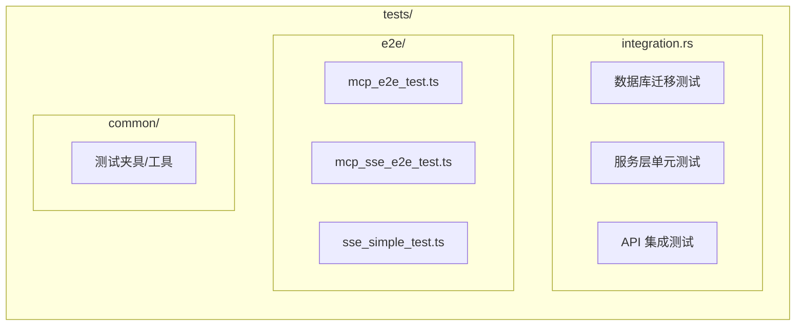

本文档详细解析 **Anspire SkillGarden**（项目内部代号 AionHive）的代码组织结构，帮助开发者快速定位功能模块、理解服务边界与数据流向。该项目采用 Rust 后端 + Svelte 前端的分层架构，通过 MCP（Model Context Protocol）协议向 AI Agent 提供 Skills 共享能力。

## 整体架构概览



Sources: [src/lib.rs](src/lib.rs#L18-L38), [Cargo.toml](Cargo.toml#L1-L73)

## 目录结构速览

| 目录 | 用途 | 关键文件 |
|------|------|----------|
| `src/` | Rust 后端核心 | `lib.rs`, `main.rs` |
| `src/api/` | REST API 层 | `handlers.rs`, `routes.rs`, `jwt.rs` |
| `src/services/` | 业务逻辑服务 | 10 个服务模块 |
| `src/models/` | 数据模型定义 | 8 个模型模块 |
| `src/db/` | 数据库访问层 | `repositories/`, `migrations/` |
| `src/mcp/` | MCP 协议实现 | `server.rs` |
| `admin/` | Svelte 管理平台 | `App.svelte`, `routes/` |
| `docs/` | 架构设计文档 | `ARCHITECTURE.md`, `MVP.md` |
| `tests/` | 测试代码 | `integration.rs`, `e2e/` |

Sources: [get_dir_structure](get_dir_structure)

## 后端核心模块详解

### 入口点与状态管理

`src/main.rs` 是应用启动入口，负责 HTTP 服务器初始化和多传输模式支持：



`src/lib.rs` 导出统一的 `AppState` 结构体，作为应用全局状态的容器：

```rust
pub struct AppState {
    pub registry: RegistryService,
    pub search: SearchService,
    pub storage: StorageService,
    pub evaluator: EvaluatorService,
    // v0.4 多租户服务
    pub organization: OrganizationService,
    pub session: SessionService,
    pub org_tool: OrgToolService,
    pub tool_router: ToolRouterService,
    pub sandbox: SandboxService,
    pub git_proxy: GitProxyService,
    pub data_dir: PathBuf,
}
```

Sources: [src/lib.rs](src/lib.rs#L18-L38), [src/main.rs](src/main.rs#L1-L50)

### 服务层（src/services/）

服务层采用**贫血模型 + 仓储模式**，每个服务负责单一业务领域：

| 服务 | 职责 | 核心方法 |
|------|------|----------|
| **RegistryService** | Skills 的注册、创建、更新、删除、索引管理 | `create_skill`, `update_skill`, `get_skill`, `delete_skill` |
| **SearchService** | 基于 Tantivy 的全文搜索服务 | `search`, `add_skill`, `delete_skill` |
| **EvaluatorService** | 结构化评价处理与置信度计算 | `evaluate`, `get_stats` |
| **OrganizationService** | 多租户组织管理 | `create_org`, `get_org`, `update_org` |
| **SessionService** | Agent 会话生命周期管理 | `create_session`, `end_session`, `declare` |
| **OrgToolService** | 组织级工具注册与审核 | `register_tool`, `approve_tool`, `reject_tool` |
| **ToolRouterService** | 运行时工具路由选择 | `route`, `add_candidate`, `remove_candidate` |
| **SandboxService** | 工具安全执行环境 | `execute_tool`, `validate_request` |
| **GitProxyService** | Skills 的 Git 仓库代理访问 | `fetch_file`, `get_diff` |
| **StorageService** | 文件系统原子操作与文件锁 | `atomic_write`, `read_json`, `write_json` |

**RegistryService** 是核心服务，其架构如下：



Sources: [src/services/mod.rs](src/services/mod.rs#L1-L25), [src/services/registry.rs](src/services/registry.rs#L1-L50), [src/services/search.rs](src/services/search.rs#L1-L50)

### 模型层（src/models/）

数据模型定义在 `src/models/` 目录，采用 `serde` 实现 JSON 序列化：



Sources: [src/models/mod.rs](src/models/mod.rs#L1-L20), [src/models/organization.rs](src/models/organization.rs#L1-L32)

### 数据库层（src/db/）

采用 **Repository 模式** + **SQLx** 实现类型安全的数据库访问：

```mermaid
erDiagram
    REPOSITORIES {
        SkillRepository skills
        AgentRepository agents
        OrganizationRepository organizations
        SessionRepository sessions
        OrgToolRepository org_tools
        EvaluationRepository evaluations
        SkillPolicyRepository skill_policies
        AuditRepository audit_logs
        AdminUserRepository admin_users
    }
    
    MIGRATIONS {
        001_initial_schema "初始表结构"
        002_add_skill_status "技能状态"
        003_seed_admin_agent "管理员种子数据"
        004_add_organizations "组织表"
        005_add_sessions "会话表"
        006_add_org_tools "组织工具表"
        007_add_skill_policies "技能策略表"
        008_add_skill_git_and_org_fields "Git 和组织字段"
        009_add_agent_id_column "Agent ID 列"
        010_add_admin_users "管理员用户表"
        011_add_session_skill_fields "会话技能字段"
    }
```

Sources: [src/db/mod.rs](src/db/mod.rs#L1-L11), [get_dir_structure](src/db/migrations)

### API 层（src/api/）

REST API 模块提供 HTTP 接口，结构如下：

```mermaid
flowchart TB
    subgraph "API 模块"
        H[handlers.rs]
        R[routes.rs]
        M[models.rs]
        J[jwt.rs]
        E[error.rs]
        S[http_state.rs]
    end
    
    subgraph "路由分组"
        subgraph "健康检查"
            H --> H1["GET /health"]
        end
        
        subgraph "MCP 端点"
            H --> M1["POST /mcp"]
            H --> M2["GET /sse"]
            H --> M3["POST /sse/:session_id"]
        end
        
        subgraph "Skills API v1"
            H --> S1["GET/POST /api/v1/skills"]
            H --> S2["GET/PUT/DELETE /api/v1/skills/:id"]
            H --> S3["GET /api/v1/skills/:id/stats"]
        end
        
        subgraph "评价 API"
            H --> E1["POST /api/v1/evaluations"]
        end
        
        subgraph "认证 API"
            H --> A1["POST /api/v1/auth/agent/register"]
            H --> A2["POST /api/v1/auth/agent/token"]
        end
        
        subgraph "组织 API (v0.4)"
            H --> O1["CRUD /api/v1/organizations"]
        end
        
        subgraph "会话 API (v0.4)"
            H --> C1["CRUD /api/v1/sessions"]
        end
        
        subgraph "组织工具 API (v0.4)"
            H --> T1["CRUD /api/v1/org-tools"]
        end
        
        subgraph "管理员 API"
            H --> D1["POST /api/v1/admin/login"]
            H --> D2["GET /api/v1/admin/audit-logs"]
            H --> D3["POST /api/v1/admin/skills/:id/approve"]
        end
    end
```



Sources: [src/api/mod.rs](src/api/mod.rs#L1-L16), [src/main.rs](src/main.rs#L90-L160)

### MCP 服务器（src/mcp/）

MCP Server 实现 Agent 与平台的协议交互：



**支持的 MCP 工具**：

| 工具名 | 功能 | 参数 |
|--------|------|------|
| `skills_search` | 搜索 Skills | `query`, `tags?`, `limit?` |
| `skills_install` | 安装 Skill | `skill_id`, `version?` |
| `skills_list` | 列出已安装 | - |
| `skills_uninstall` | 卸载 Skill | `skill_id` |
| `evaluate_skill` | 评价 Skill | `skill_id`, `success`, `duration_ms`, `tags?` |
| `session_declare` | 声明会话工具 | `tools`, `capabilities` |
| `tool_execute` | 执行工具 | `tool_name`, `params` |
| `get_tool_result` | 获取执行结果 | `execution_id` |

Sources: [src/mcp/mod.rs](src/mcp/mod.rs#L1-L5), [src/mcp/server.rs](src/mcp/server.rs#L1-L100)

## 前端结构（admin/）

管理平台基于 **Svelte 4** + **Vite** 构建：



**技术栈**：

| 依赖 | 版本 | 用途 |
|------|------|------|
| Svelte | 4.2.x | UI 框架 |
| Vite | 5.2.x | 构建工具 |
| svelte-routing | 2.13.x | 路由管理 |

Sources: [admin/package.json](admin/package.json#L1-L20), [get_dir_structure](admin/src)

## 测试结构（tests/）



Sources: [get_dir_structure](tests)

## 数据流向总览

```mermaid
flowchart TB
    subgraph "写入流程"
        W1[Agent 创建 Skill] --> W2[RegistryService.create_skill]
        W2 --> W3[(PostgreSQL)]
        W2 --> W4[SearchService.add_skill]
        W4 --> W5[(Tantivy Index)]
        
        W6[Agent 评价 Skill] --> W7[EvaluatorService.evaluate]
        W7 --> W8[(evaluations/)]
        W7 --> W9[置信度重新计算]
    end
    
    subgraph "读取流程"
        R1[Agent 搜索 Skills] --> R2[MCP tools/call]
        R2 --> R3[SearchService.search]
        R3 --> R4[(Tantivy Index)]
        R4 --> R5[SearchResult[]]
        
        R6[Agent 安装 Skill] --> R7[RegistryService.get_skill]
        R7 --> R8[GitProxyService.fetch_file]
        R8 --> R9[(Git Repo)]
    end
```

## 下一步阅读

完成项目结构学习后，建议按以下顺序深入：

1. **[系统架构](8-xi-tong-jia-gou)** — 了解服务间协作与部署模式
2. **[核心概念](3-he-xin-gai-nian)** — 掌握 Skill、Evaluation、置信度等核心概念
3. **[MCP Server 实现](10-mcp-server-shi-xian)** — 深入协议层实现细节
4. **[数据库迁移](15-shu-ju-ku-qian-yi)** — 了解数据库 schema 设计