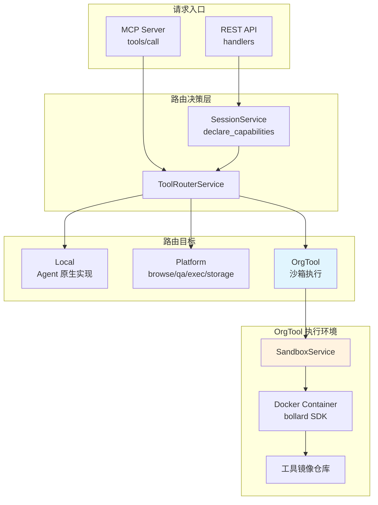
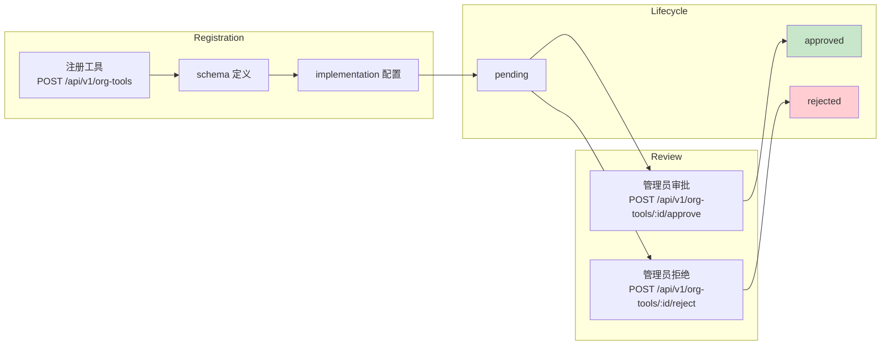
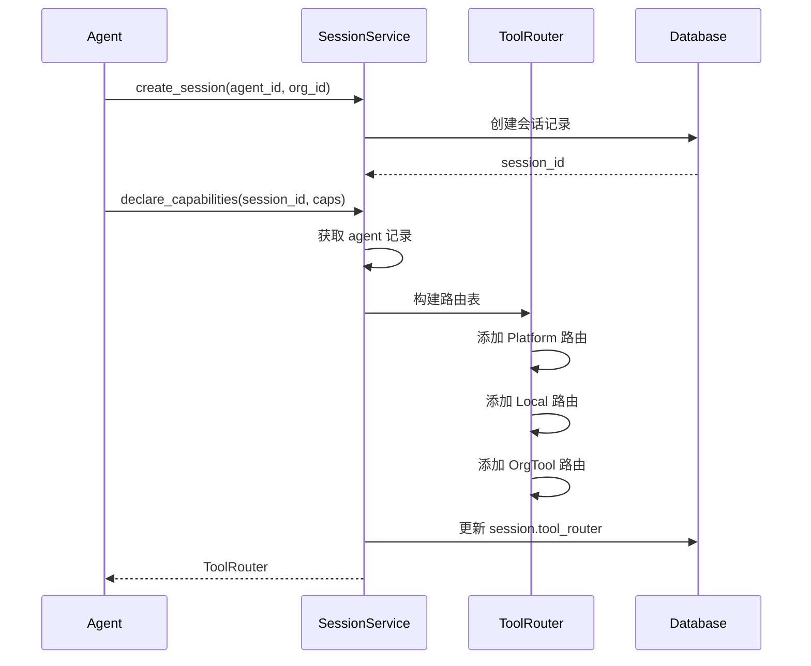
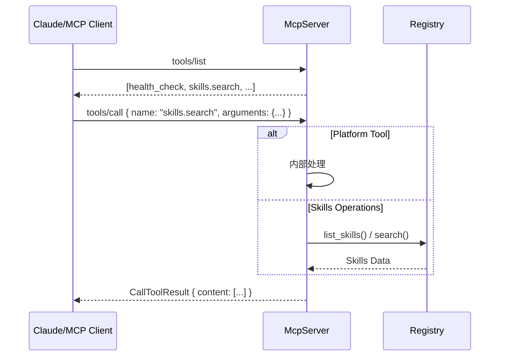
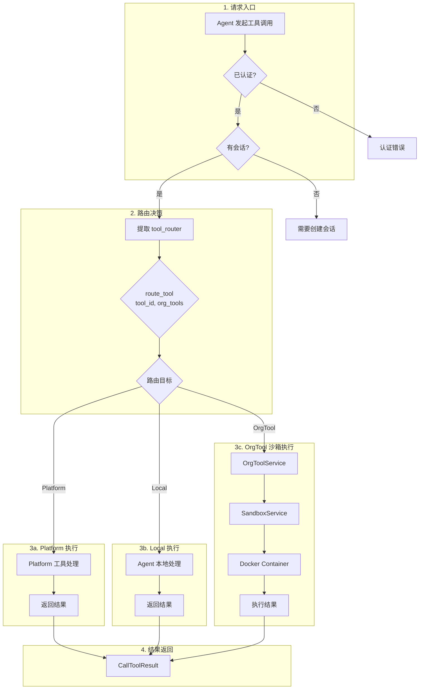

本文档详细阐述 Anspire SkillGarden 平台中工具（Tool）的路由机制、注册流程以及沙箱执行架构。该系统采用分层路由策略，将工具调用分发至三类目标：本地实现（Local）、平台内置（Platform）或组织私有工具（OrgTool）。

## 架构概览

Anspire 采用**三级路由分发架构**，通过 `ToolRouterService` 在请求入口处进行目标判定，随后由相应的执行器完成工具调用。这种设计实现了关注点分离：路由层负责决策，执行层负责安全隔离。



Sources: [src/services/tool_router.rs](src/services/tool_router.rs#L1-L91), [src/services/sandbox.rs](src/services/sandbox.rs#L1-L95)

## 路由决策机制

### RouteTarget 枚举

系统定义了三种路由目标，通过 `RouteTarget` 枚举表示：

| 目标类型 | 说明 | 典型场景 |
|---------|------|---------|
| `Local` | Agent 本地实现 | Agent 自身的原生能力 |
| `Platform` | 平台内置工具 | browse、qa、exec、storage |
| `OrgTool(String)` | 组织私有工具 | 需要沙箱隔离的 CLI 工具 |

Sources: [src/models/session.rs](src/models/session.rs#L50-L55)

### ToolRouterService 实现

`ToolRouterService` 是路由决策的核心服务，其 `route_tool` 方法按优先级检查目标：

```mermaid
sequenceDiagram
    participant Agent as Agent Request
    participant Router as ToolRouterService
    participant Platform as Platform Tools
    participant Org as Org Tools

    Agent->>Router: route_tool(tool_id, org_tools)
    
    alt Platform Tool Check
        Router->>Router: platform_tools.contains(tool_id)?
        if true then
            Router-->>Agent: RouteTarget::Platform
        else if Org Tool Check
            Router->>Router: org_tools.contains(tool_id)?
            if true then
                Router-->>Agent: RouteTarget::OrgTool(tool_id)
            else
                Router-->>Agent: RouteTarget::Local
            end
        end
    end
```

**路由优先级**：Platform > OrgTool > Local

Sources: [src/services/tool_router.rs](src/services/tool_router.rs#L28-L42)

### 平台内置工具

系统预设四类平台工具，始终可用：

```rust
platform_tools: vec![
    "browse".to_string(),   // 网页浏览
    "qa".to_string(),       // 问答搜索
    "exec".to_string(),     // 命令执行
    "storage".to_string(),  // 存储服务
]
```

Sources: [src/services/tool_router.rs](src/services/tool_router.rs#L17-L26)

## 组织工具注册与审批

### OrgTool 数据模型

组织工具在数据库中以 `org_tools` 表存储：

| 字段 | 类型 | 说明 |
|------|------|------|
| `id` | UUID | 主键 |
| `tool_id` | VARCHAR | 工具唯一标识 |
| `org_id` | UUID | 所属组织 |
| `name` | VARCHAR | 显示名称 |
| `description` | TEXT | 工具描述 |
| `schema` | JSONB | 参数 schema |
| `implementation` | JSONB | 运行时配置 |
| `status` | VARCHAR | pending/approved/rejected |

Sources: [src/db/migrations/006_add_org_tools.sql](src/db/migrations/006_add_org_tools.sql#L1-L15)

### 工具注册流程



工具注册后需管理员审批才可使用，确保组织内工具质量。

Sources: [src/services/org_tool.rs](src/services/org_tool.rs#L24-L45), [src/api/handlers.rs](src/api/handlers.rs#L611-L627)

### OrgToolService API

| 方法 | 功能 |
|------|------|
| `register_tool()` | 注册新工具 |
| `approve_tool()` | 审批通过 |
| `reject_tool()` | 审批拒绝 |
| `list_org_tools()` | 列出组织工具 |
| `list_approved_tools()` | 仅列出已批准工具 |

Sources: [src/services/org_tool.rs](src/services/org_tool.rs#L1-L83)

## 会话级路由声明

### 声明机制

Agent 在会话创建后可声明其能力，系统据此构建会话专属的 `ToolRouter`：



Sources: [src/services/session.rs](src/services/session.rs#L75-L127)

### 路由表构建

会话声明时，系统按以下顺序构建路由：

1. **平台工具**：始终路由至 `Platform`
2. **Agent 原生能力**：路由至 `Local`
3. **声明的额外能力**：路由至 `Local`（若非平台工具且非已有能力）
4. **组织工具**（未来扩展）：路由至 `OrgTool`

Sources: [src/services/session.rs](src/services/session.rs#L95-L119)

## 沙箱执行架构

### SandboxService 设计

`SandboxService` 负责在隔离的 Docker 容器中执行组织工具，实现安全的多租户工具运行：

```mermaid
flowchart TB
    subgraph "执行请求"
        Req[ToolExecutionRequest<br/>tool_id, org_id, parameters, timeout]
    end

    subgraph "沙箱执行流程"
        Pull[Pull Docker Image<br/>ghcr.io/{org}/{tool}:latest]
        Create[Create Container<br/>isolated network]
        Mount[Mount Input Volume<br/>parameters as JSON]
        Start[Start Container<br/>with timeout]
        Capture[Capture stdout<br/>as JSON result]
        Cleanup[Cleanup<br/>container + volume]
    end

    subgraph "执行结果"
        Result[ToolExecutionResult<br/>success, output, error, execution_time_ms]
    end

    Req --> Pull --> Create --> Mount --> Start --> Capture --> Cleanup --> Result
```

Sources: [src/services/sandbox.rs](src/services/sandbox.rs#L40-L60)

### 执行请求结构

```rust
pub struct ToolExecutionRequest {
    pub tool_id: String,           // 工具标识
    pub org_id: String,            // 组织标识
    pub parameters: HashMap<String, serde_json::Value>,  // 执行参数
    pub timeout_seconds: u64,       // 超时秒数
}

pub struct ToolExecutionResult {
    pub success: bool,             // 执行是否成功
    pub output: Option<serde_json::Value>,  // 输出结果
    pub error: Option<String>,      // 错误信息
    pub execution_time_ms: u64,    // 执行耗时
}
```

Sources: [src/services/sandbox.rs](src/services/sandbox.rs#L7-L23)

### Docker 隔离策略

沙箱实现计划采用以下安全措施：

| 隔离维度 | 策略 |
|---------|------|
| 网络 | 无网络访问（isolated network） |
| 文件系统 | 临时卷挂载，容器结束后清理 |
| 资源限制 | 内存、CPU 限制 |
| 执行时间 | 超时强制终止 |

### 当前实现状态

**注意**：SandboxService 目前为占位实现（TODO），正式集成需要添加 `bollard` SDK 依赖：

```toml
# Cargo.toml 未来扩展
bollard = "0.17"  # Docker API 客户端
```

Sources: [src/services/sandbox.rs](src/services/sandbox.rs#L44-L59)

## MCP 协议集成

### 工具列表与调用

MCP Server 通过 `tools/list` 和 `tools/call` 方法暴露工具能力：



Sources: [src/mcp/server.rs](src/mcp/server.rs#L137-L188)

### 内置 MCP 工具

| 工具名 | 功能 | 参数 |
|--------|------|------|
| `health_check` | 健康检查 | - |
| `skills.search` | 搜索技能 | query, tags, limit |
| `skills.list` | 列出技能 | limit |
| `skills.info` | 技能详情 | skill_id |
| `skills.create` | 创建技能 | name, description, content, tags |
| `skills.update` | 更新技能 | skill_id, ... |
| `skills.install` | 安装技能 | skill_id |
| `evaluate_skill` | 评价技能 | skill_id, agent_id, success, duration_ms |
| `skills.stats` | 技能统计 | skill_id |

Sources: [src/mcp/server.rs](src/mcp/server.rs#L386-L377)

## 工具执行流程图

完整请求生命周期：



## 配置参考

### 环境变量

| 变量 | 说明 | 默认值 |
|------|------|--------|
| `AION_HIVE_JWT_TOKEN` | MCP 认证 Token | - |
| `DATABASE_URL` | PostgreSQL 连接 | - |
| `RUST_LOG` | 日志级别 | info |

### API 端点汇总

| 方法 | 路径 | 功能 |
|------|------|------|
| `POST` | `/api/v1/org-tools` | 注册组织工具 |
| `GET` | `/api/v1/org-tools/:org_id` | 列出组织工具 |
| `GET` | `/api/v1/org-tools` | 列出所有工具 |
| `POST` | `/api/v1/org-tools/:id/approve` | 审批工具 |
| `POST` | `/api/v1/org-tools/:id/reject` | 拒绝工具 |
| `POST` | `/api/v1/sessions/:id/declare` | 声明会话能力 |

Sources: [src/api/routes.rs](src/api/routes.rs#L38-L42)

## 后续步骤

在理解工具执行与沙箱架构后，建议继续阅读：

- [置信度权重机制](26-zhi-xin-du-quan-zhong-ji-zhi) — 了解工具评价与置信度系统
- [MCP 协议接口](17-mcp-xie-yi-jie-kou) — 深入 MCP 协议细节
- [REST API 接口](18-rest-api-jie-kou) — API 完整参考

## 相关源文件

| 文件 | 说明 |
|------|------|
| [src/services/tool_router.rs](src/services/tool_router.rs) | 工具路由服务 |
| [src/services/sandbox.rs](src/services/sandbox.rs) | 沙箱执行服务 |
| [src/services/org_tool.rs](src/services/org_tool.rs) | 组织工具服务 |
| [src/services/session.rs](src/services/session.rs) | 会话管理服务 |
| [src/models/session.rs](src/models/session.rs) | 会话与路由模型 |
| [src/models/org_tool.rs](src/models/org_tool.rs) | 组织工具模型 |
| [src/mcp/server.rs](src/mcp/server.rs) | MCP 服务器实现 |
| [src/api/handlers.rs](src/api/handlers.rs) | API 处理器 |
| [src/api/routes.rs](src/api/routes.rs) | 路由配置 |
| [src/db/migrations/006_add_org_tools.sql](src/db/migrations/006_add_org_tools.sql) | 工具表迁移 |