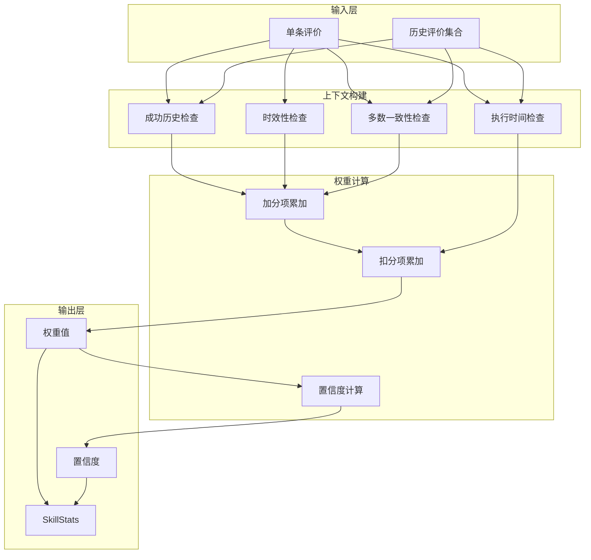
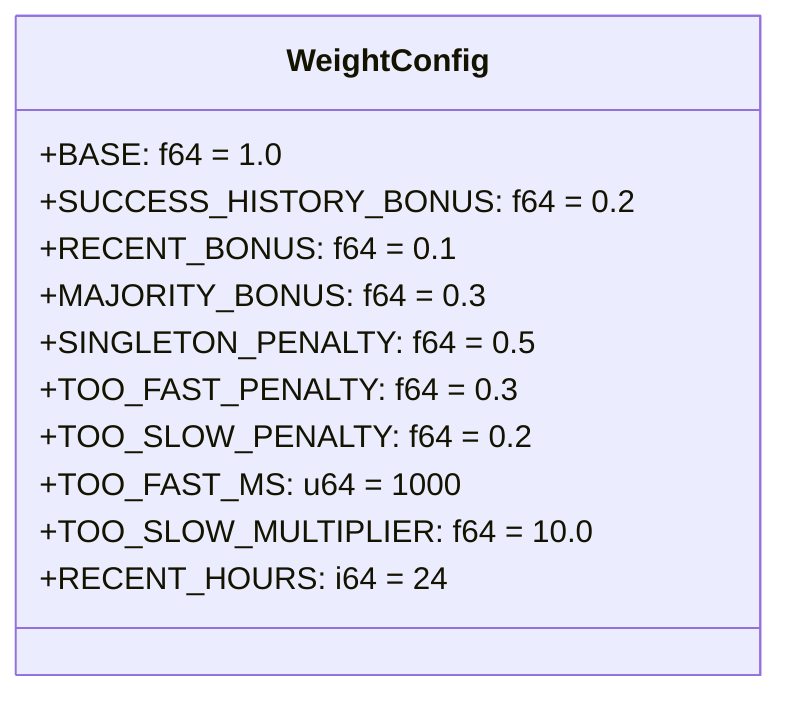
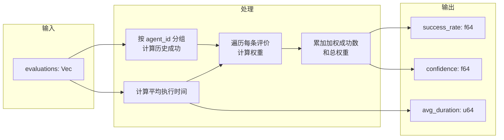
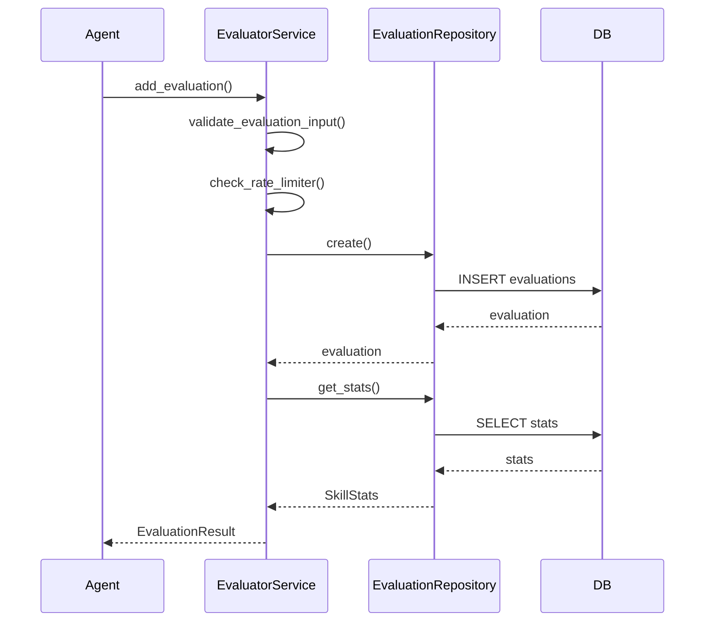
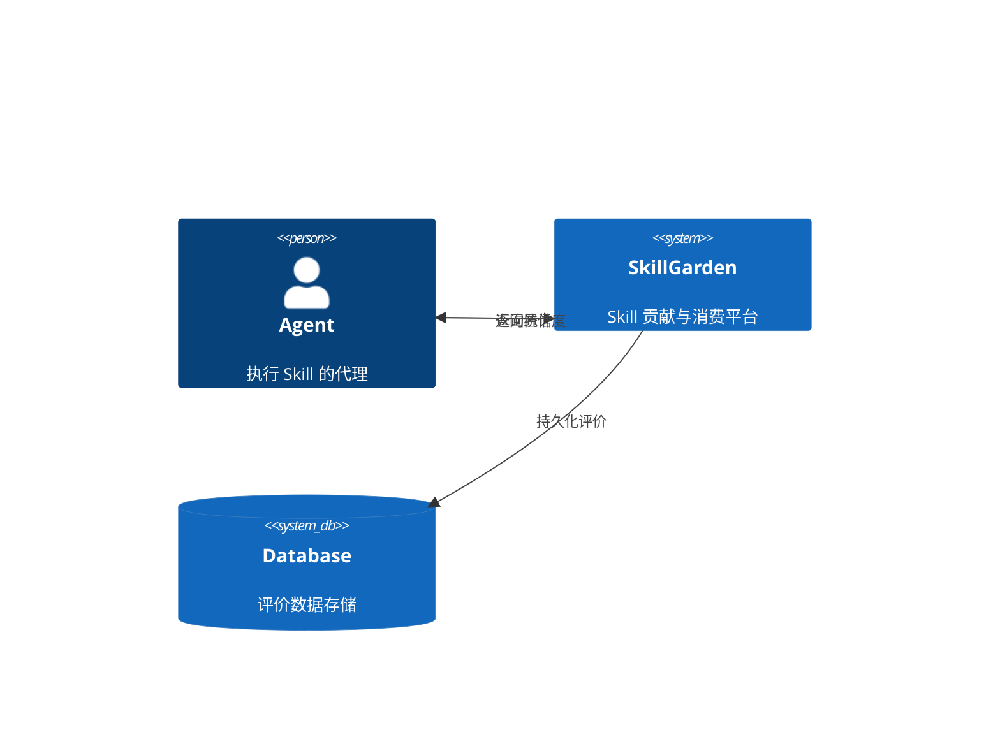

本文档详细阐述 Anspire-SkillGarden 项目中的置信度权重机制。该机制通过多维度因子计算评价权重，用于准确评估 Skill 的可靠性和质量，为 Agent 提供可信的 Skill 选择依据。

## 1. 机制概述

### 1.1 设计目标

置信度权重机制旨在解决分布式环境中单一评价不可信的问题。通过综合考虑评价的历史背景、时间因素、统计一致性等多维度因素，系统能够：

- **过滤噪音**：识别并降低异常评价（如执行时间过短/过长）的权重
- **共识加权**：优先考虑与多数一致的评价结果
- **时效感知**：对近期评价给予更高权重
- **历史累积**：对有成功历史的评价给予额外加分



### 1.2 核心数据结构

权重计算上下文 `EvalContext` 封装了影响单条评价权重的所有因子：

| 字段 | 类型 | 说明 |
|------|------|------|
| `has_success_history` | bool | 该 Agent 是否有成功执行该 Skill 的历史 |
| `is_recent` | bool | 评价是否在 24 小时内 |
| `matches_majority` | bool | 评价结果是否与多数一致 |
| `is_singleton` | bool | 是否为该 Skill 的唯一评价 |
| `too_fast` | bool | 执行时间是否低于 1000ms（疑似作弊） |
| `too_slow` | bool | 执行时间是否超过平均值的 10 倍 |

Sources: [src/utils/weight.rs](src/utils/weight.rs#L8-L19)

## 2. 权重计算算法

### 2.1 权重常量配置

`WeightConfig` 定义了权重计算的基准值和调整因子：



**加分项**：

| 因子 | 加分值 | 说明 |
|------|--------|------|
| 成功历史 | +0.2 | Agent 此前有成功执行记录 |
| 近期评价 | +0.1 | 24 小时内提交的评价 |
| 多数一致 | +0.3 | 与多数评价结果相同 |

**扣分项**：

| 因子 | 扣分值 | 说明 |
|------|--------|------|
| 唯一评价 | -0.5 | 缺乏统计意义 |
| 执行过快 | -0.3 | < 1 秒可能为作弊 |
| 执行过慢 | -0.2 | > 10 倍平均时间可能异常 |

Sources: [src/utils/weight.rs](src/utils/weight.rs#L22-L40)

### 2.2 权重计算公式

单条评价的最终权重通过以下公式计算：

```
weight = BASE + Σ(加分项) - Σ(扣分项)
weight = max(weight, 0.1)  // 最小权重保护
```

**计算示例**：

| 场景 | 加分项 | 扣分项 | 权重 |
|------|--------|--------|------|
| 全部正面因子 | +0.2 +0.1 +0.3 = +0.6 | 0 | 1.6 |
| 全部负面因子 | 0 | 0.5 + 0.3 + 0.2 = 1.0 | 0.1 (触发最小保护) |
| 正常评价 | 0 | 0 | 1.0 |
| 多数一致但唯一 | +0.3 | 0.5 | 0.8 |

Sources: [src/utils/weight.rs](src/utils/weight.rs#L42-L64)

### 2.3 上下文构建逻辑

`build_context` 函数根据评价特征和统计数据构建上下文：

```rust
pub fn build_context(
    eval: &Evaluation,
    total_evals: usize,        // 该 Skill 的总评价数
    success_count: usize,      // 成功评价数
    avg_duration: u64,         // 平均执行时间
    has_successful_history: bool, // 是否有成功历史
) -> EvalContext
```

关键判断逻辑：

- **is_singleton**: `total_evals == 1`
- **matches_majority**: 当 `total_evals > 1` 时，比较 `eval.success` 与 `success_count * 2 > total_evals`
- **too_fast**: `eval.duration_ms < 1000`
- **too_slow**: `avg_duration > 0 && eval.duration_ms > avg_duration * 10`

Sources: [src/utils/weight.rs](src/utils/weight.rs#L67-L92)

## 3. 置信度计算

### 3.1 置信度等级

置信度反映对 Skill 整体可靠性的信任程度：

| 等级 | 阈值条件 | 置信度值 |
|------|----------|----------|
| Low (低) | 总评价数 < 3 | 0.3 |
| Medium (中) | 3 ≤ 总评价数 < 10 | 0.5 |
| High (高) | 总评价数 > 10 且成功率 > 80% 且 ≥ 2 个不同 Agent 成功 | 0.9 |
| Medium-High | 总评价数 > 10 且成功率 > 50% | 0.7 |
| Low-Moderate | 总评价数 > 10 但成功率 ≤ 50% | 0.4 |

```rust
pub fn calculate_confidence(total: u32, success_rate: f64, unique_success: u32) -> f64 {
    if total < 3 {
        0.3  // 低置信度
    } else if total < 10 {
        0.5  // 中等置信度
    } else if success_rate > 0.8 && unique_success >= 2 {
        0.9  // 高置信度
    } else if success_rate > 0.5 {
        0.7
    } else {
        0.4
    }
}
```

Sources: [src/utils/weight.rs](src/utils/weight.rs#L94-L108)

### 3.2 置信度与置信等级

`SkillStats` 提供了便捷的置信等级判断方法：

```rust
impl SkillStats {
    pub fn confidence_level(&self) -> ConfidenceLevel {
        if self.total_evaluations < 3 {
            ConfidenceLevel::Low
        } else if self.total_evaluations > 10 && self.success_rate > 0.8 {
            ConfidenceLevel::High
        } else {
            ConfidenceLevel::Medium
        }
    }
}
```

Sources: [src/models/evaluation.rs](src/models/evaluation.rs#L73-L83)

## 4. 加权统计聚合

### 4.1 聚合算法

`calculate_weighted_stats` 函数将多条评价聚合成加权统计数据：



**算法复杂度**：O(n)，其中 n 为评价数量。

Sources: [src/utils/weight.rs](src/utils/weight.rs#L111-L155)

### 4.2 加权成功率计算

```rust
let success_rate = if total_weight > 0.0 {
    weighted_success / total_weight
} else {
    0.0
};
```

与传统成功率（`success_count / total`）相比，加权成功率具有以下优势：

| 方面 | 传统成功率 | 加权成功率 |
|------|-----------|-----------|
| 异常处理 | 一视同仁 | 降低异常评价影响 |
| 时效性 | 等权重 | 近期评价权重更高 |
| 统计意义 | 依赖数量 | 考虑质量因素 |

## 5. 数据模型

### 5.1 Evaluation 模型

单条评价记录：

```rust
pub struct Evaluation {
    pub id: String,           // UUID
    pub skill_id: String,     // Skill 标识
    pub agent_id: String,     // Agent 标识
    pub success: bool,        // 执行结果
    pub duration_ms: u64,     // 执行耗时
    pub error_type: Option<ErrorType>,  // 错误类型
    pub tags: Vec<EvalTag>,   // 评价标签
    pub timestamp: DateTime<Utc>,  // 评价时间
}
```

Sources: [src/models/evaluation.rs](src/models/evaluation.rs#L22-L36)

### 5.2 SkillStats 模型

聚合后的统计数据：

```rust
pub struct SkillStats {
    pub skill_id: String,
    pub success_rate: f64,        // 加权成功率 (0-1)
    pub avg_duration_ms: u64,      // 加权平均执行时间
    pub total_evaluations: u32,    // 总评价数
    pub unique_agents: u32,        // 唯一 Agent 数
    pub confidence: f64,           // 置信度 (0-1)
    pub tags: Vec<String>,         // 高频标签
    pub local_version: Option<String>,
    pub latest_version: String,
    pub upgrade_available: bool,
}
```

Sources: [src/models/evaluation.rs](src/models/evaluation.rs#L52-L68)

### 5.3 ErrorType 枚举

错误类型分类：

| 类型 | 说明 | 使用场景 |
|------|------|----------|
| `Timeout` | 执行超时 | 超过预设时间限制 |
| `Crash` | 进程崩溃 | 执行过程中异常退出 |
| `LogicError` | 逻辑错误 | 正确执行但结果不符合预期 |
| `Other` | 其他错误 | 未分类的错误 |

Sources: [src/models/evaluation.rs](src/models/evaluation.rs#L9-L18)

### 5.4 EvalTag 标签

评价标签用于补充描述：

| 标签 | 说明 |
|------|------|
| `Reliable` | 执行可靠 |
| `Fast` | 执行快速 |
| `Stable` | 表现稳定 |
| `Experimental` | 试验性功能 |

Sources: [src/models/evaluation.rs](src/models/evaluation.rs#L21)

## 6. 服务层集成

### 6.1 EvaluatorService

评价服务是置信度权重机制对外暴露的接口：



Sources: [src/services/evaluator.rs](src/services/evaluator.rs#L1-L100)

### 6.2 数据库层实现

PostgreSQL 中的置信度计算采用简化算法：

```rust
fn calculate_confidence(&self, total: i32) -> f64 {
    if total < 3 {
        total as f64 / 3.0  // 0-1 之间线性增长
    } else if total > 10 {
        1.0  // 达到阈值返回满分
    } else {
        (total as f64 - 3.0) / 7.0 + 0.5  // 0.5-1 之间线性增长
    }
}
```

数据库层使用 SQL 聚合计算统计数据：

```sql
SELECT
    COUNT(*) as total,
    COUNT(*) FILTER (WHERE success = true) as success_count,
    AVG(duration_ms) as avg_duration,
    COUNT(DISTINCT agent_id) as unique_agents
FROM evaluations
WHERE skill_id = $1
```

Sources: [src/db/repositories/evaluation.rs](src/db/repositories/evaluation.rs#L56-L82)

### 6.3 Webhook 转发

评价结果支持转发至外部系统：

```rust
pub fn with_webhook_urls(mut self, urls: Vec<String>) -> Self
pub fn add_webhook_url(mut self, url: String) -> Self
async fn forward_to_webhooks(&self, evaluation: &EvaluationResult)
```

通过环境变量配置：
```
AION_HIVE_EVAL_WEBHOOK_URLS=https://hook1.example.com,https://hook2.example.com
```

Sources: [src/services/evaluator.rs](src/services/evaluator.rs#L35-L63)

## 7. API 接口

### 7.1 MCP 协议接口

通过 `evaluate_skill` 工具提交评价：

```json
{
  "name": "evaluate_skill",
  "arguments": {
    "skill_id": "browse-v1",
    "agent_id": "agent-abc",
    "success": true,
    "duration_ms": 5000,
    "error_type": null,
    "tags": ["reliable", "fast"]
  }
}
```

响应包含更新后的统计数据：

```json
{
  "success": true,
  "evaluation_id": "uuid-xxx",
  "new_stats": {
    "skill_id": "browse-v1",
    "success_rate": 0.85,
    "avg_duration_ms": 5200,
    "total_evaluations": 25,
    "unique_agents": 8,
    "confidence": 0.9,
    "tags": ["reliable", "fast"]
  }
}
```

Sources: [src/mcp/server.rs](src/mcp/server.rs#L298-L350)

### 7.2 REST API 接口

| 端点 | 方法 | 说明 |
|------|------|------|
| `/api/evaluations` | POST | 创建评价 |
| `/api/skills/:skill_id/stats` | GET | 获取 Skill 统计 |

Sources: [src/api/handlers.rs](src/api/handlers.rs#L130-L165)

## 8. 测试验证

### 8.1 单元测试覆盖

权重计算核心逻辑有完整的单元测试：

| 测试用例 | 验证点 |
|----------|--------|
| `test_weight_calculation` | 全部正面因子 = 1.6 |
| `test_weight_calculation_minimum_weight` | 全部负面因子触发最小值保护 |
| `test_calculate_weighted_stats_single_eval` | 单评价置信度 = 0.3 |
| `test_calculate_weighted_stats_multiple_evals` | 多评价加权统计 |
| `test_calculate_confidence` | 各阈值置信度计算 |
| `test_build_context_*` | 上下文各项判断 |

Sources: [src/utils/weight.rs](src/utils/weight.rs#L200-L373)

### 8.2 边界条件测试

```rust
#[test]
fn test_calculate_weighted_stats_empty() {
    let stats = calculate_weighted_stats(&[]);
    assert_eq!(stats, (0.0, 0, 0.0));
}
```

测试场景覆盖：
- 空评价列表
- 单条评价
- 多条评价（混合成功/失败）
- 边界阈值（1秒、10倍平均）

## 9. 配置参考

### 9.1 可调参数

| 参数 | 默认值 | 位置 | 说明 |
|------|--------|------|------|
| `BASE` | 1.0 | weight.rs | 基础权重 |
| `SUCCESS_HISTORY_BONUS` | 0.2 | weight.rs | 成功历史加分 |
| `RECENT_BONUS` | 0.1 | weight.rs | 近期评价加分 |
| `MAJORITY_BONUS` | 0.3 | weight.rs | 多数一致加分 |
| `SINGLETON_PENALTY` | 0.5 | weight.rs | 唯一评价扣分 |
| `TOO_FAST_PENALTY` | 0.3 | weight.rs | 执行过快扣分 |
| `TOO_SLOW_PENALTY` | 0.2 | weight.rs | 执行过慢扣分 |
| `TOO_FAST_MS` | 1000 | weight.rs | 过快阈值(ms) |
| `TOO_SLOW_MULTIPLIER` | 10.0 | weight.rs | 过慢倍数阈值 |
| `RECENT_HOURS` | 24 | weight.rs | 近期评价时间窗口 |

### 9.2 速率限制

评价提交受速率限制保护：

```rust
pub struct RateLimitConfig {
    pub window_secs: u64 = 60,
    pub max_requests: u32 = 10,
}
```

Sources: [src/utils/rate_limiter.rs](src/utils/rate_limiter.rs)

## 10. 架构总结

置信度权重机制采用分层设计：



**关键设计原则**：

1. **上下文感知**：权重计算不仅依赖评价本身，还考虑整体统计分布
2. **防御性设计**：通过最小权重保护避免极端情况
3. **统计严谨**：区分置信度等级，量化信任程度
4. **性能优先**：权重计算 O(n) 复杂度，数据库层聚合优化

---

## 下一步

- 了解 [评价服务](13-ping-jie-fu-wu) 的完整实现
- 查看 [数据模型](14-shu-ju-mo-xing) 的详细定义
- 参考 [REST API 接口](18-rest-api-jie-kou) 进行集成开发