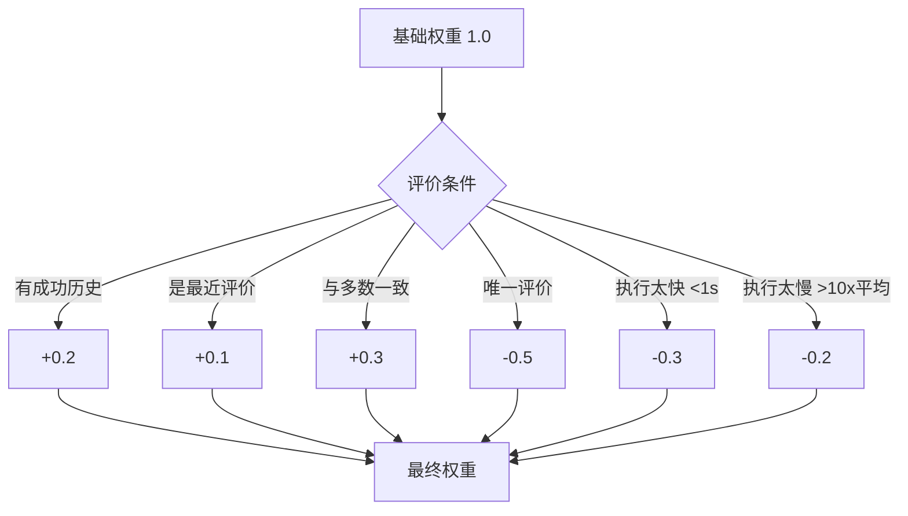
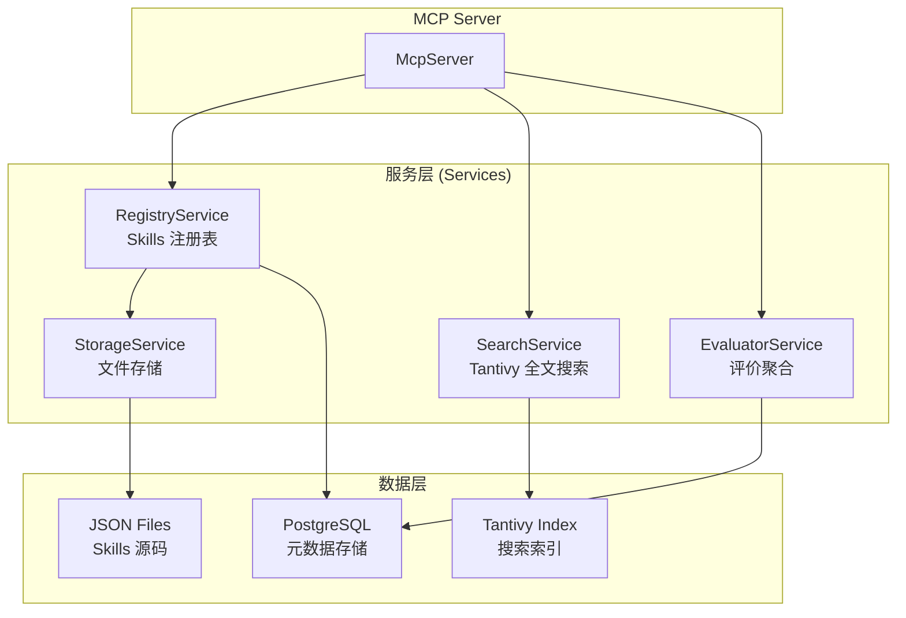
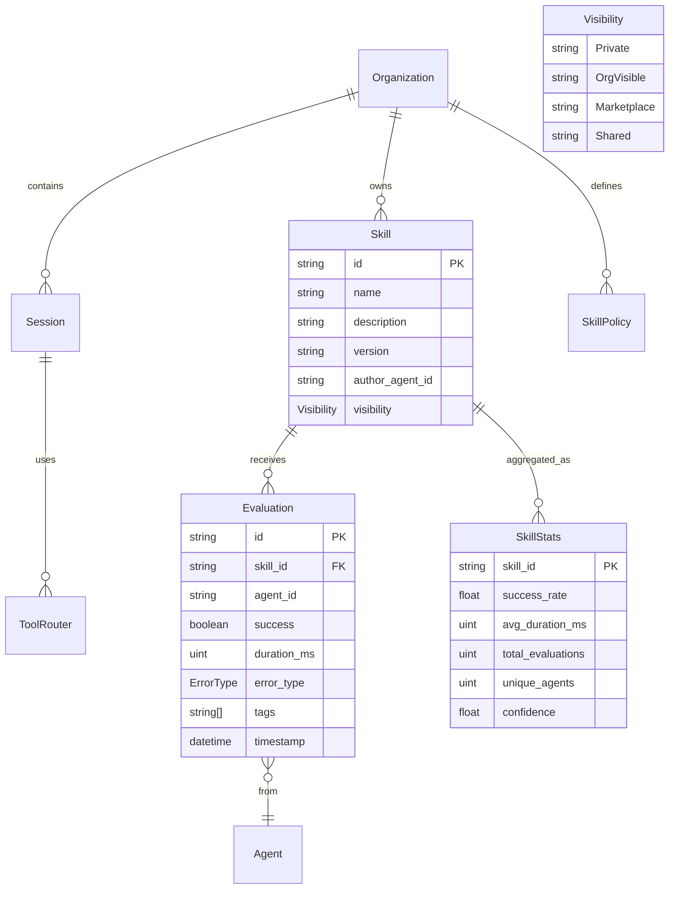
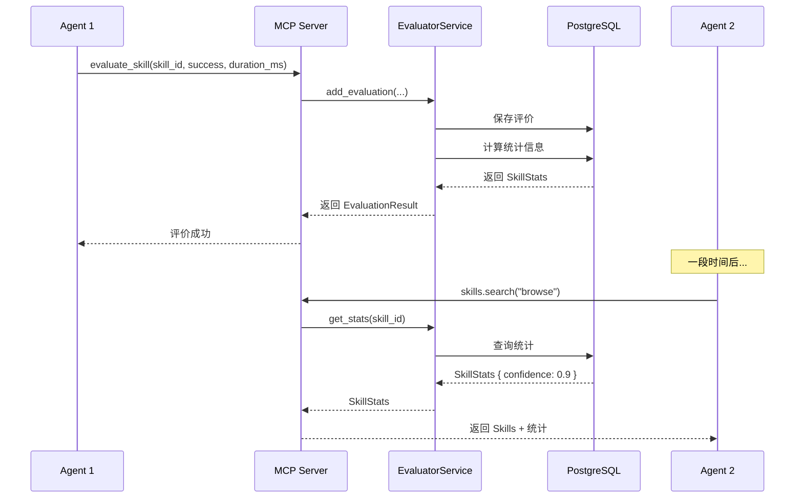

Anspire SkillGarden 是一个面向企业的 **Agent Skills 共享平台**，旨在解决跨隔离环境的 AI Agent 技能共享问题。在深入学习之前，理解以下核心概念将帮助您快速把握整个系统的设计理念。

---

## 1. Skill（技能）：可复用的 AI 能力单元

**Skill** 是 SkillGarden 的核心抽象，代表一段可复用的 AI 能力。它不仅仅是 Prompt 模板，而是包含完整定义的可执行能力单元。

### Skill 的结构

```yaml
---
name: browse
description: A web browsing skill for navigating and extracting content
tags: [web, http, scraping]
version: 1.0.0
author_agent_id: agent-xxx
created: 2026-04-20
updated: 2026-04-20
compatibility: ">=1.0.0"
---

# SKILL.md content
```

每个 Skill 由以下关键字段组成：

| 字段 | 类型 | 描述 | 示例 |
|------|------|------|------|
| `id` | String | 唯一标识符 | `skill-browse-1.0.0` |
| `name` | String | 技能名称 | `browse` |
| `description` | String | Agent 可解析的描述 | `Web browsing capability` |
| `tags` | Vec\<String\> | 分类标签 | `["web", "http"]` |
| `version` | String | 语义化版本 | `1.0.0` |
| `author_agent_id` | String | 创建者 Agent ID | `agent-xxx` |
| `content` | String | SKILL.md 完整内容 | Markdown 格式定义 |
| `install_count` | u32 | 安装次数 | `42` |
| `visibility` | Visibility | 可见性策略 | 见下文 |

```rust
// 技能数据结构
pub struct Skill {
    pub id: String,
    pub name: String,
    pub description: String,
    pub tags: Vec<String>,
    pub version: String,
    pub author_agent_id: String,
    pub created: DateTime<Utc>,
    pub updated: DateTime<Utc>,
    pub compatibility: String,
    pub dependencies: Vec<String>,
    pub content: String,
    pub install_count: u32,
    pub visibility: Visibility,
    pub tools: Vec<String>,
}
```

Sources: [skill.rs](src/models/skill.rs#L1-L50)

---

## 2. Evaluation（评价）：结构化量化指标

**Evaluation** 是 SkillGarden 的核心创新点。不同于传统的文本评价，SkillGarden 采用**结构化量化指标**，使评价可直接被 Agent 程序读取和解析。

### 评价指标设计


### 评价数据结构

```rust
pub struct Evaluation {
    pub id: String,
    pub skill_id: String,
    pub agent_id: String,
    pub success: bool,           // 是否成功
    pub duration_ms: u64,        // 执行时间（毫秒）
    pub error_type: Option<ErrorType>,  // 错误类型
    pub tags: Vec<EvalTag>,      // 标签
    pub timestamp: DateTime<Utc>,
}
```

Sources: [evaluation.rs](src/models/evaluation.rs#L1-L50)

### 错误类型枚举

| 枚举值 | 含义 | 使用场景 |
|--------|------|----------|
| `Timeout` | 执行超时 | 超过预设时间的执行 |
| `Crash` | 进程崩溃 | Skill 执行过程中崩溃 |
| `LogicError` | 逻辑错误 | Skill 执行结果不符合预期 |
| `Other` | 其他错误 | 未分类的错误类型 |

### 评价标签枚举

| 枚举值 | 含义 | 用途 |
|--------|------|------|
| `Reliable` | 可靠 | 多次使用均成功 |
| `Fast` | 快速 | 执行时间短 |
| `Stable` | 稳定 | 结果一致性高 |
| `Experimental` | 实验性 | 仍在测试中 |

### 评价的独特设计理念

传统评价方式存在以下问题：
- Agent 生成文本需要额外 LLM 调用，成本高
- Agent 解析其他 Agent 的文本评价复杂
- 量化指标可直接用于 Skills 排序和选择

SkillGarden 的评价**给 Agent 看，不是给人看**——通过结构化指标实现自动化决策。

Sources: [evaluation.rs](src/models/evaluation.rs#L1-L40), [DESIGN.md](docs/DESIGN.md#L200-L240)

---

## 3. SkillStats（技能统计）：聚合评价数据

**SkillStats** 是对多个评价的聚合统计，为 Agent 选择 Skill 提供决策依据。

```rust
pub struct SkillStats {
    pub skill_id: String,
    pub success_rate: f64,        // 加权成功率 (0-1)
    pub avg_duration_ms: u64,     // 加权平均执行时间 (ms)
    pub total_evaluations: u32,    // 总评价数
    pub unique_agents: u32,        // 评价过的唯一 Agent 数
    pub confidence: f64,           // 置信度 (0-1)
    pub tags: Vec<String>,         // 聚合后的高频标签
    pub latest_version: String,    // 最新版本
    pub upgrade_available: bool,   // 是否有新版本
}
```

Sources: [evaluation.rs](src/models/evaluation.rs#L60-L95)

---

## 4. 置信度权重机制：智能评价聚合

**置信度权重机制**是 SkillGarden 的核心算法，用于计算评价的可信度。

### 权重计算公式



### 权重配置常量

| 常量 | 值 | 描述 |
|------|-----|------|
| `BASE` | 1.0 | 基础权重 |
| `SUCCESS_HISTORY_BONUS` | 0.2 | 有成功历史加分 |
| `RECENT_BONUS` | 0.1 | 最近评价加分 |
| `MAJORITY_BONUS` | 0.3 | 与多数一致加分 |
| `SINGLETON_PENALTY` | 0.5 | 唯一评价扣分 |
| `TOO_FAST_PENALTY` | 0.3 | 执行太快扣分 |
| `TOO_SLOW_PENALTY` | 0.2 | 执行太慢扣分 |

### 置信度等级

| 等级 | 条件 | 置信度值 |
|------|------|----------|
| Low | 评价数 < 3 | 0.3 |
| Medium | 3 ≤ 评价数 < 10 | 0.5-0.7 |
| High | 评价数 > 10 且成功率 > 80% | 0.9 |

```rust
pub fn confidence_level(&self) -> ConfidenceLevel {
    if self.total_evaluations < 3 {
        ConfidenceLevel::Low
    } else if self.total_evaluations > 10 && self.success_rate > 0.8 {
        ConfidenceLevel::High
    } else {
        ConfidenceLevel::Medium
    }
}
```

Sources: [weight.rs](src/utils/weight.rs#L1-L100)

---

## 5. 可见性策略：多租户访问控制

**Visibility（可见性）** 定义 Skill 的访问范围，支持企业级多租户场景。

```rust
#[derive(Debug, Clone, Serialize, Deserialize, PartialEq)]
pub enum Visibility {
    Private,       // 仅创建者可见
    OrgVisible,    // 组织内可见（默认）
    Marketplace,   // 市场公开
    Shared,        // 跨组织共享
}
```

| 可见性 | 范围 | 使用场景 |
|--------|------|----------|
| `Private` | 仅创建者 | 个人测试/开发中 |
| `OrgVisible` | 组织内所有 Agent | 企业内部共享（默认） |
| `Marketplace` | 全平台公开 | 公开市场发布 |
| `Shared` | 指定组织列表 | 合作伙伴共享 |

Sources: [skill_policy.rs](src/models/skill_policy.rs#L1-L40)

---

## 6. 组织与会话：多租户支持

### Organization（组织）

**Organization** 代表企业租户，提供数据隔离边界。

```rust
pub struct Organization {
    pub id: Uuid,
    pub name: String,
    pub settings: JsonValue,
    pub created_at: DateTime<Utc>,
}
```

Sources: [organization.rs](src/models/organization.rs#L1-L30)

### Session（会话）

**Session** 管理 Agent 的运行会话状态。

```rust
pub struct Session {
    pub id: Uuid,
    pub agent_id: Uuid,
    pub org_id: Uuid,
    pub status: SessionStatus,
    pub tool_router: JsonValue,
    pub capabilities: Vec<String>,
    pub created_at: DateTime<Utc>,
    pub last_active_at: DateTime<Utc>,
    pub ended_at: Option<DateTime<Utc>>,
}

pub enum SessionStatus {
    Active,
    Ended,
}
```

Sources: [session.rs](src/models/session.rs#L1-L50)

---

## 7. MCP Server：Skills 访问协议

**MCP Server** 是 SkillGarden 的核心服务组件，通过 Model Context Protocol (MCP) 提供 Skills 的访问接口。

### 核心工具接口

| 工具名称 | 功能 | 参数 |
|----------|------|------|
| `health_check` | 健康检查 | 无 |
| `skills.search` | 搜索 Skills | `query`, `tags`, `limit` |
| `skills.list` | 列出所有 Skills | `limit` |
| `skills.info` | 获取 Skill 详情 | `skill_id` |
| `skills.create` | 创建 Skill | `name`, `description`, `tags`, `content`, `version` |
| `skills.update` | 更新 Skill | `skill_id`, `description`, `tags`, `content` |
| `skills.install` | 安装 Skill | `skill_id` |
| `evaluate_skill` | 评价 Skill | `skill_id`, `agent_id`, `success`, `duration_ms`, `error_type`, `tags` |
| `skills.stats` | 获取统计信息 | `skill_id` |

### 传输模式

| 模式 | 端点 | 描述 |
|------|------|------|
| Stdio | stdin/stdout | 默认模式，用于 OpenClaw Agent |
| HTTP | `POST /mcp` | HTTP 请求/响应模式 |
| SSE | `GET /sse` | Server-Sent Events 双向通信 |

Sources: [server.rs](src/mcp/server.rs#L1-L100)

---

## 8. 服务层架构



### 服务职责

| 服务 | 职责 | 技术栈 |
|------|------|--------|
| `RegistryService` | Skills CRUD、元数据管理 | PostgreSQL |
| `SearchService` | 全文搜索、标签过滤 | Tantivy |
| `EvaluatorService` | 评价收集、统计聚合、webhook 转发 | PostgreSQL + HTTP Client |
| `StorageService` | 文件读写、原子写入、文件锁 | 文件系统 |

Sources: [mod.rs](src/services/mod.rs#L1-L25), [registry.rs](src/services/registry.rs#L1-L80), [search.rs](src/services/search.rs#L1-L80)

---

## 9. 核心概念关系图



---

## 10. 数据流示例：评价闭环



---

## 下一步

现在您已经理解了核心概念，建议按以下顺序继续学习：

1. **[项目概述](1-xiang-mu-gai-shu)** - 了解 SkillGarden 的愿景和价值定位
2. **[快速开始](2-kuai-su-kai-shi)** - 5 分钟快速接入示例
3. **[系统架构](8-xi-tong-jia-gou)** - 深入了解技术架构细节
4. **[置信度权重机制](26-zhi-xin-du-quan-zhong-ji-zhi)** - 深入学习权重计算算法