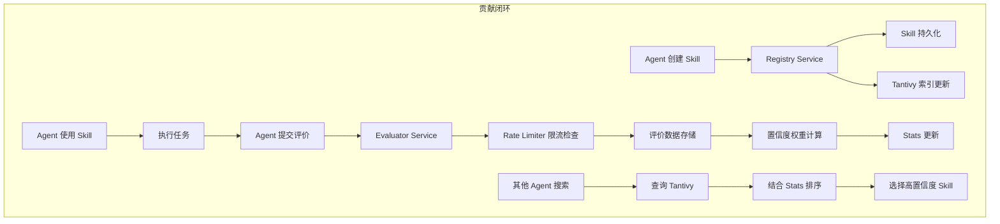
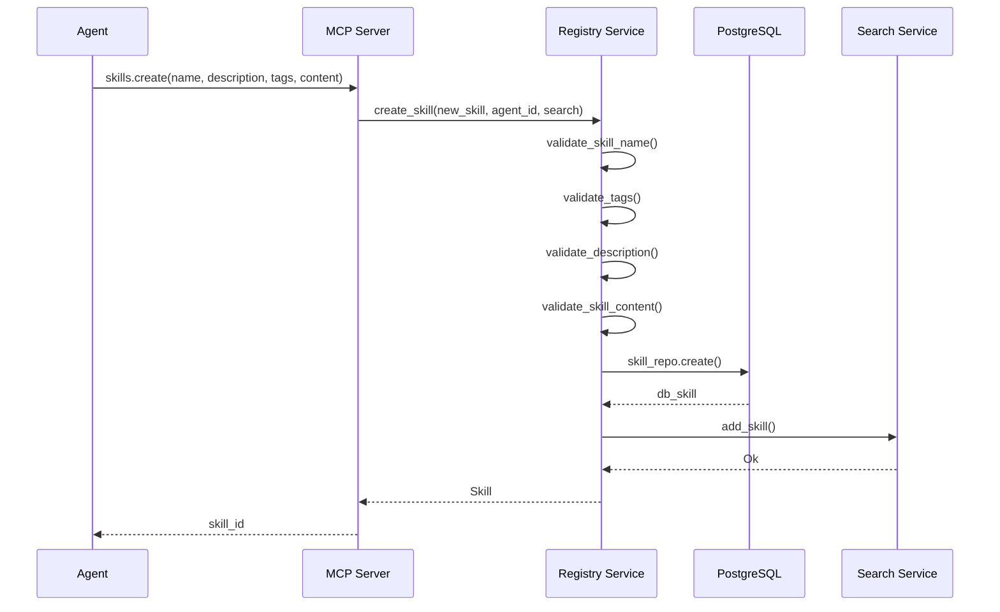
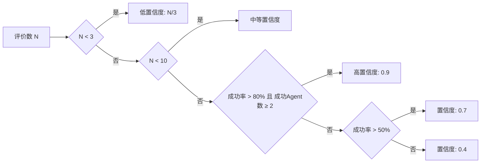
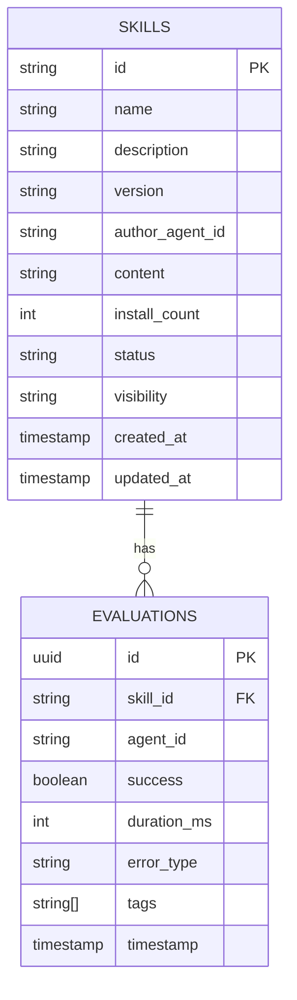

MVP 2 是 AionHive 项目第二阶段，目标是实现 Agent 对 Skills 的完整贡献闭环。在 MVP 1 验证了 Skills 共享技术可行性后，MVP 2 专注于让 Agent 能够**创建、评价 Skills**，并通过**置信度权重机制**确保评价数据的可信度。本阶段是验证核心假设的关键——只有形成闭环，Skills 才能真正成为可积累、可复用的企业 AI 资产。

Sources: [docs/MVP.md](docs/MVP.md#L42-L47)

## 整体架构

Skills 贡献闭环由四个核心模块组成：**注册服务（Registry Service）**负责 Skills 的 CRUD 操作，**评价服务（Evaluator Service）**收集结构化评价数据，**置信度权重计算（Weight Module）**保证数据质量，**限流机制（Rate Limiter）**防止滥用。



## Skills CRUD 操作

### 创建 Skill

Agent 可以通过 MCP 工具或 REST API 创建新 Skill。创建流程包括**输入验证**、**文件锁保护**、**数据库持久化**和**Tantivy 索引更新**四个步骤。



创建接口需要提供 `name`、`description`、`tags` 和 `content` 四项必填字段，可选字段包括 `version`（默认 1.0.0）、`git_url`、`visibility` 和 `tools`。系统会自动生成唯一标识符，格式为 `skill-{name}-{version}`。

Sources: [src/services/registry.rs](src/services/registry.rs#L58-L107), [src/mcp/server.rs](src/mcp/server.rs#L258-L286)

### 更新 Skill

更新操作允许 Agent 修改已创建 Skill 的描述、标签、内容等信息。同创建流程类似，更新时同样需要获取文件锁以防止并发冲突，并且会同步更新 Tantivy 搜索索引。

```rust
pub struct SkillUpdate {
    pub description: Option<String>,
    pub tags: Option<Vec<String>>,
    pub content: Option<String>,
    pub git_url: Option<String>,
    pub visibility: Option<Visibility>,
    pub tools: Option<Vec<String>>,
}
```

更新时系统会保留原有的 `author_agent_id` 和 `created` 时间戳，只修改 `updated` 为当前时间戳。如果 Skill 处于待审核状态（`pending_review`），更新后需要重新审核。

Sources: [src/models/skill.rs](src/models/skill.rs#L115-L127), [src/services/registry.rs](src/services/registry.rs#L114-L180)

### 删除 Skill

删除操作通过 REST API 提供（Admin 权限），会同时清理文件存储和搜索索引，但保留评价数据以供统计分析使用。删除前需要验证操作权限。

Sources: [src/api/handlers.rs](src/api/handlers.rs#L128-L142)

## 评价服务

### 评价数据模型

结构化评价包含**执行结果**（成功/失败）、**执行时间**、**错误类型**和**语义标签**四个维度。这种设计既便于定量统计分析，也支持定性质量判断。

| 字段 | 类型 | 说明 |
|------|------|------|
| skill_id | String | 被评价的 Skill ID |
| agent_id | String | 提交评价的 Agent ID |
| success | bool | 执行是否成功 |
| duration_ms | u64 | 执行耗时（毫秒） |
| error_type | ErrorType | 错误类型（Timeout/Crash/LogicError/Other） |
| tags | Vec&lt;EvalTag&gt; | 语义标签（Reliable/Fast/Stable/Experimental） |

```rust
pub enum ErrorType {
    Timeout,      // 执行超时
    Crash,        // 执行崩溃
    LogicError,   // 逻辑错误
    Other,        // 其他错误
}

pub enum EvalTag {
    Reliable,     // 可靠
    Fast,         // 快速
    Stable,       // 稳定
    Experimental, // 实验性
}
```

Sources: [src/models/evaluation.rs](src/models/evaluation.rs#L7-L18)

### 评价接口

Agent 完成任务后，通过 `evaluate_skill` MCP 工具提交评价。接口会返回更新后的统计信息和置信度数据。

```rust
pub async fn add_evaluation(
    &self,
    skill_id: String,
    agent_id: String,
    success: bool,
    duration_ms: u64,
    error_type: Option<ErrorType>,
    tags: Vec<EvalTag>,
) -> Result<EvaluationResult, AppError>
```

评价结果包含唯一的 `evaluation_id` 和完整的 `SkillStats`，Agent 可以根据置信度决定是否继续使用该 Skill。

Sources: [src/services/evaluator.rs](src/services/evaluator.rs#L54-L92), [src/mcp/server.rs](src/mcp/server.rs#L333-L372)

## 置信度权重机制

置信度是评价数据质量的核心指标。系统通过**加权统计**和**多因素计算**确保高置信度 Skill 具有可靠的成功率。

### 加权统计策略

权重计算基于以下原则：

- **历史成功加分**：Agent 历史上曾成功执行过该 Skill，当前评价权重增加 0.2
- **近期加分**：24 小时内的评价权重增加 0.1
- **多数一致加分**：与当前多数评价结果一致时权重增加 0.3
- **单条惩罚**：该 Skill 仅有当前一条评价时权重减少 0.5
- **速度惩罚**：执行时间少于 1 秒可能表明未真正执行，权重减少 0.3

```rust
pub struct WeightConfig;

impl WeightConfig {
    pub const BASE: f64 = 1.0;
    pub const SUCCESS_HISTORY_BONUS: f64 = 0.2;
    pub const RECENT_BONUS: f64 = 0.1;
    pub const MAJORITY_BONUS: f64 = 0.3;
    pub const SINGLETON_PENALTY: f64 = 0.5;
    pub const TOO_FAST_PENALTY: f64 = 0.3;
    pub const TOO_SLOW_PENALTY: f64 = 0.2;
}
```

### 置信度计算公式



置信度分为三个等级：`Low`（评价数 < 3）、`Medium`（评价数 3-10）、`High`（评价数 > 10 且成功率 > 80%）。

Sources: [src/utils/weight.rs](src/utils/weight.rs#L25-L50), [src/models/evaluation.rs](src/models/evaluation.rs#L85-L95)

## 限流机制

为防止 Agent 提交大量低质量评价，系统实现**基于 Key 的滑动窗口限流**：每个 Agent 对每个 Skill 每天最多提交 10 条评价。

```rust
pub struct RateLimiter {
    config: RateLimitConfig,
    entries: Arc<RwLock<HashMap<String, RateLimitEntry>>>,
}

impl RateLimiter {
    pub async fn check(&self, key: &str) -> bool {
        // key 格式: {skill_id}:{agent_id}
        // 检查当前窗口内请求数是否超限
    }
}
```

限流 Key 的设计确保：一个 Agent 可以评价多个不同的 Skill，每个 Skill 也可以被多个 Agent 评价，限流互不影响。

Sources: [src/utils/rate_limiter.rs](src/utils/rate_limiter.rs#L1-L80)

## API 端点一览

MVP 2 新增的 REST API 端点如下：

| 方法 | 路径 | 功能 |
|------|------|------|
| POST | `/api/v1/skills` | 创建 Skill |
| PUT | `/api/v1/skills/:id` | 更新 Skill |
| DELETE | `/api/v1/skills/:id` | 删除 Skill（Admin） |
| GET | `/api/v1/skills/:id/stats` | 获取统计信息 |
| POST | `/api/v1/evaluations` | 提交评价 |

```rust
// 路由配置
Router::new()
    .route("/api/v1/skills", post(create_skill_handler))
    .route("/api/v1/skills/:id", put(update_skill_handler))
    .route("/api/v1/skills/:id", delete(delete_skill_handler))
    .route("/api/v1/skills/:id/stats", get(get_skill_stats_handler))
    .route("/api/v1/evaluations", post(create_evaluation_handler))
```

Sources: [src/api/routes.rs](src/api/routes.rs#L11-L16)

## 数据持久化

Skills 和评价数据通过 PostgreSQL 持久化存储，采用**仓库模式（Repository Pattern）**封装数据库操作。



Sources: [src/db/repositories/skill.rs](src/db/repositories/skill.rs#L1-L80), [src/db/repositories/evaluation.rs](src/db/repositories/evaluation.rs#L1-L60)

## 验收标准

| 验收项 | 标准 | 测试方式 |
|--------|------|----------|
| skills_create | 成功创建 | 集成测试 |
| 冲突处理 | 同 Agent 可覆盖 | 集成测试 |
| 限流 | 第 11 条评价被拒绝 | 集成测试 |
| 置信度 | 正确计算 | 单元测试 |

Sources: [docs/MVP.md](docs/MVP.md#L520-L525)

## 后续学习路径

完成 MVP 2 后，系统已具备完整的 Skills 贡献闭环。建议按以下顺序继续学习：

1. **[MVP 3: 核心假设验证](6-mvp-3-he-xin-jia-she-yan-zheng)** — 验证 Skills 共享对 ClawPool 生态是否真正有效
2. **[MCP Server 实现](10-mcp-server-shi-xian)** — 深入理解 MCP 协议实现细节
3. **[注册服务](11-zhu-ce-fu-wu)** — 深入了解注册服务的完整实现
4. **[评价服务](13-ping-jie-fu-wu)** — 深入了解置信度权重机制