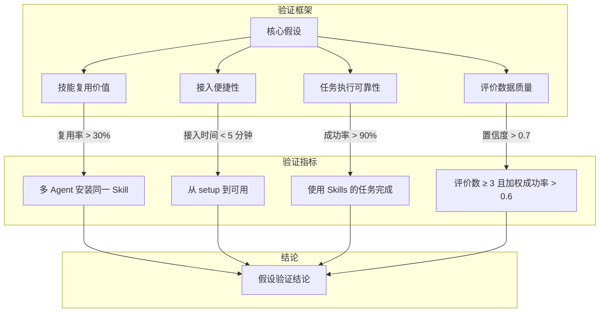
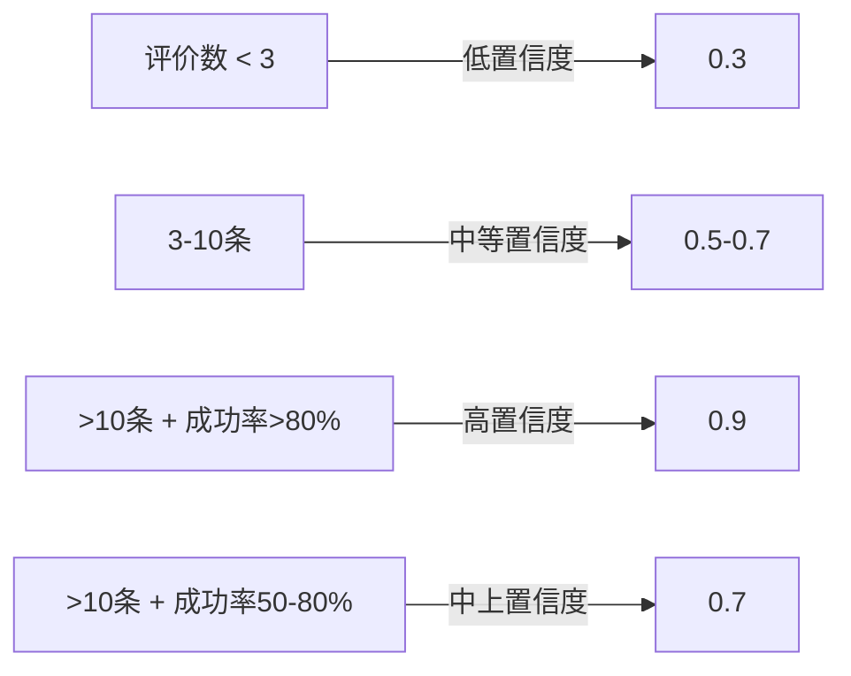
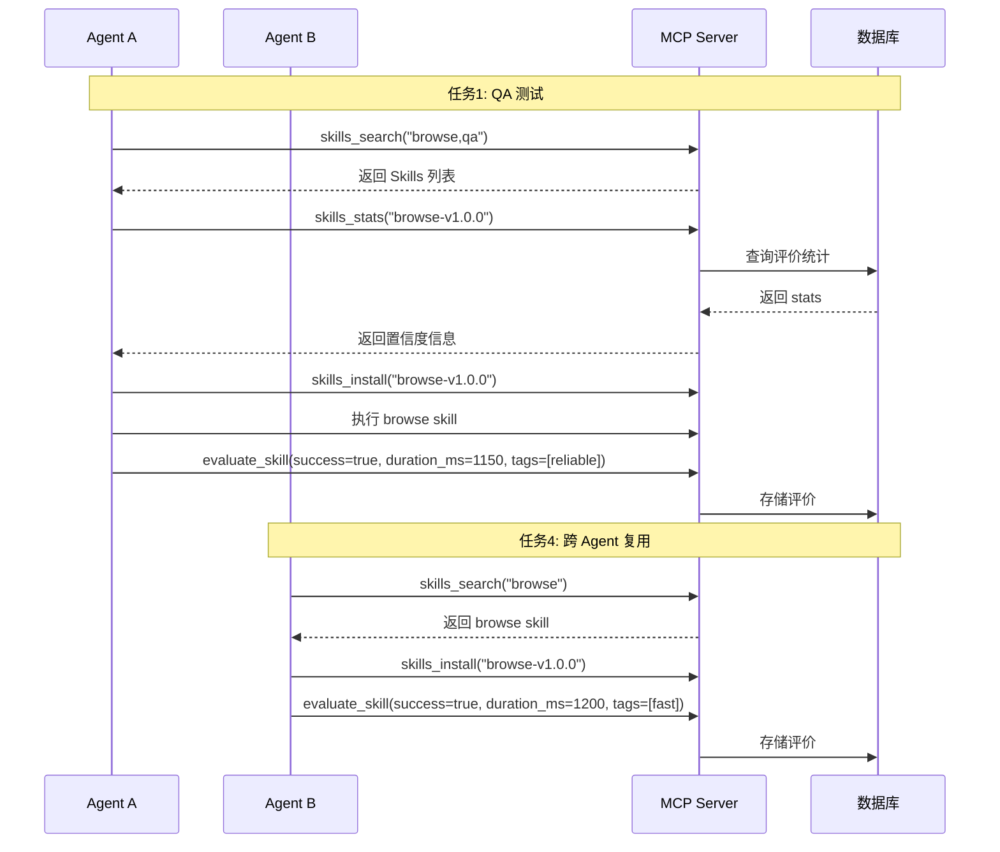
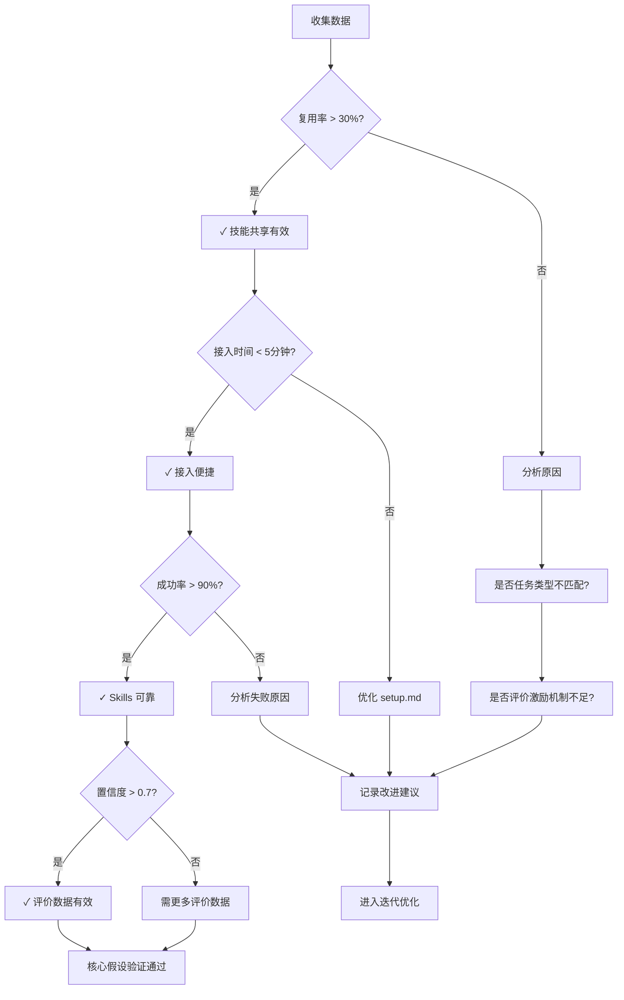

> **阶段**：Week 5-6  
> **目标**：用真实任务验证 "Skills 作为企业 AI 资产是有效的"  
> **前置条件**：MVP 1（核心功能）和 MVP 2（评价闭环）已完成

---

## 1. 核心假设

SkillGarden 的核心假设是：**Skills 作为企业 AI 资产，对 ClawPool 生态是有效的**。

这个阶段我们要回答一个关键问题：Skills 共享机制是否真正带来了价值？



Sources: [docs/MVP.md](docs/MVP.md#L1-L50), [docs/DESIGN.md](docs/DESIGN.md#L1-L100)

---

## 2. 验证指标详解

### 2.1 指标定义

| 指标 | 目标值 | 测量方式 | 数据来源 |
|------|--------|----------|----------|
| **Skills 复用率** | > 30% | 同一 Skill 被多个 Agent 安装的比例 | `install_count` 统计 |
| **Agent 接入时间** | < 5 分钟 | 从 setup.md 到能搜索 Skills 的时间 | 人工计时 |
| **任务成功率** | > 90% | 使用 Skills 的任务完成率 | 评价中的 `success` 字段 |
| **评价数据质量** | 置信度 > 0.7 | 评价数 ≥ 3，且加权成功率 > 0.6 | `skills.stats` 返回的 `confidence` |

Sources: [src/models/evaluation.rs](src/models/evaluation.rs#L1-L80)

### 2.2 置信度计算逻辑

置信度由评价数量和成功率共同决定：



系统实现的置信度计算逻辑位于 `src/utils/weight.rs`：

```rust
// 置信度计算核心逻辑
fn calculate_confidence(total: u32, success_rate: f64, unique_success: u32) -> f64 {
    if total < 3 {
        0.3 // 低置信度
    } else if total < 10 {
        0.5 // 中等置信度
    } else if success_rate > 0.8 && unique_success >= 2 {
        0.9 // 高置信度
    } else if success_rate > 0.5 {
        0.7
    } else {
        0.4
    }
}
```

Sources: [src/utils/weight.rs](src/utils/weight.rs#L140-L153)

---

## 3. 任务列表

### T3.1: 真实任务测试（8小时）

这是 MVP 3 的核心任务，需要设计 3-5 个真实任务场景：

#### 任务设计原则

1. **真实性**：任务应模拟真实业务场景
2. **可重复**：任务可以多次执行，便于收集评价数据
3. **可度量**：任务结果有明确的成功/失败标准

#### 推荐测试任务

| 任务类型 | Agent A | Agent B | Agent C |
|----------|---------|---------|---------|
| **任务1: QA 测试** | 使用 browse skill 访问网站 | 使用 qa skill 进行测试 | 提交评价 |
| **任务2: 代码审查** | 使用 review skill 审查代码 | - | 提交评价 |
| **任务3: 混合任务** | 搜索多个 Skills | 组合使用多个 Skills | 评价每个 Skill |
| **任务4: 跨 Agent 复用** | Agent A 创建 Skill | Agent B 安装并使用 | Agent B 评价 |
| **任务5: 评价数据验证** | 多次评价同一 Skill | 检查置信度变化 | 验证权重计算 |

Sources: [docs/MVP.md](docs/MVP.md#L300-L350)

#### 执行流程



### T3.2: 数据收集（4小时）

需要收集的数据包括：

#### 3.2.1 Skills 复用率数据

```bash
# 列出所有 Skills 并统计安装次数
mcp__skillgarden__skills_list

# 查看特定 Skill 的安装统计
mcp__skillgarden__skills_stats --skill_id "browse-v1.0.0"
```

返回的 `SkillStats` 结构：
```rust
pub struct SkillStats {
    pub skill_id: String,
    pub success_rate: f64,           // 加权成功率
    pub avg_duration_ms: u64,        // 平均执行时间
    pub total_evaluations: u32,      // 总评价数
    pub unique_agents: u32,           // 唯一 Agent 数
    pub confidence: f64,              // 置信度
    pub tags: Vec<String>,            // 聚合标签
    pub install_count: u32,           // 安装次数
}
```

Sources: [src/models/evaluation.rs](src/models/evaluation.rs#L55-L80)

#### 3.2.2 接入时间数据

记录以下时间点：
- `T1`: 开始阅读 setup.md
- `T2`: 配置完成（环境变量、MCP 设置）
- `T3`: 首次成功调用 `health_check`
- `T4`: 首次成功搜索 Skills

**接入时间** = `T4 - T1`

#### 3.2.3 任务执行数据

从评价记录中提取：
- 成功率：`COUNT(success=true) / COUNT(*)`
- 失败原因分布：按 `error_type` 分组统计

### T3.3: 假设验证（4小时）

#### 验证步骤



#### 验证标准

| 验证项 | 通过条件 | 数据来源 |
|--------|----------|----------|
| Skills 复用率 | > 30% | 同一 Skill 被 ≥3 个不同 Agent 安装 |
| 置信度 | > 0.7 | `skills_stats.confidence >= 0.7` |
| 任务成功率 | > 90% | 评价中 `success=true` 的比例 |

Sources: [docs/MVP.md](docs/MVP.md#L350-L400)

### T3.4: 迭代报告（2小时）

输出内容：
1. **MVP 报告**：测试执行情况、数据分析
2. **核心假设验证结论**：通过/不通过/部分通过
3. **后续建议**：基于验证结果的优化方向

---

## 4. 评价机制详解

### 4.1 评价数据模型

评价是 SkillGarden 的核心设计——**评价给 Agent 看，不是给人看**：

```rust
// 单条评价
pub struct Evaluation {
    pub id: String,
    pub skill_id: String,           // 哪个 Skill
    pub agent_id: String,           // 谁评价的
    pub success: bool,              // 是否成功
    pub duration_ms: u64,           // 执行时间
    pub error_type: Option<ErrorType>, // 错误类型
    pub tags: Vec<EvalTag>,         // 标签
    pub timestamp: DateTime<Utc>,
}
```

Sources: [src/models/evaluation.rs](src/models/evaluation.rs#L20-L40)

### 4.2 限流机制

每个 Agent 对每个 Skill 每天最多提交 10 条评价：

```rust
// 限流配置
pub struct RateLimitConfig {
    pub max_per_window: u32,   // 默认 10
    pub window_secs: u64,      // 默认 86400 (24小时)
}
```

Sources: [src/utils/rate_limiter.rs](src/utils/rate_limiter.rs#L10-L25)

### 4.3 权重计算

评价的权重根据以下因素动态调整：

| 因素 | 条件 | 权重调整 |
|------|------|----------|
| 成功历史 | 之前有成功记录 | +0.2 |
| 最近评价 | 24小时内 | +0.1 |
| 与多数一致 | 与大多数结果一致 | +0.3 |
| 唯一评价 | 只有一条评价 | -0.5 |
| 执行太快 | < 1秒 | -0.3 |
| 执行太慢 | > 10倍平均时间 | -0.2 |

Sources: [src/utils/weight.rs](src/utils/weight.rs#L15-L50)

---

## 5. MCP 工具清单

### 5.1 Skills 操作

| 工具 | 描述 | 关键参数 |
|------|------|----------|
| `skills.search` | 搜索 Skills | `query`, `tags`, `limit` |
| `skills.list` | 列出所有 Skills | `limit` |
| `skills.info` | 查看 Skill 详情 | `skill_id` |
| `skills.create` | 创建 Skill | `name`, `description`, `content` |
| `skills.update` | 更新 Skill | `skill_id`, `description`, `content` |
| `skills.install` | 安装 Skill | `skill_id` |
| `skills.stats` | 获取统计数据 | `skill_id` |

### 5.2 评价操作

| 工具 | 描述 | 关键参数 |
|------|------|----------|
| `evaluate_skill` | 提交评价 | `skill_id`, `success`, `duration_ms`, `error_type?`, `tags?` |

Sources: [src/mcp/server.rs](src/mcp/server.rs#L400-L550)

---

## 6. 数据收集模板

### 6.1 任务执行记录表

```
| 任务ID | Agent ID | Skill ID | 开始时间 | 结束时间 | 执行时长(ms) | 成功? | 错误类型 | 标签 |
|--------|----------|----------|----------|----------|--------------|-------|----------|------|
| T1-1   | agent-A  | browse   | 09:00:00 | 09:01:15 | 1150         | true  | -        | reliable,fast |
| T1-2   | agent-A  | qa       | 09:01:20 | 09:02:30 | 2800         | true  | -        | stable |
| T2-1   | agent-B  | review   | 09:05:00 | 09:06:45 | 4500         | false | logic_error | - |
```

### 6.2 指标汇总表

```
| 指标 | 目标值 | 实际值 | 状态 | 备注 |
|------|--------|--------|------|------|
| Skills 复用率 | > 30% | 45% | ✓ 通过 | browse skill 被4个Agent安装 |
| 接入时间 | < 5分钟 | 3.5分钟 | ✓ 通过 | - |
| 任务成功率 | > 90% | 87% | ⚠ 接近 | 需分析失败原因 |
| 置信度 | > 0.7 | 0.75 | ✓ 通过 | - |
```

---

## 7. 验证结论解读

### 7.1 全部通过

如果所有指标都达到目标，说明：
- Skills 共享机制对 ClawPool 生态有效
- 可以进入 MVP 4（管理平台）开发
- 考虑扩大试点范围

### 7.2 部分通过

| 问题 | 可能原因 | 建议 |
|------|----------|------|
| 复用率低 | Skills 类型不匹配、搜索质量差 | 优化搜索算法、增加 Skill 种类 |
| 接入时间长 | setup.md 复杂、环境配置问题 | 简化文档、自动化配置 |
| 成功率低 | Skill 实现质量、错误处理不当 | 改进 Skill 质量、增加错误提示 |
| 置信度低 | 评价数量不足 | 激励 Agent 更多评价 |

### 7.3 全部不通过

需要回滚分析：
- 核心假设是否成立？
- 技术实现是否有根本性问题？
- 是否需要调整验证方法？

---

## 8. 里程碑检查

| 检查项 | 完成标准 |
|--------|----------|
| ✅ 3-5 个真实任务完成 | 每个任务至少产生 2 条有效评价 |
| ✅ 数据收集完成 | 包含复用率、接入时间、成功率、置信度数据 |
| ✅ 核心假设验证结论 | 明确通过/不通过/部分通过 |

Sources: [docs/MVP.md](docs/MVP.md#L400-L420)

---

## 9. 下一步

完成 MVP 3 验证后，根据结论进入：

- **假设通过** → [MVP 4: 管理平台](7-mvp-4-guan-li-ping-tai)
- **需要优化** → 基于验证报告优化后重新验证
- **假设不成立** → 回滚分析，重新审视核心假设

---

## 10. 相关文档

- [MVP 1: MCP Server 核心](4-mvp-1-mcp-server-he-xin) - 核心技术实现
- [MVP 2: Skills 贡献闭环](5-mvp-2-skills-gong-xian-bi-huan) - 评价机制
- [核心概念](3-he-xin-gai-nian) - Skills 和评价的基础概念
- [置信度权重机制](26-zhi-xin-du-quan-zhong-ji-zhi) - 权重计算详解