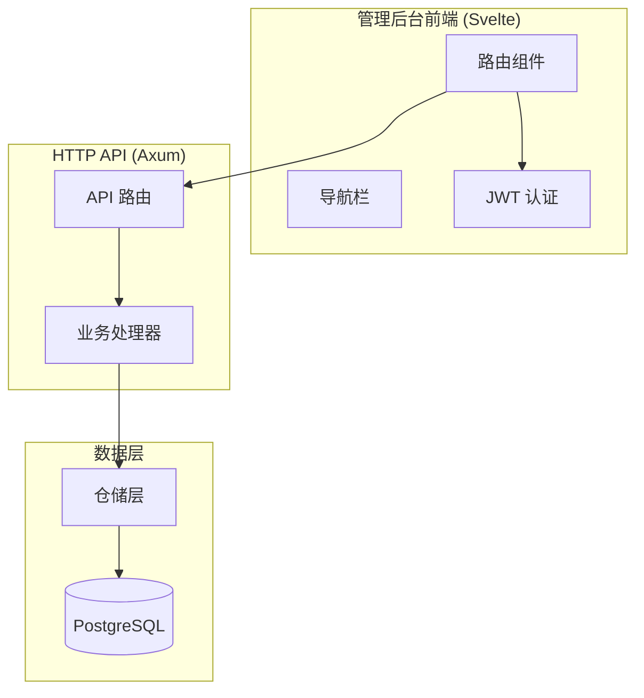
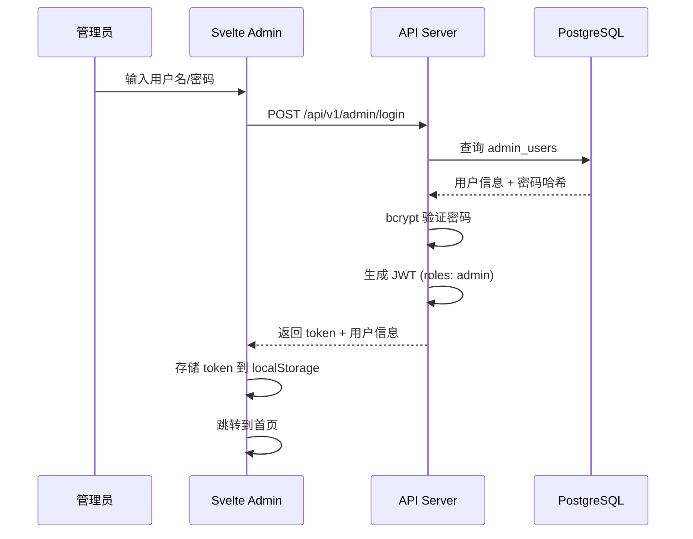
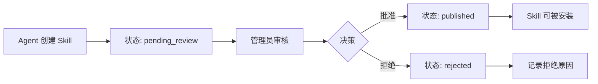

本文档介绍 SkillGarden 项目的 MVP 4 阶段——管理平台。这是一个基于 Svelte 构建的 Web 管理后台，为系统管理员提供 Skills 审核、组织管理、会话监控和审计日志等核心功能。

## 系统概述

管理平台采用前后端分离架构，前端使用 Svelte 框架，后端复用原有的 Axum HTTP 服务器，通过 RESTful API 提供服务。



## 核心功能模块

### 1. 认证与授权

管理平台采用独立的认证体系，与 Agent 的 JWT 认证区分开来。管理员使用用户名密码登录，系统生成包含 `admin` 角色的 JWT Token。

**登录流程**:



**默认凭据**: 用户名 `admin`，密码 `admin123`

管理员登录 API 调用 `adminLogin(username, password)` 方法，通过 `Authorization: Bearer <token>` 头携带 JWT 进行后续请求。

Sources: [admin/src/stores/auth.js](admin/src/stores/auth.js#L1-L46)
Sources: [src/api/handlers.rs](src/api/handlers.rs#L245-L290)

### 2. Skills 审核工作流

管理平台提供 Skills 审核功能，管理员可以查看待审核的 Skills 并执行批准或拒绝操作。

**审核流程**:



**审核 API**:

| 操作 | API 端点 | 说明 |
|------|----------|------|
| 批准 | `POST /api/v1/admin/skills/:id/approve` | 将 Skill 状态设为 published |
| 拒绝 | `POST /api/v1/admin/skills/:id/reject` | 将 Skill 状态设为 rejected |

审核操作会同步写入审计日志，记录操作类型为 `skill_reviewed`。

Sources: [admin/src/components/ReviewActions.svelte](admin/src/components/ReviewActions.svelte#L1-L60)
Sources: [src/api/handlers.rs](src/api/handlers.rs#L401-L458)

### 3. 组织管理

多租户架构的核心部分，管理员可以创建、查看、更新和删除组织。

**组织管理 API**:

| 操作 | API 端点 | 方法 |
|------|----------|------|
| 列表 | `GET /api/v1/organizations` | 获取所有组织 |
| 创建 | `POST /api/v1/organizations` | 创建新组织 |
| 详情 | `GET /api/v1/organizations/:id` | 获取组织详情 |
| 更新 | `PUT /api/v1/organizations/:id` | 更新组织信息 |
| 删除 | `DELETE /api/v1/organizations/:id` | 删除组织 |

Sources: [admin/src/routes/Organizations.svelte](admin/src/routes/Organizations.svelte#L1-L151)
Sources: [src/api/handlers.rs](src/api/handlers.rs#L468-L530)

### 4. 会话管理

管理员可以监控所有 Agent 的会话活动，包括查看会话状态和结束活跃会话。

**会话状态**:

- `active` - 会话正在运行
- `ended` - 会话已结束

**会话 API**:

| 操作 | API 端点 | 说明 |
|------|----------|------|
| 列表 | `GET /api/v1/sessions` | 获取会话列表 |
| 详情 | `GET /api/v1/sessions/:id` | 获取会话详情 |
| 结束 | `POST /api/v1/sessions/:id/end` | 强制结束会话 |
| 声明能力 | `POST /api/v1/sessions/:id/declare` | 声明会话支持的能力 |

Sources: [admin/src/routes/Sessions.svelte](admin/src/routes/Sessions.svelte#L1-L136)
Sources: [src/api/handlers.rs](src/api/handlers.rs#L532-L590)

### 5. 组织工具管理

允许组织注册和管理自己的工具扩展，支持 CLI、API、Docker 等类型。

**工具注册 API**:

| 操作 | API 端点 | 说明 |
|------|----------|------|
| 注册 | `POST /api/v1/org-tools` | 注册新工具 |
| 列表 | `GET /api/v1/org-tools` | 获取所有组织工具 |
| 审批 | `POST /api/v1/org-tools/:id/approve` | 批准工具 |
| 拒绝 | `POST /api/v1/org-tools/:id/reject` | 拒绝工具 |

Sources: [admin/src/routes/OrgTools.svelte](admin/src/routes/OrgTools.svelte#L1-L200)
Sources: [src/api/handlers.rs](src/api/handlers.rs#L608-L660)

### 6. 审计日志

完整的操作审计功能，记录所有关键操作并支持多维度查询。

**日志记录的操作类型**:

- `skill_create` - 创建 Skill
- `skill_update` - 更新 Skill
- `skill_delete` - 删除 Skill
- `skill_approve` - 批准 Skill
- `skill_reject` - 拒绝 Skill
- `skill_reviewed` - Skill 审核（通用）

**查询参数**:

| 参数 | 类型 | 说明 |
|------|------|------|
| agent_id | string | 按 Agent 筛选 |
| action | string | 按操作类型筛选 |
| resource_type | string | 按资源类型筛选 |
| limit | int | 返回数量（默认 50，最大 100） |
| offset | int | 偏移量 |

Sources: [admin/src/routes/AuditLogs.svelte](admin/src/routes/AuditLogs.svelte#L1-L113)
Sources: [src/api/handlers.rs](src/api/handlers.rs#L292-L399)

### 7. 统计仪表盘

首页展示系统关键指标的概览视图。

**统计卡片**:

| 指标 | 说明 |
|------|------|
| Total Skills | 系统中 Skills 总数 |
| Pending Review | 待审核的 Skills 数量 |
| Published | 已发布的 Skills 数量 |

Sources: [admin/src/routes/Stats.svelte](admin/src/routes/Stats.svelte#L1-L65)

## 前端架构

### 目录结构

```
admin/
├── index.html
├── package.json
├── vite.config.js
└── src/
    ├── App.svelte              # 根组件 + 路由配置
    ├── main.js                 # 入口文件
    ├── app.css                 # 全局样式
    ├── lib/
    │   ├── api.js              # API 客户端封装
    │   ├── components/         # 可复用组件
    │   └── stores/             # 状态管理
    ├── components/             # UI 组件
    │   ├── Nav.svelte          # 导航栏
    │   ├── Badge.svelte        # 状态徽章
    │   ├── StatCard.svelte     # 统计卡片
    │   ├── SkillRow.svelte     # Skill 表格行
    │   ├── ReviewActions.svelte # 审核操作按钮
    │   ├── RejectModal.svelte  # 拒绝弹窗
    │   ├── AuditTable.svelte   # 审计日志表格
    │   ├── Toast.svelte        # 通知提示
    │   ├── EmptyState.svelte   # 空状态提示
    │   ├── LoadingSpinner.svelte # 加载动画
    │   └── ProtectedRoute.svelte # 路由保护
    ├── routes/                 # 页面组件
    │   ├── Login.svelte        # 登录页
    │   ├── Home.svelte         # 首页
    │   ├── Review.svelte       # 审核队列
    │   ├── AuditLogs.svelte    # 审计日志
    │   ├── Stats.svelte        # 统计仪表盘
    │   ├── Organizations.svelte # 组织管理
    │   ├── Sessions.svelte     # 会话管理
    │   ├── OrgTools.svelte     # 组织工具
    │   └── Settings.svelte     # 系统设置
    └── stores/
        ├── auth.js             # 认证状态
        └── app.js             # 全局状态
```

### 路由配置

管理平台使用 `svelte-routing` 进行客户端路由。路由分为两类：公开路由（登录页）和受保护路由（需要认证）。

```mermaid
graph LR
    A[访问 /] --> B{已认证?}
    B -->|否| C[/login]
    B -->|是| D[Organizations 列表]
    
    E[路由表]
    E --> F[/ - Organizations]
    E --> G[/review - Review 队列]
    E --> H[/stats - 统计仪表盘]
    E --> I[/audit - 审计日志]
    E --> J[/sessions - 会话管理]
    E --> K[/org-tools - 组织工具]
    E --> L[/settings - 系统设置]
```

Sources: [admin/src/App.svelte](admin/src/App.svelte#L1-L46)

### API 客户端

统一封装了所有 API 调用，自动处理 Token 注入和错误处理。

```javascript
// 请求拦截器自动添加 Authorization 头
async function request(path, options = {}) {
  const token = localStorage.getItem('admin_token');
  const headers = {
    'Content-Type': 'application/json',
    ...(token && { Authorization: `Bearer ${token}` }),
    ...options.headers
  };
  // ...
}
```

Sources: [admin/src/lib/api.js](admin/src/lib/api.js#L1-L151)

## 后端 API 设计

### 认证中间件

使用 Axum 的 `FromRequestParts` 提取器实现 JWT 验证。`AgentContext` 包含：

- `agent_id` - 身份标识
- `org_id` - 组织 ID
- `session_id` - 会话 ID
- `roles` - 角色列表（admin 角色可访问管理接口）
- `scope` - 权限范围

Sources: [src/api/jwt.rs](src/api/jwt.rs#L1-L201)

### API 路由

```rust
// 管理相关路由
route("/api/v1/admin/login", post(admin_login_handler))
route("/api/v1/admin/audit-logs", get(list_audit_logs_handler))
route("/api/v1/admin/skills/:id/approve", post(approve_skill_handler))
route("/api/v1/admin/skills/:id/reject", post(reject_skill_handler))

// 组织相关路由
route("/api/v1/organizations", post(create_org_handler))
route("/api/v1/organizations", get(list_orgs_handler))
route("/api/v1/organizations/:id", get(get_org_handler))
route("/api/v1/organizations/:id", put(update_org_handler))
route("/api/v1/organizations/:id", delete(delete_org_handler))

// 会话相关路由
route("/api/v1/sessions", post(create_session_handler))
route("/api/v1/sessions", get(list_sessions_handler))
route("/api/v1/sessions/:id", get(get_session_handler))
route("/api/v1/sessions/:id/end", post(end_session_handler))
```

Sources: [src/api/routes.rs](src/api/routes.rs#L1-L44)

## 数据库模型

### 管理员用户表

```sql
CREATE TABLE admin_users (
    id UUID PRIMARY KEY DEFAULT uuid_generate_v4(),
    username VARCHAR(255) UNIQUE NOT NULL,
    password_hash VARCHAR(255) NOT NULL,
    display_name VARCHAR(255),
    is_active BOOLEAN NOT NULL DEFAULT true,
    created_at TIMESTAMPTZ NOT NULL DEFAULT NOW(),
    updated_at TIMESTAMPTZ NOT NULL DEFAULT NOW()
);
```

密码使用 bcrypt 加密存储，默认 cost 为 12。

Sources: [src/db/migrations/010_add_admin_users.sql](src/db/migrations/010_add_admin_users.sql#L1-L19)

### 审计日志表

```sql
CREATE TABLE audit_logs (
    id UUID PRIMARY KEY DEFAULT uuid_generate_v4(),
    agent_id VARCHAR(255),
    action VARCHAR(100) NOT NULL,
    resource_type VARCHAR(50) NOT NULL,
    resource_id VARCHAR(255),
    details JSONB DEFAULT '{}',
    timestamp TIMESTAMPTZ NOT NULL DEFAULT NOW()
);

CREATE INDEX idx_audit_timestamp ON audit_logs(timestamp DESC);
CREATE INDEX idx_audit_agent ON audit_logs(agent_id);
```

Sources: [src/db/migrations/001_initial_schema.sql](src/db/migrations/001_initial_schema.sql#L62-L71)

### 组织表

```sql
CREATE TABLE organizations (
    id UUID PRIMARY KEY DEFAULT uuid_generate_v4(),
    name VARCHAR(255) NOT NULL,
    settings JSONB DEFAULT '{}',
    created_at TIMESTAMPTZ NOT NULL DEFAULT NOW()
);
```

Sources: [src/db/repositories/organization.rs](src/db/repositories/organization.rs#L1-L132)

## 快速开始

### 启动管理后台

```bash
cd admin
npm install
npm run dev
```

访问 `http://localhost:5173` 打开管理界面。

### 登录凭据

| 字段 | 默认值 |
|------|--------|
| 用户名 | `admin` |
| 密码 | `admin123` |

**注意**: 生产环境请务必修改默认密码！

Sources: [admin/src/routes/Login.svelte](admin/src/routes/Login.svelte#L1-L98)

## 扩展阅读

建议按以下顺序阅读相关文档：

1. [MVP 3: 核心假设验证](6-mvp-3-he-xin-jia-she-yan-zheng) - 了解 Skills 评价机制
2. [系统架构](8-xi-tong-jia-gou) - 理解整体架构设计
3. [REST API 接口](18-rest-api-jie-kou) - 完整的 API 参考