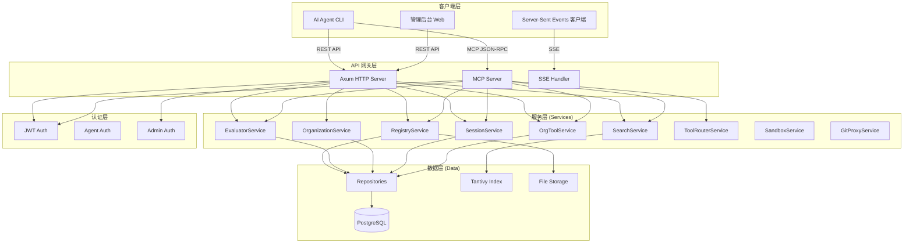
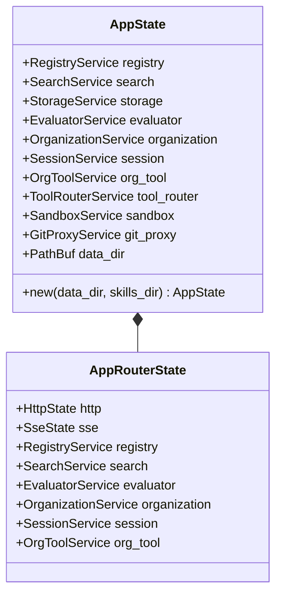
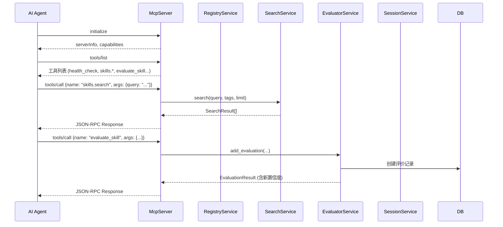
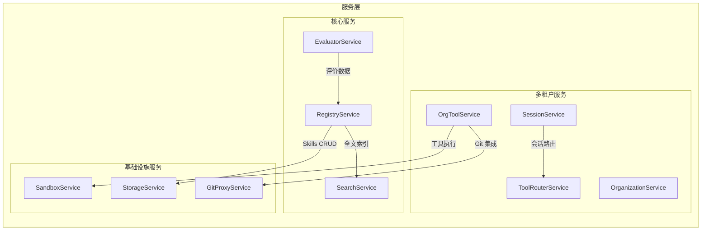
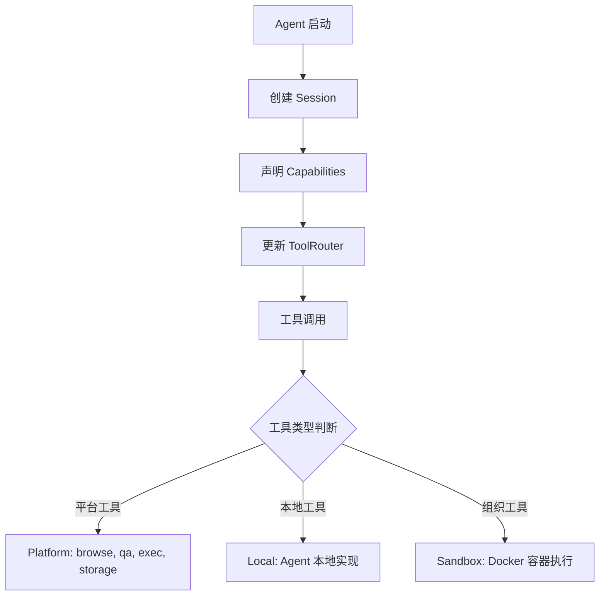
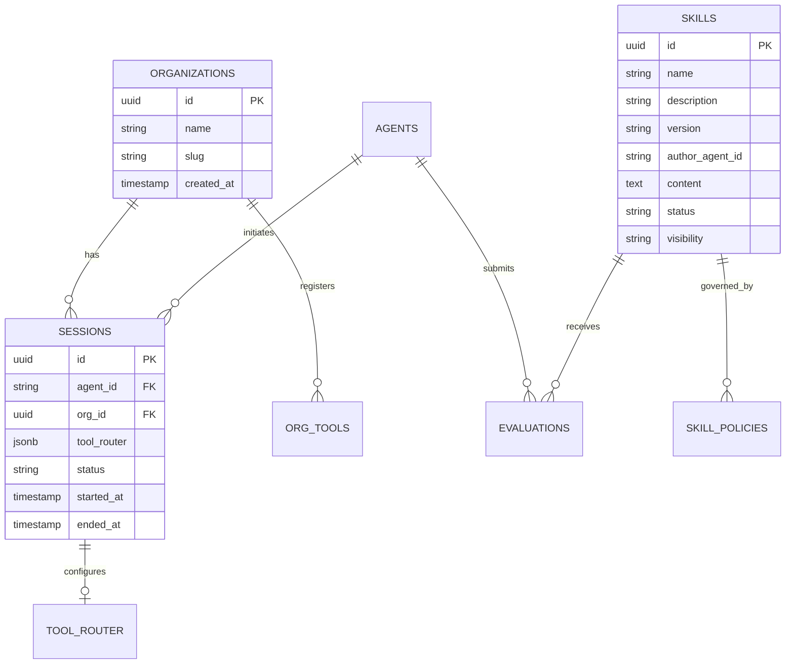
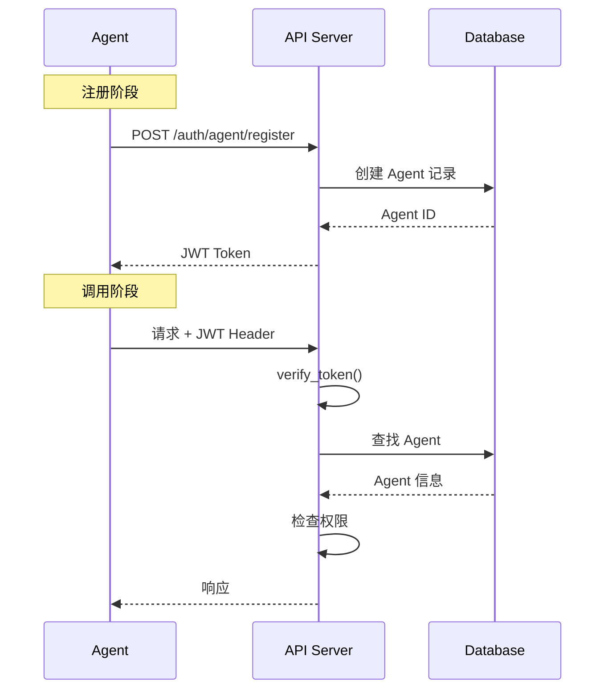

本文档详细阐述 ansphere-skillgarden（曾用名 aion-hive）项目的技术架构设计，帮助开发者理解系统各组件的职责、数据流向以及模块间的协作关系。该平台是一个企业级 AI Skills 共享与评价系统，支持多租户组织管理、技能注册搜索、以及基于 MCP 协议的工具调用。

## 架构总览

本系统采用**分层服务架构**（Layered Service Architecture），将核心功能划分为 API 层、服务层、数据层三个主要层次，并通过 MCP Server 实现与 AI Agent 的协议集成。



Sources: [src/main.rs](src/main.rs#L1-L200), [src/lib.rs](src/lib.rs#L1-L117)

## 核心组件

### 入口点与状态管理

系统的入口点位于 `src/main.rs`，负责初始化 HTTP 服务器、路由配置以及 `AppState` 的构建。`AppState` 是整个应用的核心状态容器，通过 `Arc` 在各处理器间共享。



`AppState` 在应用启动时完成初始化，包括数据库连接池创建、数据迁移执行、各类仓储和服务实例化。所有服务均实现 `Clone` trait，确保可以在多个请求处理器间高效共享。

Sources: [src/lib.rs](src/lib.rs#L42-L104), [src/api/http_state.rs](src/api/http_state.rs#L1-L43)

### API 层架构

API 层采用 Axum 框架构建，提供 RESTful API 接口和 MCP 协议端点。

| 端点类型 | 路径模式 | 功能说明 |
|---------|---------|---------|
| MCP 协议 | `POST /mcp` | MCP JSON-RPC 请求处理 |
| SSE 通信 | `GET /sse` | 建立 SSE 连接 |
| SSE 消息 | `POST /sse/:session_id` | 通过 SSE 发送 MCP 消息 |
| 健康检查 | `GET /health` | 服务健康状态 |
| Skills CRUD | `/api/v1/skills/*` | Skills 增删改查 |
| 组织管理 | `/api/v1/organizations/*` | 多租户组织管理 |
| 会话管理 | `/api/v1/sessions/*` | Agent 会话追踪 |
| 组织工具 | `/api/v1/org-tools/*` | 组织级工具注册 |
| 评价系统 | `/api/v1/evaluations` | Skills 评价提交 |
| 认证接口 | `/api/v1/auth/*` | Agent 注册与 Token 获取 |

API 层实现了统一的错误处理机制，通过 `ApiError` 枚举将不同类型的错误（400/401/403/404/500）映射为标准的 HTTP 响应格式。

Sources: [src/main.rs](src/main.rs#L131-L200), [src/api/routes.rs](src/api/routes.rs#L1-L44), [src/api/error.rs](src/api/error.rs#L1-L73)

### MCP Server 实现

MCP Server 是本系统的核心创新点，它实现了 Model Context Protocol 协议，使 AI Agent 能够以标准化的方式调用平台功能。



MCP Server 通过 `rmcp` 库实现协议处理，支持三种工具调用模式：Skills 搜索与浏览、技能信息获取、以及评价提交。Agent 身份通过 JWT Token 验证，从环境变量 `AION_HIVE_JWT_TOKEN` 中提取会话上下文。

Sources: [src/mcp/server.rs](src/mcp/server.rs#L1-L200), [src/mcp/mod.rs](src/mcp/mod.rs#L1-L5)

## 服务层设计

服务层封装了所有业务逻辑，是系统的核心功能区域。

### 服务组件图



### 注册服务 (RegistryService)

注册服务是 Skills 管理的核心，负责 Skills 的创建、更新、删除和列表查询。它同时维护文件系统的 Skill 内容存储和数据库中的元数据索引。

```rust
// 核心方法签名
pub async fn create_skill(&self, new_skill: NewSkill, author_agent_id: &str, search: &SearchService) -> Result<Skill, AppError>
pub async fn update_skill(&self, skill_id: &str, update: SkillUpdate, author_agent_id: &str, search: &SearchService) -> Result<Skill, AppError>
pub async fn get_skill(&self, skill_id: &str) -> Result<Skill, AppError>
pub async fn list_skills(&self) -> Result<Vec<SkillMetadata>, AppError>
pub fn count(&self) -> usize
```

创建 Skills 时，服务会进行多维度验证（名称格式、标签合法性、描述规范性、版本语义化、内容完整性），验证通过后同时写入数据库和文件系统，并更新 Tantivy 搜索索引。

Sources: [src/services/registry.rs](src/services/registry.rs#L1-L200)

### 搜索服务 (SearchService)

搜索服务基于 Tantivy 全文搜索引擎构建，支持对 Skills 的名称、描述、标签进行高效检索。

```rust
// 索引字段配置
schema_builder.add_text_field("id", STRING | STORED);
schema_builder.add_text_field("name", TEXT | STORED);
schema_builder.add_text_field("description", TEXT | STORED);
schema_builder.add_text_field("tags", TEXT | STORED);
schema_builder.add_text_field("content", TEXT);  // 不存储，减少索引大小
```

搜索支持按标签过滤和结果数量限制，返回按相关性排序的结果。索引采用延迟提交策略（`ReloadPolicy::OnCommitWithDelay`），在保证搜索实时性的同时避免频繁写入开销。

Sources: [src/services/search.rs](src/services/search.rs#L1-L80)

### 评价服务 (EvaluatorService)

评价服务收集 Agent 使用 Skills 的执行结果，计算并更新每个 Skill 的置信度权重。系统支持多维度评价标签（可靠、快速、稳定、实验性）和错误类型分类（超时、崩溃、逻辑错误）。

```rust
// 置信度计算输入
pub async fn add_evaluation(
    &self,
    skill_id: String,
    agent_id: String,
    success: bool,
    duration_ms: u64,
    error_type: Option<ErrorType>,
    tags: Vec<EvalTag>,
) -> Result<EvaluationResult, AppError>
```

评价服务内置速率限制机制，防止单一 Agent 对同一 Skill 产生过度评价。同时支持 Webhook 回调，可将评价结果转发至外部系统进行进一步分析。

Sources: [src/services/evaluator.rs](src/services/evaluator.rs#L1-L120)

### 会话与工具路由服务

会话服务（SessionService）追踪每个 Agent 的活动会话，管理工具路由配置。工具路由（ToolRouterService）根据 Agent 声明的能力决定工具调用的目标位置。



工具路由规则优先级为：平台工具 > 组织工具 > 本地工具。组织工具通过 SandboxService 在隔离的 Docker 容器中执行（沙箱功能目前为占位实现）。

Sources: [src/services/session.rs](src/services/session.rs#L1-L129), [src/services/sandbox.rs](src/services/sandbox.rs#L1-L95)

## 数据层架构

### 数据库设计

系统使用 PostgreSQL 作为主数据库，通过 SQLx 实现异步数据库访问。



数据库迁移采用嵌入式 SQL 脚本方式，通过 `_migrations` 表追踪已执行的迁移脚本。系统维护了 11 个迁移文件，从初始 Schema 到会话技能字段的演进。

Sources: [src/db/mod.rs](src/db/mod.rs#L1-L11), [src/db/migrations.rs](src/db/migrations.rs#L1-L80), [src/db/repositories/mod.rs](src/db/repositories/mod.rs#L1-L22)

### 仓储模式

系统采用仓储模式（Repository Pattern）封装数据库访问逻辑，每个仓储对应一个业务实体。

| 仓储 | 职责 |
|-----|------|
| SkillRepository | Skills 元数据持久化 |
| AgentRepository | Agent 注册与认证 |
| EvaluationRepository | 评价记录管理 |
| OrganizationRepository | 组织管理 |
| SessionRepository | 会话状态管理 |
| OrgToolRepository | 组织工具注册 |
| AuditRepository | 审计日志 |
| AdminUserRepository | 管理员账户 |
| SkillPolicyRepository | 可见性策略 |

仓储层通过 trait 定义接口规范，实现了业务逻辑与数据访问的解耦，便于单元测试时进行 Mock。

Sources: [src/db/repositories/skill.rs](src/db/repositories/skill.rs#L1-L50), [src/db/repositories/mod.rs](src/db/repositories/mod.rs#L1-L22)

### 文件存储

除数据库外，系统还使用文件系统存储 Skills 的实际内容（SKILL.md）和相关数据。`StorageService` 提供统一的文件读写接口，支持原子写入操作以确保数据一致性。

Sources: [src/services/storage.rs](src/services/storage.rs#L1-L50)

## 认证与授权

### JWT 认证流程



JWT Token 包含 `agent_id`、`org_id`、`session_id`、`roles` 和 `scope` 等声明，用于在 MCP 请求中传递 Agent 上下文。Token 通过 `AION_HIVE_JWT_TOKEN` 环境变量注入 MCP Server。

Sources: [src/api/jwt.rs](src/api/jwt.rs#L1-L100)

### 角色权限

系统定义了三种角色：`admin`（管理员）、`org_admin`（组织管理员）、`agent`（普通 Agent）。管理员拥有技能审核权限，组织管理员管理组织内的资源和成员，普通 Agent 使用 Skills 并提交评价。

## 技术栈汇总

| 层次 | 技术选型 | 版本 | 用途 |
|-----|---------|------|------|
| Web 框架 | Axum | 0.7 | HTTP Server |
| 异步运行时 | Tokio | 1.x | 异步 I/O |
| MCP 协议 | rmcp | 1.0 | Agent 通信协议 |
| 数据库 | PostgreSQL | - | 持久化存储 |
| DB 访问 | SQLx | 0.8 | 异步 SQL |
| 全文搜索 | Tantivy | 0.22 | Skills 检索 |
| 序列化 | Serde | 1 | JSON 编解码 |
| 认证 | jsonwebtoken | 9 | JWT 处理 |
| 日志 | tracing | 0.1 | 结构化日志 |

Sources: [Cargo.toml](Cargo.toml#L1-L73)

## 后续阅读

在理解系统架构后，建议按以下顺序深入学习：

1. [MCP Server 实现](10-mcp-server-shi-xian) — 深入了解 MCP 协议处理和工具调用分发机制
2. [数据模型](14-shu-ju-mo-xing) — 掌握各领域模型的完整定义和关系
3. [置信度权重机制](26-zhi-xin-du-quan-zhong-ji-zhi) — 理解 Skill 评价与置信度计算的数学基础
4. [技术栈详解](9-ji-zhu-zhan-xiang-jie) — 了解关键依赖库的设计考量