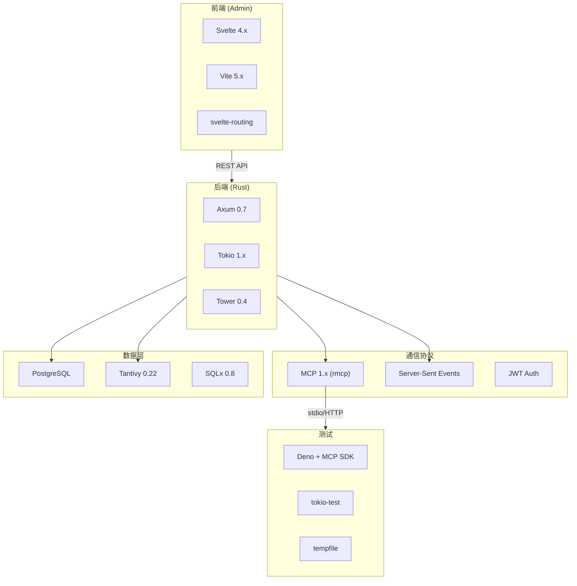
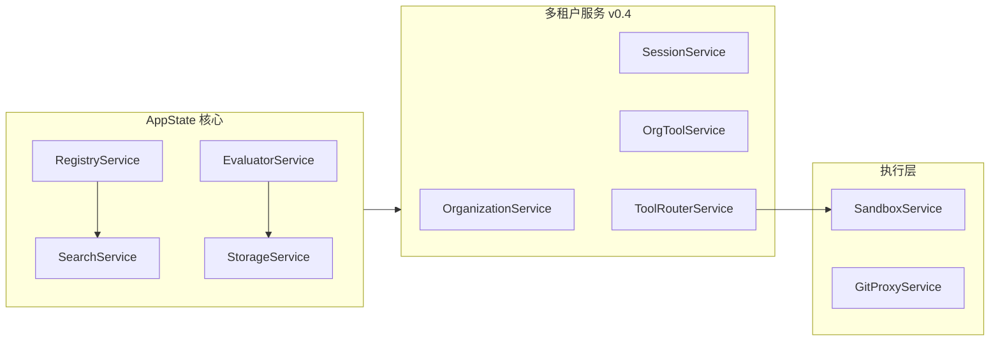

本文档深入解析 Anspire SkillGarden 项目采用的技术栈，从后端 Rust 生态到前端 Svelte 框架，从核心协议到测试工具，帮助开发者全面理解每一层技术的选型理由与实现细节。

## 技术栈总览

SkillGarden 采用**前后端分离架构**，后端使用 Rust 构建高性能服务，前端采用轻量级 Svelte 框架，通过 MCP（Model Context Protocol）协议实现与 AI Agent 的通信。整个技术栈围绕「高性能、强类型、可观测」三大原则设计。



Sources: [Cargo.toml](Cargo.toml#L1-L73) [admin/package.json](admin/package.json#L1-L20)

---

## 后端技术栈

### 运行时与 Web 框架

后端基于 **Rust 1.70+** 构建，选择 Rust 的核心考量是内存安全、高并发处理能力和优秀的异步性能。

| 组件 | 版本 | 作用 | 选型理由 |
|------|------|------|----------|
| **Tokio** | 1.x | 异步运行时 | 最成熟的 Rust 异步生态，支持多线程调度 |
| **Axum** | 0.7 | Web 框架 | 基于 Tower 构建，类型安全、模块化 |
| **Tower** | 0.4 | 中间件系统 | 提供 CORS、Trace 等企业级中间件 |
| **Tower-HTTP** | 0.5 | HTTP 扩展 | CORS、请求追踪、请求限流 |

Axum 是目前 Rust 生态中最活跃的 Web 框架，其核心优势在于与 Tokio、Tower 的深度集成。项目中 `main.rs` 展示了典型的 Axum 路由配置模式：

```rust
let app = Router::new()
    .route("/health", get(health_handler))
    .route("/mcp", post(mcp_handler))
    .route("/sse", get(sse_handler))
    .route("/sse/:session_id", post(sse_message_handler))
    // v1 API routes...
    .with_state(state);
```

Sources: [src/main.rs](src/main.rs#L140-L200)

### MCP 协议实现

MCP（Model Context Protocol）是项目的核心通信协议，提供了 Agent 与 SkillGarden 交互的标准接口。

| 组件 | 作用 | 实现方式 |
|------|------|----------|
| **rmcp** | MCP 协议 Rust 实现 | 支持 server、transport-io 特性 |
| **stdio transport** | 标准输入/输出通信 | 适用于本地进程通信 |
| **Streamable HTTP** | HTTP 长连接传输 | 支持 SSE 推送 |

MCP Server 实现位于 `src/mcp/server.rs`，通过 `serve_server` 函数启动服务：

```rust
use rmcp::{
    service::{serve_server, RoleServer},
    transport::stdio,
};

pub async fn run(self) -> Result<(), Box<dyn std::error::Error + Send + Sync>> {
    let (stdin, stdout) = stdio();
    serve_server(self, (stdin, stdout)).await?;
    Ok(())
}
```

Sources: [src/mcp/server.rs](src/mcp/server.rs#L1-L60)

### 数据库层

数据库层采用 **PostgreSQL** 作为持久化存储，配合 **SQLx** 实现类型安全的异步数据库操作。

| 组件 | 版本 | 作用 |
|------|------|------|
| **PostgreSQL** | 最新版 | 关系型数据库存储 |
| **SQLx** | 0.8 | 异步 SQL 工具，支持编译时查询验证 |
| **tokio-postgres** | 0.7 | 底层 PostgreSQL 驱动 |

SQLx 的编译时查询验证是核心特性，能在编译阶段发现 SQL 错误：

```rust
// 编译时验证的查询示例
let already_applied: bool = sqlx::query_scalar(
    "SELECT EXISTS(SELECT 1 FROM _migrations WHERE name = $1)"
)
.bind(*name)
.fetch_one(pool)
.await
```

迁移管理采用内置方式，通过 `db/migrations.rs` 中的版本化 SQL 脚本实现：

```rust
const MIGRATIONS: &[(&str, &str)] = &[
    ("001_initial_schema", include_str!("migrations/001_initial_schema.sql")),
    ("002_add_skill_status", include_str!("migrations/002_add_skill_status.sql")),
    // ...
];
```

Sources: [src/db/mod.rs](src/db/mod.rs#L1-L11) [src/db/migrations.rs](src/db/migrations.rs#L1-L50)

### 全文搜索引擎

采用 **Tantivy 0.22** 实现高性能全文搜索，这是 Rust 生态中最成熟的搜索引擎库，源自 Apache Lucene。

| 字段 | 类型 | 说明 |
|------|------|------|
| `id` | STRING + STORED | Skill 唯一标识 |
| `name` | TEXT + STORED | 名称（参与搜索） |
| `description` | TEXT + STORED | 描述（参与搜索） |
| `tags` | TEXT + STORED | 标签（参与搜索） |
| `content` | TEXT | 内容（搜索，不存储） |
| `install_count` | STORED | 安装次数（用于排序） |

Tantivy 的优势在于零外部依赖、完全内存安全的索引操作，以及优秀的搜索性能：

```rust
pub fn new(index_path: &Path) -> Result<Self> {
    let mut schema_builder = Schema::builder();
    schema_builder.add_text_field("id", STRING | STORED);
    schema_builder.add_text_field("name", TEXT | STORED);
    // ...
    let index = Index::create_in_dir(index_path, schema.clone())?;
    let reader = index.reader_builder()
        .reload_policy(ReloadPolicy::OnCommitWithDelay)
        .try_into()?;
    Ok(Self { index, reader, schema })
}
```

Sources: [src/services/search.rs](src/services/search.rs#L1-L80)

### 认证与安全

| 组件 | 版本 | 作用 |
|------|------|------|
| **jsonwebtoken** | 9 | JWT 生成与验证 |
| **bcrypt** | 0.15 | 密码哈希 |
| **tower-http** | 0.5 | CORS 中间件 |

JWT 认证采用 RS256/HS256 混合模式，支持 Agent 和 Admin 两种身份：

```rust
#[derive(Debug, Clone, Serialize, Deserialize)]
pub struct Claims {
    pub agent_id: String,
    pub org_id: Option<uuid::Uuid>,
    pub session_id: Option<uuid::Uuid>,
    pub roles: Vec<String>,
    pub scope: Vec<String>,
    pub exp: i64,
    pub iat: i64,
}
```

Token 验证通过 Axum 的 `FromRequestParts` trait 实现：

```rust
#[async_trait]
impl<S: Send + Sync> FromRequestParts<S> for AgentContext {
    type Rejection = ApiError;
    
    async fn from_request_parts(parts: &mut Parts, _state: &S) -> Result<Self, Self::Rejection> {
        let auth_header = parts.headers.get("Authorization")...;
        let claims = verify_token(token)?;
        Ok(AgentContext { ... })
    }
}
```

Sources: [src/api/jwt.rs](src/api/jwt.rs#L1-L100)

### 其他核心依赖

| 组件 | 作用 | 使用场景 |
|------|------|----------|
| **serde** | 序列化/反序列化 | JSON、Config |
| **anyhow** | 错误处理 | 库级别错误传播 |
| **thiserror** | 错误定义 | 结构化错误类型 |
| **chrono** | 时间处理 | 时间戳、日期 |
| **uuid** | UUID 生成 | 实体标识 |
| **semver** | 语义版本 | Skill 版本管理 |
| **reqwest** | HTTP 客户端 | Webhook 转发 |
| **tracing** | 结构化日志 | 请求追踪 |

Sources: [Cargo.toml](Cargo.toml#L1-L73)

---

## 前端技术栈

### 框架与构建工具

管理后台（Admin）采用 **Svelte 4.x** 配合 **Vite 5.x**，这是当前最轻量的前端组合之一。

| 组件 | 版本 | 作用 |
|------|------|------|
| **Svelte** | 4.2.12 | UI 框架 |
| **Vite** | 5.2.0 | 构建工具 |
| **@sveltejs/vite-plugin-svelte** | 3.1.0 | Svelte Vite 插件 |
| **svelte-routing** | 2.13.0 | 路由管理 |

Vite 配置中的代理设置将 `/api` 请求转发到后端服务：

```javascript
export default defineConfig({
  plugins: [svelte()],
  server: {
    port: 5174,
    proxy: {
      '/api': {
        target: 'http://localhost:8081',
        changeOrigin: true
      }
    }
  }
});
```

Sources: [admin/vite.config.js](admin/vite.config.js#L1-L16)

### 项目结构

前端采用标准 Svelte 项目结构，组件化程度高：

```
admin/src/
├── App.svelte              # 根组件 + 路由配置
├── main.js                 # 入口文件
├── app.css                 # 全局样式
├── components/             # 可复用组件
│   ├── Nav.svelte          # 导航栏
│   ├── Toast.svelte        # 消息提示
│   ├── Badge.svelte        # 标签组件
│   ├── AuditTable.svelte   # 审计表格
│   └── ...
├── routes/                 # 页面组件
│   ├── Organizations.svelte
│   ├── Sessions.svelte
│   ├── OrgTools.svelte
│   └── ...
├── lib/                    # 工具库
│   ├── api.js              # API 调用封装
│   └── stores/             # Svelte Store
└── stores/                 # 全局状态
    ├── auth.js              # 认证状态
    └── app.js               # 应用状态
```

路由配置通过 `svelte-routing` 实现，支持嵌套路由和认证保护：

```svelte
<script>
  import { Router, Route, navigate } from 'svelte-routing';
  import { isAuthenticated } from './stores/auth.js';
</script>

<Router {url}>
  <div class="min-h-screen bg-gray-50">
    {#if !$isAuthenticated}
      <Route path="/login" component={Login} />
    {:else}
      <Nav />
      <Route path="/organizations" component={Organizations} />
      <Route path="/sessions" component={Sessions} />
      <!-- ... -->
    {/if}
  </div>
</Router>
```

Sources: [admin/src/App.svelte](admin/src/App.svelte#L1-L46)

### API 通信

前端通过 `lib/api.js` 封装 REST API 调用，统一处理认证和错误：

```javascript
const API_BASE = '/api/v1';

async function request(path, options = {}) {
  const token = localStorage.getItem('admin_token');
  const headers = {
    'Content-Type': 'application/json',
    ...(token && { Authorization: `Bearer ${token}` }),
  };
  
  const res = await fetch(`${API_BASE}${path}`, { ...options, headers });
  if (!res.ok) {
    const err = await res.json().catch(() => ({ message: 'Request failed' }));
    throw new Error(err.message);
  }
  return res.json();
}
```

---

## 服务架构

### 服务依赖关系



每个服务都是独立的 Rust crate 模块，通过 `AppState` 统一管理生命周期：

```rust
pub struct AppState {
    pub registry: services::RegistryService,
    pub search: services::SearchService,
    pub storage: services::StorageService,
    pub evaluator: services::EvaluatorService,
    // v0.4 multi-tenant services
    pub organization: services::OrganizationService,
    pub session: services::SessionService,
    pub org_tool: services::OrgToolService,
    pub tool_router: services::ToolRouterService,
    pub sandbox: services::SandboxService,
    pub git_proxy: services::GitProxyService,
    pub data_dir: PathBuf,
}
```

Sources: [src/lib.rs](src/lib.rs#L50-L70) [src/services/mod.rs](src/services/mod.rs#L1-L25)

### MCP Server 实现

MCP Server 是 Agent 交互的核心入口，处理 `tools/list` 和 `tools/call` 两种核心方法：

```rust
impl ServerHandler for McpServer {
    async fn handle_list_tools(&self) -> ListToolsResult {
        let tools = vec![
            Tool { name: "health_check".into(), ... },
            Tool { name: "skills_search".into(), ... },
            Tool { name: "skills_list".into(), ... },
            Tool { name: "skills_info".into(), ... },
            Tool { name: "skills_create".into(), ... },
            // ... 更多工具
        ];
        ListToolsResult { tools }
    }
    
    async fn handle_call_tool(&self, params: CallToolRequestParams) -> CallToolResult {
        // 工具调用处理逻辑
    }
}
```

Sources: [src/mcp/server.rs](src/mcp/server.rs#L60-L120)

---

## 测试体系

### Rust 集成测试

采用 `tokio-test` 和 `tempfile` 实现无依赖的单元测试：

```rust
#[tokio::test]
async fn test_search_add_and_search() {
    let temp_dir = TempDir::new().unwrap();
    let search_dir = temp_dir.path().join("search");
    let search = aion_hive::SearchService::new(&search_dir).unwrap();
    
    let skill = aion_hive::models::skill::Skill { ... };
    search.add_skill(&skill).unwrap();
    
    let results = search.search("searching", None, 10).unwrap();
    assert!(!results.is_empty());
}
```

Sources: [tests/integration.rs](tests/integration.rs#L1-L50)

### TypeScript E2E 测试

使用 **Deno** + **MCP SDK** 进行端到端测试，验证 MCP 协议交互：

```typescript
import { Client } from "@modelcontextprotocol/sdk@1.29.0/client";
import { StreamableHTTPClientTransport } from "@modelcontextprotocol/sdk@1.29.0/client/streamableHttp.js";

Deno.test({
  name: "MCP E2E - Skills Search",
  async fn() {
    const client = await createClient();
    const result = await client.callTool({
      name: "skills_search",
      arguments: { query: "searchable", limit: 10 },
    });
    // 验证搜索结果
  }
});
```

运行测试前需启动 MCP 服务器：

```bash
# 终端 1: 启动服务器
.\start-http-server.ps1

# 终端 2: 运行测试
deno test --allow-all --filter "MCP E2E" tests/e2e/mcp_e2e_test.ts
```

Sources: [tests/e2e/mcp_e2e_test.ts](tests/e2e/mcp_e2e_test.ts#L1-L50)

---

## 技术选型原则

| 原则 | 实践 | 收益 |
|------|------|------|
| **类型安全** | Rust + SQLx + serde | 编译期错误检测 |
| **零成本抽象** | Axum + Tower | 最小运行时开销 |
| **模块化设计** | 服务分离 + trait 边界 | 独立演进 |
| **协议标准化** | MCP 协议 | Agent 互操作性 |
| **轻量前端** | Svelte | 快速加载、简单维护 |

---

## 后续演进方向

| 组件 | 计划升级 | 理由 |
|------|----------|------|
| 搜索 | 考虑 Elasticsearch 集群 | 超大规模数据支持 |
| 存储 | 引入 Redis 缓存 | 高频访问加速 |
| 沙箱 | bollard SDK | Docker 容器隔离 |
| 前端 | 考虑 SvelteKit | SSR + API 路由 |

---

## 相关文档

- [系统架构](8-xi-tong-jia-gou) - 了解整体架构设计
- [MCP Server 实现](10-mcp-server-shi-xian) - 协议层深入解析
- [数据模型](14-shu-ju-mo-xing) - 数据结构定义
- [环境配置](23-huan-jing-pei-zhi) - 开发环境搭建