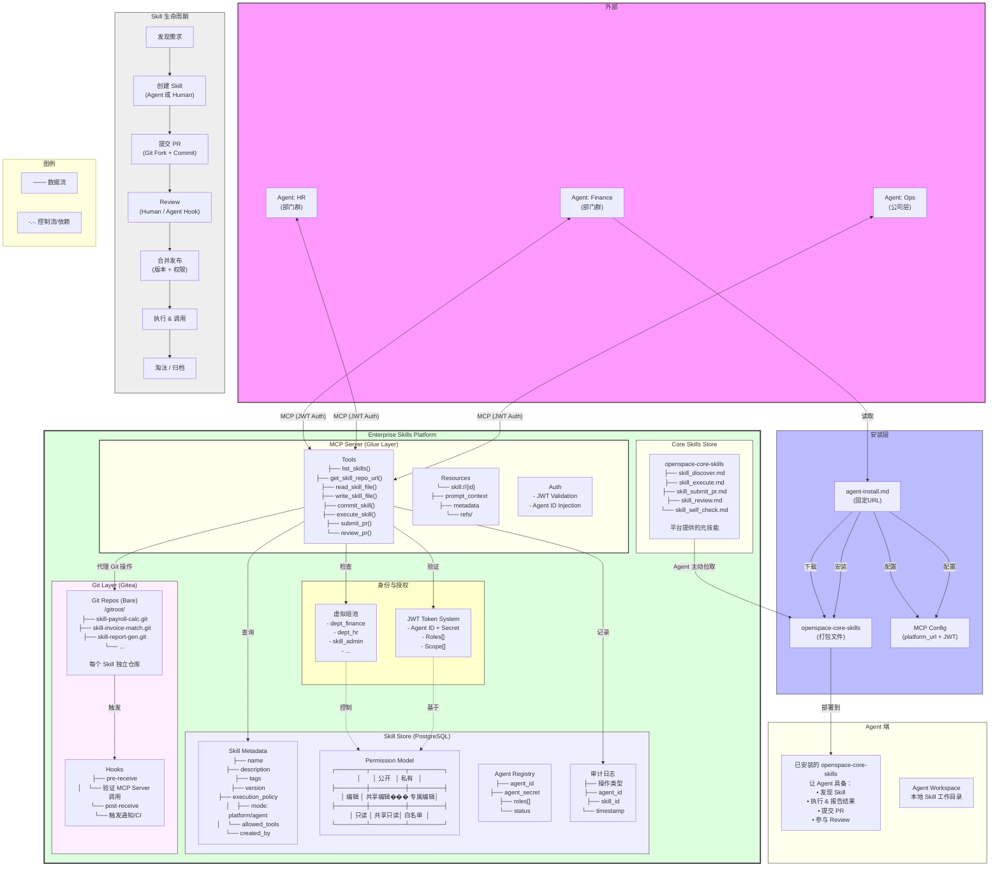
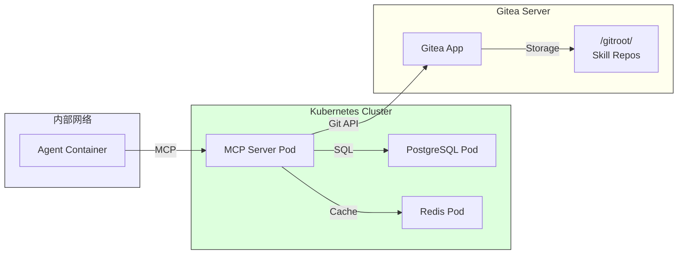

# Enterprise Skills Platform - Complete Architecture



---

## 组件说明

### 外部层
| 组件 | 说明 |
|------|------|
| Agent: Finance | 财务部门 Agent 群 |
| Agent: HR | 人力资源 Agent 群 |
| Agent: Ops | 公司级运营 Agent 群 |

### 安装层
| 组件 | 说明 |
|------|------|
| agent-install.md | 固定 URL 的安装手册，Agent 自行解析安装 |
| openspace-core-skills | 平台提供的元技能包 |
| MCP Config | Agent 连接配置（platform_url + JWT） |

### 平台核心
| 组件 | 说明 |
|------|------|
| JWT Token System | Agent 身份认证，支持角色和权限范围 |
| 虚拟组池 | dept_finance, dept_hr, skill_admin 等抽象角色 |
| MCP Server | **胶水层**，代理所有 Git 操作，统一权限控制 |
| Skill Store | 元数据、权限模型、Agent 注册、审计日志 |
| Git Layer | 每个 Skill 独立仓库，MCP 代理操作 |
| Core Skills Store | 平台元技能包 |

### Skill 生命周期
```
发现需求 → 创建 → PR提交 → Review → 合并发布 → 执行 → 淘汰归档
```

---

## Skill 目录协议

基于 [Agent Skills Spec](https://agentskills.io/specification) 标准。

### 目录结构

每个 Skill 是一个独立 Git 仓库，遵循以下目录结构：

```
skill-name/
├── SKILL.md           # 必须：元数据 + 指令
├── scripts/           # 可选：可执行脚本
│   ├── run           # 入口脚本（无扩展名）
│   └── lib/          # 辅助脚本
├── references/        # 可选：文档（REFERENCE.md 等）
├── assets/           # 可选：模板、图片等静态资源
└── ...               # 可扩展
```

### SKILL.md 格式

```markdown
---
name: browse
description: 使用无头浏览器进行网页浏览和交互测试。
license: MIT
compatibility: Requires Python 3.10+ and playwright
metadata:
  author: example-org
  version: "1.0"
allowed-tools: Bash(git:*) Read
---

# Browse Skill

## 简介

...
```

### Frontmatter 字段

| 字段 | 必填 | 说明 |
|------|------|------|
| `name` | 是 | 1-64字符，小写字母、数字、连字符 |
| `description` | 是 | 描述技能用途和使用场景，1-1024字符 |
| `license` | 否 | 许可证名称 |
| `compatibility` | 否 | 环境要求，如 Python 3.10+ |
| `metadata` | 否 | 自定义键值对 |
| `allowed-tools` | 否 | 预批准的工具（实验性） |

### 渐进式加载（Progressive Disclosure）

```
启动时加载   → name + description (~100 tokens)
激活时加载   → SKILL.md 全文 (< 5000 tokens 推荐)
按需加载     → scripts/、references/、assets/
```

### 版本管理

使用 Git 管理版本：
- 每个 Skill 一个独立仓库
- `git tag v1.0.0` 标记版本
- 版本号遵循 SemVer

---

## 数据流示例

### 1. Agent 发现 Skill
```
Agent → MCP.list_skills(JWT) → MCP验证JWT → 查询Skill_Meta → 
过滤权限 → 返回有权限的Skill列表
```

### 2. Agent 改进 Skill（PR流程）
```
Agent → MCP.read_skill_file(skill_id) 
    → MCP代理Gitea读取 → 返回文件内容

Agent本地编辑 → MCP.write_skill_file(skill_id, path, content)
    → MCP代理Gitea写入 → 创建commit

Agent → MCP.submit_pr(skill_id, message)
    → MCP调用Gitea PR API → 创建PR → 进入Review
```

### 3. Skill 执行
```
Agent → MCP.execute_skill(skill_id, params)
    → 根据execution_policy决定:
       ├── platform模式: 平台沙箱执行CLI → 返回结果
       └── agent模式: 返回Skill定义 → Agent本地执行
```

---

## 权限模型详解

```
权限表达式：
  access: ["dept_finance", "dept_hr"]   // 这些组可读
  edit:  ["dept_finance"]                // 只有Finance可编辑
  admin: ["skill_admin"]                 // 管理员权限

Agent JWT Payload：
  {
    "agent_id": "agent_finance_001",
    "roles": ["dept_finance", "skill_contributor"],
    "scope": ["skill:read", "skill:write", "skill:execute"],
    "exp": "2026-04-21T16:00:00Z"
  }
```

---

## 部署视图


